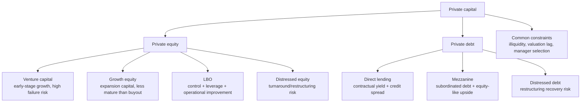

# M03: Investments in Private Capital: Equity and Debt

> **模块定位**：识别另类投资结构、绩效、私募、实物资产、对冲基金与数字资产特征。 本模块聚焦 **Investments in Private Capital: Equity and Debt**，要求把官方 LOS 转成可执行的判断、计算或解释动作。

---

## Official Module Structure

- Learning Outcomes: Investments in Private Capital: Equity and Debt
- 3.01 | Introduction
- 3.02 | Private Equity Investment Characteristics
- 3.03 | Private Debt Investment Characteristics
- 3.04 | Diversification Benefits of Private Capital

## Learning Outcome Statements

1. explain features of private equity and its investment characteristics
2. explain features of private debt and its investment characteristics
3. describe the diversification benefits that private capital can provide


## Textbook Signal Topics

- Textbook volume: `V8`
- Source ePub: `D:\BaiduNetdiskDownload\CFA2026一级原版书\cfa-program2026L1V8.ePub`
- Textbook chapter: `Module 3: Investments in Private Capital: Equity and Debt`
- Practice / Solutions: `available` / `available`

### High-Signal Anchors

- 2. Private Equity Investment Characteristics
- 2.1. Private Equity Investment Categories
- 2.2. Private Equity Exit Strategies
- 2.2.1. Trade Sale
- 2.2.2. Public Listing
- 2.2.3. Other Exit Strategies
- 2.3. Risk–Return from Private Equity Investments
- 3. Private Debt Investment Characteristics

### How To Use These Anchors

- 先用题干关键词匹配到最接近的教材锚点，再回到正文确认定义边界、顺序条件和例外。
- 计算题优先看公式触发段；概念题优先看对比、分类和限制条件段。
- 若一道题同时触发多个锚点，先处理 LOS 主动作对应的那个，再补其余支持细节。
---

## 1. 模块定位

### 3.1 学习任务
- **核心问题**：考试希望你用 `Investments in Private Capital: Equity and Debt` 解释什么、计算什么、比较什么，或判断什么。
- **输入信息**：题干事实、数据、假设、时间口径、单位、约束条件。
- **输出结果**：中文结论 + 英文关键术语 + 必要公式/框架 + 限制条件。

### 3.2 考试角色
- **难度类型**：概念+应用。
- **高频题型**：定义辨析、情境判断、计算解释、表格补数、跨模块比较。
- **答题原则**：先判断 LOS 动词，再选择工具；计算后必须解释结果含义。

### 3.3 关键英文术语
- **Investments in Private Capital: Equity and Debt（核心术语）**：本模块关键词，用于定位 LOS、题干条件和解题动作。
- **Investments in Private Capital（核心术语）**：本模块关键词，用于定位 LOS、题干条件和解题动作。
- **Introduction（核心术语）**：本模块关键词，用于定位 LOS、题干条件和解题动作。
- **Private Equity Investment Characteristics（核心术语）**：本模块关键词，用于定位 LOS、题干条件和解题动作。
- **Private Debt Investment Characteristics（核心术语）**：本模块关键词，用于定位 LOS、题干条件和解题动作。
- **Diversification Benefits of Private Capital（核心术语）**：本模块关键词，用于定位 LOS、题干条件和解题动作。
- **Private Capital（私募资本）**：非公开市场股权或债务投资。

## 2. 官方 LOS 对应学习目标

| LOS | 官方要求 | 中文学习动作 | 做题输出 |
|---|---|---|---|
| 3.1 | explain features of private equity and its investment characteristics | 解释机制、原因和后果 | 写出结论、依据、公式口径和限制条件。 |
| 3.2 | explain features of private debt and its investment characteristics | 解释机制、原因和后果 | 写出结论、依据、公式口径和限制条件。 |
| 3.3 | describe the diversification benefits that private capital can provide | 描述定义、流程和适用场景 | 写出结论、依据、公式口径和限制条件。 |

## 3. 核心知识树

```text
3. Investments in Private Capital: Equity and Debt
├─ 3.1 Introduction
│  ├─ 3.1.1 Private capital = private equity + private debt，通常通过承诺资本、封闭期和 GP 管理实现。
│  └─ 3.1.2 题干先分 equity upside 还是 contractual credit return，再判断风险和分散化来源。
├─ 3.2 Private Equity Investment Characteristics
│  ├─ 3.2.1 VC：早期公司，失败率高、现金流弱、J-curve 深；回报来自少数成功退出。
│  ├─ 3.2.2 Growth equity：扩张期企业，通常少数股权、杠杆较低，风险/回报介于 VC 与 LBO。
│  ├─ 3.2.3 LBO：用较高债务收购成熟企业，回报来自 leverage、cash flow、operational improvement、exit multiple。
│  └─ 3.2.4 Distressed/special situations：低价进入财务困境资产，风险来自重组结果和法律程序。
├─ 3.3 Private Debt Investment Characteristics
│  ├─ 3.3.1 Direct lending：向非上市/中小企业贷款，收益来自 coupon + spread，风险看 covenants 和 collateral。
│  ├─ 3.3.2 Mezzanine debt：介于 senior debt 和 equity，常带 warrants/equity kicker，收益高但次级风险高。
│  └─ 3.3.3 Distressed debt：以折价买入困境债务，收益依赖 recovery 和 restructuring。
├─ 3.4 Diversification Benefits of Private Capital
│  ├─ 3.4.1 低相关性可能来自真实不同风险因子，也可能来自 appraisal smoothing。
│  └─ 3.4.2 考试输出要同时写 potential diversification benefit 和 liquidity/valuation/manager concentration cost。
```

## 核心图解



## 4. 知识点详解

### 3.1 Introduction

- **中文主线**：围绕 `Introduction` 掌握定义、适用条件、公式/框架和考试判断。
- **对应动作**：解释机制、原因和后果

### 3.2 Private Equity Investment Characteristics

- **中文主线**：围绕 `Private Equity Investment Characteristics` 掌握定义、适用条件、公式/框架和考试判断。
- **对应动作**：解释机制、原因和后果

### 3.3 Private Debt Investment Characteristics

- **中文主线**：围绕 `Private Debt Investment Characteristics` 掌握定义、适用条件、公式/框架和考试判断。
- **对应动作**：描述定义、流程和适用场景

### 3.4 Diversification Benefits of Private Capital

- **中文主线**：围绕 `Diversification Benefits of Private Capital` 掌握定义、适用条件、公式/框架和考试判断。
- **对应动作**：识别概念并应用到题干。

### 教材驱动补强（按原版教材回看）

| 教材锚点 | 回看重点 | 题干触发词 |
|---|---|---|
| Private Equity Investment Characteristics | 重点回看定义、核心结论和它在本模块中的用途，避免只记标题不记动作。 | `Private Equity Investment Characteristics`；`PEIC`；题干里出现同义词、定义反问、比较口径或一步计算时回到这一节。 |
| Private Equity Investment Categories | 重点回看这一层的主干结论、比较口径和公式适用条件，再往下接次级细节。 | `Private Equity Investment Categories`；`PEIC`；题干里出现同义词、定义反问、比较口径或一步计算时回到这一节。 |
| Private Equity Exit Strategies | 重点回看这一层的主干结论、比较口径和公式适用条件，再往下接次级细节。 | `Private Equity Exit Strategies`；`PEES`；题干里出现同义词、定义反问、比较口径或一步计算时回到这一节。 |
| Trade Sale | 重点回看分类边界、步骤顺序、输入输出变量，以及容易被题目改口径的细节。 | `Trade Sale`；`TS`；题干里出现同义词、定义反问、比较口径或一步计算时回到这一节。 |
| Public Listing | 重点回看分类边界、步骤顺序、输入输出变量，以及容易被题目改口径的细节。 | `Public Listing`；`PL`；题干里出现同义词、定义反问、比较口径或一步计算时回到这一节。 |
| Other Exit Strategies | 重点回看分类边界、步骤顺序、输入输出变量，以及容易被题目改口径的细节。 | `Other Exit Strategies`；`ES`；题干里出现同义词、定义反问、比较口径或一步计算时回到这一节。 |
| Risk–Return from Private Equity Investments | 重点回看这一层的主干结论、比较口径和公式适用条件，再往下接次级细节。 | `Risk–Return from Private Equity Investments`；`RRFPEI`；题干里出现同义词、定义反问、比较口径或一步计算时回到这一节。 |
| Private Debt Investment Characteristics | 重点回看定义、核心结论和它在本模块中的用途，避免只记标题不记动作。 | `Private Debt Investment Characteristics`；`PDIC`；题干里出现同义词、定义反问、比较口径或一步计算时回到这一节。 |

## 5. 关键公式与计算框架

### 5.1 本模块框架与公式

| 框架/公式 | 内容 | 知识树节点 | 考试说明 |
|---|---|---|---|
| Private equity value creation | `revenue/EBITDA growth + margin improvement + multiple expansion + leverage effect` | `3.2` | Level I 多为方向解释，不要求完整 LBO 建模 |
| Capital call progress | `paid-in capital / committed capital` | `3.1` | 与 M02 PIC 连接；不是回报倍数 |
| PE performance language | `TVPI = DPI + RVPI` | `3.2` | PE 题常从 M02 借用倍数 |
| Private debt return | `contractual coupon + spread/fees + possible equity kicker - expected credit loss` | `3.3` | 用来区分 private debt 与 private equity upside |
| Diversification screen | `correlation benefit - liquidity cost - valuation smoothing risk` | `3.4` | 不能只写低相关性 |

### 5.2 考纲范围标记

| 标记 | 内容 |
|------|------|
| 【考纲重点】 | Fee structures, private capital return multiples, real estate cap-rate valuation, commodity futures carry/roll yield, hedge fund leverage |
| 【考纲内但无核心公式】 | Fund structures, private capital strategy types, infrastructure brownfield/greenfield, digital assets and tokenization 多为概念辨析 |
| 【超纲/扩展】 | PME 复杂版本、完整 LBO 建模、Black-Scholes/Greeks、DeFi 协议收益模型不作为 Level I 必背公式 |

---

## 6. 常见考点与解题思路

| 重要性 | 考点 | 解题动作 |
|---|---|---|
| ⭐⭐⭐ | 3.1 Introduction | 先定位题干触发词，再写公式/框架，最后解释结果或判断陷阱。 |
| ⭐⭐⭐ | 3.2 Private Equity Investment Characteristics | 先定位题干触发词，再写公式/框架，最后解释结果或判断陷阱。 |
| ⭐⭐ | 3.3 Private Debt Investment Characteristics | 先定位题干触发词，再写公式/框架，最后解释结果或判断陷阱。 |
| ⭐⭐ | 3.4 Diversification Benefits of Private Capital | 先定位题干触发词，再写公式/框架，最后解释结果或判断陷阱。 |

### 教材驱动解题动作

- 先按 `Textbook Signal Topics` 找最接近的教材小节，不要直接凭熟词下结论。
- 遇到 `Private Equity Investment Characteristics`` 相关题型时，先复原该小节的定义边界，再决定是套公式、做比较还是判断例外。
- 遇到 `Private Equity Investment Categories`` 相关题型时，先复原该小节的定义边界，再决定是套公式、做比较还是判断例外。
- 遇到 `Private Equity Exit Strategies`` 相关题型时，先复原该小节的定义边界，再决定是套公式、做比较还是判断例外。
- 遇到 `Trade Sale`` 相关题型时，先复原该小节的定义边界，再决定是套公式、做比较还是判断例外。
- 遇到 `Public Listing`` 相关题型时，先复原该小节的定义边界，再决定是套公式、做比较还是判断例外。
- 做完一轮后，回到教材内 `Practice Problems / Solutions` 检查自己是否漏掉了变量口径、顺序条件或例外。

## 7. 易错点与考试陷阱

| ❌ 错误理解 | ✅ 正确理解 | 为什么错 / 考试提醒 |
|---|---|---|
| ❌ 陷阱 | ✅ 错误理解 | 正确理解 |
| ❌ ❌ 另类投资都是高流动性 | ✅ 认为可以轻松买卖 | ✅ 大多数另类投资是非流动性的（ILL特征） |
| ❌ ❌ TVPI = DPI × RVPI | ✅ 乘法关系 | ✅ TVPI = DPI + RVPI（加法关系） |
| ❌ ❌ J曲线意味着总是负收益 | ✅ 全程亏损 | ✅ J曲线是先负后正，最终转正 |
| ❌ ❌ LBO 总是用50%债务 | ✅ 固定比例 | ✅ LBO 通常是 60-80% 债务 + 20-40% 股权 |
| ❌ ❌ Cap Rate上升价值上升 | ✅ 正向关系 | ✅ Cap Rate与价值是反向关系（Cap Rate↑→Value↓） |
| ❌ ❌ 棕地回报总是更高 | ✅ 现有资产回报高 | ✅ 棕地风险低、回报低（8-10%），绿地风险高、回报高（12-15%） |
| ❌ ❌ Contango = 正Roll Yield | ✅ 正向市场收益为正 | ✅ Contango（期货>现货）= 负 Roll Yield |
| ❌ ❌ Backwardation = 负Roll Yield | ✅ 反向市场收益为负 | ✅ Backwardation（期货<现货）= 正 Roll Yield |
| ❌ ❌ 对冲基金总是对冲市场风险 | ✅ 名称误导 | ✅ 很多对冲基金是净多头，并非完全对冲 |

### 教材驱动易错清单

| 易错来源 | 常见误判 | 回正动作 |
|---|---|---|
| Private Equity Investment Characteristics | 把标题当成会做题，忽略定义边界和相邻概念差异。 | 看到相关题干先回到 `Private Equity Investment Characteristics`，用一句话说清“它是什么、什么时候用、最容易和什么混”。 |
| Private Equity Investment Categories | 把标题当成会做题，忽略定义边界和相邻概念差异。 | 看到相关题干先回到 `Private Equity Investment Categories`，用一句话说清“它是什么、什么时候用、最容易和什么混”。 |
| Private Equity Exit Strategies | 把标题当成会做题，忽略定义边界和相邻概念差异。 | 看到相关题干先回到 `Private Equity Exit Strategies`，用一句话说清“它是什么、什么时候用、最容易和什么混”。 |
| Trade Sale | 记住了主标题，却忽略该细分小节真正考的是步骤顺序、分类条件或变量口径。 | 看到相关题干先回到 `Trade Sale`，用一句话说清“它是什么、什么时候用、最容易和什么混”。 |
| Public Listing | 记住了主标题，却忽略该细分小节真正考的是步骤顺序、分类条件或变量口径。 | 看到相关题干先回到 `Public Listing`，用一句话说清“它是什么、什么时候用、最容易和什么混”。 |

## 8. 跨模块关联

- **来自 M01**：LP/GP、closed-end fund、capital commitment、fee terms 是 private capital 的基础结构。
- **来自 M02**：J-curve、TVPI/DPI/RVPI、PIC、IRR 用于解释 PE fund performance。
- **到 M04**：infrastructure acquisition 可通过 private equity/LBO 或 private debt 融资结构出现。
- **到 FI/FSA**：private debt 连接 credit spread、covenants、recovery、cash flow coverage；LBO 连接 leverage 和 debt service。
- **到 Ethics/PM**：估值、performance presentation、illiquidity suitability 和 manager due diligence 都是跨科接口。

---


## 9. 复习与刷题提示

- 第一轮：按 `Official Module Structure` 逐节过概念，把每个 LOS 改写成中文任务。
- 第二轮：对照 `## 3. 核心知识树` 做主动回忆，能说出每个编号节点的定义、公式/框架和陷阱。
- 第三轮：刷题后记录错因，如果暴露 MOC 缺口，按 `docs/moc-auto-patch-workflow.md` 进入补强流程。
- 考前：只看术语、公式/框架、易错点和本模块错题，避免重新铺开所有正文。

## 10. Legacy Notes Integrated

- **主要 legacy 来源**：`00-Alternative-Investments-MOC.md` (medium, 0.406)
- **整合规则**：高置信内容已合入 `知识点详解`、`公式与计算框架`、`常见考点`、`易错陷阱` 和 `跨模块关联`。
- **边界**：若 legacy 内容与 2026 官方 LOS 冲突，以官方 module 名称、LOS 和 registry 为准。
