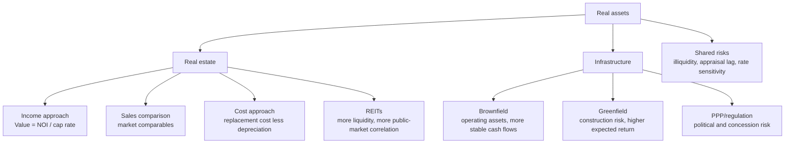

# M04: Real Estate and Infrastructure

> **模块定位**：识别另类投资结构、绩效、私募、实物资产、对冲基金与数字资产特征。 本模块聚焦 **Real Estate and Infrastructure**，要求把官方 LOS 转成可执行的判断、计算或解释动作。

---

## Official Module Structure

- Learning Outcomes: Real Estate and Infrastructure
- 4.01 | Introduction
- 4.02 | Real Estate Features
- 4.03 | Real Estate Investment Characteristics
- 4.04 | Infrastructure Investment Features
- 4.05 | Infrastructure Investment Characteristics

## Learning Outcome Statements

1. explain features and characteristics of real estate
2. explain the investment characteristics of real estate investments
3. explain features and characteristics of infrastructure
4. explain the investment characteristics of infrastructure investments


## Textbook Signal Topics

- Textbook volume: `V8`
- Source ePub: `D:\BaiduNetdiskDownload\CFA2026一级原版书\cfa-program2026L1V8.ePub`
- Textbook chapter: `Module 4: Real Estate and Infrastructure`
- Practice / Solutions: `available` / `available`

### High-Signal Anchors

- 2. Real Estate Features
- 2.1. Real Estate Investments
- 2.2. Real Estate Investment Structures
- 2.2.1. Direct Real Estate Investment
- 2.2.2. Indirect Real Estate Investment
- 3. Real Estate Investment Characteristics
- 3.1. Source of Returns
- 3.2. Real Estate Investment Diversification Benefits

### How To Use These Anchors

- 先用题干关键词匹配到最接近的教材锚点，再回到正文确认定义边界、顺序条件和例外。
- 计算题优先看公式触发段；概念题优先看对比、分类和限制条件段。
- 若一道题同时触发多个锚点，先处理 LOS 主动作对应的那个，再补其余支持细节。
---

## 1. 模块定位

### 4.1 学习任务
- **核心问题**：考试希望你用 `Real Estate and Infrastructure` 解释什么、计算什么、比较什么，或判断什么。
- **输入信息**：题干事实、数据、假设、时间口径、单位、约束条件。
- **输出结果**：中文结论 + 英文关键术语 + 必要公式/框架 + 限制条件。

### 4.2 考试角色
- **难度类型**：概念+应用。
- **高频题型**：定义辨析、情境判断、计算解释、表格补数、跨模块比较。
- **答题原则**：先判断 LOS 动词，再选择工具；计算后必须解释结果含义。

### 4.3 关键英文术语
- **Real Estate and Infrastructure（核心术语）**：本模块关键词，用于定位 LOS、题干条件和解题动作。
- **Introduction（核心术语）**：本模块关键词，用于定位 LOS、题干条件和解题动作。
- **Real Estate Features（核心术语）**：本模块关键词，用于定位 LOS、题干条件和解题动作。
- **Real Estate Investment Characteristics（核心术语）**：本模块关键词，用于定位 LOS、题干条件和解题动作。
- **Infrastructure Investment Features（核心术语）**：本模块关键词，用于定位 LOS、题干条件和解题动作。
- **Infrastructure Investment Characteristics（核心术语）**：本模块关键词，用于定位 LOS、题干条件和解题动作。
- **Real Estate（房地产）**：以不动产及相关现金流为基础的另类投资。

## 2. 官方 LOS 对应学习目标

| LOS | 官方要求 | 中文学习动作 | 做题输出 |
|---|---|---|---|
| 4.1 | explain features and characteristics of real estate | 解释机制、原因和后果 | 写出结论、依据、公式口径和限制条件。 |
| 4.2 | explain the investment characteristics of real estate investments | 解释机制、原因和后果 | 写出结论、依据、公式口径和限制条件。 |
| 4.3 | explain features and characteristics of infrastructure | 解释机制、原因和后果 | 写出结论、依据、公式口径和限制条件。 |
| 4.4 | explain the investment characteristics of infrastructure investments | 解释机制、原因和后果 | 写出结论、依据、公式口径和限制条件。 |

## 3. 核心知识树

```text
4. Real Estate and Infrastructure
├─ 4.1 房地产 (Real Estate)【考试核心】
│  ├─ 4.1.1 Investment forms：direct property 控制强但流动性低；REIT 流动性高但更受公开市场波动影响。
│  ├─ 4.1.2 Valuation：income approach 用 Value = NOI / cap rate；cost 和 sales comparison 用于交叉验证。
│  ├─ 4.1.3 NOI 口径：租金收入 - operating expenses，不扣 depreciation 和 interest。
│  └─ 4.1.4 Cap rate：反映 required return - growth；cap rate 上升，property value 下降。
├─ 4.2 基础设施 (Infrastructure)【考试核心】
│  ├─ 4.2.1 Essential service assets：transport、utilities、energy、communication；现金流常长期、受监管或合同约束。
│  ├─ 4.2.2 Brownfield：已有运营资产，现金流稳定，建设风险低，预期回报较低。
│  ├─ 4.2.3 Greenfield：新建项目，建设/许可/成本超支风险高，预期回报较高。
│  └─ 4.2.4 Risk screen：regulatory、political、leverage、demand、inflation linkage、ESG/operational risk。
```

## 核心图解



## 4. 知识点详解

### 4.1 房地产 (Real Estate)【考试核心】

#### 4.1.1 投资形式

| 方式 | 英文 | 说明 |
|------|------|------|
| 直接投资 | Direct Investment | 直接购买物业所有权 |
| 间接投资 | Indirect Investment | 通过REITs等工具投资 |

**REITs (房地产投资信托基金, Real Estate Investment Trusts)**:
- **权益型REITs (Equity REITs)**: 拥有并经营物业，主要收入来自租金
- **抵押型REITs (Mortgage REITs)**: 投资房地产抵押贷款/抵押支持证券
- **混合型REITs (Hybrid REITs)**: 两者结合

**流动性**: REITs > 直接房地产（公开交易 vs 非流动）

#### 4.1.2 三种估值方法

| 方法 | 英文 | 原理 |
|------|------|------|
| 收益法 | Income Approach | NOI / Cap Rate——最常用 |
| 成本法 | Cost Approach | 土地价值 + 重置成本 - 折旧 |
| 市场比较法 | Sales Comparison Approach | 参照类似物业近期交易价格调整 |

**NOI (净营运收入, Net Operating Income)** = 租金收入 - 运营费用（**不含**折旧和利息）

#### 4.1.3 Cap Rate (资本化率) 驱动因素

- **利率环境**: 利率↑ → Cap Rate↑ → 价值↓
- **风险溢价**: 风险↑ → Cap Rate↑ → 价值↓
- **增长预期**: 增长↑ → Cap Rate↓ → 价值↑

#### 4.1.4 房地产周期

复苏期 → 扩张期 → 过热期 → 衰退期，与宏观经济、利率、就业密切相关

### 4.2 基础设施 (Infrastructure)【考试核心】

**定义**: 提供公共服务的长期实物资产（公路、港口、电网、通信塔等）

**投资形式**: 直接投资 (Direct Ownership)、上市基础设施基金 (Listed Infrastructure Funds)、未上市基金/公私合营 (PPP)

#### 4.2.1 棕地 (Brownfield) vs 绿地 (Greenfield) 对比

| 维度 | 棕地 (Brownfield) | 绿地 (Greenfield) |
|------|-------------------|-------------------|
| 定义 | 收购现有运营资产 | 新建开发项目 |
| 现金流 | 现有稳定现金流 | 建设期无现金流 |
| 风险水平 | 低 | 高 |
| 典型回报 | 8-10% | 12-15% |
| 资本需求 | 收购对价 | 建设资本支出 |
| 适用投资者 | 追求稳定收益、低风险偏好 | 追求高增长、高风险承受能力 |

### 教材驱动补强（按原版教材回看）

| 教材锚点 | 回看重点 | 题干触发词 |
|---|---|---|
| Real Estate Features | 重点回看定义、核心结论和它在本模块中的用途，避免只记标题不记动作。 | `Real Estate Features`；`REF`；题干里出现同义词、定义反问、比较口径或一步计算时回到这一节。 |
| Real Estate Investments | 重点回看这一层的主干结论、比较口径和公式适用条件，再往下接次级细节。 | `Real Estate Investments`；`REI`；题干里出现同义词、定义反问、比较口径或一步计算时回到这一节。 |
| Real Estate Investment Structures | 重点回看这一层的主干结论、比较口径和公式适用条件，再往下接次级细节。 | `Real Estate Investment Structures`；`REIS`；题干里出现同义词、定义反问、比较口径或一步计算时回到这一节。 |
| Direct Real Estate Investment | 重点回看分类边界、步骤顺序、输入输出变量，以及容易被题目改口径的细节。 | `Direct Real Estate Investment`；`DREI`；题干里出现同义词、定义反问、比较口径或一步计算时回到这一节。 |
| Indirect Real Estate Investment | 重点回看分类边界、步骤顺序、输入输出变量，以及容易被题目改口径的细节。 | `Indirect Real Estate Investment`；`IREI`；题干里出现同义词、定义反问、比较口径或一步计算时回到这一节。 |
| Real Estate Investment Characteristics | 重点回看定义、核心结论和它在本模块中的用途，避免只记标题不记动作。 | `Real Estate Investment Characteristics`；`REIC`；题干里出现同义词、定义反问、比较口径或一步计算时回到这一节。 |
| Source of Returns | 重点回看这一层的主干结论、比较口径和公式适用条件，再往下接次级细节。 | `Source of Returns`；`SR`；题干里出现同义词、定义反问、比较口径或一步计算时回到这一节。 |
| Real Estate Investment Diversification Benefits | 重点回看这一层的主干结论、比较口径和公式适用条件，再往下接次级细节。 | `Real Estate Investment Diversification Benefits`；`REIDB`；题干里出现同义词、定义反问、比较口径或一步计算时回到这一节。 |

## 5. 关键公式与计算框架

### 5.1 核心内容

| 指标/框架 | 公式或判断链 | 知识树节点 | 考试说明 |
|------|------|------|------|
| NOI | `rental income - operating expenses` | `4.1.3` | 不含折旧、利息和所得税 |
| Cap Rate | `NOI / Property Value` | `4.1.2` | 用于 income approach |
| Property Value | `NOI / Cap Rate` | `4.1.2` | cap rate 用小数；方向关系常考 |
| Growth-form cap rate | `cap rate = required return - expected NOI growth` | `4.1.4` | 与 Gordon growth 直觉一致 |
| Brownfield/greenfield gate | `existing operating cash flow -> brownfield; new construction -> greenfield` | `4.2.2/4.2.3` | 先看是否已有运营现金流 |

**核心关系**: Cap Rate与物业价值呈反向关系（Cap Rate↑ → Value↓）

## 6. 常见考点与解题思路

| 重要性 | 考点 | 解题动作 |
|---|---|---|
| ⭐⭐⭐ | 4.1 Introduction | 先定位题干触发词，再写公式/框架，最后解释结果或判断陷阱。 |
| ⭐⭐⭐ | 4.2 Real Estate Features | 先定位题干触发词，再写公式/框架，最后解释结果或判断陷阱。 |
| ⭐⭐ | 4.3 Real Estate Investment Characteristics | 先定位题干触发词，再写公式/框架，最后解释结果或判断陷阱。 |
| ⭐⭐ | 4.4 Infrastructure Investment Features | 先定位题干触发词，再写公式/框架，最后解释结果或判断陷阱。 |
| ⭐ | 4.5 Infrastructure Investment Characteristics | 先定位题干触发词，再写公式/框架，最后解释结果或判断陷阱。 |

### 6.9 ⭐⭐ Legacy 考点补充

### 6.1 核心内容

1. **Cap Rate计算**: 给定NOI和物业价值，计算Cap Rate。**思路**: Cap Rate = NOI / Property Value。
2. **估值计算**: 给定NOI和Cap Rate，计算物业价值。**思路**: Value = NOI / Cap Rate。
3. **Cap Rate变化分析**: 判断利率/风险/增长预期变化对物业价值的影响。**思路**: Cap Rate↑ → Value↓（反向关系）。
4. **棕地vs绿地区分**: 题干描述基础设施项目特征，判断类型。**思路**: 现有运营=棕地（低风险低回报）；新建=绿地（高风险高回报）。

### 教材驱动解题动作

- 先按 `Textbook Signal Topics` 找最接近的教材小节，不要直接凭熟词下结论。
- 遇到 `Real Estate Features`` 相关题型时，先复原该小节的定义边界，再决定是套公式、做比较还是判断例外。
- 遇到 `Real Estate Investments`` 相关题型时，先复原该小节的定义边界，再决定是套公式、做比较还是判断例外。
- 遇到 `Real Estate Investment Structures`` 相关题型时，先复原该小节的定义边界，再决定是套公式、做比较还是判断例外。
- 遇到 `Direct Real Estate Investment`` 相关题型时，先复原该小节的定义边界，再决定是套公式、做比较还是判断例外。
- 遇到 `Indirect Real Estate Investment`` 相关题型时，先复原该小节的定义边界，再决定是套公式、做比较还是判断例外。
- 做完一轮后，回到教材内 `Practice Problems / Solutions` 检查自己是否漏掉了变量口径、顺序条件或例外。

## 7. 易错点与考试陷阱

| ❌ 错误理解 | ✅ 正确理解 | 为什么错 / 考试提醒 |
|---|---|---|
| ❌ 忽略：NOI不含折旧和利息: 运营费用仅包括日常维护、管理费、税费等，不含折旧费用和利息支出 | ✅ NOI不含折旧和利息: 运营费用仅包括日常维护、管理费、税费等，不含折旧费用和利息支出 | 题干通常会用口径、顺序、定义边界或例外条件设置干扰。 |
| ❌ 忽略：Cap Rate与价值反向关系: 常被误认为正向关系（Cap Rate↑ → Value↓） | ✅ Cap Rate与价值反向关系: 常被误认为正向关系（Cap Rate↑ → Value↓） | 题干通常会用口径、顺序、定义边界或例外条件设置干扰。 |
| ❌ 忽略：棕地回报不是更高: 棕地风险低、回报低（8-10%），绿地风险高、回报高（12-15%） | ✅ 棕地回报不是更高: 棕地风险低、回报低（8-10%），绿地风险高、回报高（12-15%） | 题干通常会用口径、顺序、定义边界或例外条件设置干扰。 |
| ❌ 忽略：REITs不是都投物业: 权益型投物业收租金，抵押型投贷款收利息 | ✅ REITs不是都投物业: 权益型投物业收租金，抵押型投贷款收利息 | 题干通常会用口径、顺序、定义边界或例外条件设置干扰。 |
| ❌ 忽略：收益法最常用: 房地产估值三种方法中，收益法（Income Approach）最常见 | ✅ 收益法最常用: 房地产估值三种方法中，收益法（Income Approach）最常见 | 题干通常会用口径、顺序、定义边界或例外条件设置干扰。 |

### 教材驱动易错清单

| 易错来源 | 常见误判 | 回正动作 |
|---|---|---|
| Real Estate Features | 把标题当成会做题，忽略定义边界和相邻概念差异。 | 看到相关题干先回到 `Real Estate Features`，用一句话说清“它是什么、什么时候用、最容易和什么混”。 |
| Real Estate Investments | 把标题当成会做题，忽略定义边界和相邻概念差异。 | 看到相关题干先回到 `Real Estate Investments`，用一句话说清“它是什么、什么时候用、最容易和什么混”。 |
| Real Estate Investment Structures | 把标题当成会做题，忽略定义边界和相邻概念差异。 | 看到相关题干先回到 `Real Estate Investment Structures`，用一句话说清“它是什么、什么时候用、最容易和什么混”。 |
| Direct Real Estate Investment | 记住了主标题，却忽略该细分小节真正考的是步骤顺序、分类条件或变量口径。 | 看到相关题干先回到 `Direct Real Estate Investment`，用一句话说清“它是什么、什么时候用、最容易和什么混”。 |
| Indirect Real Estate Investment | 记住了主标题，却忽略该细分小节真正考的是步骤顺序、分类条件或变量口径。 | 看到相关题干先回到 `Indirect Real Estate Investment`，用一句话说清“它是什么、什么时候用、最容易和什么混”。 |

## 8. 跨模块关联

- **来自 M01**：direct/fund ownership、illiquidity、appraisal valuation 和 unique operational risk 是本模块入口。
- **来自 M02**：direct real estate/infrastructure 的 appraisal NAV 会带来 return smoothing。
- **到 M05**：房地产周期与商品/自然资源周期都受宏观、通胀和供需影响，但现金流来源不同。
- **到 FSA/Equity**：NOI、cap rate、REIT 收益模型、depreciation 与 operating cash flow 的口径容易联动。
- **到 FI/PM**：基础设施现金流具有 duration、inflation linkage、regulatory risk 和 leverage sensitivity。


## 9. 复习与刷题提示

- 第一轮：按 `Official Module Structure` 逐节过概念，把每个 LOS 改写成中文任务。
- 第二轮：对照 `## 3. 核心知识树` 做主动回忆，能说出每个编号节点的定义、公式/框架和陷阱。
- 第三轮：刷题后记录错因，如果暴露 MOC 缺口，按 `docs/moc-auto-patch-workflow.md` 进入补强流程。
- 考前：只看术语、公式/框架、易错点和本模块错题，避免重新铺开所有正文。

## 10. Legacy Notes Integrated

- **主要 legacy 来源**：`M04-Real-Estate-and-Infrastructure.md` (high, 0.773)
- **整合规则**：高置信内容已合入 `知识点详解`、`公式与计算框架`、`常见考点`、`易错陷阱` 和 `跨模块关联`。
- **边界**：若 legacy 内容与 2026 官方 LOS 冲突，以官方 module 名称、LOS 和 registry 为准。
