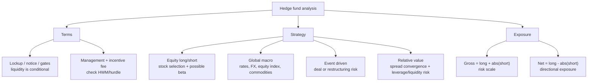

# M06: Hedge Funds

> **模块定位**：识别另类投资结构、绩效、私募、实物资产、对冲基金与数字资产特征。 本模块聚焦 **Hedge Funds**，要求把官方 LOS 转成可执行的判断、计算或解释动作。

---

## Official Module Structure

- Learning Outcomes: Hedge Funds
- 6.01 | Introduction
- 6.02 | Hedge Fund Investment Features
- 6.03 | Hedge Fund Investment Forms
- 6.04 | Hedge Fund Investment Risk, Return, and Diversification

## Learning Outcome Statements

1. explain investment features of hedge funds and contrast them with other asset classes
2. describe investment forms and vehicles used in hedge fund investments
3. analyze sources of risk, return, and diversification among hedge fund investments


## Textbook Signal Topics

- Textbook volume: `V8`
- Source ePub: `D:\BaiduNetdiskDownload\CFA2026一级原版书\cfa-program2026L1V8.ePub`
- Textbook chapter: `Module 6: Hedge Funds`
- Practice / Solutions: `available` / `available`

### High-Signal Anchors

- 2. Hedge Fund Investment Features
- 2.1. Equity Hedge Fund Strategies
- 2.2. Event-Driven Strategies
- 2.3. Relative Value Strategies
- 2.4. Opportunistic Strategies
- 2.5. Distinguishing Characteristics of Hedge Fund Investments
- 3. Hedge Fund Investment Forms
- 3.1. Direct Hedge Fund Investment Forms

### How To Use These Anchors

- 先用题干关键词匹配到最接近的教材锚点，再回到正文确认定义边界、顺序条件和例外。
- 计算题优先看公式触发段；概念题优先看对比、分类和限制条件段。
- 若一道题同时触发多个锚点，先处理 LOS 主动作对应的那个，再补其余支持细节。
---

## 1. 模块定位

### 6.1 学习任务
- **核心问题**：考试希望你用 `Hedge Funds` 解释什么、计算什么、比较什么，或判断什么。
- **输入信息**：题干事实、数据、假设、时间口径、单位、约束条件。
- **输出结果**：中文结论 + 英文关键术语 + 必要公式/框架 + 限制条件。

### 6.2 考试角色
- **难度类型**：计算+解释。
- **高频题型**：定义辨析、情境判断、计算解释、表格补数、跨模块比较。
- **答题原则**：先判断 LOS 动词，再选择工具；计算后必须解释结果含义。

### 6.3 关键英文术语
- **Hedge Funds（对冲基金）**：采用更灵活策略、杠杆和做空工具的集合投资工具。
- **Introduction（核心术语）**：本模块关键词，用于定位 LOS、题干条件和解题动作。
- **Hedge Fund Investment Features（核心术语）**：本模块关键词，用于定位 LOS、题干条件和解题动作。
- **Hedge Fund Investment Forms（核心术语）**：本模块关键词，用于定位 LOS、题干条件和解题动作。
- **Hedge Fund Investment Risk, Return, and Diversification（核心术语）**：本模块关键词，用于定位 LOS、题干条件和解题动作。

## 2. 官方 LOS 对应学习目标

| LOS | 官方要求 | 中文学习动作 | 做题输出 |
|---|---|---|---|
| 6.1 | explain investment features of hedge funds and contrast them with other asset classes | 解释机制、原因和后果 | 写出结论、依据、公式口径和限制条件。 |
| 6.2 | describe investment forms and vehicles used in hedge fund investments | 描述定义、流程和适用场景 | 写出结论、依据、公式口径和限制条件。 |
| 6.3 | analyze sources of risk, return, and diversification among hedge fund investments | 识别概念、解释机制并应用到题干。 | 写出结论、依据、公式口径和限制条件。 |

## 3. 核心知识树

```text
6. Hedge Funds
├─ 6.1 对冲基金特征 (Hedge Fund Characteristics)
│  ├─ 6.1.1 Flexible mandate：可做多/做空、用杠杆和 derivatives，目标通常是 absolute return 或低相关 alpha。
│  ├─ 6.1.2 Liquidity terms：lockup、notice period、redemption frequency/gates；比 PE 流动但不等于每日流动。
│  ├─ 6.1.3 Fee terms：management fee + incentive fee，常见 high-water mark 保护投资者。
│  └─ 6.1.4 Transparency/manager risk：策略复杂且披露有限，due diligence 很关键。
├─ 6.2 对冲基金策略 (Hedge Fund Strategies)【考试核心】
│  ├─ 6.2.1 Equity long/short：多头被低估股票，空头被高估股票；仍可能有 net long equity beta。
│  ├─ 6.2.2 Global macro：根据利率、货币、股指、商品等宏观观点跨资产交易。
│  ├─ 6.2.3 Event driven：并购、重组、破产等事件套利，核心风险是 deal/event failure。
│  └─ 6.2.4 Relative value：利用相关证券价差，常用杠杆，表面 beta 低但 leverage/liquidity risk 可高。
├─ 6.3 杠杆与风险 (Leverage and Risk)【考试核心】
│  ├─ 6.3.1 Gross exposure = long exposure + |short exposure|，衡量总风险规模。
│  ├─ 6.3.2 Net exposure = long exposure - |short exposure|，衡量市场方向暴露。
│  └─ 6.3.3 Market neutral 要求 net 近零，但 gross 可很高；不能把净敞口低等同于低风险。
```

## 核心图解



## 4. 知识点详解

### 6.1 对冲基金特征 (Hedge Fund Characteristics)

| 特征 | 说明 |
|------|------|
| 流动性 | 相对PE/VC较高，但有锁定期 (Lockup Period, 通常1-3年) + 通知期 (Notice Period, 30-90天) |
| 透明度 | 相对其他另类投资较高（需定期披露持仓），但仍低于传统共同基金 |
| 费用结构 | 通常2/20（2%管理费 + 20%业绩提成），部分新基金降低至1/10 |
| 高水位线 | 普遍采用，保护投资者，只对新创造的收益收取提成 |

### 6.2 对冲基金策略 (Hedge Fund Strategies)【考试核心】

| 策略 | 英文 | 运作方式 | 风险 | 回报 | 与股票相关性 |
|------|------|----------|------|------|-------------|
| 股票多空 | Equity Long/Short | 同时持有多头和空头头寸，降低市场风险敞口 | 中等 | 8-12% | 0.5-0.7 |
| 全球宏观 | Global Macro | 基于宏观经济趋势，跨资产类别交易（外汇、利率、股指） | 高 | 10-15% | 0.2-0.4 |
| 事件驱动 | Event Driven | 利用公司特定事件（并购、重组、破产） | 中高 | 10-14% | 0.4-0.6 |
| 相对价值 | Relative Value | 利用相关资产定价偏差，市场中性策略 | 低 | 6-10% | 0.1-0.3 |

### 6.3 杠杆与风险 (Leverage and Risk)【考试核心】

| 指标 | 公式 | 含义 |
|------|------|------|
| 总杠杆 (Gross Leverage) | (多头 + \|空头\|) / 资本 | 反映基金总敞口，包括多空双边 |
| 净杠杆 (Net Leverage) | (多头 - \|空头\|) / 资本 | 反映市场风险敞口 |

**关键区别**: Gross ≠ Net，两者完全不同。很多对冲基金是净多头 (Net Long)，并非完全对冲市场风险。市场中性策略的Net Leverage接近0。

### 教材驱动补强（按原版教材回看）

| 教材锚点 | 回看重点 | 题干触发词 |
|---|---|---|
| Hedge Fund Investment Features | 重点回看定义、核心结论和它在本模块中的用途，避免只记标题不记动作。 | `Hedge Fund Investment Features`；`HFIF`；题干里出现同义词、定义反问、比较口径或一步计算时回到这一节。 |
| Equity Hedge Fund Strategies | 重点回看这一层的主干结论、比较口径和公式适用条件，再往下接次级细节。 | `Equity Hedge Fund Strategies`；`EHFS`；题干里出现同义词、定义反问、比较口径或一步计算时回到这一节。 |
| Event-Driven Strategies | 重点回看这一层的主干结论、比较口径和公式适用条件，再往下接次级细节。 | `Event-Driven Strategies`；`EDS`；题干里出现同义词、定义反问、比较口径或一步计算时回到这一节。 |
| Relative Value Strategies | 重点回看这一层的主干结论、比较口径和公式适用条件，再往下接次级细节。 | `Relative Value Strategies`；`RVS`；题干里出现同义词、定义反问、比较口径或一步计算时回到这一节。 |
| Opportunistic Strategies | 重点回看这一层的主干结论、比较口径和公式适用条件，再往下接次级细节。 | `Opportunistic Strategies`；`OS`；题干里出现同义词、定义反问、比较口径或一步计算时回到这一节。 |
| Distinguishing Characteristics of Hedge Fund Investments | 重点回看这一层的主干结论、比较口径和公式适用条件，再往下接次级细节。 | `Distinguishing Characteristics of Hedge Fund Investments`；`DCHFI`；题干里出现同义词、定义反问、比较口径或一步计算时回到这一节。 |
| Hedge Fund Investment Forms | 重点回看定义、核心结论和它在本模块中的用途，避免只记标题不记动作。 | `Hedge Fund Investment Forms`；`HFIF`；题干里出现同义词、定义反问、比较口径或一步计算时回到这一节。 |
| Direct Hedge Fund Investment Forms | 重点回看这一层的主干结论、比较口径和公式适用条件，再往下接次级细节。 | `Direct Hedge Fund Investment Forms`；`DHFIF`；题干里出现同义词、定义反问、比较口径或一步计算时回到这一节。 |

## 5. 关键公式与计算框架

### 5.1 核心内容

| 指标/框架 | 公式或判断链 | 知识树节点 | 考试说明 |
|------|------|------|------|
| Gross leverage / exposure | `(long exposure + |short exposure|) / capital` | `6.3.1` | 总敞口规模，包含多空两边 |
| Net leverage / exposure | `(long exposure - |short exposure|) / capital` | `6.3.2` | 市场方向性，可能接近 0 |
| Long/short classification | `long undervalued + short overvalued -> equity L/S` | `6.2.1` | 仍可能是净多头 |
| Strategy trigger | `macro view -> global macro; corporate event -> event driven; spread mispricing -> relative value` | `6.2` | 按收益来源分类 |
| Incentive fee gate | `profit above HWM/hurdle x incentive fee rate` | `6.1.3` | 高水位线防止对恢复旧亏损收费 |

## 6. 常见考点与解题思路

| 重要性 | 考点 | 解题动作 |
|---|---|---|
| ⭐⭐⭐ | 6.1 Introduction | 先定位题干触发词，再写公式/框架，最后解释结果或判断陷阱。 |
| ⭐⭐⭐ | 6.2 Hedge Fund Investment Features | 先定位题干触发词，再写公式/框架，最后解释结果或判断陷阱。 |
| ⭐⭐ | 6.3 Hedge Fund Investment Forms | 先定位题干触发词，再写公式/框架，最后解释结果或判断陷阱。 |
| ⭐⭐ | 6.4 Hedge Fund Investment Risk, Return, and Diversification | 先定位题干触发词，再写公式/框架，最后解释结果或判断陷阱。 |

### 6.9 ⭐⭐ Legacy 考点补充

### 6.1 核心内容

1. **策略类型判断**: 题干描述基金的投资方式和持仓特征，要求判断属于哪种策略。**思路**: 多空持仓=Equity L/S；宏观经济判断=Global Macro；公司事件套利=Event Driven；价差套利=Relative Value。
2. **杠杆计算**: 给定多头和空头头寸及资本，计算总杠杆和净杠杆。**思路**: Gross = (多+|空|)/资本；Net = (多-|空|)/资本。
3. **策略风险排序**: 要求按风险水平排序。**思路**: Relative Value (低) < Equity L/S (中) < Event Driven (中高) < Global Macro (高)。

### 教材驱动解题动作

- 先按 `Textbook Signal Topics` 找最接近的教材小节，不要直接凭熟词下结论。
- 遇到 `Hedge Fund Investment Features`` 相关题型时，先复原该小节的定义边界，再决定是套公式、做比较还是判断例外。
- 遇到 `Equity Hedge Fund Strategies`` 相关题型时，先复原该小节的定义边界，再决定是套公式、做比较还是判断例外。
- 遇到 `Event-Driven Strategies`` 相关题型时，先复原该小节的定义边界，再决定是套公式、做比较还是判断例外。
- 遇到 `Relative Value Strategies`` 相关题型时，先复原该小节的定义边界，再决定是套公式、做比较还是判断例外。
- 遇到 `Opportunistic Strategies`` 相关题型时，先复原该小节的定义边界，再决定是套公式、做比较还是判断例外。
- 做完一轮后，回到教材内 `Practice Problems / Solutions` 检查自己是否漏掉了变量口径、顺序条件或例外。

## 7. 易错点与考试陷阱

| ❌ 错误理解 | ✅ 正确理解 | 为什么错 / 考试提醒 |
|---|---|---|
| ❌ 忽略：总杠杆 ≠ 净杠杆: Gross=总敞口（多+|空|），Net=市场敞口（多-|空|），概念完全不同 | ✅ 总杠杆 ≠ 净杠杆: Gross=总敞口（多+|空|），Net=市场敞口（多-|空|），概念完全不同 | 题干通常会用口径、顺序、定义边界或例外条件设置干扰。 |
| ❌ 忽略：对冲基金并非完全对冲: 名称中的"对冲"不代表完全对冲市场风险，很多基金是净多头 | ✅ 对冲基金并非完全对冲: 名称中的"对冲"不代表完全对冲市场风险，很多基金是净多头 | 题干通常会用口径、顺序、定义边界或例外条件设置干扰。 |
| ❌ 忽略：策略风险水平: 不能凭名称判断风险，Equity L/S实际风险中等 | ✅ 策略风险水平: 不能凭名称判断风险，Equity L/S实际风险中等 | 题干通常会用口径、顺序、定义边界或例外条件设置干扰。 |
| ❌ 忽略：锁定期+通知期: 对冲基金的流动性限制包括锁定期和通知期两个概念 | ✅ 锁定期+通知期: 对冲基金的流动性限制包括锁定期和通知期两个概念 | 题干通常会用口径、顺序、定义边界或例外条件设置干扰。 |
| ❌ 忽略：高水位线普遍采用: 是对冲基金保护投资者的重要机制 | ✅ 高水位线普遍采用: 是对冲基金保护投资者的重要机制 | 题干通常会用口径、顺序、定义边界或例外条件设置干扰。 |

### 教材驱动易错清单

| 易错来源 | 常见误判 | 回正动作 |
|---|---|---|
| Hedge Fund Investment Features | 把标题当成会做题，忽略定义边界和相邻概念差异。 | 看到相关题干先回到 `Hedge Fund Investment Features`，用一句话说清“它是什么、什么时候用、最容易和什么混”。 |
| Equity Hedge Fund Strategies | 把标题当成会做题，忽略定义边界和相邻概念差异。 | 看到相关题干先回到 `Equity Hedge Fund Strategies`，用一句话说清“它是什么、什么时候用、最容易和什么混”。 |
| Event-Driven Strategies | 把标题当成会做题，忽略定义边界和相邻概念差异。 | 看到相关题干先回到 `Event-Driven Strategies`，用一句话说清“它是什么、什么时候用、最容易和什么混”。 |
| Relative Value Strategies | 把标题当成会做题，忽略定义边界和相邻概念差异。 | 看到相关题干先回到 `Relative Value Strategies`，用一句话说清“它是什么、什么时候用、最容易和什么混”。 |
| Opportunistic Strategies | 把标题当成会做题，忽略定义边界和相邻概念差异。 | 看到相关题干先回到 `Opportunistic Strategies`，用一句话说清“它是什么、什么时候用、最容易和什么混”。 |

## 8. 跨模块关联

- **来自 M01**：高费用、lockup、低透明度和 manager discretion 是 hedge fund 的基础特征。
- **来自 M02**：net return、Sharpe/Sortino、fee drag 和 high-water mark 决定业绩解释。
- **到 M03**：hedge fund leverage 是交易敞口杠杆，区别于 PE/LBO 的 capital structure leverage。
- **到 Derivatives/FI/Equity**：做空、期权、利率/信用价差和事件风险是策略题的常见接口。
- **到 PM/Ethics**：market neutral、absolute return、low correlation 等营销表述必须结合 gross exposure、tail risk 和流动性披露。


## 9. 复习与刷题提示

- 第一轮：按 `Official Module Structure` 逐节过概念，把每个 LOS 改写成中文任务。
- 第二轮：对照 `## 3. 核心知识树` 做主动回忆，能说出每个编号节点的定义、公式/框架和陷阱。
- 第三轮：刷题后记录错因，如果暴露 MOC 缺口，按 `docs/moc-auto-patch-workflow.md` 进入补强流程。
- 考前：只看术语、公式/框架、易错点和本模块错题，避免重新铺开所有正文。

## 10. Legacy Notes Integrated

- **主要 legacy 来源**：`M06-Hedge-Funds.md` (medium, 0.397)
- **整合规则**：高置信内容已合入 `知识点详解`、`公式与计算框架`、`常见考点`、`易错陷阱` 和 `跨模块关联`。
- **边界**：若 legacy 内容与 2026 官方 LOS 冲突，以官方 module 名称、LOS 和 registry 为准。
