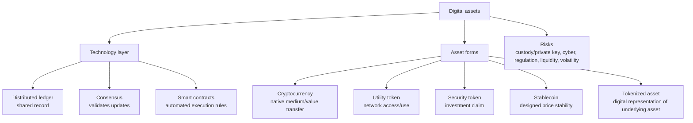

# M07: Introduction to Digital Assets

> **模块定位**：识别另类投资结构、绩效、私募、实物资产、对冲基金与数字资产特征。 本模块聚焦 **Introduction to Digital Assets**，要求把官方 LOS 转成可执行的判断、计算或解释动作。

---

## Official Module Structure

- Learning Outcomes: Introduction to Digital Assets
- 7.01 | Introduction
- 7.02 | Distributed Ledger Technology
- 7.03 | Digital Asset Investment Features
- 7.04 | Digital Asset Investment Forms
- 7.05 | Digital Asset Investment Risk, Return, and Diversification

## Learning Outcome Statements

1. describe financial applications of distributed ledger technology
2. explain investment features of digital assets and contrast them with other asset classes
3. describe investment forms and vehicles used in digital asset investments
4. analyze sources of risk, return, and diversification among digital asset investments


## Textbook Signal Topics

- Textbook volume: `V8`
- Source ePub: `D:\BaiduNetdiskDownload\CFA2026一级原版书\cfa-program2026L1V8.ePub`
- Textbook chapter: `Module 7: Introduction to Digital Assets`
- Practice / Solutions: `available` / `available`

### High-Signal Anchors

- 2. Distributed Ledger Technology
- 2.1. Proof of Work vs. Proof of Stake
- 2.1.1. The Proof of Work (PoW) Protocol
- 2.1.2. The Proof of Stake (PoS) Protocol
- 2.2. Permissioned and Permissionless Networks
- 2.3. Types of Digital Assets
- 2.3.1. Cryptocurrencies
- 2.3.2. Tokens

### How To Use These Anchors

- 先用题干关键词匹配到最接近的教材锚点，再回到正文确认定义边界、顺序条件和例外。
- 计算题优先看公式触发段；概念题优先看对比、分类和限制条件段。
- 若一道题同时触发多个锚点，先处理 LOS 主动作对应的那个，再补其余支持细节。
---

## 1. 模块定位

### 7.1 学习任务
- **核心问题**：考试希望你用 `Introduction to Digital Assets` 解释什么、计算什么、比较什么，或判断什么。
- **输入信息**：题干事实、数据、假设、时间口径、单位、约束条件。
- **输出结果**：中文结论 + 英文关键术语 + 必要公式/框架 + 限制条件。

### 7.2 考试角色
- **难度类型**：计算+解释。
- **高频题型**：定义辨析、情境判断、计算解释、表格补数、跨模块比较。
- **答题原则**：先判断 LOS 动词，再选择工具；计算后必须解释结果含义。

### 7.3 关键英文术语
- **Introduction to Digital Assets（核心术语）**：本模块关键词，用于定位 LOS、题干条件和解题动作。
- **Introduction（核心术语）**：本模块关键词，用于定位 LOS、题干条件和解题动作。
- **Distributed Ledger Technology（核心术语）**：本模块关键词，用于定位 LOS、题干条件和解题动作。
- **Digital Asset Investment Features（核心术语）**：本模块关键词，用于定位 LOS、题干条件和解题动作。
- **Digital Asset Investment Forms（核心术语）**：本模块关键词，用于定位 LOS、题干条件和解题动作。
- **Digital Asset Investment Risk, Return, and Diversification（核心术语）**：本模块关键词，用于定位 LOS、题干条件和解题动作。
- **Digital Assets（数字资产）**：基于分布式账本或加密网络的资产形态。

## 2. 官方 LOS 对应学习目标

| LOS | 官方要求 | 中文学习动作 | 做题输出 |
|---|---|---|---|
| 7.1 | describe financial applications of distributed ledger technology | 描述定义、流程和适用场景 | 写出结论、依据、公式口径和限制条件。 |
| 7.2 | explain investment features of digital assets and contrast them with other asset classes | 解释机制、原因和后果 | 写出结论、依据、公式口径和限制条件。 |
| 7.3 | describe investment forms and vehicles used in digital asset investments | 描述定义、流程和适用场景 | 写出结论、依据、公式口径和限制条件。 |
| 7.4 | analyze sources of risk, return, and diversification among digital asset investments | 识别概念、解释机制并应用到题干。 | 写出结论、依据、公式口径和限制条件。 |

## 3. 核心知识树

```text
7. Introduction to Digital Assets
├─ 7.1 区块链与共识机制【考试核心】
│  ├─ 7.1.1 DLT：多个参与方共享、同步和验证账本；blockchain 是 DLT 的一种实现。
│  ├─ 7.1.2 Consensus：PoW 用算力竞争且能耗高；PoS 用质押验证且能耗低，但有集中化/治理风险。
│  └─ 7.1.3 Smart contracts：按代码自动执行条款，提高效率但引入代码漏洞和 oracle risk。
├─ 7.2 数字资产类型 (Digital Asset Types)
│  ├─ 7.2.1 Cryptocurrency：主要作为支付/价值转移媒介，价格波动大。
│  ├─ 7.2.2 Utility token：提供网络或平台使用权，不必然代表所有权。
│  ├─ 7.2.3 Security token/tokenized asset：代表资产权益、现金流或所有权，监管属性更强。
│  └─ 7.2.4 Stablecoin：试图锚定法币或资产，但有储备、赎回和监管风险。
├─ 7.3 代币化 (Tokenization)【考试核心】
│  ├─ 7.3.1 Tokenization 是把底层资产权利映射为链上 token，可提高 fractional ownership 和交易效率。
│  ├─ 7.3.2 ICO 是融资事件，不等同于 tokenization 过程。
│  └─ 7.3.3 风险：custody/private key、cybersecurity、liquidity、regulatory uncertainty、valuation。
├─ 7.4 Risk, return, and diversification
│  ├─ 7.4.1 Return 来源高度不稳定，可能来自 adoption、network effects、speculation 或服务使用。
│  └─ 7.4.2 Diversification 不能只看历史相关性；压力期相关性、流动性和监管变化会重定价。
```

## 核心图解



## 4. 知识点详解

### 7.1 区块链与共识机制【考试核心】

#### 7.1.1 区块链 (Blockchain)

**本质**: 分布式账本技术 (DLT, Distributed Ledger Technology)

**特征**: 去中心化 (Decentralized)、不可篡改 (Immutable)、透明可追溯 (Transparent and Traceable)

**注意**: 区块链是底层技术，比特币是区块链的应用之一 —— 考试常考陷阱

#### 7.1.2 PoW (工作量证明, Proof of Work) vs PoS (权益证明, Proof of Stake)

| 维度 | PoW (工作量证明) | PoS (权益证明) |
|------|------------------|----------------|
| 方式 | 挖矿（算力竞争） | 质押（持有量决定记账权） |
| 能耗 | 高 | 低 |
| 安全性 | 高（51%攻击成本高） | 中高 |
| 代表 | Bitcoin | Ethereum 2.0 |
| 去中心化程度 | 高（算力分散） | 较高（财富集中风险） |
| 扩展性 | 较低（吞吐量受限） | 较高（可支持智能合约） |

### 7.2 数字资产类型 (Digital Asset Types)

| 类型 | 英文 | 说明 | 示例 |
|------|------|------|------|
| 加密货币 | Cryptocurrencies | 支付型代币 | Bitcoin, Litecoin |
| 效用代币 | Utility Tokens | 使用特定平台服务的权利 | 平台原生代币 |
| 证券型代币 | Security Tokens | 代表传统资产所有权，受证券法规监管 | 代币化证券 |

### 7.3 代币化 (Tokenization)【考试核心】

**定义**: 将资产权利转化为区块链上的数字代币

**与ICO区别**:
- **代币化 (Tokenization)**: 资产数字化的过程/技术
- **ICO (首次代币发行)**: 融资事件，公司出售代币筹集资金

**优势**:
- 提高流动性（分式所有权 Fractional Ownership，降低投资门槛）
- 降低交易成本（去中介化）
- 24/7交易，跨境无障碍
- 提高透明度（链上可追溯）

**风险**:
- 监管不确定性 (Regulatory Uncertainty)
- 技术风险（智能合约漏洞）
- 流动性风险（市场深度不足）
- 托管与安全风险（私钥管理）

### 教材驱动补强（按原版教材回看）

| 教材锚点 | 回看重点 | 题干触发词 |
|---|---|---|
| Distributed Ledger Technology | 重点回看定义、核心结论和它在本模块中的用途，避免只记标题不记动作。 | `Distributed Ledger Technology`；`DLT`；题干里出现同义词、定义反问、比较口径或一步计算时回到这一节。 |
| Proof of Work vs. Proof of Stake | 重点回看这一层的主干结论、比较口径和公式适用条件，再往下接次级细节。 | `Proof of Work vs. Proof of Stake`；`PWVPS`；题干里出现同义词、定义反问、比较口径或一步计算时回到这一节。 |
| The Proof of Work (PoW) Protocol | 重点回看分类边界、步骤顺序、输入输出变量，以及容易被题目改口径的细节。 | `The Proof of Work (PoW) Protocol`；`PWPP`；题干里出现同义词、定义反问、比较口径或一步计算时回到这一节。 |
| The Proof of Stake (PoS) Protocol | 重点回看分类边界、步骤顺序、输入输出变量，以及容易被题目改口径的细节。 | `The Proof of Stake (PoS) Protocol`；`PSPP`；题干里出现同义词、定义反问、比较口径或一步计算时回到这一节。 |
| Permissioned and Permissionless Networks | 重点回看这一层的主干结论、比较口径和公式适用条件，再往下接次级细节。 | `Permissioned and Permissionless Networks`；`PPN`；题干里出现同义词、定义反问、比较口径或一步计算时回到这一节。 |
| Types of Digital Assets | 重点回看这一层的主干结论、比较口径和公式适用条件，再往下接次级细节。 | `Types of Digital Assets`；`TDA`；题干里出现同义词、定义反问、比较口径或一步计算时回到这一节。 |
| Cryptocurrencies | 重点回看分类边界、步骤顺序、输入输出变量，以及容易被题目改口径的细节。 | `Cryptocurrencies`；题干里出现同义词、定义反问、比较口径或一步计算时回到这一节。 |
| Tokens | 重点回看分类边界、步骤顺序、输入输出变量，以及容易被题目改口径的细节。 | `Tokens`；题干里出现同义词、定义反问、比较口径或一步计算时回到这一节。 |

## 5. 关键公式与计算框架

### 5.1 核心内容

数字资产模块**无定量公式**，但需要掌握以下概念对比关系：

| 对比组/框架 | 判断链 | 知识树节点 | 考试说明 |
|--------|--------|------|------|
| 区块链 vs 比特币 | `blockchain = technology; bitcoin = application/asset` | `7.1.1` | 经典概念陷阱 |
| PoW vs PoS | `mining/energy-intensive -> PoW; staking/lower-energy -> PoS` | `7.1.2` | 安全、能耗和治理差异 |
| Smart contract risk | `automated execution + code/oracle/cyber risk` | `7.1.3` | 自动化不等于无风险 |
| Token classification | `function/right/claim -> cryptocurrency / utility / security / stablecoin / tokenized asset` | `7.2` | 按权利和用途判断 |
| Tokenization vs ICO | `asset digitization process vs fundraising event` | `7.3.1/7.3.2` | 不要把过程和发行事件混同 |
| Suitability screen | `volatility + liquidity + custody + regulation + client risk tolerance` | `7.3.3/7.4` | 与 Ethics/PM 连接 |

## 6. 常见考点与解题思路

| 重要性 | 考点 | 解题动作 |
|---|---|---|
| ⭐⭐⭐ | 7.1 Introduction | 先定位题干触发词，再写公式/框架，最后解释结果或判断陷阱。 |
| ⭐⭐⭐ | 7.2 Distributed Ledger Technology | 先定位题干触发词，再写公式/框架，最后解释结果或判断陷阱。 |
| ⭐⭐ | 7.3 Digital Asset Investment Features | 先定位题干触发词，再写公式/框架，最后解释结果或判断陷阱。 |
| ⭐⭐ | 7.4 Digital Asset Investment Forms | 先定位题干触发词，再写公式/框架，最后解释结果或判断陷阱。 |
| ⭐ | 7.5 Digital Asset Investment Risk, Return, and Diversification | 先定位题干触发词，再写公式/框架，最后解释结果或判断陷阱。 |

### 6.9 ⭐⭐ Legacy 考点补充

### 6.1 核心内容

1. **PoW vs PoS辨析**: 题干描述共识机制特征，判断属于PoW还是PoS。**思路**: 挖矿+高能耗=PoW；质押+低能耗=PoS。
2. **代币类型判断**: 给定代币的功能描述，判断类型。**思路**: 支付工具=Cryptocurrency；使用服务=Utility Token；代表所有权=Security Token。
3. **区块链概念辨析**: 选择题常见概念混淆。**思路**: 区块链≠比特币；区块链≠代币化。
4. **代币化优势分析**: 多选题考查代币化对传统资产市场的影响。**思路**: 流动性↑、成本↓、24/7交易、透明度↑。

### 教材驱动解题动作

- 先按 `Textbook Signal Topics` 找最接近的教材小节，不要直接凭熟词下结论。
- 遇到 `Distributed Ledger Technology`` 相关题型时，先复原该小节的定义边界，再决定是套公式、做比较还是判断例外。
- 遇到 `Proof of Work vs. Proof of Stake`` 相关题型时，先复原该小节的定义边界，再决定是套公式、做比较还是判断例外。
- 遇到 `The Proof of Work (PoW) Protocol`` 相关题型时，先复原该小节的定义边界，再决定是套公式、做比较还是判断例外。
- 遇到 `The Proof of Stake (PoS) Protocol`` 相关题型时，先复原该小节的定义边界，再决定是套公式、做比较还是判断例外。
- 遇到 `Permissioned and Permissionless Networks`` 相关题型时，先复原该小节的定义边界，再决定是套公式、做比较还是判断例外。
- 做完一轮后，回到教材内 `Practice Problems / Solutions` 检查自己是否漏掉了变量口径、顺序条件或例外。

## 7. 易错点与考试陷阱

| ❌ 错误理解 | ✅ 正确理解 | 为什么错 / 考试提醒 |
|---|---|---|
| ❌ 忽略：区块链 ≠ 比特币: 区块链是技术（分布式账本），比特币只是该技术的应用之一 | ✅ 区块链 ≠ 比特币: 区块链是技术（分布式账本），比特币只是该技术的应用之一 | 题干通常会用口径、顺序、定义边界或例外条件设置干扰。 |
| ❌ 忽略：区块链 ≠ 代币化: 区块链是底层技术，代币化是在该技术上的应用过程 | ✅ 区块链 ≠ 代币化: 区块链是底层技术，代币化是在该技术上的应用过程 | 题干通常会用口径、顺序、定义边界或例外条件设置干扰。 |
| ❌ 忽略：数字资产并非完全匿名: 而是伪匿名 (Pseudonymous)，交易记录在链上可追溯 | ✅ 数字资产并非完全匿名: 而是伪匿名 (Pseudonymous)，交易记录在链上可追溯 | 题干通常会用口径、顺序、定义边界或例外条件设置干扰。 |
| ❌ 忽略：所有代币都是加密货币?: 错误，加密货币是支付型代币，还有效用代币和证券型代币 | ✅ 所有代币都是加密货币?: 错误，加密货币是支付型代币，还有效用代币和证券型代币 | 题干通常会用口径、顺序、定义边界或例外条件设置干扰。 |
| ❌ 忽略：PoW安全性更高但能耗高: PoW的51%攻击成本远高于PoS | ✅ PoW安全性更高但能耗高: PoW的51%攻击成本远高于PoS | 题干通常会用口径、顺序、定义边界或例外条件设置干扰。 |

### 教材驱动易错清单

| 易错来源 | 常见误判 | 回正动作 |
|---|---|---|
| Distributed Ledger Technology | 把标题当成会做题，忽略定义边界和相邻概念差异。 | 看到相关题干先回到 `Distributed Ledger Technology`，用一句话说清“它是什么、什么时候用、最容易和什么混”。 |
| Proof of Work vs. Proof of Stake | 把标题当成会做题，忽略定义边界和相邻概念差异。 | 看到相关题干先回到 `Proof of Work vs. Proof of Stake`，用一句话说清“它是什么、什么时候用、最容易和什么混”。 |
| The Proof of Work (PoW) Protocol | 记住了主标题，却忽略该细分小节真正考的是步骤顺序、分类条件或变量口径。 | 看到相关题干先回到 `The Proof of Work (PoW) Protocol`，用一句话说清“它是什么、什么时候用、最容易和什么混”。 |
| The Proof of Stake (PoS) Protocol | 记住了主标题，却忽略该细分小节真正考的是步骤顺序、分类条件或变量口径。 | 看到相关题干先回到 `The Proof of Stake (PoS) Protocol`，用一句话说清“它是什么、什么时候用、最容易和什么混”。 |
| Permissioned and Permissionless Networks | 把标题当成会做题，忽略定义边界和相邻概念差异。 | 看到相关题干先回到 `Permissioned and Permissionless Networks`，用一句话说清“它是什么、什么时候用、最容易和什么混”。 |

## 8. 跨模块关联

- **来自 M01**：数字资产体现另类投资的 unique risk、regulatory uncertainty、custody complexity 和 liquidity fragmentation。
- **来自 M02**：极端波动和估值口径使 risk-adjusted performance 更难稳定解释。
- **到 Derivatives**：数字资产可通过期货、ETP、杠杆产品取得敞口，需理解 collateral 和 liquidation risk。
- **到 PM**：配置规模取决于 volatility、相关性稳定性、流动性、再平衡和客户约束。
- **到 Ethics**：推荐数字资产必须充分披露 custody、cyber、regulatory、liquidity 和 valuation 风险。


## 9. 复习与刷题提示

- 第一轮：按 `Official Module Structure` 逐节过概念，把每个 LOS 改写成中文任务。
- 第二轮：对照 `## 3. 核心知识树` 做主动回忆，能说出每个编号节点的定义、公式/框架和陷阱。
- 第三轮：刷题后记录错因，如果暴露 MOC 缺口，按 `docs/moc-auto-patch-workflow.md` 进入补强流程。
- 考前：只看术语、公式/框架、易错点和本模块错题，避免重新铺开所有正文。

## 10. Legacy Notes Integrated

- **主要 legacy 来源**：`M07-Digital-Assets.md` (medium, 0.366)
- **整合规则**：高置信内容已合入 `知识点详解`、`公式与计算框架`、`常见考点`、`易错陷阱` 和 `跨模块关联`。
- **边界**：若 legacy 内容与 2026 官方 LOS 冲突，以官方 module 名称、LOS 和 registry 为准。
