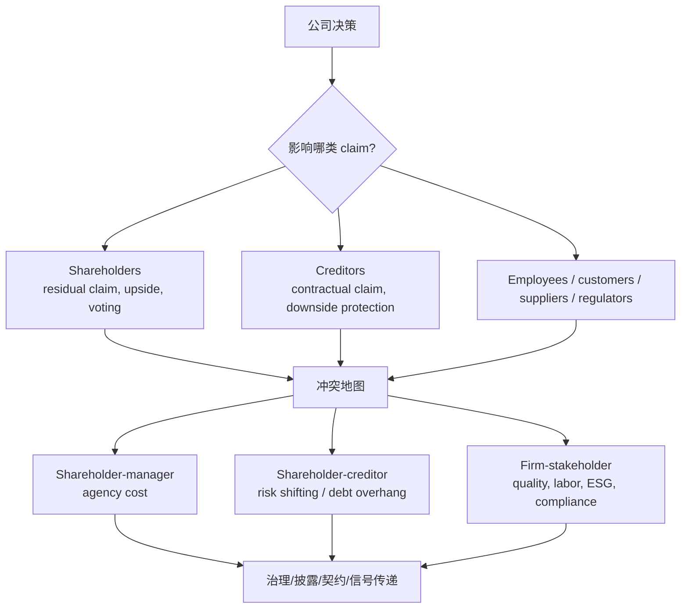

# M02: Investors and Other Stakeholders

> **模块定位**：理解公司组织、治理、营运资本、资本配置与商业模式如何影响价值创造。 本模块聚焦 **Investors and Other Stakeholders**，要求把官方 LOS 转成可执行的判断、计算或解释动作。

---

## Official Module Structure

- Learning Outcomes: Investors and Other Stakeholders
- 2.01 | Introduction
- 2.02 | Financial Claims of Lenders and Shareholders
- 2.03 | Corporate Stakeholders and Governance
- 2.04 | Corporate ESG Considerations

## Learning Outcome Statements

1. compare the financial claims and motivations of lenders and shareholders
2. describe a company’s stakeholder groups and compare their interests
3. describe environmental, social, and governance factors of corporate issuers considered by investors

---

## 1. 模块定位

### 2.1 学习任务
- **核心问题**：考试希望你用 `Investors and Other Stakeholders` 解释什么、计算什么、比较什么，或判断什么。
- **输入信息**：题干事实、数据、假设、时间口径、单位、约束条件。
- **输出结果**：中文结论 + 英文关键术语 + 必要公式/框架 + 限制条件。

### 2.2 考试角色
- **难度类型**：概念+案例判断。
- **高频题型**：定义辨析、情境判断、计算解释、表格补数、跨模块比较。
- **答题原则**：先判断 LOS 动词，再选择工具；计算后必须解释结果含义。

### 2.3 关键英文术语
- **Investors and Other Stakeholders（核心术语）**：本模块关键词，用于定位 LOS、题干条件和解题动作。
- **Introduction（核心术语）**：本模块关键词，用于定位 LOS、题干条件和解题动作。
- **Financial Claims of Lenders and Shareholders（核心术语）**：本模块关键词，用于定位 LOS、题干条件和解题动作。
- **Corporate Stakeholders and Governance（核心术语）**：本模块关键词，用于定位 LOS、题干条件和解题动作。
- **Corporate ESG Considerations（核心术语）**：本模块关键词，用于定位 LOS、题干条件和解题动作。

## 2. 官方 LOS 对应学习目标

| LOS | 官方要求 | 中文学习动作 | 做题输出 |
|---|---|---|---|
| 2.1 | compare the financial claims and motivations of lenders and shareholders | 比较相似概念的适用条件与差异 | 写出结论、依据、公式口径和限制条件。 |
| 2.2 | describe a company’s stakeholder groups and compare their interests | 比较相似概念的适用条件与差异；描述定义、流程和适用场景 | 写出结论、依据、公式口径和限制条件。 |
| 2.3 | describe environmental, social, and governance factors of corporate issuers considered by investors | 描述定义、流程和适用场景 | 写出结论、依据、公式口径和限制条件。 |

## 3. 核心知识树

```text
2. Investors and Other Stakeholders
├─ 2.1 投资者类型 (Types of Investors)
│  ├─ 2.1.1 Institutional vs retail：机构代表他人管理资金，散户用自有资金；信息能力和治理参与不同。
│  ├─ 2.1.2 Equity vs debt：股东是 residual claim，债权人是 contractual claim；风险、回报和治理权利不同。
│  └─ 2.1.3 Active ownership：投票、engagement、proxy voting 和 fiduciary duty 改变投资者角色。
├─ 2.2 利益相关者目标与冲突 (Stakeholder Objectives and Conflicts)
│  ├─ 2.2.1 股东-债权人：有限责任使股东偏好高风险项目，债权人关注 downside protection。
│  ├─ 2.2.2 股东-管理层：控制权和激励不一致，产生 agency costs。
│  ├─ 2.2.3 控股股东-少数股东：控制权可能导致 tunneling 或 related-party transactions。
│  └─ 2.2.4 公司-其他利益相关者：员工、客户、供应商、监管和社区目标可能与利润最大化冲突。
├─ 2.3 信息不对称 (Information Asymmetry)
│  ├─ 2.3.1 Adverse selection：交易前信息不对称，优质公司可能被低估。
│  ├─ 2.3.2 Moral hazard：交易后代理人行为偏移，需要监督、契约和激励约束。
│  └─ 2.3.3 Signaling：股息、债务、回购、管理层持股等行动只有可信时才传递信息。
├─ 2.4 金融分析师的角色 (The Role of Financial Analysts)
│  ├─ 2.4.1 信息中介：收集、分析和传播信息，降低管理层与外部投资者的信息差。
│  └─ 2.4.2 利益冲突：sell-side、buy-side、independent analyst 的客户和激励不同。
├─ 2.5 ESG 与利益相关者视角 (ESG from a Stakeholder Perspective)
│  ├─ 2.5.1 E/S/G 维度：环境影响社区和监管，社会影响员工客户供应链，治理影响投资者和债权人。
│  └─ 2.5.2 财务传导：material ESG 通过 cash flow、risk 和 cost of capital 影响价值。
```

## 核心图解



## 4. 知识点详解

### 2.1 投资者类型 (Types of Investors)

公司从多种渠道获得资本，不同类型的投资者在**风险承担 (risk bearing)**、**回报形式 (return form)** 和**信息需求 (information needs)** 方面有本质区别：

**按投资者类别划分：**

| 类型 | 特征 | 投资目标 | 信息要求 |
|------|------|----------|----------|
| **机构投资者 (Institutional Investors)** | 代表他人管理资金，如养老金基金、保险公司、共同基金、对冲基金、主权财富基金 | 风险调整后收益最大化；长期稳定回报；部分机构有特定负债匹配需求 | 要求高质量、标准化披露；主动参与公司治理 |
| **个人/散户投资者 (Retail Investors)** | 用自己的资金进行投资，规模较小 | 资本增值、收入产生、财富保值；目标因个人生命周期阶段而异 | 依赖公开信息；较少直接参与公司治理 |

**按权益性质划分：**

| 类型 | 索偿权性质 | 风险特征 | 回报形式 | 治理权利 |
|------|-----------|----------|----------|----------|
| **股权投资者 (Equity Holders)** | 剩余索偿权 (Residual Claim) — 公司清偿所有债务后剩余资产归股东 | 最高风险，最后受偿 | 股息 + 资本利得 | 有投票权，选举董事会，决定重大事项 |
| **债务投资者 (Debt Holders)** | 固定合约索偿权 (Fixed Contractual Claim) — 按合约获得利息和本金 | 较低风险，优先受偿 | 固定利息收入 | 无投票权（除非违约条款触发） |

**机构投资者的特殊角色**：
- **积极所有权 (Active Ownership)**：机构投资者通过**投票 (voting)** 和**参与 (engagement)** 影响公司决策。
- **受托责任 (Fiduciary Duty)**：机构投资者对最终受益人负有受托责任，必须将受益人利益置于首位。
- **代理投票 (Proxy Voting)**：机构投资者代表受益人行使投票权，在股东大会上对董事选举、薪酬政策、并购等事项表决。

### 2.2 利益相关者目标与冲突 (Stakeholder Objectives and Conflicts)

**利益相关者 (Stakeholders)** 是受公司活动影响的任何个人或团体。不同利益相关者的目标常不一致：

| 利益相关者 | 核心目标 | 关心的风险 | 潜在冲突来源 |
|-----------|----------|-----------|-------------|
| **股东 (Shareholders)** | 公司价值最大化、股价上涨、股息增长 | 业务风险、战略失误 | 与管理层的薪酬冲突、与债权人的风险偏好冲突 |
| **债权人/债务持有者 (Creditors/Debt Holders)** | 按时还本付息、资产保全 | 违约风险、过度杠杆、资产置换 | 股东可能偏好高风险高回报项目，损害债权人利益 |
| **管理层 (Managers/Executives)** | 薪酬、职业声誉、权力、工作保障 | 个人声誉风险、失业风险 | 可能追求短期业绩以获取奖金，牺牲长期价值；可能过度保守以避免个人风险 |
| **员工 (Employees)** | 薪酬福利、工作稳定性、职业发展、安全环境 | 裁员、工资下降、工作条件恶化 | 股东追求利润最大化可能导致裁员或降薪 |
| **客户 (Customers)** | 产品质量、价格合理、服务可靠 | 产品缺陷、价格欺诈、数据泄露 | 公司可能降低成本牺牲产品质量以提升利润 |
| **供应商 (Suppliers)** | 稳定的采购关系、及时付款 | 延迟付款、违约 | 公司可能压榨供应商以降低成本 |
| **监管机构 (Regulators)** | 合规运营、市场公平、消费者保护、金融稳定 | 系统性风险、市场操纵 | 公司可能规避监管以降低成本 |
| **社区/社会 (Community/Society)** | 就业机会、环境保护、社会责任 | 环境污染、资源消耗、社会不公 | 公司可能将环境和社会成本外部化 |

**关键冲突类型**：
1. **股东 vs 债权人 (Shareholder-Creditor Conflict)**：股东偏好高风险高回报项目（有限责任赋予下行保护），而债权人偏好稳健经营。这是**资产置换 (asset substitution)** 和**债务悬置 (debt overhang)** 问题的根源。
2. **股东 vs 管理层 (Principal-Agent Conflict)**：所有权与控制权分离导致管理层可能追求自身利益而非股东价值。详见 [[M03-Corporate-Governance-and-ESG]]。
3. **股东 vs 其他利益相关者 (Shareholder vs Other Stakeholders)**：利润最大化目标可能与员工福利、环境保护、客户利益等产生冲突。

### 2.3 信息不对称 (Information Asymmetry)

**信息不对称 (Information Asymmetry)** 是指公司内部人（管理层）比外部人（投资者、债权人）掌握更多关于公司真实状况的信息。这是公司金融中最核心的市场不完美之一。

**三个关键维度**：

| 概念 | 定义 | 后果 |
|------|------|------|
| **逆向选择 (Adverse Selection)** | 交易前信息不对称：内部人利用信息优势在交易中获利 | 投资者担心"柠檬问题"，压低证券发行价格；优质公司被低估 |
| **道德风险 (Moral Hazard)** | 交易后信息不对称：代理人利用信息优势做出损害委托人利益的行为 | 管理层可能从事高风险活动或懈怠；债权人设置更严格的契约条款 |
| **信号传递 (Signaling)** | 公司通过可观察的行动向市场传递私有信息 | 如举债（信号公司质量好）、股息（信号现金流充裕）、管理层持股（信号信心） |

**信息不对称对利益相关者关系的影响**：
- **对股权投资者**：无法准确评估公司价值 → 要求更高回报率 → 提高股权融资成本
- **对债权人**：无法准确评估违约风险 → 要求更高利率或更严格的契约条款
- **对管理层**：利用信息优势获取不当利益（内幕交易、自利交易）
- **对公司整体**：信息不对称导致资本错配，增加融资成本

### 2.4 金融分析师的角色 (The Role of Financial Analysts)

**金融分析师 (Financial Analysts)** 在资本市场中扮演**信息中介 (information intermediary)** 的关键角色，通过以下方式减少信息不对称：

1. **信息收集与分析 (Research & Analysis)**：分析师通过研读财务报表、与管理层沟通、行业研究等方式，形成对公司的独立评估。
2. **研究报告发布 (Research Reports)**：发布买入/持有/卖出评级、目标价和盈利预测，向市场传递信息。
3. **盈余电话会议 (Earnings Calls)**：在季度业绩发布后，分析师通过提问环节深入挖掘管理层未直接披露的信息。
4. **市场效率提升 (Market Efficiency Enhancement)**：分析师的工作使股价更快反映新信息，提高市场定价效率。

**分析师的类型**：
- **卖方分析师 (Sell-Side Analysts)**：受雇于投行或经纪商，发布研究报告供客户参考，通常覆盖特定行业或公司。
- **买方分析师 (Buy-Side Analysts)**：受雇于资产管理公司（共同基金、养老金基金、对冲基金），为内部投资决策服务。
- **独立研究分析师 (Independent Research Analysts)**：不附属于投行或资产管理公司，提供独立研究。

**分析师面临的信息不对称问题**：
- 管理层可能选择性披露信息，或通过"盈余引导 (earnings guidance)"管理市场预期。
- 分析师可能存在**利益冲突 (conflicts of interest)**：卖方分析师可能面临投行业务关系带来的偏倚压力。
- 中国墙 (Chinese Wall) 是投行内部隔离研究部门和投行部门的信息屏障，旨在防止信息不当流动。

### 2.5 ESG 与利益相关者视角 (ESG from a Stakeholder Perspective)

ESG 议题天然具有利益相关者维度：

| ESG 维度 | 影响的利益相关者 | 对公司和投资者的意义 |
|----------|----------------|---------------------|
| **环境 (Environmental)** | 社区、监管机构、投资者 | 碳排放、污染治理、资源效率 → 合规风险与运营成本 |
| **社会 (Social)** | 员工、客户、供应商、社区 | 劳工权益、产品安全、数据隐私、供应链公平 → 声誉与许可经营 |
| **治理 (Governance)** | 股东、债权人、管理层 | 董事会结构、高管薪酬、股东权利 → 决策质量与代理成本 |

**利益相关者资本主义 (Stakeholder Capitalism)** 强调公司应服务于所有利益相关者，而非仅追求股东价值最大化。这一理念与**股东至上 (Shareholder Primacy)** 形成对比。

**ESG 对利益相关者关系的三条传导路径**：
1. **风险路径**：未管理的 ESG 风险（如环境污染诉讼）损害所有利益相关者的利益。
2. **现金流路径**：良好的 ESG 实践（如节能降耗）降低运营成本、提升员工效率。
3. **资本成本路径**：投资者将 ESG 风险纳入定价，ESG 表现差的公司面临更高的资本成本。

## 5. 关键公式与计算框架

本模块以概念为主，无定量计算公式。掌握以下**利益相关者比较框架**：

### 5.1 利益相关者比较表

| 维度 | 股权投资者 | 债权投资者 | 管理层 | 员工 | 客户 |
|------|-----------|-----------|--------|------|------|
| **索偿权顺序** | 最后（剩余） | 优先于股权 | 薪酬作为费用优先 | 薪酬作为费用优先 | 无直接财务索偿权 |
| **信息获取能力** | 中等（依赖公开披露+分析师） | 较强（可要求契约条款和财报附带信息） | 最强（内部人信息） | 中等（限于自身工作范围） | 弱（仅产品层面信息） |
| **利益与公司对齐度** | 完全对齐（剩余索偿） | 部分对齐（仅偿债能力相关） | 不完全对齐（需治理机制） | 部分对齐（就业依赖） | 弱对齐（产品质量关注） |
| **风险敞口** | 业务风险 + 市场风险 | 信用/违约风险 | 失业风险 + 声誉风险 | 失业风险 | 产品/服务风险 |
| **治理参与度** | 投票权、提案权 | 契约条款、违约后控制权 | 日常经营控制权 | 工会谈判（部分） | 消费者保护法规 |

### 5.2 信息不对称分析框架

| 概念 | 定义 | 对资本市场的影响 | 缓解机制 |
|------|------|-----------------|----------|
| 逆向选择 | 交易前一方拥有更多信息 | 市场失灵、"柠檬市场" | 强制披露、信号传递、金融分析师 |
| 道德风险 | 交易后一方改变行为 | 代理成本、契约成本 | 监督机制、激励相容、治理结构 |
| 信号传递 | 高质量公司发送可信信号 | 分离均衡、降低信息成本 | 股息、资本结构选择、管理层持股 |

## 6. 常见考点与解题思路

| 重要性 | 考点 | 解题动作 |
|---|---|---|
| ⭐⭐⭐ | 2.1 Introduction | 先定位题干触发词，再写公式/框架，最后解释结果或判断陷阱。 |
| ⭐⭐⭐ | 2.2 Financial Claims of Lenders and Shareholders | 先定位题干触发词，再写公式/框架，最后解释结果或判断陷阱。 |
| ⭐⭐ | 2.3 Corporate Stakeholders and Governance | 先定位题干触发词，再写公式/框架，最后解释结果或判断陷阱。 |
| ⭐⭐ | 2.4 Corporate ESG Considerations | 先定位题干触发词，再写公式/框架，最后解释结果或判断陷阱。 |

### 6.9 ⭐⭐ Legacy 考点补充

### 6.1 核心内容

**考点 1：区分投资者类型及其目标**
- 题型：描述一个投资者的特征（如"代表退休基金管理资产，关注长期稳定回报"），问属于哪类。
- 解题思路：
  1. 机构 vs 零售 → 看"代表他人" vs "自有资金"
  2. 股权 vs 债务 → 看"剩余索偿" vs "固定索偿"
  3. 积极 vs 被动 → 看"参与治理" vs "仅价格接受"

**考点 2：分析利益相关者冲突**
- 题型：给一个公司决策情景（如"公司打算发行大量新债用于股票回购"），问哪些利益相关者受益或受损。
- 解题思路：
  1. 识别决策的**财富转移效应** → 谁获得收益？谁承担风险？
  2. 股东通常受益于高风险策略（有限责任保护下行），债权人受损（违约风险上升）。
  3. 管理层可能受益于短期激励，但长期可能因风险失控受损。

**考点 3：信息不对称的影响**
- 题型：问信息不对称如何影响公司的融资成本。
- 答案要点：信息不对称 → 投资者要求更高回报补偿信息风险 → 提高股权和债务融资成本。公司有动力通过信息披露和信号传递降低信息不对称。

**考点 4：分析师的角色**
- 题型：问金融分析师在资本市场中的主要功能。
- 答案：作为**信息中介**，收集、分析、传递信息，减少管理层与投资者之间的信息不对称，提高市场效率。

**考点 5：ESG与利益相关者**
- 题型：问某个ESG议题（如碳排放）主要影响哪些利益相关者。
- 解题：环境议题影响最广泛的利益相关者群体（社区、监管、投资者、员工），社会议题影响员工和客户，治理议题主要影响股东和债权人。

## 7. 易错点与考试陷阱

| ❌ 错误理解 | ✅ 正确理解 | 为什么错 / 考试提醒 |
|---|---|---|
| ❌ 忽略："所有投资者都有相同的信息获取能力"（错）：机构投资者通常能获得更多信息（与管理层直接沟通、雇佣专业分析师），而散户投资者主要依赖公开信息。 | ✅ "所有投资者都有相同的信息获取能力"（错）：机构投资者通常能获得更多信息（与管理层直接沟通、雇佣专业分析师），而散户投资者主要依赖公开信息。 | 题干通常会用口径、顺序、定义边界或例外条件设置干扰。 |
| ❌ 忽略："股东价值最大化等同于所有利益相关者利益最大化"（错）：股东价值最大化是公司财务的标准假设，但这一目标可能与债权人（风险偏好冲突）、员工（裁员）、客户（降低成本牺牲质量）的利益产… | ✅ "股东价值最大化等同于所有利益相关者利益最大化"（错）：股东价值最大化是公司财务的标准假设，但这一目标可能与债权人（风险偏好冲突）、员工（裁员）、客户（降低成本牺牲质量）的利益产… | 题干通常会用口径、顺序、定义边界或例外条件设置干扰。 |
| ❌ 忽略："信息不对称只存在于管理层与股东之间"（错）：信息不对称普遍存在于公司与所有外部利益相关者之间，包括债权人、供应商、客户、监管机构等。 | ✅ "信息不对称只存在于管理层与股东之间"（错）：信息不对称普遍存在于公司与所有外部利益相关者之间，包括债权人、供应商、客户、监管机构等。 | 题干通常会用口径、顺序、定义边界或例外条件设置干扰。 |
| ❌ 忽略："债权人拥有与股东相同的治理权利"（错）：债权人通常没有投票权，但通过债务契约（covenants）保护自身利益。 | ✅ "债权人拥有与股东相同的治理权利"（错）：债权人通常没有投票权，但通过债务契约（covenants）保护自身利益。 | 题干通常会用口径、顺序、定义边界或例外条件设置干扰。 |
| ❌ 忽略："卖方分析师和买方分析师的角色相同"（错）：卖方分析师对外发布研究报告，买方分析师为内部投资决策服务。卖方分析师可能面临投行业务冲突。 | ✅ "卖方分析师和买方分析师的角色相同"（错）：卖方分析师对外发布研究报告，买方分析师为内部投资决策服务。卖方分析师可能面临投行业务冲突。 | 题干通常会用口径、顺序、定义边界或例外条件设置干扰。 |
| ❌ 忽略："ESG是独立的非财务议题"（错）：ESG因素可能通过风险、现金流和资本成本路径直接影响公司财务表现。 | ✅ "ESG是独立的非财务议题"（错）：ESG因素可能通过风险、现金流和资本成本路径直接影响公司财务表现。 | 题干通常会用口径、顺序、定义边界或例外条件设置干扰。 |
| ❌ 忽略："机构投资者必然比散户投资者更理性"（错）：机构投资者也有行为偏差和利益冲突（如短期业绩压力导致短视行为）。 | ✅ "机构投资者必然比散户投资者更理性"（错）：机构投资者也有行为偏差和利益冲突（如短期业绩压力导致短视行为）。 | 题干通常会用口径、顺序、定义边界或例外条件设置干扰。 |

## 8. 跨模块关联

| 输出概念 | 连接模块 | 怎么连接 | 做题提醒 |
|---|---|---|---|
| Claim priority | [[M01-Organizational-Forms-Corporate-Issuer-Features-and-Ownership]] / FI | 股权和债权的索偿权差异来自组织形式和合约安排。 | 股东有投票权但最后受偿。 |
| Agency conflict | [[M03-Corporate-Governance-Conflicts-Mechanisms-Risks-and-Benefits]] | 治理机制针对信息不对称和目标冲突。 | 先找冲突主体，再找治理机制。 |
| Signaling / information risk | [[M06-Capital-Structure]] | 融资选择、股息和回购可能向市场传递管理层信息。 | 信号必须可信且有成本。 |
| Analyst role | Equity / Market Efficiency | 分析师降低信息不对称、提高价格发现效率。 | 卖方分析师可能有利益冲突。 |
| ESG materiality | Equity / PM / Ethics | ESG 通过现金流、风险和资本成本进入投资决策。 | ESG 不是所有场景都财务重大。 |


## 9. 复习与刷题提示

- 第一轮：按 `Official Module Structure` 逐节过概念，把每个 LOS 改写成中文任务。
- 第二轮：对照 `## 3. 核心知识树` 做主动回忆，能说出每个编号节点的定义、公式/框架和陷阱。
- 第三轮：刷题后记录错因，如果暴露 MOC 缺口，按 `docs/moc-auto-patch-workflow.md` 进入补强流程。
- 考前：只看术语、公式/框架、易错点和本模块错题，避免重新铺开所有正文。

## 10. Legacy Notes Integrated

- **主要 legacy 来源**：`M02-Investors-and-Other-Stakeholders.md` (high, 0.682)
- **整合规则**：高置信内容已合入 `知识点详解`、`公式与计算框架`、`常见考点`、`易错陷阱` 和 `跨模块关联`。
- **边界**：若 legacy 内容与 2026 官方 LOS 冲突，以官方 module 名称、LOS 和 registry 为准。
