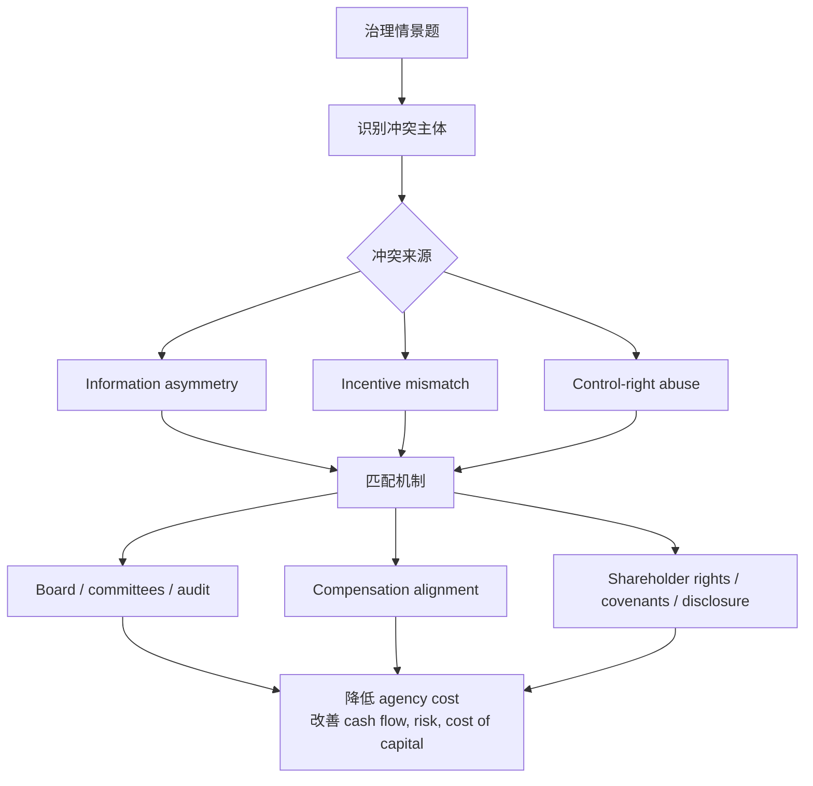

# M03: Corporate Governance: Conflicts, Mechanisms, Risks, and Benefits

> **模块定位**：理解公司组织、治理、营运资本、资本配置与商业模式如何影响价值创造。 本模块聚焦 **Corporate Governance: Conflicts, Mechanisms, Risks, and Benefits**，要求把官方 LOS 转成可执行的判断、计算或解释动作。

---

## Official Module Structure

- Learning Outcomes: Corporate Governance: Conflicts, Mechanisms, Risks, and Benefits
- 3.01 | Introduction
- 3.02 | Stakeholder Conflicts and Management
- 3.03 | Corporate Governance Mechanisms
- 3.04 | Corporate Governance Risks and Benefits

## Learning Outcome Statements

1. describe the principal-agent relationship and conflicts that may arise between stakeholder groups
2. describe corporate governance and mechanisms to manage stakeholder relationships and mitigate associated risks
3. describe potential risks of poor corporate governance and stakeholder management and benefits of effective corporate governance and stakeholder management

---

## 1. 模块定位

### 3.1 学习任务
- **核心问题**：考试希望你用 `Corporate Governance: Conflicts, Mechanisms, Risks, and Benefits` 解释什么、计算什么、比较什么，或判断什么。
- **输入信息**：题干事实、数据、假设、时间口径、单位、约束条件。
- **输出结果**：中文结论 + 英文关键术语 + 必要公式/框架 + 限制条件。

### 3.2 考试角色
- **难度类型**：概念+案例判断。
- **高频题型**：定义辨析、情境判断、计算解释、表格补数、跨模块比较。
- **答题原则**：先判断 LOS 动词，再选择工具；计算后必须解释结果含义。

### 3.3 关键英文术语
- **Corporate Governance: Conflicts, Mechanisms, Risks, and Benefits（核心术语）**：本模块关键词，用于定位 LOS、题干条件和解题动作。
- **Corporate Governance（公司治理）**：约束管理层、董事会和股东之间权责关系的制度。
- **Introduction（核心术语）**：本模块关键词，用于定位 LOS、题干条件和解题动作。
- **Stakeholder Conflicts and Management（核心术语）**：本模块关键词，用于定位 LOS、题干条件和解题动作。
- **Corporate Governance Mechanisms（核心术语）**：本模块关键词，用于定位 LOS、题干条件和解题动作。
- **Corporate Governance Risks and Benefits（核心术语）**：本模块关键词，用于定位 LOS、题干条件和解题动作。

## 2. 官方 LOS 对应学习目标

| LOS | 官方要求 | 中文学习动作 | 做题输出 |
|---|---|---|---|
| 3.1 | describe the principal-agent relationship and conflicts that may arise between stakeholder groups | 描述定义、流程和适用场景 | 写出结论、依据、公式口径和限制条件。 |
| 3.2 | describe corporate governance and mechanisms to manage stakeholder relationships and mitigate associated risks | 描述定义、流程和适用场景 | 写出结论、依据、公式口径和限制条件。 |
| 3.3 | describe potential risks of poor corporate governance and stakeholder management and benefits of effective corporate governance and stakeholder management | 描述定义、流程和适用场景 | 写出结论、依据、公式口径和限制条件。 |

## 3. 核心知识树

```text
3. Corporate Governance: Conflicts, Mechanisms, Risks, and Benefits
├─ 3.1 代理架构 (Agency Architecture)
│  ├─ 3.1.1 Principal-agent conflict：委托人与代理人目标、信息和控制权不一致。
│  ├─ 3.1.2 Conflict map：shareholder-manager、shareholder-creditor、controlling-minority、firm-stakeholder。
│  ├─ 3.1.3 Governance mechanisms：board、committees、compensation、audit、disclosure、shareholder rights、takeover market。
│  └─ 3.1.4 Governance risk：弱治理会导致 empire building、tunneling、overinvestment、risk shifting 和披露质量下降。
├─ 3.2 ESG 与受托责任 (ESG and Stewardship)
│  ├─ 3.2.1 Stewardship：投资者通过投票、engagement 和监督推动长期价值。
│  ├─ 3.2.2 Material ESG：只有能影响 cash flow、risk、growth 或 cost of capital 的 ESG 才进入估值。
│  └─ 3.2.3 考试判断：治理机制不是越多越好，而是是否针对具体冲突并降低 agency cost。
```

## 核心图解



## 4. 知识点详解

### 3.1 代理架构 (Agency Architecture)

**代理问题 (Principal-Agent Problem)** 是公司治理的核心议题。在公司环境中，委托人（股东）雇佣代理人（管理层）代表其利益行事，但两者的激励并不天然一致。

三大冲突来源：
- **控制权分离 (Separation of Control)**：股东拥有公司但不参与日常经营，管理层掌握实际控制权。
- **信息不对称 (Information Asymmetry)**：管理层比股东更了解公司真实状况，可能利用信息优势谋取私利。
- **激励不匹配 (Incentive Mismatch)**：管理层的薪酬结构可能鼓励短期行为而非长期价值创造。

**治理机制 (Governance Mechanisms)** 旨在对齐各方利益：
- **董事会监督 (Board Oversight)**：董事会代表股东监督管理层。**独立董事 (Independent Directors)** 是关键 — 与公司无重大利益关系，能做出客观判断。
- **专业委员会 (Committees)**：审计委员会 (Audit Committee)、薪酬委员会 (Compensation Committee)、提名委员会 (Nominating Committee) 通常全部或大部分由独立董事组成。
- **管理层薪酬 (Executive Compensation)**：将薪酬与业绩挂钩，如股票期权、限制性股票等股权激励。
- **审计 (Audit)**：内外部审计确保财务信息准确可靠。
- **股东权利 (Shareholder Rights)**：包括投票权 (voting rights)、提案权、在重大事项上（如并购）的表决权。

**弱治理的后果**：资本错配 (capital misallocation)、融资成本上升、代理成本侵蚀股东价值。

### 3.2 ESG 与受托责任 (ESG and Stewardship)

ESG 代表 **环境 (Environmental)、社会 (Social)、治理 (Governance)** 三大维度。在 CFA L1 框架中，ESG 被视为影响风险与回报的实质性因素：

- **实质性 ESG 因素 (Material ESG Factors)**：指那些可能显著影响公司财务表现、运营或声誉的 ESG 议题。例如，环境法规变化可能增加高污染企业的合规成本。
- ESG 对财务的三条传导路径：
  1. **改变风险 (Alter Risk)**：如气候风险、劳工纠纷风险
  2. **改变现金流 (Alter Cash Flows)**：如节能减排带来的成本节约
  3. **改变资本成本 (Alter Cost of Capital)**：投资者对ESG表现好的公司要求更低的风险溢价
- **披露质量 (Disclosure Quality)**：高质量、标准化的 ESG 披露帮助投资者更准确地评估公司价值。
- **股东参与 (Engagement)**：机构投资者通过与公司管理层对话推动治理改进和ESG实践。

## 5. 关键公式与计算框架

### 5.1 核心内容

| 冲突 | 典型行为 | 缓解机制 | 考试判断 |
|---|---|---|---|
| Shareholder vs manager | empire building、短期奖金、过度保守 | 独立董事、薪酬对齐、审计、披露 | 看激励是否绑定长期价值。 |
| Shareholder vs creditor | asset substitution、debt overhang、过度分红 | covenants、collateral、限制举债/分红 | 股东有限责任会提高风险偏好。 |
| Controlling vs minority | tunneling、related-party transactions | minority rights、independent board、披露 | 控制权集中不等于治理好。 |
| Firm vs stakeholders | 环境外部性、产品安全、劳工问题 | regulation、ESG oversight、stakeholder engagement | material ESG 才进入财务判断。 |

### 5.2 治理机制决策树

1. 先识别谁是 principal、谁是 agent。
2. 找冲突来自信息不对称、激励错配还是控制权滥用。
3. 匹配机制：监督类、激励类、权利类、披露类、市场约束类。
4. 判断机制效果：降低 agency cost 还是只是形式合规。

## 6. 常见考点与解题思路

| 重要性 | 考点 | 解题动作 |
|---|---|---|
| ⭐⭐⭐ | 3.1 Introduction | 先定位题干触发词，再写公式/框架，最后解释结果或判断陷阱。 |
| ⭐⭐⭐ | 3.2 Stakeholder Conflicts and Management | 先定位题干触发词，再写公式/框架，最后解释结果或判断陷阱。 |
| ⭐⭐ | 3.3 Corporate Governance Mechanisms | 先定位题干触发词，再写公式/框架，最后解释结果或判断陷阱。 |
| ⭐⭐ | 3.4 Corporate Governance Risks and Benefits | 先定位题干触发词，再写公式/框架，最后解释结果或判断陷阱。 |

### 6.9 ⭐⭐ Legacy 考点补充

### 6.1 核心内容

**考点 1：识别代理问题**
- 题目描述管理层行为（如过度投资、追求多元化而非股东价值），问这是何种问题。
- 关键判断词：管理层私利、信息优势、短期主义。

**考点 2：董事会独立性与委员会设置**
- 题目可能问：审计委员会成员应是哪些人？
- 答案：全部或主要由**独立董事 (Independent Directors)** 组成。

**考点 3：ESG 的财务相关性**
- 题目问：为什么 ESG 因素对投资者重要？
- 答案：ESG 因素通过影响**风险、现金流和资本成本**三条路径影响公司估值。

**考点 4：股东权利 vs 利益相关者理论**
- 股东至上 (Shareholder Primacy) vs 利益相关者理论 (Stakeholder Theory)。CFA 框架承认两者，但强调治理的核心是保护股东利益，同时兼顾其他利益相关者。

## 7. 易错点与考试陷阱

| ❌ 错误理解 | ✅ 正确理解 | 为什么错 / 考试提醒 |
|---|---|---|
| ❌ 忽略：治理不是表面文章：良好的治理不仅仅是合规和文书，它真正影响决策质量和折现率。 | ✅ 治理不是表面文章：良好的治理不仅仅是合规和文书，它真正影响决策质量和折现率。 | 题干通常会用口径、顺序、定义边界或例外条件设置干扰。 |
| ❌ 忽略：ESG 不等于"好人好事"：考试关注的是实质性 (materiality) — 哪些 ESG 因素真的影响财务表现。 | ✅ ESG 不等于"好人好事"：考试关注的是实质性 (materiality) — 哪些 ESG 因素真的影响财务表现。 | 题干通常会用口径、顺序、定义边界或例外条件设置干扰。 |
| ❌ 忽略：独立董事 ≠ 外部董事：独立董事必须与公司没有重大业务或个人关系，而外部董事仅指不在公司任职。 | ✅ 独立董事 ≠ 外部董事：独立董事必须与公司没有重大业务或个人关系，而外部董事仅指不在公司任职。 | 题干通常会用口径、顺序、定义边界或例外条件设置干扰。 |
| ❌ 忽略：代理问题不仅存在于股东-管理层之间：控股股东与小股东之间（隧道效应 tunneling）、股东与债权人之间也存在代理冲突。 | ✅ 代理问题不仅存在于股东-管理层之间：控股股东与小股东之间（隧道效应 tunneling）、股东与债权人之间也存在代理冲突。 | 题干通常会用口径、顺序、定义边界或例外条件设置干扰。 |

## 8. 跨模块关联

| 输出概念 | 连接模块 | 怎么连接 | 做题提醒 |
|---|---|---|---|
| Agency cost | [[M02-Investors-and-Other-Stakeholders]] | 利益相关者冲突是治理问题来源。 | 先找冲突主体。 |
| Capital allocation quality | [[M05-Capital-Investments-and-Capital-Allocation]] | 弱治理导致过度投资、项目筛选差和资本浪费。 | 治理会影响 NPV 项目是否被正确选择。 |
| Financing constraints | [[M06-Capital-Structure]] | 债权人通过 covenants 和定价回应治理风险。 | 治理差会提高资本成本。 |
| Working capital discipline | [[M04-Working-Capital-and-Liquidity]] | 管理层激励影响应收、库存和供应商付款政策。 | 激进营运资本可能是风险转移。 |
| ESG materiality | Equity / PM / Ethics | 重大 ESG 影响现金流、风险和估值。 | ESG 题要落到财务传导路径。 |


## 9. 复习与刷题提示

- 第一轮：按 `Official Module Structure` 逐节过概念，把每个 LOS 改写成中文任务。
- 第二轮：对照 `## 3. 核心知识树` 做主动回忆，能说出每个编号节点的定义、公式/框架和陷阱。
- 第三轮：刷题后记录错因，如果暴露 MOC 缺口，按 `docs/moc-auto-patch-workflow.md` 进入补强流程。
- 考前：只看术语、公式/框架、易错点和本模块错题，避免重新铺开所有正文。

## 10. Legacy Notes Integrated

- **主要 legacy 来源**：`M02-Corporate-Governance-and-ESG.md` (medium, 0.406)
- **整合规则**：高置信内容已合入 `知识点详解`、`公式与计算框架`、`常见考点`、`易错陷阱` 和 `跨模块关联`。
- **边界**：若 legacy 内容与 2026 官方 LOS 冲突，以官方 module 名称、LOS 和 registry 为准。
