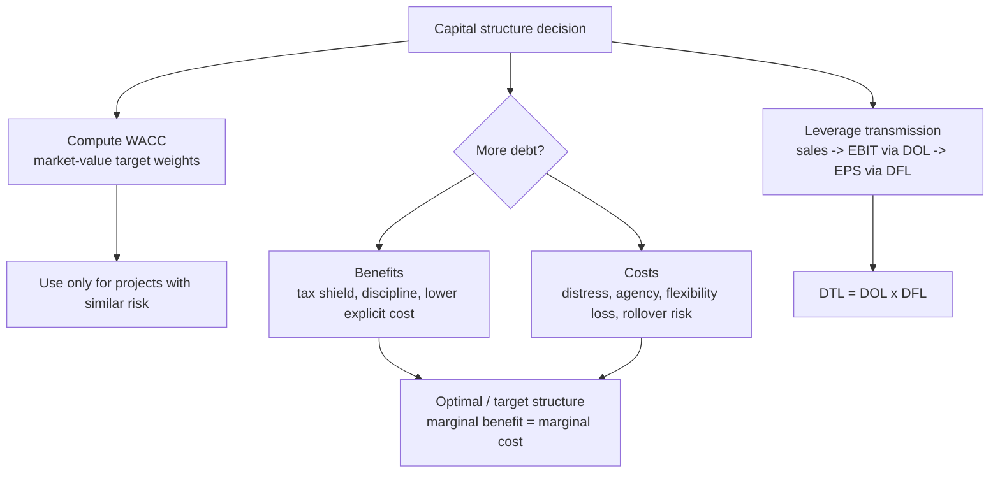

# M06: Capital Structure

> **模块定位**：理解公司组织、治理、营运资本、资本配置与商业模式如何影响价值创造。 本模块聚焦 **Capital Structure**，要求把官方 LOS 转成可执行的判断、计算或解释动作。

---

## Official Module Structure

- Learning Outcomes: Capital Structure
- 6.01 | Introduction
- 6.02 | The Cost of Capital
- 6.03 | Factors Affecting Capital Structure
- 6.04 | Modigliani–Miller Capital Structure Propositions
- 6.05 | Optimal Capital Structure

## Learning Outcome Statements

1. calculate and interpret the weighted-average cost of capital for a company
2. explain factors affecting capital structure and the weighted-average cost of capital
3. explain the Modigliani-Miller propositions regarding capital structure
4. describe optimal and target capital structures

---

## 1. 模块定位

### 6.1 学习任务
- **核心问题**：考试希望你用 `Capital Structure` 解释什么、计算什么、比较什么，或判断什么。
- **输入信息**：题干事实、数据、假设、时间口径、单位、约束条件。
- **输出结果**：中文结论 + 英文关键术语 + 必要公式/框架 + 限制条件。

### 6.2 考试角色
- **难度类型**：计算+解释。
- **高频题型**：定义辨析、情境判断、计算解释、表格补数、跨模块比较。
- **答题原则**：先判断 LOS 动词，再选择工具；计算后必须解释结果含义。

### 6.3 关键英文术语
- **Capital Structure（核心术语）**：本模块关键词，用于定位 LOS、题干条件和解题动作。
- **Introduction（核心术语）**：本模块关键词，用于定位 LOS、题干条件和解题动作。
- **The Cost of Capital（核心术语）**：本模块关键词，用于定位 LOS、题干条件和解题动作。
- **Factors Affecting Capital Structure（核心术语）**：本模块关键词，用于定位 LOS、题干条件和解题动作。
- **Modigliani–Miller Capital Structure Propositions（核心术语）**：本模块关键词，用于定位 LOS、题干条件和解题动作。
- **Optimal Capital Structure（核心术语）**：本模块关键词，用于定位 LOS、题干条件和解题动作。

## 2. 官方 LOS 对应学习目标

| LOS | 官方要求 | 中文学习动作 | 做题输出 |
|---|---|---|---|
| 6.1 | calculate and interpret the weighted-average cost of capital for a company | 计算并解释数值结果；解释结果的投资含义 | 写出结论、依据、公式口径和限制条件。 |
| 6.2 | explain factors affecting capital structure and the weighted-average cost of capital | 解释机制、原因和后果 | 写出结论、依据、公式口径和限制条件。 |
| 6.3 | explain the Modigliani-Miller propositions regarding capital structure | 解释机制、原因和后果 | 写出结论、依据、公式口径和限制条件。 |
| 6.4 | describe optimal and target capital structures | 描述定义、流程和适用场景 | 写出结论、依据、公式口径和限制条件。 |

## 3. 核心知识树

```text
6. Capital Structure
├─ 6.1 杠杆机制 (Leverage Mechanics)
│  ├─ 6.1.1 Cost of capital：debt、preferred、equity component costs 合成 WACC，服务资本预算折现率。
│  ├─ 6.1.2 Operating leverage：固定经营成本放大 sales 对 EBIT 的影响。
│  ├─ 6.1.3 Financial leverage：固定融资成本放大 EBIT 对 EPS 的影响。
│  └─ 6.1.4 Total leverage：`DTL = DOL x DFL`，把 sales shock 传导到 EPS shock。
├─ 6.2 结构权衡 (Structure Trade-Offs)
│  ├─ 6.2.1 Debt benefits：interest tax shield、discipline、低显性成本。
│  ├─ 6.2.2 Debt costs：financial distress、agency cost、loss of flexibility、rollover/refinancing risk。
│  ├─ 6.2.3 Debt capacity：现金流稳定、资产可抵押、低经营风险支持更多债务。
│  └─ 6.2.4 MM benchmark：无税无摩擦时资本结构不影响价值；真实世界因税、破产、代理和信息不对称而重要。
```

## 核心图解



## 4. 知识点详解

### 6.1 杠杆机制 (Leverage Mechanics)

杠杆是指**使用固定成本放大收益和亏损**的机制。分为两类：

- **经营杠杆 (Operating Leverage)**：来自固定经营成本。固定成本占比越高，销售额的微小变化就会引起 EBIT 的大幅变化。
  - **经营杠杆度 (Degree of Operating Leverage, DOL)** = `%ΔEBIT / %ΔSales`
  - 高 DOL 意味着公司盈亏平衡点高，销售波动会显著影响利润。

- **财务杠杆 (Financial Leverage)**：来自固定融资成本（如债务利息）。EBIT 的变化会被固定利息费用放大为更大的 EPS 变化。
  - **财务杠杆度 (Degree of Financial Leverage, DFL)** = `%ΔEPS / %ΔEBIT`

- **总杠杆 (Total Leverage)** = **DOL × DFL**
  - **总杠杆度 (Degree of Total Leverage, DTL)** = `%ΔEPS / %ΔSales`
  - 体现了**销售端的波动如何被两级杠杆传导至每股收益 (EPS)**。

**经营风险 (Business Risk)** vs **财务风险 (Financial Risk)**：
- 经营风险取决于行业特性和成本结构（与融资方式无关）
- 财务风险取决于资本结构中的债务比例
- 两者叠加决定公司的**整体风险 (total risk)**

### 6.2 结构权衡 (Structure Trade-Offs)

理论上最优资本结构不存在统一公式，但需要理解以下权衡：

- **债务税盾 (Debt Tax Shield)**：利息可税前扣除，减少税负，增加公司价值。
- **财务困境成本 (Financial Distress Cost)**：债务过高导致违约风险上升，产生直接（法律费用）和间接（客户流失、供应商收紧）成本。
- **灵活性损失 (Loss of Flexibility)**：高债务水平限制公司响应市场机会的能力。

**影响债务容量 (Debt Capacity) 的因素**：
- **经营风险 (Business Risk)**：经营风险越高，债务容量越低
- **资产类型**：有形资产多的公司更容易获得债务融资（可抵押）
- **盈利稳定性**：现金流稳定可支撑更多债务

**MM 理论 (Modigliani-Miller Propositions)** 提供了基准框架：
- **MM 无税 (No Tax)**：资本结构不影响公司价值（理想世界）
- **MM 有税 (With Tax)**：债务税盾增加公司价值
- 真实世界中，权衡理论 (Trade-Off Theory) 和**优序融资理论 (Pecking Order Theory)** 提供了更现实的视角

## 5. 关键公式与计算框架

### 5.1 核心内容

| 指标 | 公式 | 说明 |
|------|------|------|
| After-tax cost of debt | `r_d(1 - T)` | 利息税盾后债务成本 |
| Cost of preferred | `r_p = D_p/P_p` | 固定优先股股息口径 |
| CAPM cost of equity | `r_e = r_f + β[E(R_M)-r_f]` | 股权必要收益率 |
| Dividend growth cost of equity | `r_e = D_1/P_0 + g` | 稳定增长股息口径 |
| WACC | `w_d r_d(1-T) + w_p r_p + w_e r_e` | 使用 market-value target weights |
| 经营杠杆度 (DOL) | `%ΔEBIT / %ΔSales` | 衡量经营杠杆 |
| DOL quantity form | `Q(P - V) / [Q(P - V) - F]` | 给单价/变动成本/固定成本时使用 |
| 财务杠杆度 (DFL) | `%ΔEPS / %ΔEBIT` | 衡量财务杠杆 |
| DFL EBIT form | `EBIT / (EBIT - Interest)` | 无优先股时常用 |
| 总杠杆度 (DTL) | `DOL × DFL` 或 `%ΔEPS / %ΔSales` | 两级杠杆总效应 |
| DTL quantity form | `Q(P - V) / [Q(P - V) - F - Interest]` | 经营和财务杠杆合并 |
| 盈亏平衡点 | `Fixed Costs / (Price - Variable Cost per unit)` | 利润为零的销售量 |

## 6. 常见考点与解题思路

| 重要性 | 考点 | 解题动作 |
|---|---|---|
| ⭐⭐⭐ | 6.1 Introduction | 先定位题干触发词，再写公式/框架，最后解释结果或判断陷阱。 |
| ⭐⭐⭐ | 6.2 The Cost of Capital | 先定位题干触发词，再写公式/框架，最后解释结果或判断陷阱。 |
| ⭐⭐ | 6.3 Factors Affecting Capital Structure | 先定位题干触发词，再写公式/框架，最后解释结果或判断陷阱。 |
| ⭐⭐ | 6.4 Modigliani–Miller Capital Structure Propositions | 先定位题干触发词，再写公式/框架，最后解释结果或判断陷阱。 |
| ⭐ | 6.5 Optimal Capital Structure | 先定位题干触发词，再写公式/框架，最后解释结果或判断陷阱。 |

### 6.9 ⭐⭐ Legacy 考点补充

### 6.1 核心内容

**考点 1：计算 DOL、DFL、DTL**
- 给定财务数据（如销售额、变动成本、固定成本、利息费用），求各杠杆度。
- 解题步骤：
  1. 计算 EBIT = 销售额 - 变动成本 - 固定成本
  2. 计算 EPS 或净利润
  3. 用百分比变化公式计算 DOL、DFL、DTL
  4. 或用公式：`DOL = (Sales - Variable Costs) / EBIT`，`DFL = EBIT / (EBIT - Interest)`

**考点 2：判断杠杆类型**
- 题目描述一种风险（如"销售下降 10% 导致 EBIT 下降 20%"），问这是何种杠杆。
- 答案：DOL = 2，属于经营杠杆效应。

**考点 3：理解 MM 理论**
- 题目问：在无税无摩擦的世界中，增加债务比例有何影响？
- 答案：不影响公司价值（MM Proposition I 无税）。但会提高股权成本和股权 β。

**考点 4：债务 vs 权益选择**
- 题目描述公司特征（如高盈利、高税率、低经营风险），问应多用债务还是权益。
- 思路：高税率 → 税盾价值大 → 适合债务。低经营风险 → 债务容量大 → 适合债务。

## 7. 易错点与考试陷阱

| ❌ 错误理解 | ✅ 正确理解 | 为什么错 / 考试提醒 |
|---|---|---|
| ❌ 忽略：高 ROE 可能只是高风险的伪装：杠杆推高的 ROE 可能伴随着更高的风险，并不一定代表更好的经营表现。 | ✅ 高 ROE 可能只是高风险的伪装：杠杆推高的 ROE 可能伴随着更高的风险，并不一定代表更好的经营表现。 | 题干通常会用口径、顺序、定义边界或例外条件设置干扰。 |
| ❌ 忽略：DOL 和 DFL 是两个不同的概念：一个来自成本结构（卖什么、怎么卖），一个来自融资结构（钱哪来的）。两者不可混淆。 | ✅ DOL 和 DFL 是两个不同的概念：一个来自成本结构（卖什么、怎么卖），一个来自融资结构（钱哪来的）。两者不可混淆。 | 题干通常会用口径、顺序、定义边界或例外条件设置干扰。 |
| ❌ 忽略：MM 无税世界中资本结构不重要：这只是理想世界的基准，真实世界中税收、破产成本、代理成本使资本结构至关重要。 | ✅ MM 无税世界中资本结构不重要：这只是理想世界的基准，真实世界中税收、破产成本、代理成本使资本结构至关重要。 | 题干通常会用口径、顺序、定义边界或例外条件设置干扰。 |
| ❌ 忽略：债务税盾不是只有好处：同时带来财务困境风险和灵活性损失。 | ✅ 债务税盾不是只有好处：同时带来财务困境风险和灵活性损失。 | 题干通常会用口径、顺序、定义边界或例外条件设置干扰。 |
| ❌ 忽略：DTL = DOL × DFL：总杠杆的乘数效应意味着两级杠杆叠加是乘法而非加法。 | ✅ DTL = DOL × DFL：总杠杆的乘数效应意味着两级杠杆叠加是乘法而非加法。 | 题干通常会用口径、顺序、定义边界或例外条件设置干扰。 |

## 8. 跨模块关联

| 输出概念 | 连接模块 | 怎么连接 | 做题提醒 |
|---|---|---|---|
| WACC / hurdle rate | [[M05-Capital-Investments-and-Capital-Allocation]] | 资本成本是项目 NPV 的折现率。 | 项目风险不同要调 hurdle rate。 |
| Operating leverage | [[M07-Business-Models]] | 商业模式的固定/变动成本结构决定 DOL。 | 平台/订阅模式常有高 fixed cost 和高 scalability。 |
| Creditor protection | [[M02-Investors-and-Other-Stakeholders]] | 债权人通过契约控制风险转移。 | 高杠杆改变股东-债权人冲突。 |
| Governance | [[M03-Corporate-Governance-Conflicts-Mechanisms-Risks-and-Benefits]] | 管理层风险偏好和激励影响杠杆选择。 | 次优杠杆可能源于代理问题。 |
| Equity valuation | Equity | 杠杆影响 required return、EPS volatility 和 EV/equity bridge。 | 高 ROE 可能只是高风险。 |


## 9. 复习与刷题提示

- 第一轮：按 `Official Module Structure` 逐节过概念，把每个 LOS 改写成中文任务。
- 第二轮：对照 `## 3. 核心知识树` 做主动回忆，能说出每个编号节点的定义、公式/框架和陷阱。
- 第三轮：刷题后记录错因，如果暴露 MOC 缺口，按 `docs/moc-auto-patch-workflow.md` 进入补强流程。
- 考前：只看术语、公式/框架、易错点和本模块错题，避免重新铺开所有正文。

## 10. Legacy Notes Integrated

- **主要 legacy 来源**：`M06-Capital-Structure-and-Leverage.md` (medium, 0.394)
- **整合规则**：高置信内容已合入 `知识点详解`、`公式与计算框架`、`常见考点`、`易错陷阱` 和 `跨模块关联`。
- **边界**：若 legacy 内容与 2026 官方 LOS 冲突，以官方 module 名称、LOS 和 registry 为准。
