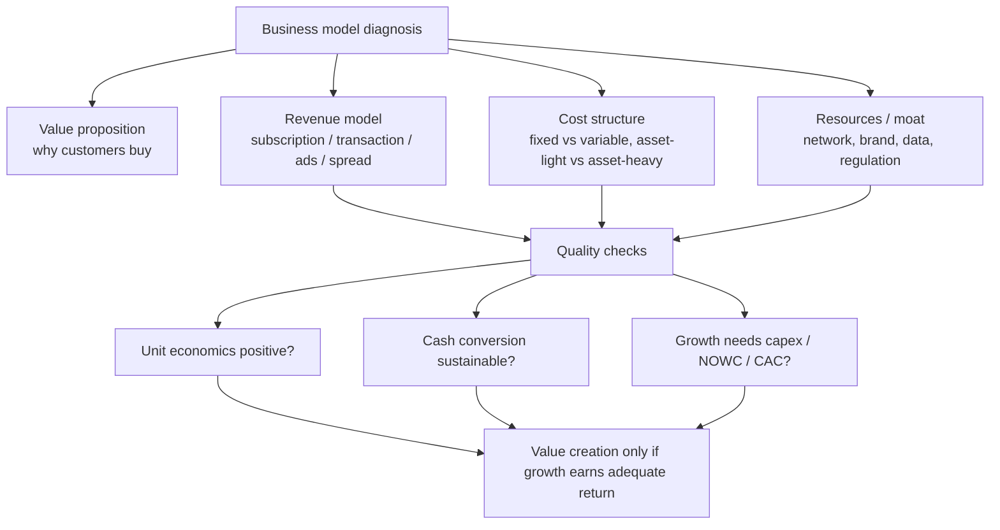

# M07: Business Models

> **模块定位**：理解公司组织、治理、营运资本、资本配置与商业模式如何影响价值创造。 本模块聚焦 **Business Models**，要求把官方 LOS 转成可执行的判断、计算或解释动作。

---

## Official Module Structure

- Learning Outcomes: Business Models
- 7.01 | Introduction
- 7.02 | Defining the Business Model
- 7.03 | Business Model Types

## Learning Outcome Statements

1. describe key features of business models
2. describe various types of business models

---

## 1. 模块定位

### 7.1 学习任务
- **核心问题**：考试希望你用 `Business Models` 解释什么、计算什么、比较什么，或判断什么。
- **输入信息**：题干事实、数据、假设、时间口径、单位、约束条件。
- **输出结果**：中文结论 + 英文关键术语 + 必要公式/框架 + 限制条件。

### 7.2 考试角色
- **难度类型**：概念+应用。
- **高频题型**：定义辨析、情境判断、计算解释、表格补数、跨模块比较。
- **答题原则**：先判断 LOS 动词，再选择工具；计算后必须解释结果含义。

### 7.3 关键英文术语
- **Business Models（核心术语）**：本模块关键词，用于定位 LOS、题干条件和解题动作。
- **Introduction（核心术语）**：本模块关键词，用于定位 LOS、题干条件和解题动作。
- **Defining the Business Model（核心术语）**：本模块关键词，用于定位 LOS、题干条件和解题动作。
- **Business Model Types（核心术语）**：本模块关键词，用于定位 LOS、题干条件和解题动作。

## 2. 官方 LOS 对应学习目标

| LOS | 官方要求 | 中文学习动作 | 做题输出 |
|---|---|---|---|
| 7.1 | describe key features of business models | 描述定义、流程和适用场景 | 写出结论、依据、公式口径和限制条件。 |
| 7.2 | describe various types of business models | 描述定义、流程和适用场景 | 写出结论、依据、公式口径和限制条件。 |

## 3. 核心知识树

```text
7. Business Models
├─ 7.1 Introduction
│  ├─ 7.1.1 主线：商业模式解释公司如何创造、交付和获取价值。
│  └─ 7.1.2 考试判断：增长快不等于价值创造，要看 unit economics、现金转换和再投资需求。
├─ 7.2 Defining the Business Model
│  ├─ 7.2.1 Value proposition：客户为什么购买，痛点和替代方案是什么。
│  ├─ 7.2.2 Revenue model：subscription、transaction、advertising、licensing、spread/fee 等收入机制。
│  ├─ 7.2.3 Cost structure：fixed vs variable、asset-light vs asset-heavy，决定 scalability 和 DOL。
│  └─ 7.2.4 Resources/capabilities：品牌、技术、网络、数据、渠道和监管牌照。
├─ 7.3 Business Model Types
│  ├─ 7.3.1 Subscription/recurring：收入可预测，但要看 churn、CAC 和 LTV。
│  ├─ 7.3.2 Platform/network：网络效应可能提高 moat，但常需先投入获客和补贴。
│  ├─ 7.3.3 Manufacturing/asset-heavy：资本密集、库存和周期风险更高。
│  └─ 7.3.4 Financial intermediation：资产负债表、信用风险、流动性和监管资本是核心。
```

## 核心图解



## 4. 知识点详解

### 7.1 Introduction

- **中文主线**：围绕 `Introduction` 掌握定义、适用条件、公式/框架和考试判断。
- **对应动作**：描述定义、流程和适用场景

### 7.2 Defining the Business Model

- **中文主线**：围绕 `Defining the Business Model` 掌握定义、适用条件、公式/框架和考试判断。
- **对应动作**：描述定义、流程和适用场景

### 7.3 Business Model Types

- **中文主线**：围绕 `Business Model Types` 掌握定义、适用条件、公式/框架和考试判断。
- **对应动作**：识别概念并应用到题干。

## 5. 关键公式与计算框架

### 5.1 商业模式诊断框架

| 维度 | 判断问题 | 对应节点 | 考试说明 |
|---|---|---|---|
| Value proposition | 客户痛点是什么，替代方案是什么？ | 7.2.1 | 没有清晰价值主张，增长难持续。 |
| Revenue model | 收入是 recurring、transactional、advertising、licensing 还是 spread/fee？ | 7.2.2 | 收入可预测性影响风险和估值。 |
| Unit economics | 单位客户/订单是否贡献正经济价值？ | 7.1.2 | 高增长但 unit economics 差会毁灭价值。 |
| Cost structure | fixed vs variable，asset-light vs asset-heavy | 7.2.3 | 决定 operating leverage 和 scalability。 |
| Cash conversion | DIO、DSO、DPO 和 upfront cash collection | 7.1.2 | 模式质量常体现在 CCC。 |
| Reinvestment need | 增长是否需要大量 capex、NOWC 或获客投入？ | 7.1.2 | 增长必须有资本回报支撑。 |
| Moat | switching cost、network effect、brand、regulation | 7.2.4 | 护城河决定增长期和利润率。 |

### 5.2 模式类型速查

| 类型 | 优势 | 主要风险 |
|---|---|---|
| Subscription | 收入可预测、留存价值高 | churn、CAC 回收期长 |
| Platform/network | 网络效应、规模经济 | 冷启动、监管、补贴依赖 |
| Asset-light | 扩张快、资本需求低 | 控制力弱、供应链/平台依赖 |
| Asset-heavy manufacturing | 产能和质量可控 | capex 高、周期和库存风险 |
| Financial intermediation | 利差/手续费规模化 | 信用、流动性、监管资本风险 |

---

## 6. 常见考点与解题思路

| 重要性 | 考点 | 解题动作 |
|---|---|---|
| ⭐⭐⭐ | 7.1 Introduction | 先定位题干触发词，再写公式/框架，最后解释结果或判断陷阱。 |
| ⭐⭐⭐ | 7.2 Defining the Business Model | 先定位题干触发词，再写公式/框架，最后解释结果或判断陷阱。 |
| ⭐⭐ | 7.3 Business Model Types | 先定位题干触发词，再写公式/框架，最后解释结果或判断陷阱。 |

## 7. 易错点与考试陷阱

| ❌ 错误理解 | ✅ 正确理解 | 为什么错 / 考试提醒 |
|---|---|---|
| ❌ IRR 高就一定更好 | ✅ mutually exclusive 时通常优先 NPV | 按官方定义和 LOS 口径核验。 |
| ❌ payback 可以代表价值创造 | ✅ payback 忽略 time value 和部分后期现金流 | 按官方定义和 LOS 口径核验。 |
| ❌ WACC 权重用 book values 也差不多 | ✅ 考试优先 market weights | 按官方定义和 LOS 口径核验。 |
| ❌ debt 永远比 equity 便宜就应多用 debt | ✅ 过高杠杆会提高 financial distress cost | 按官方定义和 LOS 口径核验。 |
| ❌ ESG 只是“好形象” | ✅ ESG 会影响风险、现金流和估值 | 按官方定义和 LOS 口径核验。 |
| ❌ aggressive WC policy 只是管理更高效 | ✅ 也意味着更高 liquidity risk | 按官方定义和 LOS 口径核验。 |
| ❌ current ratio 高一定更好 | ✅ 过高可能意味着资本占用低效 | 按官方定义和 LOS 口径核验。 |
| ❌ DOL 和 DFL 一样 | ✅ 一个来自成本结构，一个来自融资结构 | 按官方定义和 LOS 口径核验。 |
| ❌ MM 理论说资本结构完全不重要 | ✅ 那是特定假设下的基准世界 | 按官方定义和 LOS 口径核验。 |
| ❌ 债务税盾只带来好处 | ✅ 同时带来违约与灵活性损失 | 按官方定义和 LOS 口径核验。 |

## 8. 跨模块关联

| 输出概念 | 连接模块 | 怎么连接 | 做题提醒 |
|---|---|---|---|
| Cost structure / scalability | [[M06-Capital-Structure]] | fixed cost mix 决定 DOL，影响债务容量。 | 高 DOL 公司通常更怕收入下滑。 |
| Cash conversion | [[M04-Working-Capital-and-Liquidity]] | 不同模式有不同 DIO/DSO/DPO 和现金收款节奏。 | 负 CCC 要判断是否可持续。 |
| Reinvestment / capital allocation | [[M05-Capital-Investments-and-Capital-Allocation]] | 增长是否创造价值取决于再投资回报。 | 高增长不等于高 NPV。 |
| Governance / stakeholder trust | [[M03-Corporate-Governance-Conflicts-Mechanisms-Risks-and-Benefits]] | 平台、金融中介和订阅模式依赖信任和治理。 | 弱治理会削弱模式可持续性。 |
| Equity valuation | Equity | 商业模式决定增长期、利润率、风险和估值倍数。 | 模式好也要看当前价格。 |


## 9. 复习与刷题提示

- 第一轮：按 `Official Module Structure` 逐节过概念，把每个 LOS 改写成中文任务。
- 第二轮：对照 `## 3. 核心知识树` 做主动回忆，能说出每个编号节点的定义、公式/框架和陷阱。
- 第三轮：刷题后记录错因，如果暴露 MOC 缺口，按 `docs/moc-auto-patch-workflow.md` 进入补强流程。
- 考前：只看术语、公式/框架、易错点和本模块错题，避免重新铺开所有正文。

## 10. Legacy Notes Integrated

- **主要 legacy 来源**：`00-Corporate-Issuers-MOC.md` (high, 0.481)
- **整合规则**：高置信内容已合入 `知识点详解`、`公式与计算框架`、`常见考点`、`易错陷阱` 和 `跨模块关联`。
- **边界**：若 legacy 内容与 2026 官方 LOS 冲突，以官方 module 名称、LOS 和 registry 为准。
