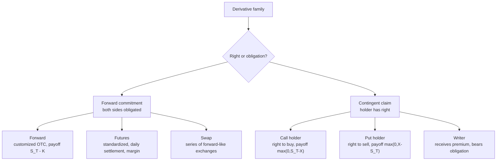

# M02: Forward Commitment and Contingent Claim Features and Instruments

> **模块定位**：用无套利、复制和工具结构理解远期、期货、互换、期权的风险转移。 本模块聚焦 **Forward Commitment and Contingent Claim Features and Instruments**，要求把官方 LOS 转成可执行的判断、计算或解释动作。

---

## Official Module Structure

- Learning Outcomes: Forward Commitment and Contingent Claim Features and Instruments
- 2.01 | Introduction
- 2.02 | Forwards, Futures, and Swaps
- 2.03 | Futures
- 2.04 | Swaps
- 2.05 | Options
- 2.06 | Credit Derivatives
- 2.07 | Forward Commitments vs. Contingent Claims

## Learning Outcome Statements

1. define forward contracts, futures contracts, swaps, options (calls and puts), and credit derivatives and compare their basic characteristics
2. determine the value at expiration and profit from a long or a short position in a call or put option
3. contrast forward commitments with contingent claims


## Textbook Signal Topics

- Textbook volume: `V7`
- Source ePub: `D:\BaiduNetdiskDownload\CFA2026一级原版书\cfa-program2026L1V7.ePub`
- Textbook chapter: `Module 2: Forward Commitment and Contingent Claim Features and Instruments`
- Practice / Solutions: `available` / `available`

### High-Signal Anchors

- 2. Forwards, Futures, and Swaps
- 3. Futures
- 4. Swaps
- 5. Options
- 5.1. Scenario 1: Transact (ST > X)
- 5.2. Scenario 2: Do Not Transact (ST < X)
- 6. Credit Derivatives
- 7. Forward Commitments vs. Contingent Claims

### How To Use These Anchors

- 先用题干关键词匹配到最接近的教材锚点，再回到正文确认定义边界、顺序条件和例外。
- 计算题优先看公式触发段；概念题优先看对比、分类和限制条件段。
- 若一道题同时触发多个锚点，先处理 LOS 主动作对应的那个，再补其余支持细节。
---

## 1. 模块定位

### 2.1 学习任务
- **核心问题**：考试希望你用 `Forward Commitment and Contingent Claim Features and Instruments` 解释什么、计算什么、比较什么，或判断什么。
- **输入信息**：题干事实、数据、假设、时间口径、单位、约束条件。
- **输出结果**：中文结论 + 英文关键术语 + 必要公式/框架 + 限制条件。

### 2.2 考试角色
- **难度类型**：概念+应用。
- **高频题型**：定义辨析、情境判断、计算解释、表格补数、跨模块比较。
- **答题原则**：先判断 LOS 动词，再选择工具；计算后必须解释结果含义。

### 2.3 关键英文术语
- **Forward Commitment and Contingent Claim Features and Instruments（核心术语）**：本模块关键词，用于定位 LOS、题干条件和解题动作。
- **Introduction（核心术语）**：本模块关键词，用于定位 LOS、题干条件和解题动作。
- **Forwards, Futures, and Swaps（核心术语）**：本模块关键词，用于定位 LOS、题干条件和解题动作。
- **Futures（期货）**：交易所标准化、每日盯市的远期类合约。
- **Swaps（核心术语）**：本模块关键词，用于定位 LOS、题干条件和解题动作。
- **Options（核心术语）**：本模块关键词，用于定位 LOS、题干条件和解题动作。
- **Credit Derivatives（核心术语）**：本模块关键词，用于定位 LOS、题干条件和解题动作。
- **Forward Commitments vs. Contingent Claims（核心术语）**：本模块关键词，用于定位 LOS、题干条件和解题动作。

## 2. 官方 LOS 对应学习目标

| LOS | 官方要求 | 中文学习动作 | 做题输出 |
|---|---|---|---|
| 2.1 | define forward contracts, futures contracts, swaps, options (calls and puts), and credit derivatives and compare their basic characteristics | 比较相似概念的适用条件与差异 | 写出结论、依据、公式口径和限制条件。 |
| 2.2 | determine the value at expiration and profit from a long or a short position in a call or put option | 根据条件判断正确结论 | 写出结论、依据、公式口径和限制条件。 |
| 2.3 | contrast forward commitments with contingent claims | 识别概念、解释机制并应用到题干。 | 写出结论、依据、公式口径和限制条件。 |

## 3. 核心知识树

```text
2. Forward Commitment and Contingent Claim Features and Instruments
├─ 2.1 Introduction
│  ├─ 2.1.1 第一分叉：forward commitment 是 obligation，contingent claim 是 right/triggered claim
│  └─ 2.1.2 payoff 形状：obligation 多为线性，option payoff 非线性且下行/上行不对称
├─ 2.2 Forwards, Futures, and Swaps
│  ├─ 2.2.1 Forward：OTC、customized、single future exchange；到期多头 payoff=`S_T-K`
│  ├─ 2.2.2 Futures：exchange-traded、standardized、daily settlement、margin
│  └─ 2.2.3 Swap：series of forward-like cash-flow exchanges，常见 fixed-for-floating
├─ 2.3 Futures
│  ├─ 2.3.1 Daily mark-to-market 将盈亏每日实现，改变现金流时点
│  └─ 2.3.2 Margin 是履约保障，不是 option premium
├─ 2.4 Swaps
│  ├─ 2.4.1 Interest rate swap 多数不交换 notional，只按 notional 计算净利息
│  └─ 2.4.2 Currency swap 可能交换不同币种本金与利息，含 FX exposure
├─ 2.5 Options
│  ├─ 2.5.1 Call holder has right to buy；put holder has right to sell；writer bears obligation
│  ├─ 2.5.2 Call payoff=`max(0,S_T-X)`；put payoff=`max(0,X-S_T)`
│  └─ 2.5.3 Profit = payoff - premium for long option；payoff 不是 profit
```

## 核心图解



## 4. 知识点详解

### 2.1 Introduction

- **中文主线**：围绕 `Introduction` 掌握定义、适用条件、公式/框架和考试判断。
- **对应动作**：比较相似概念的适用条件与差异

### 2.2 Forwards, Futures, and Swaps

- **中文主线**：围绕 `Forwards, Futures, and Swaps` 掌握定义、适用条件、公式/框架和考试判断。
- **对应动作**：根据条件判断正确结论

### 2.3 Futures

- **中文主线**：围绕 `Futures` 掌握定义、适用条件、公式/框架和考试判断。
- **对应动作**：识别概念、解释机制并应用到题干。

### 2.4 Swaps

- **中文主线**：围绕 `Swaps` 掌握定义、适用条件、公式/框架和考试判断。
- **对应动作**：识别概念并应用到题干。

### 2.5 Options

- **中文主线**：围绕 `Options` 掌握定义、适用条件、公式/框架和考试判断。
- **对应动作**：识别概念并应用到题干。

### 教材驱动补强（按原版教材回看）

| 教材锚点 | 回看重点 | 题干触发词 |
|---|---|---|
| Forwards, Futures, and Swaps | 重点回看定义、核心结论和它在本模块中的用途，避免只记标题不记动作。 | `Forwards, Futures, and Swaps`；`FFS`；题干里出现同义词、定义反问、比较口径或一步计算时回到这一节。 |
| Futures | 重点回看定义、核心结论和它在本模块中的用途，避免只记标题不记动作。 | `Futures`；题干里出现同义词、定义反问、比较口径或一步计算时回到这一节。 |
| Swaps | 重点回看定义、核心结论和它在本模块中的用途，避免只记标题不记动作。 | `Swaps`；题干里出现同义词、定义反问、比较口径或一步计算时回到这一节。 |
| Options | 重点回看定义、核心结论和它在本模块中的用途，避免只记标题不记动作。 | `Options`；题干里出现同义词、定义反问、比较口径或一步计算时回到这一节。 |
| Scenario 1: Transact (ST > X) | 重点回看这一层的主干结论、比较口径和公式适用条件，再往下接次级细节。 | `Scenario 1: Transact (ST > X)`；`STSX`；题干里出现同义词、定义反问、比较口径或一步计算时回到这一节。 |
| Scenario 2: Do Not Transact (ST < X) | 重点回看这一层的主干结论、比较口径和公式适用条件，再往下接次级细节。 | `Scenario 2: Do Not Transact (ST < X)`；`SDNTSX`；题干里出现同义词、定义反问、比较口径或一步计算时回到这一节。 |
| Credit Derivatives | 重点回看定义、核心结论和它在本模块中的用途，避免只记标题不记动作。 | `Credit Derivatives`；`CD`；题干里出现同义词、定义反问、比较口径或一步计算时回到这一节。 |
| Forward Commitments vs. Contingent Claims | 重点回看定义、核心结论和它在本模块中的用途，避免只记标题不记动作。 | `Forward Commitments vs. Contingent Claims`；`FCVCC`；题干里出现同义词、定义反问、比较口径或一步计算时回到这一节。 |

## 5. 关键公式与计算框架

### 5.1 M04-M06 Forward Commitments

| 指标 | 公式 | 知识树节点 | 考试说明 |
|------|------|------------|----------|
| Forward Price, No Income | `F_0(T) = S_0(1+r)^T` | `M05` | carry 主干 |
| Forward Price, Continuous No Income | `F_0(T) = S_0e^{rT}` | `M05` | 连续复利口径 |
| Forward Price, Known Income | `F_0(T) = [S_0 - PV(I)](1+r)^T` | `M05` | 先扣收入现值 |
| Forward Price, Known Yield | `F_0(T) = S_0[(1+r)/(1+q)]^T` 或连续口径 `S_0e^{(r-q)T}` | `M05` | 看题目给的是离散收益率还是连续收益率 |
| Forward Price, Storage/Convenience | `F_0(T) = S_0e^{(r + storage - convenience)T}` | `M04/M05` | 商品 forward/cost-of-carry 直觉 |
| Long Forward Expiry Payoff | `S_T - K` | `M05` | `K` 是约定 delivery price |
| Short Forward Expiry Payoff | `K - S_T` | `M05` | long/short 对称 |
| Long Forward Value During Life | `V_t = S_t - PV_t(K)` | `M05` | 无 income 的简化直觉 |
| Long Forward Value, Known Income | `V_t = S_t - PV_t(I) - PV_t(K)` | `M05` | 标的在剩余期有已知收入 |
| Long Forward Value, Known Yield | `V_t = S_te^{-q(T-t)} - K e^{-r(T-t)}` | `M05` | 连续收益率口径 |
| Net Swap Payment | `Notional x (Floating rate - Fixed rate) x accrual factor` | `M06` | payer/receiver 方向先读题 |
| Fixed-rate Swap Value Intuition | `Value to fixed-rate payer = Floating-leg value - Fixed-leg value` | `M06` | 【考纲重点】方向判断多于完整手算 |

### 5.2 M07 Options and Parity

| 指标 | 公式 | 知识树节点 | 考试说明 |
|------|------|------------|----------|
| Call Payoff | `max(0, S_T - X)` | `M07` | payoff 不是 profit |
| Put Payoff | `max(0, X - S_T)` | `M07` | 高频 |
| Long Call Profit | `max(0, S_T - X) - c_0` | `M07` | premium 不能漏 |
| Long Put Profit | `max(0, X - S_T) - p_0` | `M07` | premium 不能漏 |
| Put-Call Parity | `c + PV(X) = p + S_0` | `M07` | European options |
| Put-Call Parity with Known Income | `c + PV(X) + PV(I) = p + S_0` | `M07` | 有已知股利/收入时调整 |
| Put-Call Parity with Yield | `c + PV(X) = p + S_0e^{-qT}` | `M07` | 连续收益率口径 |
| Synthetic Long Call | `c = p + S_0 - PV(X)` | `M07` | 会移项比背图强 |
| Synthetic Long Put | `p = c + PV(X) - S_0` | `M07` | parity 移项 |
| Synthetic Long Stock | `S_0 = c - p + PV(X)` | `M07` | fiduciary call/protective put 等价 |
| Synthetic Protective Put | `p + S_0 = c + PV(X)` | `M07` | 两边经济等价 |
| Intrinsic Value | `max(0, payoff driver)` | `M07` | call/put 分别代入 |
| European Call Lower Bound | `c >= max(0, S_0 - PV(X))` | `M07` | 【考纲重点】套利边界 |
| European Put Lower Bound | `p >= max(0, PV(X) - S_0)` | `M07` | 套利边界 |
| American Option Value Bound | `American option value >= European option value` | `M07` | 提前行权权利不降低价值 |

### 5.3 M08 Binomial Valuation

| 指标 | 公式 | 知识树节点 | 考试说明 |
|------|------|------------|----------|
| Hedge Ratio | `h = (C_u - C_d)/(S_u - S_d)` | `M08` | replication 核心 |
| Risk-neutral Probability | `p* = [(1+r)-d]/(u-d)` | `M08` | 不是真实概率 |
| One-Period Option Value | `V_0 = [p*V_u + (1-p*)V_d]/(1+r)` | `M08` | 先算 terminal payoff |
| Replicating Portfolio Value | `V_0 = hS_0 + B` | `M08` | `B` 可为 borrowing |
| Borrowing/Lending in Replication | `B = (C_d - hS_d)/(1+r)` | `M08` | 用下行状态求无风险借贷头寸 |

### 5.4 考纲范围标记

| 标记 | 内容 |
|------|------|
| 【考纲重点】 | Forwards/futures pricing and value、swap net payment and value direction、option payoff/profit/moneyness、put-call parity/synthetics/bounds、one-period binomial valuation |
| 【考纲内但无核心公式】 | Market features, uses/risks, exchange vs OTC, hedge/speculation/arbitrage distinctions |
| 【超纲/扩展】 | Black-Scholes 公式、Greeks 全套计算、多期树完整回溯、复杂 swap curve bootstrapping 不作为 Level I 必背公式 |

---

## 6. 常见考点与解题思路

| 重要性 | 考点 | 解题动作 |
|---|---|---|
| ⭐⭐⭐ | 2.1 Introduction | 先定位题干触发词，再写公式/框架，最后解释结果或判断陷阱。 |
| ⭐⭐⭐ | 2.2 Forwards, Futures, and Swaps | 先定位题干触发词，再写公式/框架，最后解释结果或判断陷阱。 |
| ⭐⭐ | 2.3 Futures | 先定位题干触发词，再写公式/框架，最后解释结果或判断陷阱。 |
| ⭐⭐ | 2.4 Swaps | 先定位题干触发词，再写公式/框架，最后解释结果或判断陷阱。 |
| ⭐ | 2.5 Options | 先定位题干触发词，再写公式/框架，最后解释结果或判断陷阱。 |

### 教材驱动解题动作

- 先按 `Textbook Signal Topics` 找最接近的教材小节，不要直接凭熟词下结论。
- 遇到 `Forwards, Futures, and Swaps`` 相关题型时，先复原该小节的定义边界，再决定是套公式、做比较还是判断例外。
- 遇到 `Futures`` 相关题型时，先复原该小节的定义边界，再决定是套公式、做比较还是判断例外。
- 遇到 `Swaps`` 相关题型时，先复原该小节的定义边界，再决定是套公式、做比较还是判断例外。
- 遇到 `Options`` 相关题型时，先复原该小节的定义边界，再决定是套公式、做比较还是判断例外。
- 遇到 `Scenario 1: Transact (ST > X)`` 相关题型时，先复原该小节的定义边界，再决定是套公式、做比较还是判断例外。
- 做完一轮后，回到教材内 `Practice Problems / Solutions` 检查自己是否漏掉了变量口径、顺序条件或例外。

## 7. 易错点与考试陷阱

| ❌ 错误理解 | ✅ 正确理解 | 为什么错 / 考试提醒 |
|---|---|---|
| ❌ option holder 一定会行权 | ✅ 只有在经济上有利时才行权 | 按官方定义和 LOS 口径核验。 |
| ❌ payoff 就是 profit | ✅ profit 还要减 premium/融资成本 | 按官方定义和 LOS 口径核验。 |
| ❌ futures 和 forwards 完全一样 | ✅ futures 有 daily settlement 和 margining | 按官方定义和 LOS 口径核验。 |
| ❌ forward pricing 可以不看 income | ✅ 分红/收益率会改变 fair forward price | 按官方定义和 LOS 口径核验。 |
| ❌ call 越贵越差 | ✅ 价格要结合波动率、到期日、内在值判断 | 按官方定义和 LOS 口径核验。 |
| ❌ put-call parity 适用于所有期权 | ✅ 基础版本用于 European options | 按官方定义和 LOS 口径核验。 |
| ❌ binomial 先求 risk-neutral p 就够了 | ✅ terminal payoff 和 hedge ratio 同样关键 | 按官方定义和 LOS 口径核验。 |
| ❌ swap 会凭空创造收益 | ✅ swap 本质是交换现金流暴露 | 按官方定义和 LOS 口径核验。 |
| ❌ long forward 和 long call 一样 | ✅ 一个是 obligation，一个是 right | 按官方定义和 LOS 口径核验。 |
| ❌ 衍生品题都先代公式 | ✅ 先画 payoff 往往能救整题 | 按官方定义和 LOS 口径核验。 |

### 教材驱动易错清单

| 易错来源 | 常见误判 | 回正动作 |
|---|---|---|
| Forwards, Futures, and Swaps | 把标题当成会做题，忽略定义边界和相邻概念差异。 | 看到相关题干先回到 `Forwards, Futures, and Swaps`，用一句话说清“它是什么、什么时候用、最容易和什么混”。 |
| Futures | 把标题当成会做题，忽略定义边界和相邻概念差异。 | 看到相关题干先回到 `Futures`，用一句话说清“它是什么、什么时候用、最容易和什么混”。 |
| Swaps | 把标题当成会做题，忽略定义边界和相邻概念差异。 | 看到相关题干先回到 `Swaps`，用一句话说清“它是什么、什么时候用、最容易和什么混”。 |
| Options | 把标题当成会做题，忽略定义边界和相邻概念差异。 | 看到相关题干先回到 `Options`，用一句话说清“它是什么、什么时候用、最容易和什么混”。 |
| Scenario 1: Transact (ST > X) | 把标题当成会做题，忽略定义边界和相邻概念差异。 | 看到相关题干先回到 `Scenario 1: Transact (ST > X)`，用一句话说清“它是什么、什么时候用、最容易和什么混”。 |

## 8. 跨模块关联

| 连接 | 传递内容 | 做题用途 |
|---|---|---|
| `M01 -> M02` | venue、settlement、notional、underlying | 完成工具分类和合约特征比较。 |
| `M02 -> M03` | hedge/speculate/arbitrage 可用工具 | 判断使用者选择工具的动机与风险。 |
| `M02 -> M05/M06/M07` | forward/futures/swap 是线性义务 | 进入 price/value 和 daily settlement 计算。 |
| `M02 -> M08/M09/M10` | options 是 contingent claims | 进入 payoff/profit、parity、binomial。 |

---


## 9. 复习与刷题提示

- 第一轮：按 `Official Module Structure` 逐节过概念，把每个 LOS 改写成中文任务。
- 第二轮：对照 `## 3. 核心知识树` 做主动回忆，能说出每个编号节点的定义、公式/框架和陷阱。
- 第三轮：刷题后记录错因，如果暴露 MOC 缺口，按 `docs/moc-auto-patch-workflow.md` 进入补强流程。
- 考前：只看术语、公式/框架、易错点和本模块错题，避免重新铺开所有正文。

## 10. Legacy Notes Integrated

- **主要 legacy 来源**：`00-Derivatives-MOC.md` (high, 0.549)
- **整合规则**：高置信内容已合入 `知识点详解`、`公式与计算框架`、`常见考点`、`易错陷阱` 和 `跨模块关联`。
- **边界**：若 legacy 内容与 2026 官方 LOS 冲突，以官方 module 名称、LOS 和 registry 为准。
