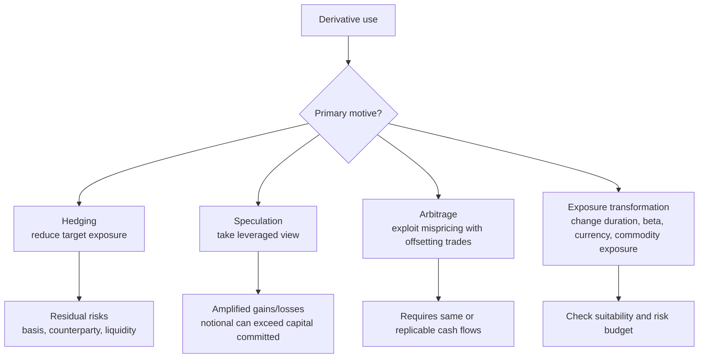

# M03: Derivative Benefits, Risks, and Issuer and Investor Uses

> **模块定位**：用无套利、复制和工具结构理解远期、期货、互换、期权的风险转移。 本模块聚焦 **Derivative Benefits, Risks, and Issuer and Investor Uses**，要求把官方 LOS 转成可执行的判断、计算或解释动作。

---

## Official Module Structure

- Learning Outcomes: Derivative Benefits, Risks, and Issuer and Investor Uses
- 3.01 | Introduction
- 3.02 | Derivative Benefits
- 3.03 | Derivative Risks
- 3.04 | Issuer Use of Derivatives
- 3.05 | Investor Use of Derivatives

## Learning Outcome Statements

1. describe benefits and risks of derivative instruments
2. compare the use of derivatives among issuers and investors

---

## 1. 模块定位

### 3.1 学习任务
- **核心问题**：考试希望你用 `Derivative Benefits, Risks, and Issuer and Investor Uses` 解释什么、计算什么、比较什么，或判断什么。
- **输入信息**：题干事实、数据、假设、时间口径、单位、约束条件。
- **输出结果**：中文结论 + 英文关键术语 + 必要公式/框架 + 限制条件。

### 3.2 考试角色
- **难度类型**：概念+应用。
- **高频题型**：定义辨析、情境判断、计算解释、表格补数、跨模块比较。
- **答题原则**：先判断 LOS 动词，再选择工具；计算后必须解释结果含义。

### 3.3 关键英文术语
- **Derivative Benefits, Risks, and Issuer and Investor Uses（核心术语）**：本模块关键词，用于定位 LOS、题干条件和解题动作。
- **Introduction（核心术语）**：本模块关键词，用于定位 LOS、题干条件和解题动作。
- **Derivative Benefits（核心术语）**：本模块关键词，用于定位 LOS、题干条件和解题动作。
- **Derivative Risks（核心术语）**：本模块关键词，用于定位 LOS、题干条件和解题动作。
- **Issuer Use of Derivatives（核心术语）**：本模块关键词，用于定位 LOS、题干条件和解题动作。
- **Investor Use of Derivatives（核心术语）**：本模块关键词，用于定位 LOS、题干条件和解题动作。

## 2. 官方 LOS 对应学习目标

| LOS | 官方要求 | 中文学习动作 | 做题输出 |
|---|---|---|---|
| 3.1 | describe benefits and risks of derivative instruments | 描述定义、流程和适用场景 | 写出结论、依据、公式口径和限制条件。 |
| 3.2 | compare the use of derivatives among issuers and investors | 比较相似概念的适用条件与差异 | 写出结论、依据、公式口径和限制条件。 |

## 3. 核心知识树

```text
3. Derivative Benefits, Risks, and Issuer and Investor Uses
├─ 3.1 核心内容
│  ├─ 3.1.1 Benefits：hedging、risk transfer、price discovery、lower transaction cost、capital efficiency
│  ├─ 3.1.2 Risks：leverage、liquidity、counterparty、basis、model、operational risk
│  ├─ 3.1.3 Issuer use：稳定 financing cost、commodity input/output price、FX cash flows
│  ├─ 3.1.4 Investor use：tactical exposure、portfolio hedging、duration/beta/currency transformation
│  └─ 3.1.5 考试判断：hedging reduces a selected risk but can introduce basis/counterparty risk
```

## 核心图解



## 4. 知识点详解

### 3.1 核心内容

**衍生品收益 (Benefits)**

| 用途 | 描述 |
|------|------|
| 对冲 (Hedge) | 对冲现有敞口，转换久期、Beta、货币、商品风险 (hedge existing exposure; transform duration, beta, currency, commodity risk) |
| 高效敞口 (Efficient Exposure) | 以资本效率和较低摩擦获得风险敞口 (gain exposure with capital efficiency and lower friction) |
| 价格发现 (Price Discovery) | 市场参与者通过衍生品交易发现未来价格预期 |
| 风险转移 (Risk Transfer) | 将风险从不愿承担者转移给愿意承担者 |

**衍生品风险 (Risks)**
- **杠杆风险 (Leverage Risk)**：少量资金控制大额敞口，放大损失
- **流动性风险 (Liquidity Risk)**：某些 OTC 合约难以平仓
- **交易对手风险 (Counterparty Risk)**：OTC 合约中对手方违约风险
- **基差风险 (Basis Risk)**：对冲工具与标的资产价格变动不完全同步
- **模型风险 (Model Risk)**：定价模型假设不准确导致错误估值
- **操作风险 (Operational Risk)**：交易执行、结算等环节失误

**使用者 (Users)**
- **发行方 (Issuers)**：使用对冲稳定融资/经营现金流 (stabilize financing/operating cash flows)
- **投资者 (Investors)**：使用衍生品进行风险控制、战术性敞口调整、套利 (risk control, tactical exposure, arbitrage)

## 5. 关键公式与计算框架

### 5.1 核心内容

| 节点 | 决策框架 | 使用条件 | 考试判断 |
|---|---|---|---|
| 3.1.1 | Benefit = desired exposure or risk transfer with lower cash outlay | 用途题 | 资本效率不等于低风险，leverage 会放大盈亏。 |
| 3.1.2 | Residual risk checklist | 对冲题 | 检查 basis、liquidity、counterparty、model、operational risk。 |
| 3.1.3 | Issuer hedge map | 发行人/公司题 | 债务发行人常对冲利率或 FX，生产企业常对冲商品价格。 |
| 3.1.4 | Investor use map | 投资者题 | 投资者可对冲组合、改变 beta/duration/currency，或主动投机。 |
| 3.1.5 | Hedge vs speculate vs arbitrage | 动机识别题 | 是否已有原始敞口是 hedge 与 speculate 的关键分叉；无风险错价才是 arbitrage。 |

## 6. 常见考点与解题思路

| 重要性 | 考点 | 解题动作 |
|---|---|---|
| ⭐⭐⭐ | 3.1 Introduction | 先定位题干触发词，再写公式/框架，最后解释结果或判断陷阱。 |
| ⭐⭐⭐ | 3.2 Derivative Benefits | 先定位题干触发词，再写公式/框架，最后解释结果或判断陷阱。 |
| ⭐⭐ | 3.3 Derivative Risks | 先定位题干触发词，再写公式/框架，最后解释结果或判断陷阱。 |
| ⭐⭐ | 3.4 Issuer Use of Derivatives | 先定位题干触发词，再写公式/框架，最后解释结果或判断陷阱。 |
| ⭐ | 3.5 Investor Use of Derivatives | 先定位题干触发词，再写公式/框架，最后解释结果或判断陷阱。 |

### 6.9 ⭐⭐ Legacy 考点补充

### 6.1 核心内容

- 区分**对冲 (Hedging)** 与**投机 (Speculating)**：对冲降低既有风险，投机主动建立风险
- 理解衍生品的**双重作用**：既可用于风险管理，也可用于建立投机头寸
- 对冲不一定消灭所有风险，可能引入基差风险或交易对手风险

## 7. 易错点与考试陷阱

| ❌ 错误理解 | ✅ 正确理解 | 为什么错 / 考试提醒 |
|---|---|---|
| ❌ 忽略：对冲降低的是特定风险，可能引入新的风险类型 (basis, counterparty) | ✅ 对冲降低的是特定风险，可能引入新的风险类型 (basis, counterparty) | 题干通常会用口径、顺序、定义边界或例外条件设置干扰。 |
| ❌ 忽略：杠杆是双刃剑：放大收益也放大损失 | ✅ 杠杆是双刃剑：放大收益也放大损失 | 题干通常会用口径、顺序、定义边界或例外条件设置干扰。 |
| ❌ 忽略：衍生品用于风险转移而非风险消灭 (risk transfer, not risk elimination) | ✅ 衍生品用于风险转移而非风险消灭 (risk transfer, not risk elimination) | 题干通常会用口径、顺序、定义边界或例外条件设置干扰。 |

## 8. 跨模块关联

| 连接 | 传递内容 | 做题用途 |
|---|---|---|
| `M02 -> M03` | forwards/futures/swaps/options 的 payoff 特征 | 匹配风险管理目标和工具选择。 |
| `M03 -> M04` | arbitrage as distinct use | 进入 no-arbitrage pricing 时先确认是否真是套利。 |
| `M03 -> PM` | portfolio hedge、tactical exposure、currency overlay | 连接组合风险管理和资产配置。 |
| `M03 -> FI/Equity/Corp` | duration、beta、FX、commodity exposure | 判断发行人和投资者的具体对冲对象。 |


## 9. 复习与刷题提示

- 第一轮：按 `Official Module Structure` 逐节过概念，把每个 LOS 改写成中文任务。
- 第二轮：对照 `## 3. 核心知识树` 做主动回忆，能说出每个编号节点的定义、公式/框架和陷阱。
- 第三轮：刷题后记录错因，如果暴露 MOC 缺口，按 `docs/moc-auto-patch-workflow.md` 进入补强流程。
- 考前：只看术语、公式/框架、易错点和本模块错题，避免重新铺开所有正文。

## 10. Legacy Notes Integrated

- **主要 legacy 来源**：`M03-Benefits-and-Risks.md` (high, 0.512)
- **整合规则**：高置信内容已合入 `知识点详解`、`公式与计算框架`、`常见考点`、`易错陷阱` 和 `跨模块关联`。
- **边界**：若 legacy 内容与 2026 官方 LOS 冲突，以官方 module 名称、LOS 和 registry 为准。
