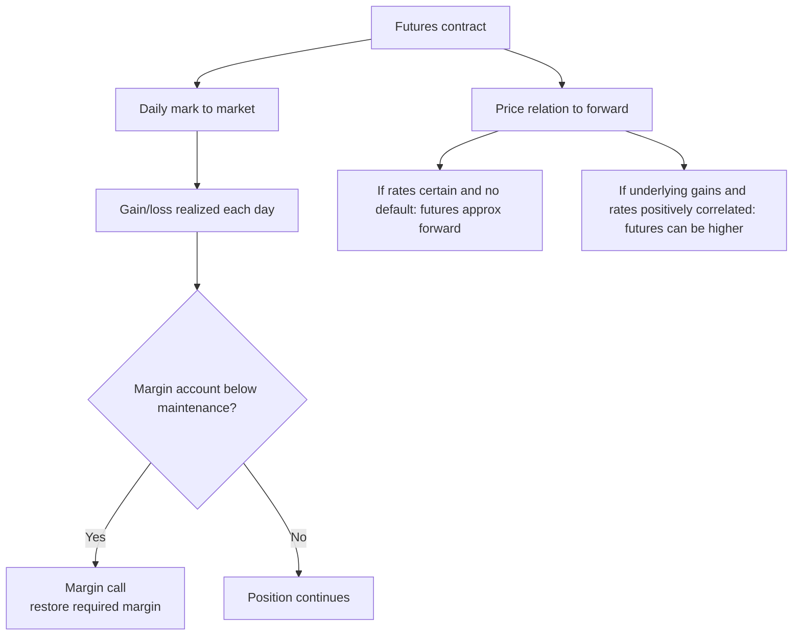

# M06: Pricing and Valuation of Futures Contracts

> **模块定位**：用无套利、复制和工具结构理解远期、期货、互换、期权的风险转移。 本模块聚焦 **Pricing and Valuation of Futures Contracts**，要求把官方 LOS 转成可执行的判断、计算或解释动作。

---

## Official Module Structure

- Learning Outcomes: Pricing and Valuation of Futures Contracts
- 6.01 | Introduction
- 6.02 | Pricing of Futures Contracts at Inception
- 6.03 | MTM Valuation: Forwards versus Futures
- 6.04 | Interest Rate Futures versus Forward Contracts
- 6.05 | Forward and Futures Price Differences
- 6.06 | Interest Rate Forward and Futures Price Differences
- 6.07 | Effect of Central Clearing of OTC Derivatives

## Learning Outcome Statements

1. compare the value and price of forward and futures contracts
2. explain why forward and futures prices differ

---

## 1. 模块定位

### 6.1 学习任务
- **核心问题**：考试希望你用 `Pricing and Valuation of Futures Contracts` 解释什么、计算什么、比较什么，或判断什么。
- **输入信息**：题干事实、数据、假设、时间口径、单位、约束条件。
- **输出结果**：中文结论 + 英文关键术语 + 必要公式/框架 + 限制条件。

### 6.2 考试角色
- **难度类型**：计算+解释。
- **高频题型**：定义辨析、情境判断、计算解释、表格补数、跨模块比较。
- **答题原则**：先判断 LOS 动词，再选择工具；计算后必须解释结果含义。

### 6.3 关键英文术语
- **Pricing and Valuation of Futures Contracts（核心术语）**：本模块关键词，用于定位 LOS、题干条件和解题动作。
- **Introduction（核心术语）**：本模块关键词，用于定位 LOS、题干条件和解题动作。
- **Pricing of Futures Contracts at Inception（核心术语）**：本模块关键词，用于定位 LOS、题干条件和解题动作。
- **MTM Valuation: Forwards versus Futures（核心术语）**：本模块关键词，用于定位 LOS、题干条件和解题动作。
- **MTM Valuation（核心术语）**：本模块关键词，用于定位 LOS、题干条件和解题动作。
- **Interest Rate Futures versus Forward Contracts（核心术语）**：本模块关键词，用于定位 LOS、题干条件和解题动作。
- **Forward and Futures Price Differences（核心术语）**：本模块关键词，用于定位 LOS、题干条件和解题动作。
- **Interest Rate Forward and Futures Price Differences（核心术语）**：本模块关键词，用于定位 LOS、题干条件和解题动作。

## 2. 官方 LOS 对应学习目标

| LOS | 官方要求 | 中文学习动作 | 做题输出 |
|---|---|---|---|
| 6.1 | compare the value and price of forward and futures contracts | 比较相似概念的适用条件与差异 | 写出结论、依据、公式口径和限制条件。 |
| 6.2 | explain why forward and futures prices differ | 解释机制、原因和后果 | 写出结论、依据、公式口径和限制条件。 |

## 3. 核心知识树

```text
6. Pricing and Valuation of Futures Contracts
├─ 6.1 Introduction
│  ├─ 6.1.1 Futures 是 exchange-traded forward commitment，有 clearinghouse、margin、daily settlement
│  └─ 6.1.2 Price vs value：futures price 是合约价格，daily MTM 使合约价值每日归零附近
├─ 6.2 Pricing of Futures Contracts at Inception
│  ├─ 6.2.1 若利率确定且无违约，futures price 通常接近 forward price
│  └─ 6.2.2 仍以 cost-of-carry 为基础：spot、financing、income/yield、storage/convenience
├─ 6.3 MTM Valuation: Forwards versus Futures
│  ├─ 6.3.1 Futures gains/losses are realized daily；forwards gains/losses accumulate until settlement
│  └─ 6.3.2 Margin calls create cash-flow timing risk and reinvestment effects
├─ 6.4 Interest Rate Futures versus Forward Contracts
│  ├─ 6.4.1 Interest rate futures 对利率路径和 daily settlement 更敏感
│  └─ 6.4.2 Convexity/correlation intuition：利率与标的相关性会造成 futures-forward difference
├─ 6.5 Forward and Futures Price Differences
│  ├─ 6.5.1 标的价格与利率正相关时，long futures 盈利常在高利率时收到，futures price 可高于 forward price
│  └─ 6.5.2 标的价格与利率负相关时，futures price 可低于 forward price
```

## 核心图解



## 4. 知识点详解

### 6.1 Introduction

- **中文主线**：围绕 `Introduction` 掌握定义、适用条件、公式/框架和考试判断。
- **对应动作**：比较相似概念的适用条件与差异

### 6.2 Pricing of Futures Contracts at Inception

- **中文主线**：围绕 `Pricing of Futures Contracts at Inception` 掌握定义、适用条件、公式/框架和考试判断。
- **对应动作**：解释机制、原因和后果

### 6.3 MTM Valuation: Forwards versus Futures

- **中文主线**：围绕 `MTM Valuation: Forwards versus Futures` 掌握定义、适用条件、公式/框架和考试判断。
- **对应动作**：识别概念并应用到题干。

### 6.4 Interest Rate Futures versus Forward Contracts

- **中文主线**：围绕 `Interest Rate Futures versus Forward Contracts` 掌握定义、适用条件、公式/框架和考试判断。
- **对应动作**：识别概念并应用到题干。

### 6.5 Forward and Futures Price Differences

- **中文主线**：围绕 `Forward and Futures Price Differences` 掌握定义、适用条件、公式/框架和考试判断。
- **对应动作**：识别概念并应用到题干。

## 5. 关键公式与计算框架

### 5.0 本模块公式选择

| 知识树节点 | 公式/框架 | 使用条件 | 考试判断 |
|---|---|---|---|
| 6.2.1 | Futures price ≈ fair forward price | 利率确定、无违约、现金流时点影响可忽略 | Level I 多先用 forward/carry 直觉，再解释 daily settlement 差异。 |
| 6.3.1 | Daily MTM gain/loss = today's futures price change x contract multiplier | 期货每日结算题 | 盈亏每日实现，合约价值被结算回接近零。 |
| 6.3.2 | Margin balance = initial margin + cumulative gains - cumulative losses | 保证金题 | margin 是履约保障，不是 option premium。 |
| 6.5.1 | Positive correlation with rates -> futures price may exceed forward price | forward vs futures 概念题 | 盈利现金流在高利率时收到，reinvestment 更有利。 |
| 6.5.2 | Negative correlation with rates -> futures price may be below forward price | forward vs futures 概念题 | 盈利现金流在低利率时收到，reinvestment 较不利。 |

### 5.1 M04-M06 Forward Commitments

| 指标 | 公式 | 知识树节点 | 考试说明 |
|------|------|------------|----------|
| Forward Price, No Income | `F_0(T) = S_0(1+r)^T` | `M05` | carry 主干 |
| Forward Price, Continuous No Income | `F_0(T) = S_0e^{rT}` | `M05` | 连续复利口径 |
| Forward Price, Known Income | `F_0(T) = [S_0 - PV(I)](1+r)^T` | `M05` | 先扣收入现值 |
| Forward Price, Known Yield | `F_0(T) = S_0[(1+r)/(1+q)]^T` 或连续口径 `S_0e^{(r-q)T}` | `M05` | 看题目给的是离散收益率还是连续收益率 |
| Forward Price, Storage/Convenience | `F_0(T) = S_0e^{(r + storage - convenience)T}` | `M04/M05` | 商品 forward/cost-of-carry 直觉 |
| Long Forward Expiry Payoff | `S_T - K` | `M05` | `K` 是约定 delivery price |
| Short Forward Expiry Payoff | `K - S_T` | `M05` | long/short 对称 |
| Long Forward Value During Life | `V_t = S_t - PV_t(K)` | `M05` | 无 income 的简化直觉 |
| Long Forward Value, Known Income | `V_t = S_t - PV_t(I) - PV_t(K)` | `M05` | 标的在剩余期有已知收入 |
| Long Forward Value, Known Yield | `V_t = S_te^{-q(T-t)} - K e^{-r(T-t)}` | `M05` | 连续收益率口径 |
| Net Swap Payment | `Notional x (Floating rate - Fixed rate) x accrual factor` | `M06` | payer/receiver 方向先读题 |
| Fixed-rate Swap Value Intuition | `Value to fixed-rate payer = Floating-leg value - Fixed-leg value` | `M06` | 【考纲重点】方向判断多于完整手算 |

### 5.2 M07 Options and Parity

| 指标 | 公式 | 知识树节点 | 考试说明 |
|------|------|------------|----------|
| Call Payoff | `max(0, S_T - X)` | `M07` | payoff 不是 profit |
| Put Payoff | `max(0, X - S_T)` | `M07` | 高频 |
| Long Call Profit | `max(0, S_T - X) - c_0` | `M07` | premium 不能漏 |
| Long Put Profit | `max(0, X - S_T) - p_0` | `M07` | premium 不能漏 |
| Put-Call Parity | `c + PV(X) = p + S_0` | `M07` | European options |
| Put-Call Parity with Known Income | `c + PV(X) + PV(I) = p + S_0` | `M07` | 有已知股利/收入时调整 |
| Put-Call Parity with Yield | `c + PV(X) = p + S_0e^{-qT}` | `M07` | 连续收益率口径 |
| Synthetic Long Call | `c = p + S_0 - PV(X)` | `M07` | 会移项比背图强 |
| Synthetic Long Put | `p = c + PV(X) - S_0` | `M07` | parity 移项 |
| Synthetic Long Stock | `S_0 = c - p + PV(X)` | `M07` | fiduciary call/protective put 等价 |
| Synthetic Protective Put | `p + S_0 = c + PV(X)` | `M07` | 两边经济等价 |
| Intrinsic Value | `max(0, payoff driver)` | `M07` | call/put 分别代入 |
| European Call Lower Bound | `c >= max(0, S_0 - PV(X))` | `M07` | 【考纲重点】套利边界 |
| European Put Lower Bound | `p >= max(0, PV(X) - S_0)` | `M07` | 套利边界 |
| American Option Value Bound | `American option value >= European option value` | `M07` | 提前行权权利不降低价值 |

### 5.3 M08 Binomial Valuation

| 指标 | 公式 | 知识树节点 | 考试说明 |
|------|------|------------|----------|
| Hedge Ratio | `h = (C_u - C_d)/(S_u - S_d)` | `M08` | replication 核心 |
| Risk-neutral Probability | `p* = [(1+r)-d]/(u-d)` | `M08` | 不是真实概率 |
| One-Period Option Value | `V_0 = [p*V_u + (1-p*)V_d]/(1+r)` | `M08` | 先算 terminal payoff |
| Replicating Portfolio Value | `V_0 = hS_0 + B` | `M08` | `B` 可为 borrowing |
| Borrowing/Lending in Replication | `B = (C_d - hS_d)/(1+r)` | `M08` | 用下行状态求无风险借贷头寸 |

### 5.4 考纲范围标记

| 标记 | 内容 |
|------|------|
| 【考纲重点】 | Forwards/futures pricing and value、swap net payment and value direction、option payoff/profit/moneyness、put-call parity/synthetics/bounds、one-period binomial valuation |
| 【考纲内但无核心公式】 | Market features, uses/risks, exchange vs OTC, hedge/speculation/arbitrage distinctions |
| 【超纲/扩展】 | Black-Scholes 公式、Greeks 全套计算、多期树完整回溯、复杂 swap curve bootstrapping 不作为 Level I 必背公式 |

---

## 6. 常见考点与解题思路

| 重要性 | 考点 | 解题动作 |
|---|---|---|
| ⭐⭐⭐ | 6.1 Introduction | 先定位题干触发词，再写公式/框架，最后解释结果或判断陷阱。 |
| ⭐⭐⭐ | 6.2 Pricing of Futures Contracts at Inception | 先定位题干触发词，再写公式/框架，最后解释结果或判断陷阱。 |
| ⭐⭐ | 6.3 MTM Valuation: Forwards versus Futures | 先定位题干触发词，再写公式/框架，最后解释结果或判断陷阱。 |
| ⭐⭐ | 6.4 Interest Rate Futures versus Forward Contracts | 先定位题干触发词，再写公式/框架，最后解释结果或判断陷阱。 |
| ⭐ | 6.5 Forward and Futures Price Differences | 先定位题干触发词，再写公式/框架，最后解释结果或判断陷阱。 |

## 7. 易错点与考试陷阱

| ❌ 错误理解 | ✅ 正确理解 | 为什么错 / 考试提醒 |
|---|---|---|
| ❌ option holder 一定会行权 | ✅ 只有在经济上有利时才行权 | 按官方定义和 LOS 口径核验。 |
| ❌ payoff 就是 profit | ✅ profit 还要减 premium/融资成本 | 按官方定义和 LOS 口径核验。 |
| ❌ futures 和 forwards 完全一样 | ✅ futures 有 daily settlement 和 margining | 按官方定义和 LOS 口径核验。 |
| ❌ forward pricing 可以不看 income | ✅ 分红/收益率会改变 fair forward price | 按官方定义和 LOS 口径核验。 |
| ❌ call 越贵越差 | ✅ 价格要结合波动率、到期日、内在值判断 | 按官方定义和 LOS 口径核验。 |
| ❌ put-call parity 适用于所有期权 | ✅ 基础版本用于 European options | 按官方定义和 LOS 口径核验。 |
| ❌ binomial 先求 risk-neutral p 就够了 | ✅ terminal payoff 和 hedge ratio 同样关键 | 按官方定义和 LOS 口径核验。 |
| ❌ swap 会凭空创造收益 | ✅ swap 本质是交换现金流暴露 | 按官方定义和 LOS 口径核验。 |
| ❌ long forward 和 long call 一样 | ✅ 一个是 obligation，一个是 right | 按官方定义和 LOS 口径核验。 |
| ❌ 衍生品题都先代公式 | ✅ 先画 payoff 往往能救整题 | 按官方定义和 LOS 口径核验。 |

## 8. 跨模块关联

| 连接 | 传递内容 | 做题用途 |
|---|---|---|
| `M05 -> M06` | forward price/value baseline | 比较 futures 是否因 daily settlement 偏离 forward。 |
| `M06 -> M07` | futures/forward cash-flow timing | 理解 swap 是多期 forward-like cash flows。 |
| `M01 -> M06` | clearinghouse、margin、exchange trading | 解释 futures 的信用风险和现金流机制。 |
| `FI -> M06` | interest rate futures、rate correlation | 判断利率期货与远期价格差异。 |
| `PM/Risk -> M06` | margin and liquidity needs | 期货对冲会产生现金流和追加保证金风险。 |

---


## 9. 复习与刷题提示

- 第一轮：按 `Official Module Structure` 逐节过概念，把每个 LOS 改写成中文任务。
- 第二轮：对照 `## 3. 核心知识树` 做主动回忆，能说出每个编号节点的定义、公式/框架和陷阱。
- 第三轮：刷题后记录错因，如果暴露 MOC 缺口，按 `docs/moc-auto-patch-workflow.md` 进入补强流程。
- 考前：只看术语、公式/框架、易错点和本模块错题，避免重新铺开所有正文。

## 10. Legacy Notes Integrated

- **主要 legacy 来源**：`00-Derivatives-MOC.md` (high, 0.458)
- **整合规则**：高置信内容已合入 `知识点详解`、`公式与计算框架`、`常见考点`、`易错陷阱` 和 `跨模块关联`。
- **边界**：若 legacy 内容与 2026 官方 LOS 冲突，以官方 module 名称、LOS 和 registry 为准。
