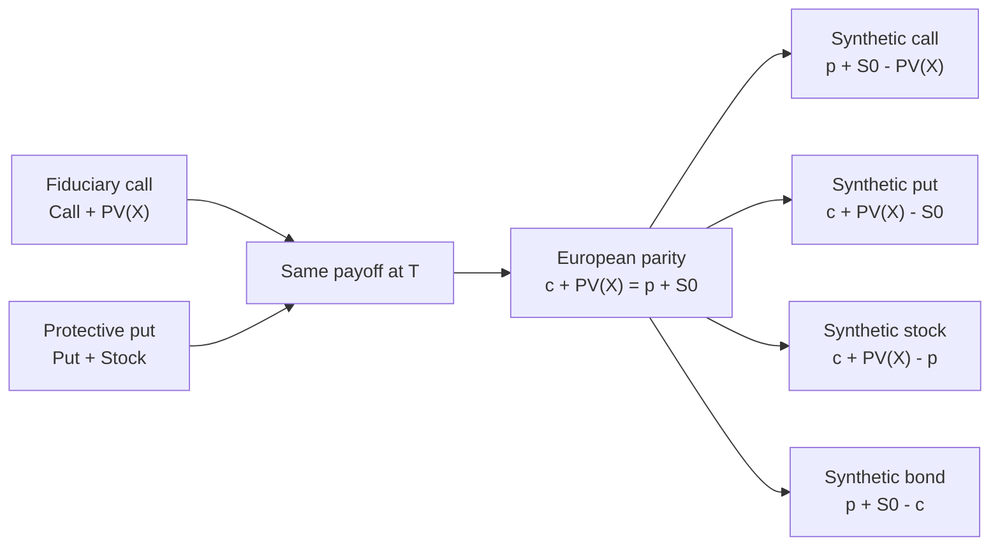

# M09: Option Replication Using Put-Call Parity

> **模块定位**：用无套利、复制和工具结构理解远期、期货、互换、期权的风险转移。 本模块聚焦 **Option Replication Using Put-Call Parity**，要求把官方 LOS 转成可执行的判断、计算或解释动作。

---

## Official Module Structure

- Learning Outcomes: Option Replication Using Put–Call Parity
- 9.01 | Introduction
- 9.02 | Put–Call Parity
- 9.03 | Option Strategies Based on Put–Call Parity
- 9.04 | Put–Call Forward Parity and Option Applications
- 9.05 | Put–Call Forward Parity
- 9.06 | Option Put–Call Parity Applications: Firm Value

## Learning Outcome Statements

1. explain put-call parity for European options
2. explain put-call forward parity for European options

---

## 1. 模块定位

### 9.1 学习任务
- **核心问题**：考试希望你用 `Option Replication Using Put-Call Parity` 解释什么、计算什么、比较什么，或判断什么。
- **输入信息**：题干事实、数据、假设、时间口径、单位、约束条件。
- **输出结果**：中文结论 + 英文关键术语 + 必要公式/框架 + 限制条件。

### 9.2 考试角色
- **难度类型**：概念+应用。
- **高频题型**：定义辨析、情境判断、计算解释、表格补数、跨模块比较。
- **答题原则**：先判断 LOS 动词，再选择工具；计算后必须解释结果含义。

### 9.3 关键英文术语
- **Option Replication Using Put-Call Parity（核心术语）**：本模块关键词，用于定位 LOS、题干条件和解题动作。
- **Introduction（核心术语）**：本模块关键词，用于定位 LOS、题干条件和解题动作。
- **Put–Call Parity（核心术语）**：本模块关键词，用于定位 LOS、题干条件和解题动作。
- **Option Strategies Based on Put–Call Parity（核心术语）**：本模块关键词，用于定位 LOS、题干条件和解题动作。
- **Put–Call Forward Parity and Option Applications（核心术语）**：本模块关键词，用于定位 LOS、题干条件和解题动作。
- **Put–Call Forward Parity（核心术语）**：本模块关键词，用于定位 LOS、题干条件和解题动作。
- **Option Put–Call Parity Applications: Firm Value（核心术语）**：本模块关键词，用于定位 LOS、题干条件和解题动作。
- **Option Put–Call Parity Applications（核心术语）**：本模块关键词，用于定位 LOS、题干条件和解题动作。

## 2. 官方 LOS 对应学习目标

| LOS | 官方要求 | 中文学习动作 | 做题输出 |
|---|---|---|---|
| 9.1 | explain put-call parity for European options | 解释机制、原因和后果 | 写出结论、依据、公式口径和限制条件。 |
| 9.2 | explain put-call forward parity for European options | 解释机制、原因和后果 | 写出结论、依据、公式口径和限制条件。 |

## 3. 核心知识树

```text
9. Option Replication Using Put-Call Parity
├─ 9.1 核心内容
│  ├─ 9.1.1 Put-call parity：European options 且同一 underlying、strike、maturity
│  ├─ 9.1.2 标准式：`c + PV(X) = p + S0`，两边到期现金流相同
│  ├─ 9.1.3 有已知收入：`c + PV(X) + PV(I) = p + S0`
│  ├─ 9.1.4 有连续收益率：`c + PV(X) = p + S0e^{-qT}`
│  ├─ 9.1.5 Synthetic positions：移项得到 synthetic call/put/stock/bond
│  └─ 9.1.6 Forward parity：用 forward exposure 替换 stock exposure 时必须匹配到期与交割价
```

## 核心图解



## 4. 知识点详解

### 9.1 核心内容

**收益语言 (Payoff Language)**

| 指标 | 公式 | 说明 |
|------|------|------|
| 看涨期权到期收益 (Call Payoff) | `max(0, ST - X)` | ST > X 时行权盈利 |
| 看跌期权到期收益 (Put Payoff) | `max(0, X - ST)` | ST < X 时行权盈利 |
| 多头看涨期权利润 (Long Call Profit) | `max(0, ST - X) - c0` | 扣除权利金 |
| 多头看跌期权利润 (Long Put Profit) | `max(0, X - ST) - p0` | 扣除权利金 |

**关键概念**
- **内在价值 (Intrinsic Value)**：立即行权的经济价值，`= max(0, payoff driver)`
- **时间价值 (Time Value)**：期权价格超出内在价值的部分
- **实值状态 (Moneyness)**：实值 (in-the-money)、平值 (at-the-money)、虚值 (out-of-the-money)
- **收益 vs 利润**：收益不包括权利金；利润包括权利金和融资成本 (payoff excludes premium; profit includes premium and financing context)

**平价关系与合成头寸 (Parity and Synthetics)**

**买卖权平价公式 (Put-Call Parity)**：
```
c + PV(X) = p + S0
```

| 合成头寸 | 移项结果 |
|---------|---------|
| 合成看涨 (Synthetic Call) | `c = p + S0 - PV(X)` |
| 合成看跌 (Synthetic Put) | `p = c - S0 + PV(X)` |
| 合成股票 (Synthetic Stock) | `S0 = c + PV(X) - p` |
| 保护性看跌 (Protective Put) | `p + S0 = c + PV(X)` |

**有收入资产的平价调整**：
- 已知现金收入：`c + PV(X) + PV(I) = p + S0`
- 连续收益率：`c + PV(X) = p + S0e^{-qT}`

**期权价值边界（European options）**：
- 看涨下限：`c >= max(0, S0 - PV(X))`
- 看跌下限：`p >= max(0, PV(X) - S0)`
- 美式期权价值通常不低于对应欧式期权，因为提前行权权利不会降低价值。

## 5. 关键公式与计算框架

### 5.1 核心内容

```
Call payoff = max(0, ST - X)          Long call profit = max(0, ST - X) - c0
Put payoff  = max(0, X - ST)          Long put profit  = max(0, X - ST) - p0
c + PV(X) = p + S0                   买卖权平价 (仅适用于欧式期权)
c + PV(X) + PV(I) = p + S0           有已知收入资产的平价
c + PV(X) = p + S0e^(-qT)            有连续收益率资产的平价
```

**考纲标记**：
- 【考纲重点】payoff/profit、put-call parity、synthetics、option value bounds。
- 【考纲内但无核心公式】moneyness、American vs European、option uses。
- 【超纲/扩展】Black-Scholes 与 Greeks 不属于 Level I 必背公式。

## 6. 常见考点与解题思路

| 重要性 | 考点 | 解题动作 |
|---|---|---|
| ⭐⭐⭐ | 9.1 Introduction | 先定位题干触发词，再写公式/框架，最后解释结果或判断陷阱。 |
| ⭐⭐⭐ | 9.2 Put–Call Parity | 先定位题干触发词，再写公式/框架，最后解释结果或判断陷阱。 |
| ⭐⭐ | 9.3 Option Strategies Based on Put–Call Parity | 先定位题干触发词，再写公式/框架，最后解释结果或判断陷阱。 |
| ⭐⭐ | 9.4 Put–Call Forward Parity and Option Applications | 先定位题干触发词，再写公式/框架，最后解释结果或判断陷阱。 |
| ⭐ | 9.5 Put–Call Forward Parity | 先定位题干触发词，再写公式/框架，最后解释结果或判断陷阱。 |

### 6.9 ⭐⭐ Legacy 考点补充

### 6.1 核心内容

1. **payoff 题**：先分清 call/put → 代入 max(0, 公式)
2. **profit 题**：在 payoff 基础上减权利金（如有融资成本也要考虑）
3. **parity 题**：写标准 parity → 移项得到目标合成头寸 → 检查是否欧式期权条件
4. **套利题**：若 parity 两边不等，买入便宜方、卖出贵方

## 7. 易错点与考试陷阱

| ❌ 错误理解 | ✅ 正确理解 | 为什么错 / 考试提醒 |
|---|---|---|
| ❌ 忽略：payoff 不是 profit —— profit 还要减权利金和融资成本 | ✅ payoff 不是 profit —— profit 还要减权利金和融资成本 | 题干通常会用口径、顺序、定义边界或例外条件设置干扰。 |
| ❌ 忽略：【高频】payoff 和 profit 混淆后整题方向全错 | ✅ 【高频】payoff 和 profit 混淆后整题方向全错 | 题干通常会用口径、顺序、定义边界或例外条件设置干扰。 |
| ❌ 忽略：基础版 put-call parity 仅适用于欧式期权 (European options)，美式期权因其可提前行权需要更复杂的处理 | ✅ 基础版 put-call parity 仅适用于欧式期权 (European options)，美式期权因其可提前行权需要更复杂的处理 | 题干通常会用口径、顺序、定义边界或例外条件设置干扰。 |
| ❌ 忽略：不要将欧式平价关系直接套用到所有美式期权场景 | ✅ 不要将欧式平价关系直接套用到所有美式期权场景 | 题干通常会用口径、顺序、定义边界或例外条件设置干扰。 |
| ❌ 忽略：期权价格受波动率影响，不是越贵越差 | ✅ 期权价格受波动率影响，不是越贵越差 | 题干通常会用口径、顺序、定义边界或例外条件设置干扰。 |

## 8. 跨模块关联

| 连接 | 传递内容 | 做题用途 |
|---|---|---|
| `M08 -> M09` | call/put payoff、intrinsic value、exercise style | 判断 parity 是否适用，避免把 American 条件直接套入基础式。 |
| `M04 -> M09` | no-arbitrage and replication | parity 两边现金流相同，所以价格必须相等。 |
| `M09 -> M10` | synthetic replication | binomial 复制组合是 parity 思想的状态版本。 |
| `Equity/Corporate -> M09` | firm value as option-like payoff | 理解股权/债务的期权式解释。 |
| `FI -> M09` | PV(X)、discounting | 行权价现值必须用对应期限无风险贴现。 |


## 9. 复习与刷题提示

- 第一轮：按 `Official Module Structure` 逐节过概念，把每个 LOS 改写成中文任务。
- 第二轮：对照 `## 3. 核心知识树` 做主动回忆，能说出每个编号节点的定义、公式/框架和陷阱。
- 第三轮：刷题后记录错因，如果暴露 MOC 缺口，按 `docs/moc-auto-patch-workflow.md` 进入补强流程。
- 考前：只看术语、公式/框架、易错点和本模块错题，避免重新铺开所有正文。

## 10. Legacy Notes Integrated

- **主要 legacy 来源**：`M07-Options-and-Put-Call-Parity.md` (high, 0.605)
- **整合规则**：高置信内容已合入 `知识点详解`、`公式与计算框架`、`常见考点`、`易错陷阱` 和 `跨模块关联`。
- **边界**：若 legacy 内容与 2026 官方 LOS 冲突，以官方 module 名称、LOS 和 registry 为准。
