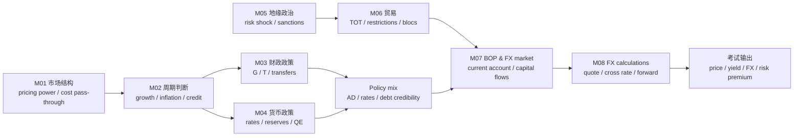

# Economics MOC

> **一句话核心**：用市场结构、周期、政策、贸易和汇率解释宏观环境对资产价格的影响。

---

## 1. 科目定位

- **考试权重**：6-9%
- **官方模块数**：8
- **主线框架**：识别市场/宏观变量 -> 判断冲击方向 -> 连接政策反应 -> 推导价格/产出/汇率影响
- **使用方式**：先从官方模块导航进入，再用编号知识树做主动回忆，最后用公式/陷阱清单做考前压缩。

## 2. 官方模块导航

| 编号 | 官方 Module | 难度 | 必考点 | 模块链接 |
|---|---|---|---|---|
| M01 | The Firm and Market Structures | 概念+应用 | Introduction / Profit Maximization: Production Breakeven, Shutdown and Economies of Scale | [[M01-The-Firm-and-Market-Structures]] |
| M02 | Understanding Business Cycles | 概念+案例判断 | Introduction / Overview of the Business Cycle | [[M02-Understanding-Business-Cycles]] |
| M03 | Fiscal Policy | 概念+应用 | Introduction / Introduction to Monetary and Fiscal Policy | [[M03-Fiscal-Policy]] |
| M04 | Monetary Policy | 概念+应用 | Introduction / Role of Central Banks | [[M04-Monetary-Policy]] |
| M05 | Introduction to Geopolitics | 概念+案例判断 | Introduction / National Governments and Political Cooperation | [[M05-Introduction-to-Geopolitics]] |
| M06 | International Trade | 概念+应用 | Introduction / Benefits and Costs of Trade | [[M06-International-Trade]] |
| M07 | Capital Flows and the FX Market | 计算+解释 | Introduction / The Foreign Exchange Market and Exchange Rates | [[M07-Capital-Flows-and-the-FX-Market]] |
| M08 | Exchange Rate Calculations | 计算+解释 | Introduction / Cross-Rate Calculations | [[M08-Exchange-Rate-Calculations]] |

## 3. 核心知识树

```text
Economics (6-9%)
├─ 1. The Firm and Market Structures
│  ├─ 1.1 成本-利润口径：TR=P×Q, accounting profit=TR-explicit costs, economic profit=TR-explicit-implicit costs
│  ├─ 1.2 产量决策：MR=MC 定最优产量；P≥AVC 短期继续生产，P<AVC 关停；长期看 P 与 ATC ↳ 笔记：Perfect competition 下 MC schedule = supply function，其他结构无唯一 supply function（oligopoly 有 strategic interdependence）
│  ├─ 1.3 规模经济：LRAC 下降/上升判断 economies/diseconomies；自然垄断来自大规模固定成本 ↳ 笔记：Economies of scale=单位成本↓，Diseconomies=单位成本↑，Constant returns=单位成本不变；Output↑→Cost per unit↓，LRAC 向下倾斜部分
│  ├─ 1.4 市场结构识别：企业数量、产品差异、进入壁垒、定价权、长期经济利润；barriers to entry 排序为 perfect competition 近乎无、monopolistic competition 低、oligopoly 高、monopoly 非常高；price leader 被小企业 undercut 时，先判断低价是否迫使高成本小企业退出，领导者份额可能上升 ← 高频错因
│  └─ 1.5 集中度指标：CR_n 与 HHI 只描述集中，不等于竞争强度；monopoly 下单一企业 market share=100%，CR_1=100%，HHI 在百分数口径为 10,000；仍需结合进口竞争和潜在进入
├─ 2. Understanding Business Cycles
│  ├─ 2.1 周期阶段：expansion -> peak -> contraction/recession -> trough；题目常考变量先后顺序
│  ├─ 2.2 指标分类：leading 预测、coincident 确认当前、lagging 滞后验证；不要用滞后指标预测拐点
│  ├─ 2.3 信贷/库存/劳动力传导：住房和新订单偏领先，就业和通胀偏滞后
│  └─ 2.4 周期对资产：复苏利好周期股，衰退提升信用风险和避险需求
├─ 3. Fiscal Policy
│  ├─ 3.1 工具：government spending、taxes、transfers、automatic stabilizers
│  ├─ 3.2 乘数：spending multiplier=1/(1-MPC)，tax multiplier=-MPC/(1-MPC)，漏出越多乘数越小
│  ├─ 3.3 政策立场：衰退用扩张，过热用紧缩；判断 output gap 和 inflation pressure
│  └─ 3.4 约束：recognition/action/impact lag、crowding out、debt sustainability、Ricardian effects
├─ 4. Monetary Policy
│  ├─ 4.1 央行目标：price stability 为核心，兼顾 growth/employment 与金融稳定
│  ├─ 4.2 工具：policy rate、reserve requirements、open market operations、asset purchases
│  ├─ 4.3 传导：利率、信贷、资产价格、汇率渠道；rate cut 是动作，easing effectiveness 是结果
│  └─ 4.4 可信度：independence、transparency、inflation targeting 影响预期和长期利率
├─ 5. Introduction to Geopolitics
│  ├─ 5.1 风险类型：geopolitical risk 关注国家间权力/冲突，political risk 更偏单国政策与制度
│  ├─ 5.2 传导渠道：供应链、商品价格、风险溢价、资本流、政策反应
│  ├─ 5.3 投资判断：flight to safety、risk premium 上升、commodity shock、FX pressure
│  └─ 5.4 方法：scenario analysis / stress testing 优于单点预测
├─ 6. International Trade
│  ├─ 6.1 优势判断：absolute advantage 看产出效率；comparative advantage 看 opportunity cost
│  ├─ 6.2 贸易收益：专业化提高总产出；TOT=export price index/import price index，TOT 上升通常有利
│  ├─ 6.3 限制工具：tariff 有政府收入，quota 产生配额租，export subsidy 可能损害本国福利
│  └─ 6.4 区域一体化：FTA -> customs union -> common market -> economic/monetary union；区分 trade creation/diversion
├─ 7. Capital Flows and the FX Market
│  ├─ 7.1 BOP：current account + capital/financial account + reserves/errors；外部平衡必须从账户联动看
│  ├─ 7.2 资本流：利差、风险偏好、增长预期、政策可信度共同驱动 FX pressure
│  ├─ 7.3 汇率制度：floating、managed float、peg/currency board、monetary union；制度决定政策独立性
│  └─ 7.4 FX 市场：spot、forward、swap；hedger 与 speculator 可用同一工具但目标不同
├─ 8. Exchange Rate Calculations
│  ├─ 8.1 报价规则：A/B 表示 1A = B；A/B 上升是 A 升值、B 贬值；倒数报价 bid/ask 要换边
│  ├─ 8.2 交叉汇率：A/C=(A/B)×(B/C)，中间货币必须约掉；bid 用保守买入链、ask 用保守卖出链
│  ├─ 8.3 远期汇率：forward points=F-S；premium=(F-S)/S，可按题目期限年化
│  └─ 8.4 CIP：F=S(1+i_d)/(1+i_f)；高利率货币通常远期贴水，forward premium 不等于未来必然升值
```

## 核心图解



## 4. 跨模块依赖关系

```text
Micro structure (M01)
├─ pricing power / cost pass-through -> inflation persistence and margin cycle (M02)
└─ market power / regulation -> fiscal intervention and antitrust context (M03)

Business cycle diagnosis (M02)
├─ recession / output gap -> expansionary fiscal stance, automatic stabilizers (M03)
├─ inflation / overheating -> monetary tightening or credibility issue (M04)
└─ credit and housing signals -> FI yield curve, Equity cyclicals, PM asset allocation

Policy block (M03-M04)
├─ fiscal deficit / debt -> rates, crowding out, sovereign risk, FX confidence
├─ policy rate / liquidity -> interest differential -> CIP forward rate (M08)
└─ policy mix -> growth-inflation trade-off -> PM macro scenario

External block (M05-M08)
├─ geopolitics (M05) -> trade restrictions / commodity shock / risk premium
├─ trade structure (M06) -> current account pressure and terms of trade
├─ capital flows and FX regime (M07) -> spot FX and policy independence
└─ FX calculations (M08) -> cross-rate, forward points, covered arbitrage
```

| 依赖关系 | 输入 | 输出到考试判断 | 接口科目 |
|---|---|---|---|
| `M02 -> M03/M04` | output gap、unemployment、inflation | 选 fiscal 还是 monetary；判断扩张/紧缩和时滞 | PM macro allocation、FI rate expectations |
| `M04 -> M08` | domestic/foreign interest rates | 用 `F=S(1+i_d)/(1+i_f)` 定 forward premium/discount | Derivatives FX forward、FI money market |
| `M05 -> M06/M07` | conflict、sanctions、supply chain shock | trade cost、capital flight、safe-haven demand | Equity country risk、PM scenario analysis |
| `M06 -> M07` | comparative advantage、tariff/quota、TOT | current account 与 FX pressure | Corporate margins、PM currency exposure |
| `M07 -> M08` | quote convention、regime、participants | 选择 spot/forward/swap 与报价方向 | Quant return conversion、Derivatives hedging |
| `Quant -> Economics` | index、growth rate、correlation | 判断指标领先/滞后，避免把相关当因果 | Quant time series、PM forecasting |

## 5. 核心对比专题

| 重要性 | 对比项 | 英文 | 中文解释 | 考试判断 |
|---|---|---|---|---|
| ⭐⭐⭐ | 概念 vs 应用 | definition vs application | 先确认官方定义，再放入题干情境判断。 | 概念题也要能说出适用条件和例外。 |
| ⭐⭐⭐ | 计算 vs 解释 | calculation vs interpretation | 数值只是中间结果，答案要解释方向、含义和限制。 | 凡是 calculate and interpret 都不能只算。 |
| ⭐⭐ | 静态知识 vs 决策流程 | static knowledge vs decision process | 把每个模块压缩成输入 -> 工具 -> 输出 -> 陷阱。 | 流程化比孤立背诵更抗干扰。 |
| ⭐⭐⭐ | 英文识题 vs 中文理解 | English trigger vs Chinese explanation | 英文用于识别题干，中文用于确认真正含义。 | 避免看到熟词就按直觉作答。 |
| ⭐⭐ | 本模块 vs 跨模块 | single module vs cross-module use | 同一公式/概念可能在估值、风险、伦理或报表中换场景出现。 | 错题要回填到 MOC 节点。 |

## 6. 公式与框架速查

### M01 Firm and Market Structures

| 指标 | 公式 | 知识树节点 | 考试说明 |
|------|------|------------|----------|
| Total Revenue | `TR = P x Q` | `M01` | 【考纲重点】收益、利润和市场结构计算入口 |
| Accounting Profit | `TR - Explicit Costs` | `M01` | 区分会计利润与经济利润 |
| Economic Profit | `TR - Explicit Costs - Implicit Costs` | `M01` | 【考纲重点】经济利润为零不等于会计亏损 |
| Profit Maximization | `MR = MC` | `M01` | 【考纲重点】所有市场结构通用的产量条件 |
| Average Total Cost | `ATC = TC / Q` | `M01` | `P > ATC` 表示正经济利润 |
| Average Variable Cost | `AVC = TVC / Q` | `M01` | shutdown 判断常用 |
| Marginal Product | `MP = ΔTP / ΔL` | `M01` | 生产函数边际量 |
| Concentration Ratio | `CR_n = Σ market share of largest n firms` | `M01` | 【考纲重点】行业集中度轻计算；pure monopoly 下单一企业 market share=100%，所以 `CR_1=100%` |
| Herfindahl-Hirschman Index | `HHI = Σ market share_i^2` | `M01` | 【考纲重点】市场份额口径必须统一：百分数口径下 monopoly `HHI=100^2=10,000`；小数口径下 `HHI=1.0^2=1.0` |

### M03 Fiscal Policy

| 指标 | 公式 | 知识树节点 | 考试说明 |
|------|------|------------|----------|
| Government Spending Multiplier | `1 / (1 - MPC)` | `M03` | 【考纲重点】政府支出乘数 |
| Tax Multiplier | `-MPC / (1 - MPC)` | `M03` | 【考纲重点】绝对值小于支出乘数 |
| Balanced Budget Multiplier | `1` | `M03` | 支出和税收同额变化的简化结论 |
| Debt/GDP Change | `Δ(D/Y) = (r - g)(D/Y) - PB/Y` | `M03` | 【扩展/谨慎】有助于债务可持续性直觉，若题目未给足变量不强行计算 |

### M06 International Trade

| 指标 | 公式 | 知识树节点 | 考试说明 |
|------|------|------------|----------|
| 机会成本 | `Opportunity Cost = Units B Given Up / Units A Gained` | `M06` | 比较优势判定 |
| 贸易条件 | `TOT = Export Price Index / Import Price Index` | `M06` | TOT上升有利 |

### M08 FX Calculations

| 指标 | 公式 | 知识树节点 | 考试说明 |
|------|------|------------|----------|
| Cross Rate | `A/C = (A/B) x (B/C)` | `M08` | 中间币种要约掉 |
| Inverted Quote | `B/A = 1 / (A/B)` | `M08` | bid/ask inversion 要换边 |
| Forward Premium | `(F - S) / S` | `M08` | 报价方向先定 |
| Annualized Forward Premium | `[(F - S) / S] x (periods per year)` | `M08` | 【考纲重点】按题目期限年化 |
| Forward Points | `Forward Rate - Spot Rate` | `M08` | points sign 看 quote |
| Covered Interest Parity | `F = S[(1 + i_d)/(1 + i_f)]` | `M08` | domestic/foreign 先定义 |
| Currency Appreciation, Price Currency Quote | `(Old quote - New quote) / Old quote` | `M08` | 若 quote 是 domestic/foreign，报价下降表示 foreign 升值或 domestic 升值需先定义 |

### 考纲范围标记

| 标记 | 内容 |
|------|------|
| 【考纲重点】 | Market structure concentration/profit logic、fiscal multipliers、trade opportunity cost、FX cross-rate/forward-rate/CIP 计算 |
| 【考纲内但无核心公式】 | Business cycles、monetary policy、geopolitics、FX market structure 多为机制判断 |
| 【超纲/扩展】 | 完整 IS-LM/Phillips curve 计量模型、复杂福利三角面积推导、宏观债务动态的深入微分形式不作为 Level I 必背公式 |

---

## 7. 高频考试陷阱

| ❌ 错误理解 | ✅ 正确理解 | 高频场景 |
|---|---|---|
| ❌ monopoly 一定高利润且无风险 | ✅ 也受监管、需求弹性和替代品影响 | 按官方定义和 LOS 口径核验。 |
| ❌ leading indicator 是确认当前周期 | ✅ leading 是预测未来方向 | 按官方定义和 LOS 口径核验。 |
| ❌ expansionary fiscal 就一定降低利率 | ✅ 也可能挤出私人投资 | 按官方定义和 LOS 口径核验。 |
| ❌ monetary easing 一定立即刺激信贷 | ✅ 传导可能失灵 | 按官方定义和 LOS 口径核验。 |
| ❌ tariff 和 quota 只是形式不同 | ✅ tariff 有政府收入，quota 不一定 | 按官方定义和 LOS 口径核验。 |
| ❌ forward premium 表示一定会升值 | ✅ 它先是定价关系，不等于必然实现 | 按官方定义和 LOS 口径核验。 |
| ❌ 本币报价上升一定是本币升值 | ✅ 先看 quote convention | 按官方定义和 LOS 口径核验。 |
| ❌ 汇率题可以不看 domestic/foreign 定义 | ✅ 不看报价方向最容易整题错掉 | 按官方定义和 LOS 口径核验。 |
| ❌ economic profit 为零就是公司亏损 | ✅ 可能仍有正常会计利润和资本补偿 | 按官方定义和 LOS 口径核验。 |
| ❌ 贸易逆差单独决定本币走势 | ✅ 资本流、政策、利差和预期都可能主导 | 按官方定义和 LOS 口径核验。 |
| ❌ price leader 被 undercut，领导者市场份额一定下降 | ✅ 若低价低于小企业可持续成本，边缘企业可能退出，dominant price leader 的市场份额可能上升 | 寡头/价格领导题先判断退出机制，不按“低价抢份额”直觉作答。 |
| ❌ payoff matrix 一律先套 no-collusion Nash equilibrium | ✅ 若题干给出 collusive agreement / side payment，先按联合利润最大化与分成激励判断 | 寡头博弈题先圈出 no collusion vs collusion，再选 Nash 或 collusive outcome。 |
| ❌ colluding 和 non-colluding 下每家公司都面对 individual demand curve | ✅ colluding 下先看 aggregate market demand 如何在参与者间分配；non-colluding 下各公司才面对自己的 individual demand curve | 寡头需求曲线题先判断是否 collusion，不要把两种情境合并。 |
| ❌ Cournot assumption 是价格竞争或对手价格不变 | ✅ Cournot assumption 是各企业选择自己的 profit-maximizing output，并假设 competitors' output will not change | 看到 Cournot/古诺时，先锁定 output competition，不要误套 Bertrand price competition。 |
| ❌ HHI 与 CR_n 可以混用百分数和小数口径 | ✅ 先锁定 market share 单位；monopoly 下 `CR_1=100%`，HHI 若用百分数为 `10,000`，若用小数为 `1.0` | concentration measure 题先统一单位，再解释集中度和局限。 |
| ❌ monopolistic competition 因为有差异化产品，所以进入壁垒高 | ✅ monopolistic competition 通常 low barriers to entry；high barriers 更符合 oligopoly，very high barriers 才是 monopoly | 市场结构题看到 high barriers，优先在 oligopoly/monopoly 间判断，不要被 product differentiation 带偏。 |

## 8. 通用分析框架

### 框架1：政策题决策树

1. 识别宏观状态：若 output below potential / unemployment high -> 需求不足；若 inflation high / capacity tight -> 过热。
2. 选择政策主体：预算、税收、转移支付 -> fiscal；policy rate、reserves、OMO、QE/QT -> monetary。
3. 判断方向：扩张政策提高 AD；紧缩政策降低 AD。财政要检查 `spending multiplier=1/(1-MPC)` 或 `tax multiplier=-MPC/(1-MPC)` 是否适用。
4. 加上约束：财政看 deficit、debt、crowding out、implementation lag；货币看 credibility、zero lower bound、bank lending channel。
5. 输出资产含义：growth、inflation、nominal rate、real rate、FX。若题干给 domestic/foreign rates，转入 `M08 CIP` 而不是凭直觉判断汇率。

### 框架2：市场结构题决策树

1. 先问企业是否 price taker：若是，进入 perfect competition，并用 `P=MR`、长期 `P=MC=min ATC`。
2. 若有差异化但进入壁垒低：monopolistic competition，短期可有经济利润，长期需求曲线与 ATC 相切。
3. 若少数企业、进入壁垒高且策略互动明显：oligopoly，先圈出题干是 no collusion 还是 collusive agreement / side payment；无合谋才优先找 Nash equilibrium 和 firm-level individual demand curve，有合谋则先看 aggregate market demand 的分配、联合利润最大化和分成后是否有偏离激励。若题干给 Cournot/古诺假设，核心是各企业选择自己的 profit-maximizing output，并假设 competitors' output will not change。
4. 若单一卖方且壁垒极高：monopoly，使用 `MR=MC` 定产量、需求曲线定价格，注意 deadweight loss 和 price discrimination；集中度指标上，单一企业 market share=100%，`CR_1=100%`，HHI 达到最大值。
5. 如果题干只给 `CR_n` 或 `HHI`，先统一 market share 单位再算集中度：百分数口径 HHI 范围通常是 0 到 10,000，小数口径范围是 0 到 1；最后写限制：指标不能识别潜在进入、进口竞争和产品差异。

### 框架3：汇率题决策树

1. 写清报价：`A/B` 表示 1A 兑 B；若倒数，`bid(B/A)=1/ask(A/B)`，`ask(B/A)=1/bid(A/B)`。
2. 若求 cross rate，先排成能约掉中间货币的链：`A/C=(A/B)x(B/C)`；bid/ask 不能混用。
3. 若题干给 spot 与 forward：先算 `forward points=F-S`，再算 `premium=(F-S)/S`，按天数或月数年化。
4. 若题干给利率：使用 `F=S(1+i_d)/(1+i_f)`。先定义 direct quote 下的 domestic/foreign，再判断高利率货币通常远期贴水。
5. 解释时分清定价与预测：forward premium/discount 是无套利价格关系，不等于未来 spot 必然变化。

---

## 9. 学习路径建议

- **第一轮：结构对齐**。按模块顺序读官方结构和 LOS，不急着刷难题。
- **第二轮：主动回忆**。遮住解释，只看编号知识树说出定义、公式和陷阱。
- **第三轮：题目驱动**。把错题回填到对应模块和 MOC 节点，形成可复用 fix rule。
- **考前压缩**。只保留高频术语、公式/框架、易错点、跨模块依赖和错题触发点。

## 10. Legacy 内容治理

- 本 MOC 已优先吸收 `_legacy/2026-05-26-official-sync/` 中的中文解释、公式、陷阱和框架。
- `_legacy` 只作为补强来源，不作为最终学习入口；若与官方 2026 LOS 冲突，以 registry 和官方 Topic Outline 为准。
