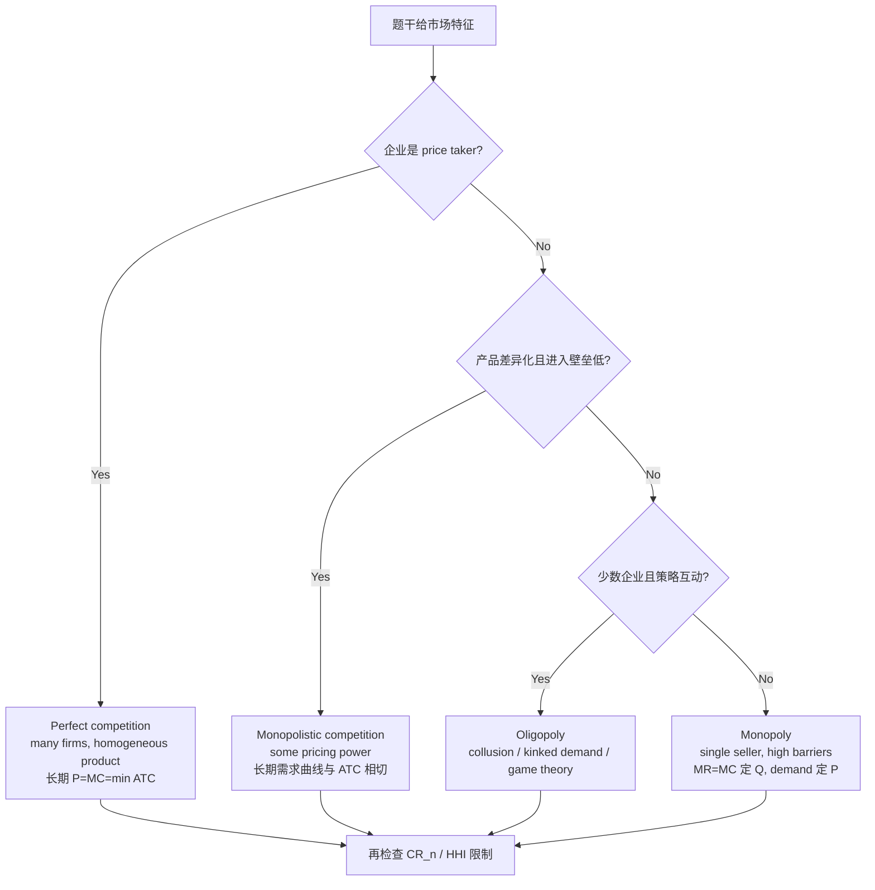

# M01: The Firm and Market Structures

> **模块定位**：用市场结构、周期、政策、贸易和汇率解释宏观环境对资产价格的影响。 本模块聚焦 **The Firm and Market Structures**，要求把官方 LOS 转成可执行的判断、计算或解释动作。

---

## Official Module Structure

- Learning Outcomes: The Firm and Market Structures
- 1.01 | Introduction
- 1.02 | Profit Maximization: Production Breakeven, Shutdown and Economies of Scale
- 1.03 | Introduction to Market Structures
- 1.04 | Monopolistic Competition
- 1.05 | Oligopoly
- 1.06 | Determining Market Structure

## Learning Outcome Statements

1. determine and interpret breakeven and shutdown points of production, as well as how economies and diseconomies of scale affect costs under perfect and imperfect competition
2. describe characteristics of perfect competition, monopolistic competition, oligopoly, and pure monopoly
3. explain supply and demand relationships under monopolistic competition, including the optimal price and output for firms as well as pricing strategy
4. explain supply and demand relationships under oligopoly, including the optimal price and output for firms as well as pricing strategy
5. identify the type of market structure within which a firm operates and describe the use and limitations of concentration measures

---

## 1. 模块定位

### 1.1 学习任务
- **核心问题**：考试希望你用 `The Firm and Market Structures` 解释什么、计算什么、比较什么，或判断什么。
- **输入信息**：题干事实、数据、假设、时间口径、单位、约束条件。
- **输出结果**：中文结论 + 英文关键术语 + 必要公式/框架 + 限制条件。

### 1.2 考试角色
- **难度类型**：概念+应用。
- **高频题型**：定义辨析、情境判断、计算解释、表格补数、跨模块比较。
- **答题原则**：先判断 LOS 动词，再选择工具；计算后必须解释结果含义。

### 1.3 关键英文术语
- **The Firm and Market Structures（核心术语）**：本模块关键词，用于定位 LOS、题干条件和解题动作。
- **Introduction（核心术语）**：本模块关键词，用于定位 LOS、题干条件和解题动作。
- **Profit Maximization: Production Breakeven, Shutdown and Economies of Scale（核心术语）**：本模块关键词，用于定位 LOS、题干条件和解题动作。
- **Profit Maximization（核心术语）**：本模块关键词，用于定位 LOS、题干条件和解题动作。
- **Introduction to Market Structures（核心术语）**：本模块关键词，用于定位 LOS、题干条件和解题动作。
- **Monopolistic Competition（核心术语）**：本模块关键词，用于定位 LOS、题干条件和解题动作。
- **Oligopoly（核心术语）**：本模块关键词，用于定位 LOS、题干条件和解题动作。
- **Determining Market Structure（核心术语）**：本模块关键词，用于定位 LOS、题干条件和解题动作。

## 2. 官方 LOS 对应学习目标

| LOS | 官方要求 | 中文学习动作 | 做题输出 |
|---|---|---|---|
| 1.1 | determine and interpret breakeven and shutdown points of production, as well as how economies and diseconomies of scale affect costs under perfect and imperfect competition | 解释结果的投资含义；根据条件判断正确结论 | 写出结论、依据、公式口径和限制条件。 |
| 1.2 | describe characteristics of perfect competition, monopolistic competition, oligopoly, and pure monopoly | 描述定义、流程和适用场景 | 写出结论、依据、公式口径和限制条件。 |
| 1.3 | explain supply and demand relationships under monopolistic competition, including the optimal price and output for firms as well as pricing strategy | 解释机制、原因和后果 | 写出结论、依据、公式口径和限制条件。 |
| 1.4 | explain supply and demand relationships under oligopoly, including the optimal price and output for firms as well as pricing strategy | 解释机制、原因和后果 | 写出结论、依据、公式口径和限制条件。 |
| 1.5 | identify the type of market structure within which a firm operates and describe the use and limitations of concentration measures | 描述定义、流程和适用场景；识别题干中的关键事实和触发条件 | 写出结论、依据、公式口径和限制条件。 |

## 3. 核心知识树

```text
1. The Firm and Market Structures
├─ 1.1 成本与利润的基本概念（Cost and Profit Concepts）
│  ├─ 1.1.1 收入口径：TR=P×Q；AR=TR/Q；MR=ΔTR/ΔQ，perfect competition 下 P=MR
│  ├─ 1.1.2 利润口径：accounting profit=TR-explicit costs；economic profit=TR-explicit-implicit costs
│  └─ 1.1.3 考试判断：zero economic profit 表示赚到 normal profit，不等于会计亏损
├─ 1.2 四种市场结构（Four Market Structures）
│  ├─ 1.2.1 Perfect competition：many firms、homogeneous product、no barriers；长期 P=MC=min ATC ↳ 笔记：Perfect competition 下 MC schedule = supply function，其他市场结构无唯一 supply function
│  ├─ 1.2.2 Monopolistic competition：product differentiation、low barriers、some pricing power；长期需求曲线与 ATC 相切
│  ├─ 1.2.3 Oligopoly：few firms、high barriers、strategic interaction；看 kinked demand、collusion、game theory
│  └─ 1.2.4 Monopoly：single seller、high barriers；MR=MC 定产量，需求曲线定价格
├─ 1.3 进入壁垒（Barriers to Entry）
│  ├─ 1.3.1 壁垒来源：economies of scale、patents/licenses、network effects、brand loyalty、high fixed cost ↳ 笔记：Economies of scale=单位成本↓，Diseconomies=单位成本↑，Constant returns=单位成本不变；Output↑→Cost per unit↓，LRAC 向下倾斜部分
│  └─ 1.3.2 判断用途：壁垒越强，长期经济利润越可能维持，价格越可能高于边际成本
├─ 1.4 集中度指标（Concentration Measures）
│  ├─ 1.4.1 CR_n=前 n 家企业市场份额之和；monopoly 下单一企业 market share=100%，CR_1=100%；适合快速判断集中度但忽略分布
│  ├─ 1.4.2 HHI=Σ market share_i^2；百分数口径下 monopoly HHI=10,000，小数口径下 HHI=1.0；大企业合并对 HHI 影响更大
│  └─ 1.4.3 限制：集中度不能捕捉进口竞争、潜在进入、产品差异和动态竞争
```

## 核心图解



## 4. 知识点详解

### 1.1 成本与利润的基本概念（Cost and Profit Concepts）

**会计利润与经济利润（Accounting Profit vs Economic Profit）**：
- **会计利润（Accounting Profit）** = 总收益 − 显性成本（explicit costs），即账面利润。
- **经济利润（Economic Profit）** = 总收益 − 显性成本 − 隐性成本（implicit costs），包括机会成本。
- **正常利润（Normal Profit）** = 隐性成本部分，即经济利润为零时的会计利润水平。

一个重要结论：**经济利润为零时企业仍在盈利（有正常利润）**，这足以让资本留在该行业。

**短期与长期（Short Run vs Long Run）**：
- **短期（Short Run）**：至少有一种生产要素固定不变，存在固定成本（fixed cost）和可变成本（variable cost）。
- **长期（Long Run）**：所有要素都可调整，所有成本都是可变的。

**边际决策（Marginal Decision Rule）**：企业在边际收益（MR）等于边际成本（MC）时实现利润最大化。只要 MR > MC，企业就应该增加产量；若 MR < MC，则应减少产量。

### 1.2 四种市场结构（Four Market Structures）

| 特征 | 完全竞争 | 垄断竞争 | 寡头 | 垄断 |
|------|---------|---------|------|------|
| 企业数量 | 非常多 | 较多 | 少数几家 | 一家 |
| 产品差异化 | 同质 | 差异化 | 可同质可差异 | 唯一产品 |
| 进入壁垒 | 无 | 较低 | 较高 | 非常高 |
| 定价权 | 价格接受者 | 有限 | 相互依存 | 价格制定者 |
| 长期利润 | 零经济利润 | 零经济利润 | 可能有 | 正经济利润 |

**完全竞争（Perfect Competition）**：
- 特点：大量小型企业，同质产品，完全信息，自由进入退出
- 需求曲线为水平线（价格接受者）
- 长期中经济利润为零

**垄断竞争（Monopolistic Competition）**：
- 特点：产品差异化（product differentiation），非价格竞争（广告、品牌）
- 需求曲线向右下方倾斜但较为平坦
- 短期可能有经济利润，长期为零

**寡头（Oligopoly）**：
- 特点：少数企业主导市场，存在策略互动（strategic interaction）
- 可能发生价格战或形成默契合谋（tacit collusion）
- 博弈论（game theory）用于分析寡头行为
- 纳什均衡（Nash Equilibrium）是重要分析工具
- 需求曲线口径：colluding 条件下先看 aggregate market demand 在参与企业间分配；non-colluding 条件下每家公司才面对自己的 individual demand curve。
- 古诺假设（Cournot assumption）：每家企业选择自己的 profit-maximizing output，并假设 competitors' output will not change；这是 output competition，不是 price competition。

**垄断（Monopoly）**：
- 特点：唯一生产者，极高进入壁垒
- 需求曲线即为市场需求曲线
- 可通过价格歧视（price discrimination）增加利润
- 导致无谓损失（deadweight loss）

### 1.3 进入壁垒（Barriers to Entry）

常见的进入壁垒包括：
- 规模经济（economies of scale）：大企业成本优势
- 品牌忠诚度（brand loyalty）
- 专利与政府许可（patents and government licenses）
- 高初始投资成本
- 网络效应（network effects）

### 1.4 集中度指标（Concentration Measures）

- **N企业集中率（N-firm concentration ratio）**：前N家企业市场份额之和。值越高，市场越集中。
- **赫芬达尔-赫希曼指数（HHI, Herfindahl-Hirschman Index）**：所有企业市场份额的平方和，对市场份额分布更敏感。
- **Monopoly market share 口径**：pure monopoly 只有一个卖方，因此单一企业 market share=100%，`CR_1=100%`。HHI 是 market share 的平方和；若用百分数，`HHI=100^2=10,000`；若用小数，`HHI=1.0^2=1.0`。两种口径含义一致，但不能在同一道题中混用。
- 注意：集中度指标不能完全替代竞争分析，还需要考虑进出口竞争、潜在进入等因素。

## 5. 关键公式与计算框架

### 5.1 核心内容

| 节点 | 公式/框架 | 使用条件 | 考试判断 |
|---|---|---|---|
| 1.1.1 | `TR = P x Q`; `AR = TR/Q`; `MR = ΔTR/ΔQ` | 收益、边际收益、表格补数 | perfect competition 下企业是 price taker，`P=MR`。 |
| 1.1.2 | `Accounting Profit = TR - Explicit Costs` | 会计利润口径 | 不扣隐性机会成本。 |
| 1.1.2 | `Economic Profit = TR - Explicit Costs - Implicit Costs` | 经济利润/进入退出判断 | `Economic profit = 0` 表示 normal profit 已被覆盖。 |
| 1.2.4 | `MR = MC` | 所有市场结构的利润最大化产量 | 先定 Q，再用需求曲线读 P；不要用 P=MC 判断垄断产量。 |
| 1.2.1 | `P = MC = minimum ATC` | 完全竞争长期均衡 | 长期经济利润为零，企业仍有正常利润。 |
| 1.2.4 | `P > MC` | 垄断/垄断竞争定价权 | 产生 deadweight loss，价格不是由 MC 直接决定。 |
| 1.3.1 | `ATC = TC/Q`; `AVC = TVC/Q` | breakeven 与 shutdown | 短期 `P < AVC` 关停；长期 `P < ATC` 退出。 |
| 1.4.1 | `CR_n = Σ market share of largest n firms` | 集中率题 | 只看前 n 家，不能反映剩余企业分布；pure monopoly 下 `CR_1=100%`。 |
| 1.4.2 | `HHI = Σ market share_i^2` | HHI 题 | 市占率单位需统一；百分数口径 monopoly `HHI=10,000`，小数口径 monopoly `HHI=1.0`，两者不可混用。 |

## 6. 常见考点与解题思路

| 重要性 | 考点 | 解题动作 |
|---|---|---|
| ⭐⭐⭐ | 1.1 Introduction | 先定位题干触发词，再写公式/框架，最后解释结果或判断陷阱。 |
| ⭐⭐⭐ | 1.2 Profit Maximization: Production Breakeven, Shutdown and Economies of Scale | 先定位题干触发词，再写公式/框架，最后解释结果或判断陷阱。 |
| ⭐⭐ | 1.3 Introduction to Market Structures | 先定位题干触发词，再写公式/框架，最后解释结果或判断陷阱。 |
| ⭐⭐ | 1.4 Monopolistic Competition | 先定位题干触发词，再写公式/框架，最后解释结果或判断陷阱。 |
| ⭐ | 1.5 Oligopoly | 先定位题干触发词，再写公式/框架，最后解释结果或判断陷阱。 |

### 6.9 ⭐⭐ Legacy 考点补充

### 6.1 核心内容

**考点1：判断市场结构**
- 看企业数量 → 数量极多为完全竞争或垄断竞争
- 看产品差异化 → 同质为完全竞争，差异为垄断竞争
- 看进入壁垒 → 高壁垒通常是寡头或垄断
- 看定价权 → 价格接受者为完全竞争

**考点2：完全竞争的长期均衡**
- P = MR = MC = ATC（最小点），经济利润为零
- 只赚取正常利润（会计利润为正）

**考点3：垄断的无谓损失**
- 垄断定价高于边际成本，产量低于社会最优水平
- 消费者剩余减少部分转化为生产者剩余，部分变为无谓损失

**考点4：寡头的策略行为**
- 囚徒困境（Prisoner's Dilemma）解释为何寡头有时选择非合作
- 卡特尔（cartel）不稳定，成员有作弊动机

## 7. 易错点与考试陷阱

| ❌ 错误理解 | ✅ 正确理解 | 为什么错 / 考试提醒 |
|---|---|---|
| ❌ 忽略：经济利润为零不代表企业亏损：企业仍然获得正常利润（会计利润），足以覆盖隐性成本。 | ✅ 经济利润为零不代表企业亏损：企业仍然获得正常利润（会计利润），足以覆盖隐性成本。 | 题干通常会用口径、顺序、定义边界或例外条件设置干扰。 |
| ❌ 忽略：完全竞争企业的需求曲线是水平的，而不是向下倾斜的。行业需求曲线才是向下倾斜的。 | ✅ 完全竞争企业的需求曲线是水平的，而不是向下倾斜的。行业需求曲线才是向下倾斜的。 | 题干通常会用口径、顺序、定义边界或例外条件设置干扰。 |
| ❌ 忽略：垄断竞争与完全竞争的区别：垄断竞争有产品差异化，短期可能有经济利润，长期需求曲线与ATC相切但不在最小点。 | ✅ 垄断竞争与完全竞争的区别：垄断竞争有产品差异化，短期可能有经济利润，长期需求曲线与ATC相切但不在最小点。 | 题干通常会用口径、顺序、定义边界或例外条件设置干扰。 |
| ❌ 忽略：HHI对合并非常敏感：两个小企业合并对HHI的影响小于两个大企业合并。 | ✅ HHI对合并非常敏感：两个小企业合并对HHI的影响小于两个大企业合并。 | 题干通常会用口径、顺序、定义边界或例外条件设置干扰。 |
| ❌ 把 colluding 与 non-colluding 的需求曲线口径混在一起。 | ✅ colluding 看 aggregate market demand 的分配；non-colluding 才说每家公司面对 individual demand curve。 | 题干出现 colluding/non-colluding 时，先判断需求曲线归属层级。 |
| ❌ 把 Cournot assumption 当成价格竞争或假设对手价格不变。 | ✅ Cournot assumption 假设对手产量不变，企业选择自己的利润最大化产量。 | 题干出现 Cournot/古诺时，先锁定 output competition。 |
| ❌ 看到 monopoly 只想到定价权，忘记 concentration measure 的 market share 极值。 | ✅ pure monopoly 下单一企业 market share=100%，`CR_1=100%`；HHI 用百分数为 `10,000`，用小数为 `1.0`。 | CR/HHI 题先统一 market share 单位，再判断集中度含义与局限。 |
| ❌ 把 monopolistic competition 的产品差异化误当作 high barriers to entry。 | ✅ monopolistic competition 通常是 low barriers；oligopoly 才是 fairly high barriers，monopoly 是 very high barriers。 | 问 barriers to entry 时先回忆壁垒阶梯，而不是先看产品是否差异化。 |

## 8. 跨模块关联

| 连接 | 传递内容 | 做题用途 |
|---|---|---|
| `M01 -> M02 Business Cycles` | pricing power、cost pass-through、profit margin | 判断通胀冲击如何进入企业利润和周期行业表现。 |
| `M01 -> M03 Fiscal Policy` | monopoly、natural monopoly、market failure | 解释监管、补贴、反垄断或政府干预的经济理由。 |
| `M01 -> Equity` | competitive position、entry barriers、economic profit | 分析行业长期 ROIC 与估值可持续性。 |
| `M01 -> Corporate Issuers` | economies of scale、fixed/variable cost | 连接 operating leverage 与 breakeven 分析。 |
| `Quant -> M01` | concentration ratios、HHI、marginal changes | 计算集中度和边际量时注意单位一致。 |


## 9. 复习与刷题提示

- 第一轮：按 `Official Module Structure` 逐节过概念，把每个 LOS 改写成中文任务。
- 第二轮：对照 `## 3. 核心知识树` 做主动回忆，能说出每个编号节点的定义、公式/框架和陷阱。
- 第三轮：刷题后记录错因，如果暴露 MOC 缺口，按 `docs/moc-auto-patch-workflow.md` 进入补强流程。
- 考前：只看术语、公式/框架、易错点和本模块错题，避免重新铺开所有正文。

## 10. Legacy Notes Integrated

- **主要 legacy 来源**：`M01-The-Firm-and-Market-Structures.md` (high, 0.428)
- **整合规则**：高置信内容已合入 `知识点详解`、`公式与计算框架`、`常见考点`、`易错陷阱` 和 `跨模块关联`。
- **边界**：若 legacy 内容与 2026 官方 LOS 冲突，以官方 module 名称、LOS 和 registry 为准。
