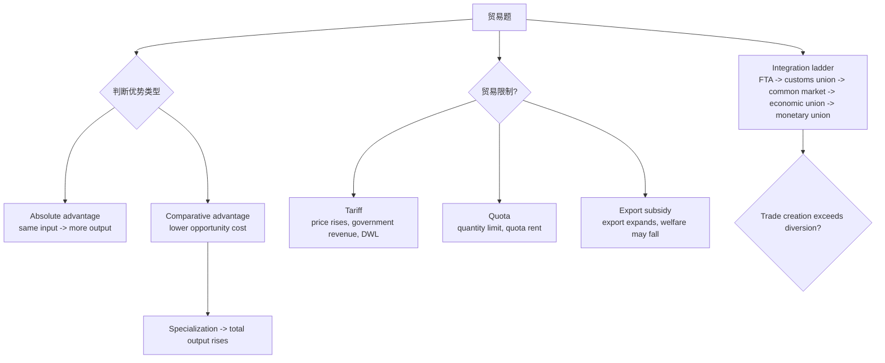

# M06: International Trade

> **模块定位**：用市场结构、周期、政策、贸易和汇率解释宏观环境对资产价格的影响。 本模块聚焦 **International Trade**，要求把官方 LOS 转成可执行的判断、计算或解释动作。

---

## Official Module Structure

- Learning Outcomes: International Trade
- 6.01 | Introduction
- 6.02 | Benefits and Costs of Trade
- 6.03 | Trade Restrictions and Agreements—Tariffs, Quotas, and Export Subsidies
- 6.04 | Trading Blocs and Regional Integration

## Learning Outcome Statements

1. describe the benefits and costs of international trade
2. compare types of trade restrictions, such as tariffs, quotas, and export subsidies, and their economic implications
3. explain motivations for and advantages of trading blocs, common markets, and economic unions

---

## 1. 模块定位

### 6.1 学习任务
- **核心问题**：考试希望你用 `International Trade` 解释什么、计算什么、比较什么，或判断什么。
- **输入信息**：题干事实、数据、假设、时间口径、单位、约束条件。
- **输出结果**：中文结论 + 英文关键术语 + 必要公式/框架 + 限制条件。

### 6.2 考试角色
- **难度类型**：概念+应用。
- **高频题型**：定义辨析、情境判断、计算解释、表格补数、跨模块比较。
- **答题原则**：先判断 LOS 动词，再选择工具；计算后必须解释结果含义。

### 6.3 关键英文术语
- **International Trade（核心术语）**：本模块关键词，用于定位 LOS、题干条件和解题动作。
- **Introduction（核心术语）**：本模块关键词，用于定位 LOS、题干条件和解题动作。
- **Benefits and Costs of Trade（核心术语）**：本模块关键词，用于定位 LOS、题干条件和解题动作。
- **Trade Restrictions and Agreements—Tariffs, Quotas, and Export Subsidies（核心术语）**：本模块关键词，用于定位 LOS、题干条件和解题动作。
- **Trading Blocs and Regional Integration（核心术语）**：本模块关键词，用于定位 LOS、题干条件和解题动作。

## 2. 官方 LOS 对应学习目标

| LOS | 官方要求 | 中文学习动作 | 做题输出 |
|---|---|---|---|
| 6.1 | describe the benefits and costs of international trade | 描述定义、流程和适用场景 | 写出结论、依据、公式口径和限制条件。 |
| 6.2 | compare types of trade restrictions, such as tariffs, quotas, and export subsidies, and their economic implications | 比较相似概念的适用条件与差异 | 写出结论、依据、公式口径和限制条件。 |
| 6.3 | explain motivations for and advantages of trading blocs, common markets, and economic unions | 解释机制、原因和后果 | 写出结论、依据、公式口径和限制条件。 |

## 3. 核心知识树

```text
6. International Trade
├─ 6.1 贸易基础理论（Foundations of Trade）
│  ├─ 6.1.1 Absolute advantage 看单位投入产出或单位产出成本
│  ├─ 6.1.2 Comparative advantage 看 opportunity cost，贸易方向由低机会成本决定
│  └─ 6.1.3 Gains from trade 来自 specialization，总福利提高但分配可能不均
├─ 6.2 贸易限制（Trade Restrictions）
│  ├─ 6.2.1 Tariff：提高进口价格，政府获得收入，消费者剩余下降
│  ├─ 6.2.2 Quota：限制数量，quota rents 归许可证持有者，政府不一定有收入
│  ├─ 6.2.3 Export subsidy：鼓励出口但扭曲资源配置，可能降低本国总福利
│  └─ 6.2.4 Non-tariff barriers：标准、检疫、行政流程等隐性贸易成本
├─ 6.3 贸易条件（Terms of Trade）
│  ├─ 6.3.1 `TOT = Export Price Index / Import Price Index`
│  └─ 6.3.2 TOT 上升表示每单位出口可换更多进口，通常改善购买力
├─ 6.4 区域经济一体化（Regional Economic Integration）
│  ├─ 6.4.1 层级：FTA -> customs union -> common market -> economic union -> monetary union
│  ├─ 6.4.2 Trade creation：低成本成员替代高成本国内生产，提高效率
│  └─ 6.4.3 Trade diversion：高成本成员替代低成本非成员，降低效率
```

## 核心图解



## 4. 知识点详解

### 6.1 贸易基础理论（Foundations of Trade）

**绝对优势（Absolute Advantage）**：一个国家用更少的资源生产同一种商品的能力。

**比较优势（Comparative Advantage）**：一个国家生产某种商品的**机会成本（opportunity cost）** 低于其他国家。这是国际贸易的核心理论基础。

即使一国在所有商品生产上都具有绝对劣势，它仍然可以通过专业化生产机会成本最低的商品并进行贸易而获益。

**贸易收益（Gains from Trade）**：专业化生产 → 全球总产出增加 → 贸易各方通过交换分享收益。

### 6.2 贸易限制（Trade Restrictions）

**关税（Tariffs）**：对进口商品征收税收。
- 效果：政府获得收入；国内生产者剩余增加；消费者剩余减少；产生无谓损失
- 净效果：贸易量减少 + 社会福利损失

**配额（Quotas）**：对进口数量设置上限。
- 效果：与关税类似，但配额收益（quota rents）流向进口许可证持有者而非政府
- 通常比关税更扭曲市场

**出口补贴（Export Subsidies）**：政府补贴出口企业。
- 效果：鼓励出口，但扭曲全球贸易格局，损害其他国家生产者

**非关税壁垒（Non-Tariff Barriers）**：包括监管标准、卫生检疫要求、海关程序等，间接增加进口难度。

### 6.3 贸易条件（Terms of Trade）

**贸易条件（Terms of Trade, TOT）** = 出口价格指数 / 进口价格指数
- TOT上升：每单位出口能换取更多进口 → 对该国有利
- TOT下降：出口购买力下降 → 对该国不利

### 6.4 区域经济一体化（Regional Economic Integration）

区域经济一体化从低到高分五个层级：

| 级别 | 名称 | 特征 |
|------|------|------|
| 1 | 自由贸易区（Free Trade Area） | 内部取消关税，各国对非成员自行制定关税 |
| 2 | 关税同盟（Customs Union） | 内部取消关税 + 统一对外关税 |
| 3 | 共同市场（Common Market） | 关税同盟 + 要素自由流动（劳动力、资本） |
| 4 | 经济联盟（Economic Union） | 共同市场 + 协调经济政策 |
| 5 | 货币联盟（Monetary Union） | 经济联盟 + 统一货币和货币政策 |

**常见一体化组织**：
- EU（欧盟）：经济与货币联盟
- USMCA（美墨加协定）：自由贸易区
- ASEAN（东盟）：自由贸易区

**贸易创造（Trade Creation） vs 贸易转移（Trade Diversion）**：
- 贸易创造：从低成本生产国进口取代国内高成本生产 → 提高效率
- 贸易转移：从低成本非成员国进口转向高成本成员国 → 降低效率
- 区域一体化在贸易创造 > 贸易转移时对成员国有利

## 5. 关键公式与计算框架

### 5.1 核心内容

**机会成本计算**：`Opportunity Cost of Good A = Units of Good B Given Up / Units of Good A Gained`
- 场景：给定两国生产两种商品的产量表，计算各自的机会成本，判断比较优势。

**贸易条件**：`Terms of Trade = Export Price Index / Import Price Index`
- 场景：判断一国贸易条件是否改善。指数上升表示贸易条件改善。

| 节点 | 计算/框架 | 使用条件 | 考试判断 |
|---|---|---|---|
| 6.1.2 | `Opportunity Cost of A = B given up / A gained` | 两国两商品产量表 | 低机会成本者有 comparative advantage，即使没有 absolute advantage 也可贸易。 |
| 6.2 | Tariff welfare map | 关税题 | consumer loss > producer gain + government revenue，差额为 deadweight loss。 |
| 6.2.2 | Quota rent | 配额题 | rent 归谁取决于许可证分配，不一定归政府。 |
| 6.3 | `TOT = Export Price Index / Import Price Index` | 价格指数题 | TOT 上升通常有利，但也要看数量和需求弹性。 |
| 6.4 | Integration ladder | 区域组织题 | 是否有统一对外关税、要素流动、政策协调、共同货币是分叉点。 |

## 6. 常见考点与解题思路

| 重要性 | 考点 | 解题动作 |
|---|---|---|
| ⭐⭐⭐ | 6.1 Introduction | 先定位题干触发词，再写公式/框架，最后解释结果或判断陷阱。 |
| ⭐⭐⭐ | 6.2 Benefits and Costs of Trade | 先定位题干触发词，再写公式/框架，最后解释结果或判断陷阱。 |
| ⭐⭐ | 6.3 Trade Restrictions and Agreements—Tariffs, Quotas, and Export Subsidies | 先定位题干触发词，再写公式/框架，最后解释结果或判断陷阱。 |
| ⭐⭐ | 6.4 Trading Blocs and Regional Integration | 先定位题干触发词，再写公式/框架，最后解释结果或判断陷阱。 |

### 6.9 ⭐⭐ Legacy 考点补充

### 6.1 核心内容

**考点1：绝对优势 vs 比较优势的判断**
- 绝对优势：看单位投入产出更多（或单位产出需要投入更少）
- 比较优势：看机会成本更低
- 解题关键：先算机会成本，再比较

**考点2：关税/配额的效果分析**
- 关税效果三角形分析：消费者损失 > 生产者收益 + 政府收入 → 净损失
- 配额相比关税：政府失去收入，配额收益归进口商

**考点3：一体化水平的判断**
- 根据特征描述判断属于哪类一体化组织
- 记忆技巧：Free Trade → Customs → Common → Economic → Monetary（从低到高）

## 7. 易错点与考试陷阱

| ❌ 错误理解 | ✅ 正确理解 | 为什么错 / 考试提醒 |
|---|---|---|
| ❌ 忽略：贸易政策可以帮助特定群体但仍降低总福利。例如关税保护国内特定行业就业，但消费者支付更高价格，整体福利下降。 | ✅ 贸易政策可以帮助特定群体但仍降低总福利。例如关税保护国内特定行业就业，但消费者支付更高价格，整体福利下降。 | 题干通常会用口径、顺序、定义边界或例外条件设置干扰。 |
| ❌ 忽略：比较优势是动态的：随时间推移，要素积累和技术进步会改变一国的比较优势。 | ✅ 比较优势是动态的：随时间推移，要素积累和技术进步会改变一国的比较优势。 | 题干通常会用口径、顺序、定义边界或例外条件设置干扰。 |
| ❌ 忽略：配额比关税更扭曲：配额完全限制数量，市场调节机制更少，通常导致更大的效率损失。 | ✅ 配额比关税更扭曲：配额完全限制数量，市场调节机制更少，通常导致更大的效率损失。 | 题干通常会用口径、顺序、定义边界或例外条件设置干扰。 |
| ❌ 忽略：自由贸易区vs关税同盟的区别：自由贸易区需原产地规则（rules of origin）防止贸易偏转（trade deflection）。 | ✅ 自由贸易区vs关税同盟的区别：自由贸易区需原产地规则（rules of origin）防止贸易偏转（trade deflection）。 | 题干通常会用口径、顺序、定义边界或例外条件设置干扰。 |
| ❌ 忽略：贸易创造 vs 贸易转移：区域一体化的净福利效应取决于贸易创造是否超过贸易转移。 | ✅ 贸易创造 vs 贸易转移：区域一体化的净福利效应取决于贸易创造是否超过贸易转移。 | 题干通常会用口径、顺序、定义边界或例外条件设置干扰。 |

## 8. 跨模块关联

| 连接 | 传递内容 | 做题用途 |
|---|---|---|
| `M05 -> M06` | sanctions、trade restrictions、supply chain shifts | 识别贸易政策背后的地缘政治动机。 |
| `M06 -> M07` | trade balance、terms of trade、regional blocs | 连接经常账户、资本流和汇率压力。 |
| `M06 -> M03` | tariff revenue、subsidies、distributional effects | 关税/补贴也会成为财政政策工具。 |
| `M06 -> Equity/Corporate` | import costs、export competitiveness、supply chain | 解释企业利润率和行业受益/受损。 |
| `M06 -> PM` | country exposure、trade bloc membership | 连接国家配置和风险分散。 |


## 9. 复习与刷题提示

- 第一轮：按 `Official Module Structure` 逐节过概念，把每个 LOS 改写成中文任务。
- 第二轮：对照 `## 3. 核心知识树` 做主动回忆，能说出每个编号节点的定义、公式/框架和陷阱。
- 第三轮：刷题后记录错因，如果暴露 MOC 缺口，按 `docs/moc-auto-patch-workflow.md` 进入补强流程。
- 考前：只看术语、公式/框架、易错点和本模块错题，避免重新铺开所有正文。

## 10. Legacy Notes Integrated

- **主要 legacy 来源**：`M06-International-Trade.md` (high, 0.548)
- **整合规则**：高置信内容已合入 `知识点详解`、`公式与计算框架`、`常见考点`、`易错陷阱` 和 `跨模块关联`。
- **边界**：若 legacy 内容与 2026 官方 LOS 冲突，以官方 module 名称、LOS 和 registry 为准。
