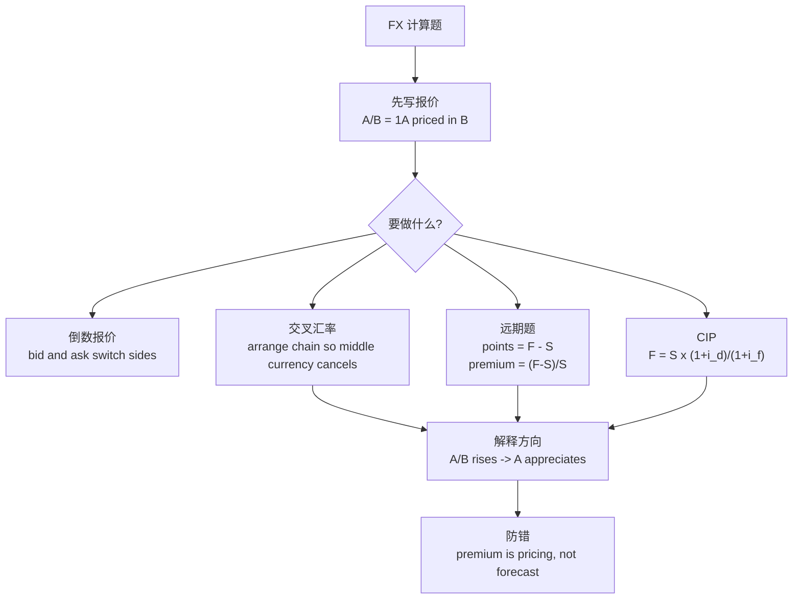

# M08: Exchange Rate Calculations

> **模块定位**：用市场结构、周期、政策、贸易和汇率解释宏观环境对资产价格的影响。 本模块聚焦 **Exchange Rate Calculations**，要求把官方 LOS 转成可执行的判断、计算或解释动作。

---

## Official Module Structure

- Learning Outcomes: Exchange Rate Calculations
- 8.01 | Introduction
- 8.02 | Cross-Rate Calculations
- 8.03 | Forward Rate Calculations

## Learning Outcome Statements

1. calculate and interpret currency cross-rates
2. explain the arbitrage relationship between spot and forward exchange rates and interest rates, calculate a forward rate using points or in percentage terms, and interpret a forward discount or premium

---

## 1. 模块定位

### 8.1 学习任务
- **核心问题**：考试希望你用 `Exchange Rate Calculations` 解释什么、计算什么、比较什么，或判断什么。
- **输入信息**：题干事实、数据、假设、时间口径、单位、约束条件。
- **输出结果**：中文结论 + 英文关键术语 + 必要公式/框架 + 限制条件。

### 8.2 考试角色
- **难度类型**：计算+解释。
- **高频题型**：定义辨析、情境判断、计算解释、表格补数、跨模块比较。
- **答题原则**：先判断 LOS 动词，再选择工具；计算后必须解释结果含义。

### 8.3 关键英文术语
- **Exchange Rate Calculations（核心术语）**：本模块关键词，用于定位 LOS、题干条件和解题动作。
- **Introduction（核心术语）**：本模块关键词，用于定位 LOS、题干条件和解题动作。
- **Cross-Rate Calculations（核心术语）**：本模块关键词，用于定位 LOS、题干条件和解题动作。
- **Forward Rate Calculations（核心术语）**：本模块关键词，用于定位 LOS、题干条件和解题动作。
- **Forward（远期）**：双方约定未来按固定价格交易标的的合约。

## 2. 官方 LOS 对应学习目标

| LOS | 官方要求 | 中文学习动作 | 做题输出 |
|---|---|---|---|
| 8.1 | calculate and interpret currency cross-rates | 计算并解释数值结果；解释结果的投资含义 | 写出结论、依据、公式口径和限制条件。 |
| 8.2 | explain the arbitrage relationship between spot and forward exchange rates and interest rates, calculate a forward rate using points or in percentage terms, and interpret a forward discount or premium | 计算并解释数值结果；解释结果的投资含义；解释机制、原因和后果 | 写出结论、依据、公式口径和限制条件。 |

## 3. 核心知识树

```text
8. Exchange Rate Calculations
├─ 8.1 汇率报价基础（Exchange Rate Quote Basics）
│  ├─ 8.1.1 `A/B` 表示 1 单位 A 兑换 B；A 是 base currency，B 是 price currency
│  ├─ 8.1.2 A/B 上升表示 A 升值、B 贬值；direct/indirect quote 先转成同一视角
│  └─ 8.1.3 倒数报价：`B/A = 1/(A/B)`；bid/ask 倒置必须换边
├─ 8.2 交叉汇率（Cross Rate Calculation）
│  ├─ 8.2.1 基本链：`A/C = (A/B) x (B/C)`，中间货币必须约掉
│  └─ 8.2.2 Bid/ask：目标 bid 用你卖出目标 base 的不利价格链，ask 用买入目标 base 的不利价格链
├─ 8.3 远期汇率（Forward Exchange Rate）
│  ├─ 8.3.1 Forward points = `F - S`；points 的小数位取决于货币对报价习惯
│  ├─ 8.3.2 Forward premium/discount = `(F-S)/S`，按题目期限年化
│  └─ 8.3.3 Premium 是 forward quote 相对 spot 的定价关系，不是未来 spot 预测
├─ 8.4 抛补利率平价（Covered Interest Parity, CIP）
│  ├─ 8.4.1 Direct quote 下 `F = S x (1+i_d)/(1+i_f)`
│  ├─ 8.4.2 高利率货币通常远期贴水；低利率货币通常远期升水
│  └─ 8.4.3 市场 forward 偏离 CIP 时，借低收益路径、投资高收益路径并用 forward 锁汇
├─ 8.5 无抛补利率平价（Uncovered Interest Parity, UIP）
│  ├─ 8.5.1 UIP 用预期未来 spot 替代 forward，暴露于汇率风险
│  └─ 8.5.2 Carry trade 不是无风险套利，因为没有 forward 锁定换回汇率
```

## 核心图解



## 4. 知识点详解

### 8.1 汇率报价基础（Exchange Rate Quote Basics）

**报价方式（Quote Convention）**：
- **直接报价（Direct Quote）**：一单位外币折合多少本币（DC/FC）。在中国，USD/CNY = 7.25 就是直接报价。
- **间接报价（Indirect Quote）**：一单位本币折合多少外币（FC/DC）。

**基础货币与报价货币（Base Currency vs Price Currency）**：
- 在 A/B 报价中：A 是**基础货币（base currency）**，B 是**报价货币（price currency）**
- 汇率表示 1 单位基础货币可以兑换多少报价货币

**升值与贬值（Appreciation and Depreciation）**：
- A/B 上升 → A 升值（appreciates），B 贬值（depreciates）
- 注意：必须先明确报价方向再判断升贬值！

**买卖价差（Bid-Ask Spread）**：
- **买入价（Bid）**：做市商愿意买入基础货币的价格
- **卖出价（Ask/Offer）**：做市商愿意卖出基础货币的价格
- 做市商低买高卖：Bid < Ask，差额 = 交易成本

### 8.2 交叉汇率（Cross Rate Calculation）

**交叉汇率概念**：通过第三种货币计算两种货币之间的汇率。

`A/C = (A/B) × (B/C)`

**计算步骤**：
1. 确定目标配对（如 EUR/GBP）
2. 找到两种货币与共同第三种货币的汇率
3. 相乘约掉中间币种

**买卖价差下的交叉汇率**：计算时要小心"哪个乘哪个"。计算买入价时取保守方向（乘 BID 或除 ASK 取决于方向）。

### 8.3 远期汇率（Forward Exchange Rate）

**远期升水/贴水（Forward Premium/Discount）**：
- `Forward Premium = (Forward Rate − Spot Rate) / Spot Rate`（年化时需乘以 12/N）
- 远期汇率 > 即期汇率 → 基础货币远期升水（forward premium）
- 远期汇率 < 即期汇率 → 基础货币远期贴水（forward discount）

**远期点数（Forward Points）** = Forward Rate − Spot Rate，通常以点数形式报价（1 point = 0.0001 或 0.01，视货币对而定）

### 8.4 抛补利率平价（Covered Interest Parity, CIP）

**CIP公式**：`F = S × (1 + i_d) / (1 + i_f)`

其中：
- F = 远期汇率（直接报价）
- S = 即期汇率（直接报价）
- i_d = 本币利率（domestic interest rate）
- i_f = 外币利率（foreign interest rate）

**CIP的含义**：通过远期合约锁定汇率后，国内外无风险投资收益应相等。如果偏离CIP，存在**套利（arbitrage）** 机会。

### 8.5 无抛补利率平价（Uncovered Interest Parity, UIP）

**UIP公式**：`E(S) = S × (1 + i_d) / (1 + i_f)`

UIP假设投资者不通过远期对冲，而是根据预期的未来即期汇率做决策。预期汇率的变化由利差驱动。

**套利交易（Carry Trade）**：借入低利率货币，投资高利率货币，赚取利差。但这面临汇率风险——高利率货币可能贬值。

## 5. 关键公式与计算框架

### 5.1 核心内容

**倒数报价**：`B/A = 1 / (A/B)`
- 场景：若 EUR/USD = 1.10，则 USD/EUR = 1/1.10 = 0.9091
- 注意：买卖价差倒置时要交换 bid 和 ask：`(B/A)_bid = 1 / (A/B)_ask`

**交叉汇率**：`A/C = (A/B) × (B/C)`
- 场景：已知 EUR/USD = 1.10，USD/JPY = 110，则 EUR/JPY = 1.10 × 110 = 121

**远期升水**：`Forward Premium = (F − S) / S × (360 / N) × 100%`
- 场景：S = 1.10，F（90天）= 1.1088，则年化升水 = (1.1088 − 1.10) / 1.10 × 4 = 3.2%

**远期点数**：`Forward Points = Forward Rate - Spot Rate`
- 场景：F > S 时 forward points 为正；F < S 时为负。

**抛补利率平价**：`F = S × (1 + i_d) / (1 + i_f)`
- 场景：S = 7.25（USD/CNY），i_d = 2%，i_f = 5%，则 F = 7.25 × 1.02 / 1.05 = 7.0429（人民币远期升水）

**交叉买卖价差**：
- 若目标是 `A/C = (A/B) x (B/C)`：
  - `bid(A/C) = bid(A/B) x bid(B/C)`
  - `ask(A/C) = ask(A/B) x ask(B/C)`
- 若需要倒数报价：`bid(B/A) = 1/ask(A/B)`，`ask(B/A) = 1/bid(A/B)`

**考纲标记**：
- 【考纲重点】倒数报价、交叉汇率、forward premium/discount、forward points、CIP。
- 【考纲内但无核心公式】FX market participants、exchange-rate regime、capital flow intuition。
- 【超纲/扩展】UIP 和 carry trade 是理解辅助；CFA L1 重点不是证明 UIP，而是区分它与 covered arbitrage。

## 6. 常见考点与解题思路

| 重要性 | 考点 | 解题动作 |
|---|---|---|
| ⭐⭐⭐ | 8.1 Introduction | 先定位题干触发词，再写公式/框架，最后解释结果或判断陷阱。 |
| ⭐⭐⭐ | 8.2 Cross-Rate Calculations | 先定位题干触发词，再写公式/框架，最后解释结果或判断陷阱。 |
| ⭐⭐ | 8.3 Forward Rate Calculations | 先定位题干触发词，再写公式/框架，最后解释结果或判断陷阱。 |

### 6.9 ⭐⭐ Legacy 考点补充

### 6.1 核心内容

**考点1：判断升贬值方向**
- 先确定报价方向：A/B上升时，A升值B贬值
- 题干给的是直接报价还是间接报价？确定后再判断

**考点2：交叉汇率计算**
- 步骤：找出中间货币，将汇率配对方向调整一致，相乘
- 如给 EUR/USD 和 USD/GBP，求 EUR/GBP → EUR/USD × USD/GBP

**考点3：套利机会判断**
- 计算CIP理论远期汇率，与市场远期汇率比较
- 如果理论 ≠ 市场 → 可套利
- 套利方向：从利率低的国家借钱，换汇后投资于利率高的国家，再换回

## 7. 易错点与考试陷阱

| ❌ 错误理解 | ✅ 正确理解 | 为什么错 / 考试提醒 |
|---|---|---|
| ❌ 忽略：最常见错误：报价方向搞反。大部分计算错误本质上是 quote-direction error，不是数学问题。 | ✅ 最常见错误：报价方向搞反。大部分计算错误本质上是 quote-direction error，不是数学问题。 | 题干通常会用口径、顺序、定义边界或例外条件设置干扰。 |
| ❌ 忽略：倒数报价的买卖价差：倒置时要交换 bid 和 ask 两个数字，不能简单地取倒数。 | ✅ 倒数报价的买卖价差：倒置时要交换 bid 和 ask 两个数字，不能简单地取倒数。 | 题干通常会用口径、顺序、定义边界或例外条件设置干扰。 |
| ❌ 忽略：远期升水≠未来即期汇率一定升值：远期汇率是今天的定价关系，不等于未来一定会实现。 | ✅ 远期升水≠未来即期汇率一定升值：远期汇率是今天的定价关系，不等于未来一定会实现。 | 题干通常会用口径、顺序、定义边界或例外条件设置干扰。 |
| ❌ 忽略：CIP在现实中可能不完美：存在交易成本、资本管制和对手方风险，但在CFA L1中假设完美市场。 | ✅ CIP在现实中可能不完美：存在交易成本、资本管制和对手方风险，但在CFA L1中假设完美市场。 | 题干通常会用口径、顺序、定义边界或例外条件设置干扰。 |
| ❌ 忽略：套利交易（carry trade）不是套利（arbitrage）：carry trade承担汇率风险，不是无风险。Arbitrage才是无风险的。 | ✅ 套利交易（carry trade）不是套利（arbitrage）：carry trade承担汇率风险，不是无风险。Arbitrage才是无风险的。 | 题干通常会用口径、顺序、定义边界或例外条件设置干扰。 |

## 8. 跨模块关联

| 连接 | 传递内容 | 做题用途 |
|---|---|---|
| `M07 -> M08` | quote convention、spot/forward market context | 先定报价方向，再计算升贬值和 cross rate。 |
| `M04 -> M08` | domestic/foreign rates | 用 CIP 计算 forward rate 或检验 covered arbitrage。 |
| `M06/M05 -> M08` | trade shock、capital flow、safe-haven demand | 解释 spot move 背后的经济原因，但不替代报价计算。 |
| `M08 -> Derivatives` | FX forwards、forward points、hedging | 连接外汇远期定价和风险管理。 |
| `M08 -> Quant/PM` | percentage currency return、base currency conversion | 计算国际投资收益和货币贡献。 |


## 9. 复习与刷题提示

- 第一轮：按 `Official Module Structure` 逐节过概念，把每个 LOS 改写成中文任务。
- 第二轮：对照 `## 3. 核心知识树` 做主动回忆，能说出每个编号节点的定义、公式/框架和陷阱。
- 第三轮：刷题后记录错因，如果暴露 MOC 缺口，按 `docs/moc-auto-patch-workflow.md` 进入补强流程。
- 考前：只看术语、公式/框架、易错点和本模块错题，避免重新铺开所有正文。

## 10. Legacy Notes Integrated

- **主要 legacy 来源**：`M08-Exchange-Rate-Calculations.md` (high, 0.643)
- **整合规则**：高置信内容已合入 `知识点详解`、`公式与计算框架`、`常见考点`、`易错陷阱` 和 `跨模块关联`。
- **边界**：若 legacy 内容与 2026 官方 LOS 冲突，以官方 module 名称、LOS 和 registry 为准。
