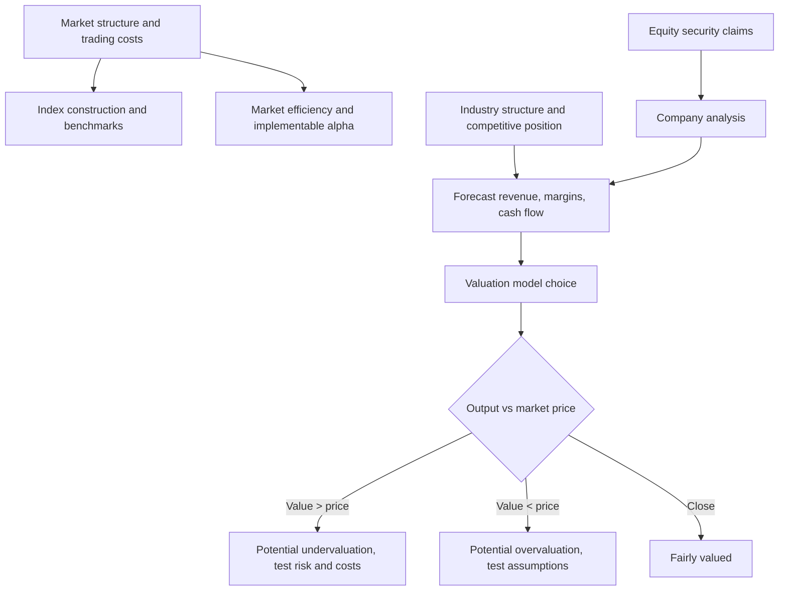
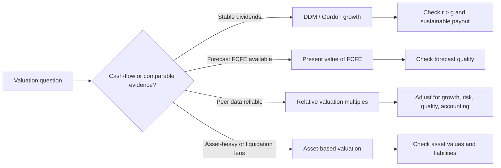

# Equity Investments MOC

> **一句话核心**：理解股票市场结构、行业公司分析和权益估值工具。

---

## 1. 科目定位

- **考试权重**：11-14%
- **官方模块数**：8
- **主线框架**：界定市场与行业 -> 分析公司竞争力 -> 选择估值模型 -> 做敏感性判断
- **使用方式**：先从官方模块导航进入，再用编号知识树做主动回忆，最后用公式/陷阱清单做考前压缩。

## 2. 官方模块导航

| 编号 | 官方 Module | 难度 | 必考点 | 模块链接 |
|---|---|---|---|---|
| M01 | Market Organization and Structure | 计算+解释 | Introduction / The Functions of the Financial System | [[M01-Market-Organization-and-Structure]] |
| M02 | Security Market Indexes | 计算+解释 | Introduction / Index Definition and Calculations of Value and Returns | [[M02-Security-Market-Indexes]] |
| M03 | Market Efficiency | 概念+应用 | Introduction / The Concept of Market Efficiency | [[M03-Market-Efficiency]] |
| M04 | Overview of Equity Securities | 计算+解释 | Importance of Equity Securities / Characteristics of Equity Securities | [[M04-Overview-of-Equity-Securities]] |
| M05 | Company Analysis: Past and Present | 概念+应用 | Introduction / Company Research Reports | [[M05-Company-Analysis-Past-and-Present]] |
| M06 | Industry and Competitive Analysis | 概念+应用 | Introduction / Uses of Industry Analysis | [[M06-Industry-and-Competitive-Analysis]] |
| M07 | Company Analysis: Forecasting | 概念+应用 | Introduction / Forecast Objects, Principles, and Approaches | [[M07-Company-Analysis-Forecasting]] |
| M08 | Equity Valuation: Concepts and Basic Tools | 计算+解释 | Introduction / Estimated Value and Market Price | [[M08-Equity-Valuation-Concepts-and-Basic-Tools]] |

## 3. 核心知识树

```text
Equity Investments (11-14%)
├─ 1. Market Organization and Structure
│  ├─ 1.1 市场功能：资本配置、价格发现、流动性、风险转移；判断 primary market vs secondary market 的现金流去向。
│  ├─ 1.2 市场结构：order-driven / quote-driven / brokered market；看谁提供流动性、谁承担 inventory risk。
│  ├─ 1.3 订单与执行：market order 重成交、limit order 控价格、stop order 触发后变成交指令；考点是 price risk vs execution risk。
│  └─ 1.4 杠杆交易：long margin 与 short sale 都放大收益/亏损；先画 loan/equity，再套 margin call price。
├─ 2. Security Market Indexes
│  ├─ 2.1 指数构建流程：target market -> security selection -> weighting -> rebalancing -> reconstitution。
│  ├─ 2.2 加权方法：price-weighted 受高价股影响；equal-weighted 受小市值/再平衡影响；value-weighted 受大市值影响。
│  ├─ 2.3 指数收益：price return 排除 income；total return 假设 income reinvested。
│  └─ 2.4 除数调整：拆股或成分变动时保持指数连续，不代表投资收益。
├─ 3. Market Efficiency
│  ├─ 3.1 信息集：weak = 历史价量；semi-strong = 公开信息；strong = 公开+私有信息。
│  ├─ 3.2 判断标准：有效性不是价格不变，而是 after costs 难以持续赚 abnormal return。
│  ├─ 3.3 异常与限制：anomalies 可能来自行为偏差、风险补偿、数据挖掘或交易成本。
│  └─ 3.4 策略含义：越接近 semi-strong，主动基本面研究越难持续胜出，但不等于所有研究无价值。
├─ 4. Overview of Equity Securities
│  ├─ 4.1 普通股：剩余索取权、投票权、股息不固定、清算顺位低但上行不封顶。
│  ├─ 4.2 优先股：股息/清算优先，常有 cumulative、callable、putable、participating 等条款。
│  ├─ 4.3 公开 vs 私募：流动性、披露、治理、估值折扣和 due diligence 要分开判断。
│  └─ 4.4 跨境权益：depositary receipts 改变交易便利性，不消除汇率、治理、结算和国家风险。
├─ 5. Company Analysis: Past and Present
│  ├─ 5.1 业务画像：收入模式、客户经济学、成本结构、资本密集度、管理层资本配置纪律。
│  ├─ 5.2 财务质量：利润率、周转率、ROE、现金转换、资产负债表韧性；用 FSA 数据但服务估值假设。
│  ├─ 5.3 历史归因：区分 normalized vs transitory performance，不能把一次性增长直接外推。
│  └─ 5.4 研究报告逻辑：business description -> industry position -> forecast -> valuation -> risks/catalysts。
├─ 6. Industry and Competitive Analysis
│  ├─ 6.1 行业边界：按产品、客户、地理、价值链界定 peer group；边界错则倍数和份额判断都错。
│  ├─ 6.2 生命周期：embryonic/growth/shakeout/mature/decline 影响增长、利润率、再投资和估值倍数。
│  ├─ 6.3 竞争力量：进入壁垒、替代品、买方/供应商力量、竞争强度决定定价能力。
│  └─ 6.4 公司相对位置：成本优势、差异化、网络效应、转换成本解释可持续 ROIC。
├─ 7. Company Analysis: Forecasting
│  ├─ 7.1 预测链条：revenue -> margin -> earnings/cash flow -> working capital/capex -> balance sheet needs。
│  ├─ 7.2 方法选择：top-down 适合宏观/行业驱动，bottom-up 适合单位经济和运营驱动清晰的公司。
│  ├─ 7.3 增长约束：`g = retention ratio x ROE` 是可持续增长校验，不是机械预测器。
│  └─ 7.4 情景纪律：base/upside/downside 必须绑定关键假设、催化剂和风险。
├─ 8. Equity Valuation: Concepts and Basic Tools
│  ├─ 8.1 估值入口：market price vs intrinsic value；投资判断看 mispricing 是否足以覆盖风险和成本。
│  ├─ 8.2 DDM/Gordon：稳定分红、长期 `r > g`、股息与增长可持续时使用；`P0 = D1/(r-g)`。
│  ├─ 8.3 Justified multiples：P/E、P/B、P/S 把 payout、ROE、margin、growth、required return 连成基本面逻辑。
│  └─ 8.4 Relative valuation：先找真可比公司，再统一 trailing/forward、会计口径、资本结构和周期位置。
```

## 核心图解





## 4. 跨模块依赖关系

### Equity 内部依赖图

```text
M01 市场结构/交易成本
├─> M02 指数构建：流动性、可交易性、价格源影响指数代表性和复制成本
├─> M03 市场效率：信息流、交易摩擦和套利成本决定 abnormal return 是否可持续
└─> M08 估值执行：bid-ask、market impact、short constraints 影响 mispricing 可实现性

M04 权益证券权利
├─> M05 公司分析：claim priority、voting rights、preferred terms 改变现金流与治理解释
└─> M08 估值模型：common 用 residual cash flow/price multiples，preferred 更像固定股息 claim

M06 行业竞争结构
├─> M07 预测：行业生命周期、供需、定价能力决定 revenue growth、margin、capex 和 horizon
└─> M08 估值：peer group、normalized earnings、terminal growth 和 justified multiples 的来源

M05 历史与当前公司质量
└─> M07 预测
   └─> M08 DDM/Multiples：预测的 dividend、earnings、book value、sales、EBITDA 进入估值
```

### 跨科目接口表

| Equity 节点 | 依赖/输出到 | 具体接口 | 考试判断 |
|---|---|---|---|
| M01 market organization | PM / Ethics | best execution、transaction costs、market quality | 交易机制题不要只背定义，要判断客户执行结果和成本。 |
| M02 security indexes | PM / Quant | benchmark、market proxy、index return、rebalancing | 指数是 PM 绩效评估的基准，也是 Quant return series 的来源。 |
| M03 efficiency | PM / Behavioral | active vs passive、anomalies、limits to arbitrage | 半强有效不等于价格永远正确，而是公开信息难稳定套利。 |
| M05 company analysis | FSA / Corporate Issuers | ROE、margin、turnover、leverage、capital allocation | FSA 是证据层，Equity 把证据转成 forecast 和 valuation。 |
| M06 industry analysis | Economics / Corporate Issuers | business cycle、industry life cycle、pricing power、reinvestment | 行业阶段决定增长与资本需求，不能孤立用历史增长。 |
| M07 forecasting | Quant / FSA / Corporate | scenario analysis、sustainable growth、working capital、capex | 预测必须和财务报表、资本预算、营运资本联动。 |
| M08 valuation | Corporate / FI / PM | WACC/required return、capital structure、enterprise value、portfolio decision | DDM、multiples 和 EV/EBITDA 都要匹配资本结构与风险口径。 |

## 5. 核心对比专题

| 重要性 | 对比项 | 英文 | 中文解释 | 考试判断 |
|---|---|---|---|---|
| ⭐⭐⭐ | 概念 vs 应用 | definition vs application | 先确认官方定义，再放入题干情境判断。 | 概念题也要能说出适用条件和例外。 |
| ⭐⭐⭐ | 计算 vs 解释 | calculation vs interpretation | 数值只是中间结果，答案要解释方向、含义和限制。 | 凡是 calculate and interpret 都不能只算。 |
| ⭐⭐ | 静态知识 vs 决策流程 | static knowledge vs decision process | 把每个模块压缩成输入 -> 工具 -> 输出 -> 陷阱。 | 流程化比孤立背诵更抗干扰。 |
| ⭐⭐⭐ | 英文识题 vs 中文理解 | English trigger vs Chinese explanation | 英文用于识别题干，中文用于确认真正含义。 | 避免看到熟词就按直觉作答。 |
| ⭐⭐ | 本模块 vs 跨模块 | single module vs cross-module use | 同一公式/概念可能在估值、风险、伦理或报表中换场景出现。 | 错题要回填到 MOC 节点。 |

## 6. 公式与框架速查

### M01-M03 市场、交易与指数

| 指标 | 公式 | 知识树节点 | 考试说明 |
|------|------|------------|----------|
| Long margin leverage | `Position value / investor equity` | `1.4` | leverage 越高，price drop 对 equity 的冲击越大。 |
| Initial margin | `Investor equity / purchase value` | `1.4` | 先分清自有资金、借款和证券市值。 |
| Maintenance margin | `Equity / market value` | `1.4` | 低于要求触发 margin call。 |
| Margin call price, long | `Loan / [Shares x (1 - maintenance margin)]` | `1.4` | 【考纲重点】long 题先算 loan，再把 equity 写成 `shares x P - loan`。 |
| Short sale equity | `Initial sale proceeds + margin deposit - current market value` | `1.4` | short 的 liability 是回补股票的现值。 |
| Margin call price, short | `(Initial sale proceeds + initial margin deposit) / [Shares x (1 + maintenance margin)]` | `1.4` | 【考纲重点】空头价格上涨才危险。 |
| Short sale return | `(Initial proceeds - repurchase cost - costs + income on collateral - dividends paid) / initial equity` | `1.4` | 注意股息由空头支付。 |
| Bid-ask spread | `Ask price - bid price` | `1.3` | 交易成本和流动性 tightness 的直接指标。 |
| Price-weighted index | `Σ Price_i / Divisor` | `2.2` | 高价股权重大；拆股后要调 divisor。 |
| Price-weighted divisor | `Divisor = Σ adjusted prices / index value before change` | `2.4` | 【考纲重点】保持指数连续，不创造收益。 |
| Equal-weighted index return | `Σ R_i / N` | `2.2` | 再平衡使小公司影响更大，turnover 更高。 |
| Value-weighted index return | `Σ w_i R_i` | `2.2` | `w_i` 通常用 market cap 或 float-adjusted market cap。 |
| Market-cap weight | `Market cap_i / Σ Market cap_i` | `2.2` | 大市值股票驱动指数表现。 |
| Float-adjusted market cap | `Price x shares outstanding x float factor` | `2.2` | 排除不可自由交易股份。 |
| Price return | `(Ending price - beginning price) / beginning price` | `2.3` | 不含股息/利息收入。 |
| Total return | `(Ending value + income - beginning value) / beginning value` | `2.3` | 与 price return 区分；常作为投资者真实收益口径。 |
| Active return test | `Portfolio return - benchmark return` | `3.4` | 市场效率题看 after-cost abnormal return 是否可持续。 |

### M07-M08 预测与估值

| 指标 | 公式 | 知识树节点 | 考试说明 |
|------|------|------------|----------|
| Sustainable growth | `g = retention ratio x ROE` | `7.3` | growth 必须有留存收益和 ROE 支撑。 |
| Retention ratio | `1 - dividend payout ratio` | `7.3` | payout 越高，其他条件不变可持续增长越低。 |
| Gordon growth model | `P_0 = D_1/(r - g)` | `8.2` | 必须 `r > g` 且稳定永续增长。 |
| Expected return from GGM | `r = D_1/P_0 + g` | `8.2` | dividend yield + capital gains yield。 |
| Implied growth | `g = r - D_1/P_0` | `8.2` | 从市场价格反推增长假设。 |
| Dividend yield | `D_1/P_0` | `8.2` | total expected return 的 income component。 |
| Capital gains yield | `g` | `8.2` | Gordon 模型下价格增长率等于股息增长率。 |
| Justified leading P/E | `P_0/E_1 = payout ratio/(r - g)` | `8.3` | 【考纲重点】与 payout、risk、growth 绑定。 |
| Justified trailing P/E | `P_0/E_0 = payout ratio x (1 + g)/(r - g)` | `8.3` | trailing 分母多一个 `1 + g`。 |
| Justified P/B | `P_0/B_0 = (ROE - g)/(r - g)` | `8.3` | ROE 高于 required return 才支持高 P/B。 |
| Justified P/S | `P_0/S_0 = net profit margin x P_0/E_0` | `8.3` | sales multiple 必须用 margin 校验。 |
| P/E | `Price per share / EPS` | `8.4` | 适合盈利相对正常、会计可比的公司。 |
| P/B | `Price per share / BVPS` | `8.4` | 金融、资产型公司常见；ROE 是关键解释变量。 |
| P/S | `Price per share / sales per share` | `8.4` | 可用于暂时亏损公司，但必须看 margin potential。 |
| P/CF | `Price per share / cash flow per share` | `8.4` | 对会计 earnings 质量差异较敏感时有用。 |
| Enterprise value | `Market value of equity + debt + preferred + minority interest - cash and investments` | `8.4` | enterprise multiples 的分子口径。 |
| EV/EBITDA | `Enterprise value / EBITDA` | `8.4` | 更适合比较资本结构不同但经营类似的公司。 |

### 考纲范围标记

| 标记 | 内容 |
|------|------|
| 【考纲重点】 | Margin/short sale、index weighting and return、company forecasting drivers、Gordon model、justified multiples、relative valuation ratios |
| 【考纲内但无核心公式】 | Market organization, market efficiency, equity security types, industry analysis 多为概念、机制和适用性判断 |
| 【超纲/扩展】 | 多阶段 DDM 全量建模、FCFE/FCFF 估值完整推导、复杂残余收益模型不作为 Level I 必背公式 |

---

## 7. 高频考试陷阱

| ❌ 错误理解 | ✅ 正确理解 | 高频场景 |
|---|---|---|
| ❌ limit order 比 market order 更“安全” | ✅ 它只是控制价格，不控制成交 | 按官方定义和 LOS 口径核验。 |
| ❌ price-weighted index 更代表市场整体 | ✅ 它更偏向高价股 | 按官方定义和 LOS 口径核验。 |
| ❌ total return index 和 price return index 基本一样 | ✅ 前者包含分红再投资 | 按官方定义和 LOS 口径核验。 |
| ❌ semi-strong efficiency 表示基本面分析毫无价值 | ✅ 只是说公开信息难持续带来超额收益 | 按官方定义和 LOS 口径核验。 |
| ❌ preferred stock 就是 bond | ✅ 它有 mixed characteristics，不等于债券 | 按官方定义和 LOS 口径核验。 |
| ❌ 低 P/E 一定低估 | ✅ 也可能是增长差、风险高或会计质量差 | 按官方定义和 LOS 口径核验。 |
| ❌ DDM 所有公司都适用 | ✅ dividend policy 不稳定时不合适 | 按官方定义和 LOS 口径核验。 |
| ❌ higher growth 一定意味着更高价值 | ✅ 还要看 required return 和可持续性 | 按官方定义和 LOS 口径核验。 |
| ❌ EV/EBITDA 一定优于 P/E | ✅ 只是适用场景不同 | 按官方定义和 LOS 口径核验。 |
| ❌ 公司分析和估值是两件独立事 | ✅ 真正考试常把两者绑在一起考 | 按官方定义和 LOS 口径核验。 |

## 8. 通用分析框架

### 框架1：估值模型选择决策树

1. 先判断题目要的是 `intrinsic value` 还是 `relative value`。
2. 若公司有稳定、可持续、可预测分红，且长期 `r > g`：用 `P_0 = D_1/(r - g)`；若题目给 price 和 dividend，则反推 `r` 或 `g`。
3. 若题目给 earnings/book/sales 和同业数据：用 multiples，但先统一 trailing vs forward、会计口径、周期位置和资本结构。
4. 若要求 justified multiple：不要直接套 peer multiple，先用 fundamentals：P/E 看 payout/r/g，P/B 看 ROE/r/g，P/S 看 margin 和 P/E。
5. 若模型输出与市场价比较：只有当估计价值、交易成本、风险和信息可信度都支持时，才能推 undervalued/overvalued。

### 框架2：公司分析到预测的执行链

1. 从 M05 抽取历史证据：收入来源、利润率、周转、杠杆、现金转换和一次性项目。
2. 用 M06 判断行业条件：生命周期、供需、竞争力量、监管和 pricing power。
3. 建立 M07 预测：revenue growth -> margin -> earnings/cash flow -> working capital/capex -> financing need。
4. 用 `g = retention ratio x ROE` 检查增长是否可持续；若增长高但 ROE/留存/外部融资不支持，调低假设或提高风险。
5. 将预测输入 M08：稳定分红走 GGM；同业可比且口径可靠走 multiples；两者冲突时解释 growth/risk/quality 差异。

### 框架3：指数与市场效率题决策树

1. 看到 index 题，先识别 weighting：price-weighted 看高价股，equal-weighted 看平均个股与再平衡，value-weighted 看大市值。
2. 再识别 return 口径：price return 不含 income，total return 含 income reinvestment。
3. 有 split/成分替换时先调 divisor，避免把机械连续性误判为收益。
4. 看到 efficiency 题，先识别信息类型：historical -> weak，public -> semi-strong，private -> strong。
5. 最后判断 implication：是否还能 after costs 持续赚 abnormal return，而不是简单说 active management 一定无效。

---

## 9. 学习路径建议

- **第一轮：结构对齐**。按模块顺序读官方结构和 LOS，不急着刷难题。
- **第二轮：主动回忆**。遮住解释，只看编号知识树说出定义、公式和陷阱。
- **第三轮：题目驱动**。把错题回填到对应模块和 MOC 节点，形成可复用 fix rule。
- **考前压缩**。只保留高频术语、公式/框架、易错点、跨模块依赖和错题触发点。

## 10. Legacy 内容治理

- 本 MOC 已优先吸收 `_legacy/2026-05-26-official-sync/` 中的中文解释、公式、陷阱和框架。
- `_legacy` 只作为补强来源，不作为最终学习入口；若与官方 2026 LOS 冲突，以 registry 和官方 Topic Outline 为准。
