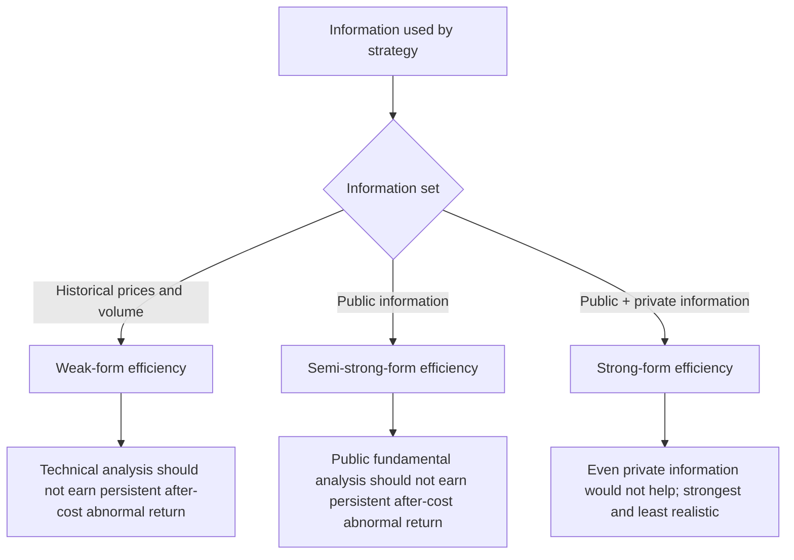
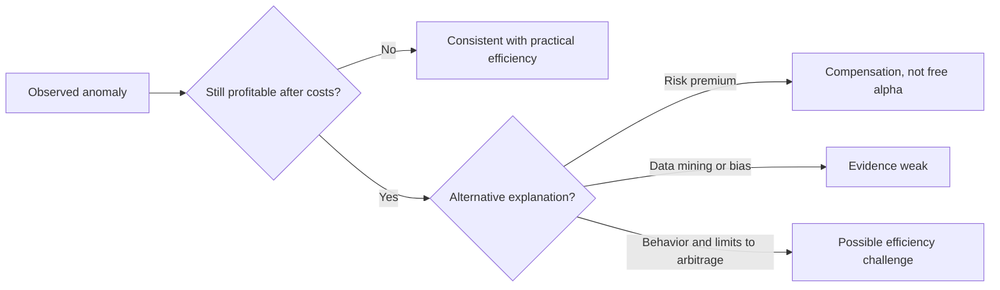

# M03: Market Efficiency

> **模块定位**：理解股票市场结构、行业公司分析和权益估值工具。 本模块聚焦 **Market Efficiency**，要求把官方 LOS 转成可执行的判断、计算或解释动作。

---

## Official Module Structure

- Learning Outcomes: Market Efficiency
- 3.01 | Introduction
- 3.02 | The Concept of Market Efficiency
- 3.03 | Factors Affecting Market Efficiency Including Trading Costs
- 3.04 | Forms of Market Efficiency
- 3.05 | Implications of the Efficient Market Hypothesis
- 3.06 | Market Pricing Anomalies - Time Series and Cross-Sectional
- 3.07 | Other Anomalies, Implications of Market Pricing Anomalies
- 3.08 | Behavioral Finance
- 3.09 | Summary

## Learning Outcome Statements

1. describe market efficiency and related concepts, including their importance to investment practitioners
2. contrast market value and intrinsic value
3. explain factors that affect a market’s efficiency
4. contrast weak-form, semi-strong-form, and strong-form market efficiency
5. explain the implications of each form of market efficiency for fundamental analysis, technical analysis, and the choice between active and passive portfolio management
6. describe market anomalies
7. describe behavioral finance and its potential relevance to understanding market anomalies

---

## 1. 模块定位

### 3.1 学习任务
- **核心问题**：考试希望你用 `Market Efficiency` 解释什么、计算什么、比较什么，或判断什么。
- **输入信息**：题干事实、数据、假设、时间口径、单位、约束条件。
- **输出结果**：中文结论 + 英文关键术语 + 必要公式/框架 + 限制条件。

### 3.2 考试角色
- **难度类型**：概念+应用。
- **高频题型**：定义辨析、情境判断、计算解释、表格补数、跨模块比较。
- **答题原则**：先判断 LOS 动词，再选择工具；计算后必须解释结果含义。

### 3.3 关键英文术语
- **Market Efficiency（核心术语）**：本模块关键词，用于定位 LOS、题干条件和解题动作。
- **Introduction（核心术语）**：本模块关键词，用于定位 LOS、题干条件和解题动作。
- **The Concept of Market Efficiency（核心术语）**：本模块关键词，用于定位 LOS、题干条件和解题动作。
- **Factors Affecting Market Efficiency Including Trading Costs（核心术语）**：本模块关键词，用于定位 LOS、题干条件和解题动作。
- **Forms of Market Efficiency（核心术语）**：本模块关键词，用于定位 LOS、题干条件和解题动作。
- **Implications of the Efficient Market Hypothesis（核心术语）**：本模块关键词，用于定位 LOS、题干条件和解题动作。
- **Market Pricing Anomalies - Time Series and Cross-Sectional（核心术语）**：本模块关键词，用于定位 LOS、题干条件和解题动作。
- **Other Anomalies, Implications of Market Pricing Anomalies（核心术语）**：本模块关键词，用于定位 LOS、题干条件和解题动作。

## 2. 官方 LOS 对应学习目标

| LOS | 官方要求 | 中文学习动作 | 做题输出 |
|---|---|---|---|
| 3.1 | describe market efficiency and related concepts, including their importance to investment practitioners | 描述定义、流程和适用场景 | 写出结论、依据、公式口径和限制条件。 |
| 3.2 | contrast market value and intrinsic value | 识别概念、解释机制并应用到题干。 | 写出结论、依据、公式口径和限制条件。 |
| 3.3 | explain factors that affect a market’s efficiency | 解释机制、原因和后果 | 写出结论、依据、公式口径和限制条件。 |
| 3.4 | contrast weak-form, semi-strong-form, and strong-form market efficiency | 识别概念、解释机制并应用到题干。 | 写出结论、依据、公式口径和限制条件。 |
| 3.5 | explain the implications of each form of market efficiency for fundamental analysis, technical analysis, and the choice between active and passive portfolio management | 解释机制、原因和后果 | 写出结论、依据、公式口径和限制条件。 |
| 3.6 | describe market anomalies | 描述定义、流程和适用场景 | 写出结论、依据、公式口径和限制条件。 |
| 3.7 | describe behavioral finance and its potential relevance to understanding market anomalies | 描述定义、流程和适用场景 | 写出结论、依据、公式口径和限制条件。 |

## 3. 核心知识树

```text
3. Market Efficiency
├─ 3.1 信息集与有效形式 (Information set and forms)
│  ├─ 3.1.1 Weak form：价格反映历史价格和成交量；技术分析难以持续 after-cost 获利。
│  ├─ 3.1.2 Semi-strong form：价格反映所有公开信息；公开财报、公告和新闻应快速进入价格。
│  ├─ 3.1.3 Strong form：价格反映公开和私有信息；现实中通常因 insider trading 证据而最难成立。
│  └─ 3.1.4 判断顺序：先识别 information set，再判断 abnormal return 是否可持续。
├─ 3.2 启示 (Implications)
│  ├─ 3.2.1 有效性含义：不是价格永远正确，而是无法系统性利用信息赚取超额收益。
│  ├─ 3.2.2 异常解释：可能来自行为偏差、风险补偿、数据挖掘、交易成本或套利限制。
│  ├─ 3.2.3 主动/被动：市场越有效，被动投资越有吸引力；低效率市场给主动管理更多空间。
│  └─ 3.2.4 考试陷阱：看到 anomaly 不要立刻否定效率，要问是否可持续、可交易、扣除成本后仍有效。
```

## 核心图解





## 4. 知识点详解

### 3.1 信息集与有效形式 (Information set and forms)
- **弱式有效 (weak form)**：当前价格已反映所有历史价格与成交量信息 — 技术分析无法获得超额收益
- **半强式有效 (semi-strong form)**：当前价格已反映所有公开信息 — 基本面分析无法获得超额收益
- **强式有效 (strong form)**：当前价格已反映所有公开加私有信息 — 内幕交易也无法获得超额收益

### 3.2 启示 (Implications)
- **交易成本 (transaction costs)** 与**套利限制 (limits to arbitrage)** 使实际市场无法完全有效
- **异常现象 (anomalies)** 可能源于**行为偏差 (behavior)**、**风险溢价 (risk)**、**数据挖掘 (data mining)** 或**市场摩擦 (market friction)**
- **市场效率程度指导主动与被动投资选择 (active vs passive choice)**

## 5. 关键公式与计算框架

### 5.1 市场效率判断框架

| 判断对象 | 识别信息 | 对应有效形式 | 考试输出 |
|---|---|---|---|
| Technical analysis | 历史价格、成交量 | Weak form | 若 weak-form efficient，技术分析难持续赚取 abnormal return。 |
| Fundamental/public news analysis | 财报、公告、新闻、公开研究 | Semi-strong form | 若 semi-strong efficient，公开信息应快速反映在价格中。 |
| Insider/private information | 非公开重大信息 | Strong form | strong form 要求私有信息也无法带来超额收益；现实最难成立。 |
| Active manager skill | 扣费后持续跑赢基准 | Efficiency implication | 需要区分 skill、luck、risk exposure 和 data mining。 |
| Anomaly | 规模、价值、动量、日历效应等 | Challenge/qualification | 先检查交易成本、风险补偿和样本偏差。 |

### 5.2 轻公式与流程

| 工具 | 表达 | 用法 |
|---|---|---|
| Abnormal return | `Actual return - expected return` | expected return 可来自 CAPM 或合适 benchmark。 |
| Active return | `Portfolio return - benchmark return` | 判断主动管理表现时要扣除费用和风险差异。 |
| 三步判断 | `information set -> efficiency form -> after-cost implication` | 避免只背 weak/semi-strong/strong 名称。 |

## 6. 常见考点与解题思路

| 重要性 | 考点 | 解题动作 |
|---|---|---|
| ⭐⭐⭐ | 3.1 Introduction | 先定位题干触发词，再写公式/框架，最后解释结果或判断陷阱。 |
| ⭐⭐⭐ | 3.2 The Concept of Market Efficiency | 先定位题干触发词，再写公式/框架，最后解释结果或判断陷阱。 |
| ⭐⭐ | 3.3 Factors Affecting Market Efficiency Including Trading Costs | 先定位题干触发词，再写公式/框架，最后解释结果或判断陷阱。 |
| ⭐⭐ | 3.4 Forms of Market Efficiency | 先定位题干触发词，再写公式/框架，最后解释结果或判断陷阱。 |
| ⭐ | 3.5 Implications of the Efficient Market Hypothesis | 先定位题干触发词，再写公式/框架，最后解释结果或判断陷阱。 |

### 6.9 ⭐⭐ Legacy 考点补充

### 6.1 核心内容

- **三步判断法**：① 识别信息类型（历史/公开/私有）→ ② 匹配有效形式（weak/semi-strong/strong）→ ③ 判断主动策略是否仍有 edge
- **异常现象归类**：calendar effect、momentum effect、value effect — 判断它们违反哪一形式

## 7. 易错点与考试陷阱

| ❌ 错误理解 | ✅ 正确理解 | 为什么错 / 考试提醒 |
|---|---|---|
| ❌ 忽略：有效 ≠ 价格永远正确：有效是指扣除成本后难以持续获得超额收益，而非价格不波动 | ✅ 有效 ≠ 价格永远正确：有效是指扣除成本后难以持续获得超额收益，而非价格不波动 | 题干通常会用口径、顺序、定义边界或例外条件设置干扰。 |
| ❌ 忽略：半强式有效不意味着基本面分析完全无用：只是公开信息难以产生持续超额收益 | ✅ 半强式有效不意味着基本面分析完全无用：只是公开信息难以产生持续超额收益 | 题干通常会用口径、顺序、定义边界或例外条件设置干扰。 |
| ❌ 忽略：异常现象不等于市场无效：可能是风险补偿、数据挖掘或幸存者偏差 | ✅ 异常现象不等于市场无效：可能是风险补偿、数据挖掘或幸存者偏差 | 题干通常会用口径、顺序、定义边界或例外条件设置干扰。 |

## 8. 跨模块关联

| 输出概念 | 连接模块 | 怎么连接 | 做题提醒 |
|---|---|---|---|
| Benchmark / abnormal return | [[M02-Security-Market-Indexes]] | 市场效率判断需要可比 benchmark 和投资 universe。 | 选错指数会错判超额收益。 |
| Trading costs / short constraints | [[M01-Market-Organization-and-Structure]] | 套利能否实施取决于市场摩擦。 | 有 mispricing 不等于有可实现利润。 |
| Public company disclosure | [[M05-Company-Analysis-Past-and-Present]] | 半强有效假设公开财务信息已快速反映。 | 基本面分析价值取决于信息处理能力和成本。 |
| Active vs passive | Portfolio Management | 市场效率影响组合管理方式和费用合理性。 | 考试常问 implication，不只问定义。 |


## 9. 复习与刷题提示

- 第一轮：按 `Official Module Structure` 逐节过概念，把每个 LOS 改写成中文任务。
- 第二轮：对照 `## 3. 核心知识树` 做主动回忆，能说出每个编号节点的定义、公式/框架和陷阱。
- 第三轮：刷题后记录错因，如果暴露 MOC 缺口，按 `docs/moc-auto-patch-workflow.md` 进入补强流程。
- 考前：只看术语、公式/框架、易错点和本模块错题，避免重新铺开所有正文。

## 10. Legacy Notes Integrated

- **主要 legacy 来源**：`M03-Market-Efficiency.md` (high, 0.423)
- **整合规则**：高置信内容已合入 `知识点详解`、`公式与计算框架`、`常见考点`、`易错陷阱` 和 `跨模块关联`。
- **边界**：若 legacy 内容与 2026 官方 LOS 冲突，以官方 module 名称、LOS 和 registry 为准。
