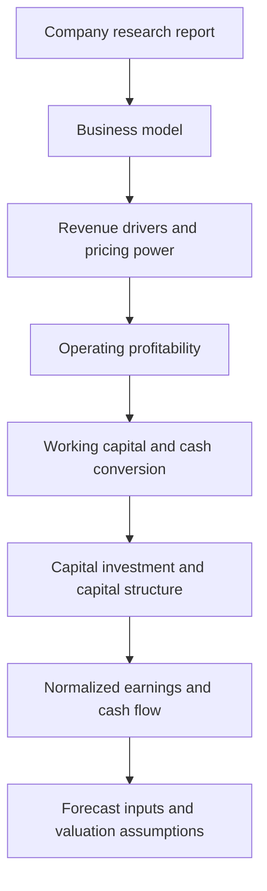
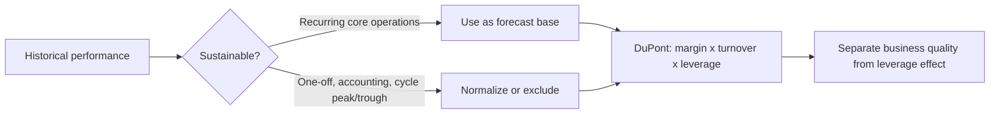

# M05: Company Analysis: Past and Present

> **模块定位**：理解股票市场结构、行业公司分析和权益估值工具。 本模块聚焦 **Company Analysis: Past and Present**，要求把官方 LOS 转成可执行的判断、计算或解释动作。

---

## Official Module Structure

- Learning Outcomes: Company Analysis: Past and Present
- 5.01 | Introduction
- 5.02 | Company Research Reports
- 5.03 | Determining the Business Model
- 5.04 | Revenue Analysis
- 5.05 | Operating Profitability and Working Capital Analysis
- 5.06 | Capital Investments and Capital Structure

## Learning Outcome Statements

1. describe the elements that should be covered in a thorough company research report
2. determine a company’s business model
3. evaluate a company’s revenue and revenue drivers, including pricing power
4. evaluate a company’s operating profitability and working capital using key measures
5. evaluate a company’s capital investments and capital structure

---

## 1. 模块定位

### 5.1 学习任务
- **核心问题**：考试希望你用 `Company Analysis: Past and Present` 解释什么、计算什么、比较什么，或判断什么。
- **输入信息**：题干事实、数据、假设、时间口径、单位、约束条件。
- **输出结果**：中文结论 + 英文关键术语 + 必要公式/框架 + 限制条件。

### 5.2 考试角色
- **难度类型**：概念+应用。
- **高频题型**：定义辨析、情境判断、计算解释、表格补数、跨模块比较。
- **答题原则**：先判断 LOS 动词，再选择工具；计算后必须解释结果含义。

### 5.3 关键英文术语
- **Company Analysis: Past and Present（核心术语）**：本模块关键词，用于定位 LOS、题干条件和解题动作。
- **Company Analysis（核心术语）**：本模块关键词，用于定位 LOS、题干条件和解题动作。
- **Introduction（核心术语）**：本模块关键词，用于定位 LOS、题干条件和解题动作。
- **Company Research Reports（核心术语）**：本模块关键词，用于定位 LOS、题干条件和解题动作。
- **Determining the Business Model（核心术语）**：本模块关键词，用于定位 LOS、题干条件和解题动作。
- **Revenue Analysis（核心术语）**：本模块关键词，用于定位 LOS、题干条件和解题动作。
- **Operating Profitability and Working Capital Analysis（核心术语）**：本模块关键词，用于定位 LOS、题干条件和解题动作。
- **Capital Investments and Capital Structure（核心术语）**：本模块关键词，用于定位 LOS、题干条件和解题动作。

## 2. 官方 LOS 对应学习目标

| LOS | 官方要求 | 中文学习动作 | 做题输出 |
|---|---|---|---|
| 5.1 | describe the elements that should be covered in a thorough company research report | 描述定义、流程和适用场景 | 写出结论、依据、公式口径和限制条件。 |
| 5.2 | determine a company’s business model | 根据条件判断正确结论 | 写出结论、依据、公式口径和限制条件。 |
| 5.3 | evaluate a company’s revenue and revenue drivers, including pricing power | 评价优缺点、限制和决策含义 | 写出结论、依据、公式口径和限制条件。 |
| 5.4 | evaluate a company’s operating profitability and working capital using key measures | 评价优缺点、限制和决策含义 | 写出结论、依据、公式口径和限制条件。 |
| 5.5 | evaluate a company’s capital investments and capital structure | 评价优缺点、限制和决策含义 | 写出结论、依据、公式口径和限制条件。 |

## 3. 核心知识树

```text
5. Company Analysis: Past and Present
├─ 5.1 了解业务 (Understand the business)
│  ├─ 5.1.1 Business model：收入来源、客户群、价值主张、渠道、成本结构和资本密集度。
│  ├─ 5.1.2 Competitive position：市场份额、差异化、成本优势、转换成本和管理层执行力。
│  └─ 5.1.3 Research report：business description -> industry context -> financial analysis -> valuation -> risks/catalysts。
├─ 5.2 盈利能力与韧性 (Profitability and resilience)
│  ├─ 5.2.1 Profitability：gross/operating/net margin、ROA、ROE；要解释驱动因素而非只看高低。
│  ├─ 5.2.2 DuPont：`ROE = net margin x asset turnover x financial leverage`，拆出经营、效率和杠杆来源。
│  └─ 5.2.3 Resilience：现金流质量、债务期限、流动性、客户集中度和周期敏感性。
├─ 5.3 理性看待历史 (Read history without worshiping it)
│  ├─ 5.3.1 Normalization：剔除一次性项目、周期高低点和会计政策变化。
│  ├─ 5.3.2 Quality of earnings：比较 earnings 与 operating cash flow，识别 accrual 和非经常项目。
│  └─ 5.3.3 Forecast bridge：只有可解释、可持续的历史驱动因素才进入预测。
```

## 核心图解





## 4. 知识点详解

### 5.1 了解业务 (Understand the business)
- **收入模式 (revenue model)**：公司如何赚钱 — 一次性销售、订阅、交易费、广告等
- **客户经济学 (customer economics)**：获客成本 (CAC)、客户生命周期价值 (LTV)、留存率
- **成本结构 (cost structure)**：固定 vs 可变成本比例，影响经营杠杆
- **资本密集度 (capital intensity)**：每单位收入所需资本投入，影响自由现金流

### 5.2 盈利能力与韧性 (Profitability and resilience)
- **盈利能力指标 (profitability)**：ROE、ROA、ROIC、毛利率、营业利润率
- **再投资需求 (reinvestment)**：维护性 vs 增长性资本支出
- **资产负债表韧性 (balance-sheet resilience)**：杠杆率、流动性、偿债能力

### 5.3 理性看待历史 (Read history without worshiping it)
- **正常化 vs 暂时性业绩 (normalized vs transitory)**：区分一次性损益与可持续业绩
- **会计质量 (accounting quality)**：收入确认、折旧政策、准备金水平影响可比性
- **ROE 驱动因素**：通过 DuPont 分解分析利润率、周转率、杠杆的变化

## 5. 关键公式与计算框架

### 5.1 核心内容

| 指标/框架 | 公式或检查点 | 对应节点 | 考试说明 |
|---|---|---|---|
| Gross margin | `Gross profit / revenue` | 5.2.1 | 产品定价能力和成本压力。 |
| Operating margin | `Operating income / revenue` | 5.2.1 | 经营成本结构和规模效应。 |
| Net margin | `Net income / revenue` | 5.2.1 | 受融资、税和非经营项目影响。 |
| ROA | `Net income / average assets` | 5.2.1 | 资产盈利效率。 |
| ROE | `Net income / average equity` | 5.2.1 | 可能被杠杆放大。 |
| DuPont ROE | `Net margin x asset turnover x financial leverage` | 5.2.2 | 区分利润率、周转率和杠杆驱动。 |
| ROIC | `NOPAT / invested capital` | 5.2.1 | 与资本成本比较，判断价值创造。 |
| Earnings quality check | `Operating cash flow vs net income` | 5.3.2 | earnings 高但 cash flow 弱要谨慎。 |
| Normalization checklist | 一次性项目、周期位置、会计政策、重组费用 | 5.3.1 | 历史数据要先清洗再预测。 |

## 6. 常见考点与解题思路

| 重要性 | 考点 | 解题动作 |
|---|---|---|
| ⭐⭐⭐ | 5.1 Introduction | 先定位题干触发词，再写公式/框架，最后解释结果或判断陷阱。 |
| ⭐⭐⭐ | 5.2 Company Research Reports | 先定位题干触发词，再写公式/框架，最后解释结果或判断陷阱。 |
| ⭐⭐ | 5.3 Determining the Business Model | 先定位题干触发词，再写公式/框架，最后解释结果或判断陷阱。 |
| ⭐⭐ | 5.4 Revenue Analysis | 先定位题干触发词，再写公式/框架，最后解释结果或判断陷阱。 |
| ⭐ | 5.5 Operating Profitability and Working Capital Analysis | 先定位题干触发词，再写公式/框架，最后解释结果或判断陷阱。 |

### 6.9 ⭐⭐ Legacy 考点补充

### 6.1 核心内容

- **DuPont 分解**：将 ROE 拆解为利润率 × 周转率 × 杠杆，分析变化来源
- **质量 of earnings 判断**：注意非经常性项目、会计估计变更对盈利的影响
- **管理层信号**：资本配置决策（回购 vs 分红 vs 投资）反映管理层信心

## 7. 易错点与考试陷阱

| ❌ 错误理解 | ✅ 正确理解 | 为什么错 / 考试提醒 |
|---|---|---|
| ❌ 忽略：历史增长只有找出驱动因素和可持续性后才有用：不能盲目外推 | ✅ 历史增长只有找出驱动因素和可持续性后才有用：不能盲目外推 | 题干通常会用口径、顺序、定义边界或例外条件设置干扰。 |
| ❌ 忽略：高 ROE 不一定好：可能来自高杠杆而非经营效率 | ✅ 高 ROE 不一定好：可能来自高杠杆而非经营效率 | 题干通常会用口径、顺序、定义边界或例外条件设置干扰。 |
| ❌ 忽略：会计政策差异：不同公司折旧方法、存货计价方法影响可比性 | ✅ 会计政策差异：不同公司折旧方法、存货计价方法影响可比性 | 题干通常会用口径、顺序、定义边界或例外条件设置干扰。 |

## 8. 跨模块关联

| 输出概念 | 连接模块 | 怎么连接 | 做题提醒 |
|---|---|---|---|
| Financial ratios / quality | FSA | 报表数据是证据，Equity 用它判断业务质量和预测输入。 | ratio 高低必须解释驱动。 |
| Business model / management | Corporate Issuers | 管理层资本配置和商业模式影响盈利持续性。 | 好公司不等于好股票。 |
| Normalized earnings | [[M07-Company-Analysis-Forecasting]] | 清洗后的历史业绩才可外推。 | 一次性增长不能直接进入 terminal growth。 |
| Company quality | [[M08-Equity-Valuation-Concepts-and-Basic-Tools]] | 估值倍数要用增长、风险、盈利质量解释。 | 低倍数可能是 deserved discount。 |


## 9. 复习与刷题提示

- 第一轮：按 `Official Module Structure` 逐节过概念，把每个 LOS 改写成中文任务。
- 第二轮：对照 `## 3. 核心知识树` 做主动回忆，能说出每个编号节点的定义、公式/框架和陷阱。
- 第三轮：刷题后记录错因，如果暴露 MOC 缺口，按 `docs/moc-auto-patch-workflow.md` 进入补强流程。
- 考前：只看术语、公式/框架、易错点和本模块错题，避免重新铺开所有正文。

## 10. Legacy Notes Integrated

- **主要 legacy 来源**：`M05-Company-Analysis-Past-and-Present.md` (high, 0.439)
- **整合规则**：高置信内容已合入 `知识点详解`、`公式与计算框架`、`常见考点`、`易错陷阱` 和 `跨模块关联`。
- **边界**：若 legacy 内容与 2026 官方 LOS 冲突，以官方 module 名称、LOS 和 registry 为准。
