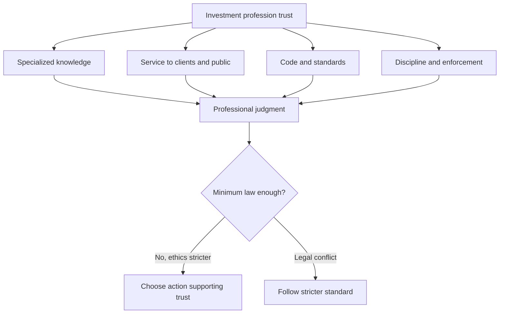

# M01: Ethics and Trust in the Investment Profession

> **模块定位**：用 Code and Standards 判断专业行为、利益冲突、客户责任与合规边界。 本模块聚焦 **Ethics and Trust in the Investment Profession**，要求把官方 LOS 转成可执行的判断、计算或解释动作。

---

## Official Module Structure

- Learning Outcomes: Ethics and Trust in the Investment Profession
- 1.01 | Introduction
- 1.02 | Ethics
- 1.03 | Ethics and Professionalism
- 1.04 | Challenges to Ethical Conduct
- 1.05 | Ethical vs. Legal Standards
- 1.06 | Ethical Decision-Making Frameworks
- 1.07 | Conclusion
- 1.08 | Summary

## Learning Outcome Statements

1. explain ethics
2. describe the role of a code of ethics in defining a profession
3. describe professions and how they establish trust
4. describe the need for high ethical standards in investment management
5. explain professionalism in investment management
6. identify challenges to ethical behavior
7. compare and contrast ethical standards with legal standards
8. describe a framework for ethical decision making

---

## 1. 模块定位

### 1.1 学习任务
- **核心问题**：考试希望你用 `Ethics and Trust in the Investment Profession` 解释什么、计算什么、比较什么，或判断什么。
- **输入信息**：题干事实、数据、假设、时间口径、单位、约束条件。
- **输出结果**：中文结论 + 英文关键术语 + 必要公式/框架 + 限制条件。

### 1.2 考试角色
- **难度类型**：概念+案例判断。
- **高频题型**：定义辨析、情境判断、计算解释、表格补数、跨模块比较。
- **答题原则**：先判断 LOS 动词，再选择工具；计算后必须解释结果含义。

### 1.3 关键英文术语
- **Ethics and Trust in the Investment Profession（核心术语）**：本模块关键词，用于定位 LOS、题干条件和解题动作。
- **Introduction（核心术语）**：本模块关键词，用于定位 LOS、题干条件和解题动作。
- **Ethics（伦理）**：专业行为、客户利益、市场诚信和合规责任的规范体系。
- **Ethics and Professionalism（核心术语）**：本模块关键词，用于定位 LOS、题干条件和解题动作。
- **Challenges to Ethical Conduct（核心术语）**：本模块关键词，用于定位 LOS、题干条件和解题动作。
- **Ethical vs. Legal Standards（核心术语）**：本模块关键词，用于定位 LOS、题干条件和解题动作。
- **Ethical Decision-Making Frameworks（核心术语）**：本模块关键词，用于定位 LOS、题干条件和解题动作。
- **Conclusion（核心术语）**：本模块关键词，用于定位 LOS、题干条件和解题动作。

## 2. 官方 LOS 对应学习目标

| LOS | 官方要求 | 中文学习动作 | 做题输出 |
|---|---|---|---|
| 1.1 | explain ethics | 解释机制、原因和后果 | 写出结论、依据、公式口径和限制条件。 |
| 1.2 | describe the role of a code of ethics in defining a profession | 描述定义、流程和适用场景 | 写出结论、依据、公式口径和限制条件。 |
| 1.3 | describe professions and how they establish trust | 描述定义、流程和适用场景 | 写出结论、依据、公式口径和限制条件。 |
| 1.4 | describe the need for high ethical standards in investment management | 描述定义、流程和适用场景 | 写出结论、依据、公式口径和限制条件。 |
| 1.5 | explain professionalism in investment management | 解释机制、原因和后果 | 写出结论、依据、公式口径和限制条件。 |
| 1.6 | identify challenges to ethical behavior | 识别题干中的关键事实和触发条件 | 写出结论、依据、公式口径和限制条件。 |
| 1.7 | compare and contrast ethical standards with legal standards | 比较相似概念的适用条件与差异 | 写出结论、依据、公式口径和限制条件。 |
| 1.8 | describe a framework for ethical decision making | 描述定义、流程和适用场景 | 写出结论、依据、公式口径和限制条件。 |

## 3. 核心知识树

```text
1. Ethics and Trust in the Investment Profession
├─ 1.1 职业的本质 (Nature of a Profession)
│  ├─ 1.1.1 Profession = specialized knowledge + service to others + code/standards + discipline process。
│  └─ 1.1.2 投资行业靠 trust 运作；损害信任的行为即使短期合法，也会提高资本市场摩擦。
├─ 1.2 道德与法律的边界 (Ethics vs. Law)
│  ├─ 1.2.1 Law 是最低可执行规则；ethics 是判断应不应该做，通常高于最低法律要求。
│  └─ 1.2.2 Stricter standard rule：当地法律、公司规则、CFA Standards 中取更严格行为。
├─ 1.3 受托人心态 (Fiduciary Mindset)
│  ├─ 1.3.1 Client-first：loyalty、prudence、care，不把个人/雇主便利置于客户利益之前。
│  └─ 1.3.2 不是所有题都写 fiduciary，但遇到 suitability、conflict、fair dealing 时要用这种优先级。
├─ 1.4 七条职业行为准则总纲 (Seven Standards Overview)
│  ├─ 1.4.1 Standards I-VII 把 professional integrity 分解为法律/市场/客户/雇主/研究/冲突/CFA 身份责任。
│  └─ 1.4.2 本模块只建判断底座，具体违规定位在 M03 和 M05 中完成。
```

## 核心图解



## 4. 知识点详解

### 1.1 职业的本质 (Nature of a Profession)

一个真正的职业 (profession) 具备三个核心特征：

- **专业知识 (specialized knowledge)** — 从业者掌握普通人不具备的专业技能与知识体系
- **服务导向 (service orientation)** — 将客户利益和社会利益置于个人利益之上
- **信任 (trust)** — 公众对行业的信任是资本市场有效运作的基石

资本市场 (capital markets) 的运行依赖于可信行为与信息完整性 (credible conduct and information integrity)。如果市场参与者失去信任，整个金融系统的效率将大幅下降。

### 1.2 道德与法律的边界 (Ethics vs. Law)

**核心区分**：法律回答"我可以做吗？" (may I)；道德常常追问"我应该做吗？" (should I)

- 合法 (legal) 不等于合乎道德 (ethical)
- CFA 标准常常要求高于法律底线 (higher than legal minimum)
- 道德行为 (ethical action) 可以超越法律最低要求

### 1.3 受托人心态 (Fiduciary Mindset)

受托人 (fiduciary) 的核心义务：
- 将客户利益置于首位
- 避免利益冲突
- 以审慎、忠诚的态度行事

### 1.4 七条职业行为准则总纲 (Seven Standards Overview)

Standards I-VII 涵盖了从专业精神、市场诚信到客户义务、雇主义务、冲突管理等全部职业道德领域，是 M03-M07 的纲领性框架。

## 5. 关键公式与计算框架

### 5.1 核心内容

| 框架 | 内容 | 知识树节点 | 应用场景 |
|------|------|------|----------|
| Profession trust chain | `specialized knowledge -> service orientation -> code/standards -> discipline -> public trust` | `1.1` | 判断 profession 与 ordinary occupation |
| Stricter Standard Rule | `required conduct = most strict(applicable law, regulation, CFA Standards)` | `1.2` | 法律与标准冲突时 |
| Ethical vs legal test | `legal? -> ethical? -> protects trust? -> defensible if public?` | `1.2/1.4` | 合法但不当的题干 |
| Priority Rule | `client interest + market integrity > employer/self convenience` | `1.3` | 初步利益冲突排序 |
| Ethical decision framework | `facts -> stakeholders -> duties/conflicts -> alternatives -> action -> reflection` | `1.4` | 情境题基本步骤 |

## 6. 常见考点与解题思路

| 重要性 | 考点 | 解题动作 |
|---|---|---|
| ⭐⭐⭐ | 1.1 考点 1：职业与普通工作的区别 | 先定位题干触发词，再写公式/框架，最后解释结果或判断陷阱。 |
| ⭐⭐⭐ | 1.2 考点 2：道德 vs 法律 | 先定位题干触发词，再写公式/框架，最后解释结果或判断陷阱。 |
| ⭐⭐ | 1.3 考点 3：情境题判断逻辑 | 先定位题干触发词，再写公式/框架，最后解释结果或判断陷阱。 |

### 6.9 ⭐⭐ Legacy 考点补充

### 6.1 考点 1：职业与普通工作的区别
- **典型问法**：下列哪项最符合 profession 的定义？
- **解题思路**：关注 specialized knowledge + service orientation + trust 三个特征，缺一不可

### 6.2 考点 2：道德 vs 法律
- **典型问法**：某行为合法但可能违反 CFA Standards，应如何处理？
- **解题思路**：遵循 stricter standard；CFA 要求高于法律底线的场景常考

### 6.3 考点 3：情境题判断逻辑
1. 先抽事实：谁做了什么
2. 再找受影响方：client / employer / market / profession
3. 再问触发哪个 Standard
4. 最后问最佳做法是否比"最低合规"更严格

## 7. 易错点与考试陷阱

| ❌ 错误理解 | ✅ 正确理解 | 为什么错 / 考试提醒 |
|---|---|---|
| ❌ 合法就一定合乎道德 | ✅ CFA 常要求高于法律底线 | 按官方定义和 LOS 口径核验。 |
| ❌ 只要不违法就不会违规 | ✅ 可能违反 CFA Standards 即使未违法 | 按官方定义和 LOS 口径核验。 |
| ❌ 道德标准只是建议而非要求 | ✅ CFA Standards 对会员和考生具有强制约束力 | 按官方定义和 LOS 口径核验。 |
| ❌ 职业资格只代表技术水平 | ✅ 职业资格同时意味着道德义务 | 按官方定义和 LOS 口径核验。 |

## 8. 跨模块关联

- **到 M02**：本模块解释为什么 profession 需要 Code、Standards 和 enforcement；M02 给出正式索引。
- **到 M03**：ethics vs law、professionalism、fiduciary mindset 会落到 Standards I、III、VI 的具体判断。
- **到 M05**：案例题先用本模块的 facts/stakeholders/duties 框架，再定位具体 Standard。
- **到全科目**：研究报告、交易、客户推荐、业绩展示、模型假设和身份表述都受 trust 与 professional judgment 约束。


## 9. 复习与刷题提示

- 第一轮：按 `Official Module Structure` 逐节过概念，把每个 LOS 改写成中文任务。
- 第二轮：对照 `## 3. 核心知识树` 做主动回忆，能说出每个编号节点的定义、公式/框架和陷阱。
- 第三轮：刷题后记录错因，如果暴露 MOC 缺口，按 `docs/moc-auto-patch-workflow.md` 进入补强流程。
- 考前：只看术语、公式/框架、易错点和本模块错题，避免重新铺开所有正文。

## 10. Legacy Notes Integrated

- **主要 legacy 来源**：`M01-Ethics-Trust-and-Professionalism.md` (medium, 0.394)
- **整合规则**：高置信内容已合入 `知识点详解`、`公式与计算框架`、`常见考点`、`易错陷阱` 和 `跨模块关联`。
- **边界**：若 legacy 内容与 2026 官方 LOS 冲突，以官方 module 名称、LOS 和 registry 为准。
