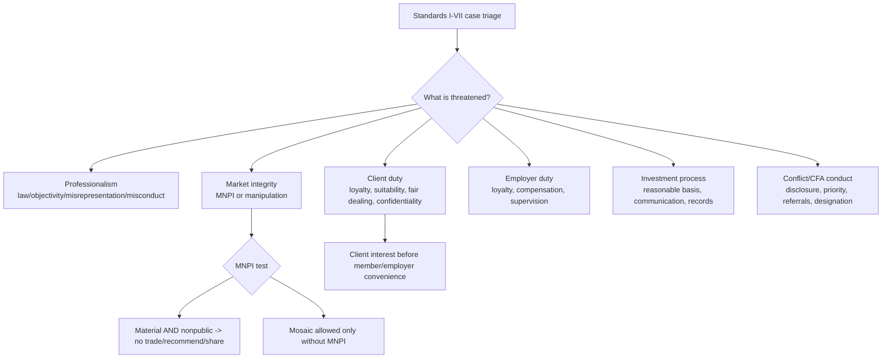

# M03: Guidance for Standards I-VII

> **模块定位**：用 Code and Standards 判断专业行为、利益冲突、客户责任与合规边界。 本模块聚焦 **Guidance for Standards I-VII**，要求把官方 LOS 转成可执行的判断、计算或解释动作。

---

## Official Module Structure

- Learning Outcomes: Guidance for Standards I–VII
- 3.01 | Standard I: Professionalism
- 3.02 | Standard I(A): Recommended Procedures
- 3.03 | Standard I(A): Application of the Standard
- 3.04 | Standard I(B) Independence and Objectivity
- 3.05 | Standard I(B): Recommended Procedures
- 3.06 | Standard I(B): Application of the Standard
- 3.07 | Standard I(C) Misrepresentation
- 3.08 | Standard I(C): Recommended Procedures
- 3.09 | Standard I(C): Application of the Standard
- 3.10 | Standard I(D) Misconduct
- 3.11 | Standard I(D): Recommended Procedures
- 3.12 | Standard I(D): Application of the Standard
- 3.13 | Standard I(E) Competence
- 3.14 | Standard I(E): Recommended Procedures
- 3.15 | Standard I(E): Application of the Standard
- 3.16 | Standard II: Integrity of Capital Markets
- 3.17 | Standard II(A): Recommended Procedures
- 3.18 | Standard II(A): Application of the Standard
- 3.19 | Standard II(B) Market Manipulation
- 3.20 | Standard II(B): Application of the Standard
- 3.21 | Standard III: Duties to Clients
- 3.22 | Standard III(A): Recommended Procedures
- 3.23 | Standard III(A): Application of the Standard
- 3.24 | Standard III(B) Fair Dealing
- 3.25 | Standard III(B): Recommended Procedures
- 3.26 | Standard III(B): Application of the Standard
- 3.27 | Standard III(C) Suitability
- 3.28 | Standard III(C): Recommended Procedures
- 3.29 | Standard III(C): Application of the Standard
- 3.30 | Standard III(D) Performance Presentation
- 3.31 | Standard III(D): Recommended Procedures
- 3.32 | Standard III(D): Application of the Standard
- 3.33 | Standard III(E) Preservation of Confidentiality
- 3.34 | Standard III(E): Recommended Procedures
- 3.35 | Standard III(E): Application of the Standard
- 3.36 | Standard IV: Duties to Employers
- 3.37 | Standard IV(A): Recommended Procedures
- 3.38 | Standard IV(A): Application of the Standard
- 3.39 | Standard IV(B) Additional Compensation Arrangements
- 3.40 | Standard IV(B): Recommended Procedures
- 3.41 | Standard IV(B): Application of the Standard
- 3.42 | Standard IV(C) Responsibilities of Supervisors
- 3.43 | Standard IV(C): Recommended Procedures
- 3.44 | Standard IV(C): Application of the Standard
- 3.45 | Standard V: Investment Analysis, Recommendations, and Actions
- 3.46 | Standard V(A): Recommended Procedures
- 3.47 | Standard V(A): Application of the Standard
- 3.48 | Standard V(B) Communication with Clients and Prospective Clients
- 3.49 | Standard V(B): Recommended Procedures
- 3.50 | Standard V(B): Application of the Standard
- 3.51 | Standard V(C) Record Retention
- 3.52 | Standard V(C): Recommended Procedures
- 3.53 | Standard V(C): Application of the Standard
- 3.54 | Standard VI: Conflicts of Interest
- 3.55 | Standard VI(A): Application of the Standard
- 3.56 | Standard VI(B) Priority of Transactions
- 3.57 | Standard VI(B): Recommended Procedures
- 3.58 | Standard VI(B): Application of the Standard
- 3.59 | Standard VI(C) Referral Fees
- 3.60 | Standard VI(C): Recommended Procedures
- 3.61 | Standard VI(C): Application of the Standard
- 3.62 | Standard VII: Responsibilities as a CFA Institute Member or CFA Candidate
- 3.63 | Standard VII(A): Application of the Standard
- 3.64 | Standard VII(B) Reference to CFA Institute, the CFA Designation, and the CFA Program
- 3.65 | Standard VII(B): Recommended Procedures
- 3.66 | Standard VII(B): Application of the Standard

## Learning Outcome Statements

1. demonstrate the application of the Code of Ethics and Standards of Professional Conduct to situations involving issues of professional integrity
2. recommend practices and procedures designed to prevent violations of the Code of Ethics and Standards of Professional Conduct
3. identify conduct that conforms to the Code and Standards and conduct that violates the Code and Standards

---

## 1. 模块定位

### 3.1 学习任务
- **核心问题**：考试希望你用 `Guidance for Standards I-VII` 解释什么、计算什么、比较什么，或判断什么。
- **输入信息**：题干事实、数据、假设、时间口径、单位、约束条件。
- **输出结果**：中文结论 + 英文关键术语 + 必要公式/框架 + 限制条件。

### 3.2 考试角色
- **难度类型**：概念+案例判断。
- **高频题型**：定义辨析、情境判断、计算解释、表格补数、跨模块比较。
- **答题原则**：先判断 LOS 动词，再选择工具；计算后必须解释结果含义。

### 3.3 关键英文术语
- **Guidance for Standards I-VII（核心术语）**：本模块关键词，用于定位 LOS、题干条件和解题动作。
- **Standard I: Professionalism（核心术语）**：本模块关键词，用于定位 LOS、题干条件和解题动作。
- **Standard I（核心术语）**：本模块关键词，用于定位 LOS、题干条件和解题动作。
- **Standard I(A): Recommended Procedures（核心术语）**：本模块关键词，用于定位 LOS、题干条件和解题动作。
- **Standard I(A)（核心术语）**：本模块关键词，用于定位 LOS、题干条件和解题动作。
- **Standard I(A): Application of the Standard（核心术语）**：本模块关键词，用于定位 LOS、题干条件和解题动作。
- **Standard I(B) Independence and Objectivity（核心术语）**：本模块关键词，用于定位 LOS、题干条件和解题动作。
- **Standard I(B): Recommended Procedures（核心术语）**：本模块关键词，用于定位 LOS、题干条件和解题动作。

## 2. 官方 LOS 对应学习目标

| LOS | 官方要求 | 中文学习动作 | 做题输出 |
|---|---|---|---|
| 3.1 | demonstrate the application of the Code of Ethics and Standards of Professional Conduct to situations involving issues of professional integrity | 识别概念、解释机制并应用到题干。 | 写出结论、依据、公式口径和限制条件。 |
| 3.2 | recommend practices and procedures designed to prevent violations of the Code of Ethics and Standards of Professional Conduct | 给出符合约束的行动建议 | 写出结论、依据、公式口径和限制条件。 |
| 3.3 | identify conduct that conforms to the Code and Standards and conduct that violates the Code and Standards | 识别题干中的关键事实和触发条件 | 写出结论、依据、公式口径和限制条件。 |

## 3. 核心知识树

```text
3. Guidance for Standards I-VII
├─ 3.1 Standard I: Professionalism
│  ├─ 3.1.1 I(A) Knowledge of the Law：遵守更严格的法律/法规/Standards；发现违法要 dissociate。
│  ├─ 3.1.2 I(B) Independence and Objectivity：礼物、压力、issuer-paid research、banking relationship 不能损害独立判断。
│  ├─ 3.1.3 I(C) Misrepresentation：不得误导学历、业绩、模型、服务、第三方资料；引用外部材料要注明来源。
│  ├─ 3.1.4 I(D) Misconduct：涉及 dishonesty、fraud、deceit 或影响职业声誉的行为违规。
│  └─ 3.1.5 I(E) Competence：只在能力范围内服务，保持并提升专业能力。
├─ 3.2 Standard II: Integrity of Capital Markets
│  ├─ 3.2.1 II(A) MNPI：material AND nonpublic -> 不交易、不建议、不传播；mosaic theory 不能包含 MNPI。
│  └─ 3.2.2 II(B) Market Manipulation：禁止制造虚假价格/成交量或传播误导信息。
├─ 3.3 Standard III: Duties to Clients
│  ├─ 3.3.1 III(A) Loyalty, Prudence, Care：客户利益优先，管理客户资产要审慎。
│  ├─ 3.3.2 III(B) Fair Dealing：机会和推荐要公平传播，分配按既定政策，不要求所有客户绝对同价同秒。
│  ├─ 3.3.3 III(C) Suitability：了解客户 objectives/constraints，并在整个 portfolio context 判断。
│  ├─ 3.3.4 III(D) Performance Presentation：业绩陈述不得误导，要有合理依据和充分披露。
│  └─ 3.3.5 III(E) Confidentiality：保密，除非客户授权、法律要求或涉及违法调查。
├─ 3.4 Standard IV-V: Employers and Investment Process
│  ├─ 3.4.1 IV(A) Loyalty：可为离职做有限准备，但不能挖客户、带走资料或损害雇主。
│  ├─ 3.4.2 IV(B)/(C)：额外报酬需书面同意；主管要建立并执行合理合规程序。
│  ├─ 3.4.3 V(A) Diligence and Reasonable Basis：研究和推荐必须有合理充分依据。
│  ├─ 3.4.4 V(B) Communication：区分事实和观点，披露假设、风险、限制和方法变化。
│  └─ 3.4.5 V(C) Record Retention：保留支持研究、推荐和行动的记录。
├─ 3.5 Standard VI-VII: Conflicts and CFA Responsibilities
│  ├─ 3.5.1 VI(A) Disclosure of Conflicts：充分、公平、显著披露可能影响独立性的冲突。
│  ├─ 3.5.2 VI(B) Priority of Transactions：客户交易优先于雇主和个人交易。
│  ├─ 3.5.3 VI(C) Referral Fees：向客户/潜在客户披露 referral compensation。
│  ├─ 3.5.4 VII(A) CFA Program Conduct：不得作弊、泄题、扰乱考试或损害考试完整性。
│  └─ 3.5.5 VII(B) CFA Designation：不能夸大 CFA 称号、候选人身份或考试成绩含义。
```

## 核心图解



## 4. 知识点详解

### 3.1 Standard I: Professionalism

- **中文主线**：围绕 `Standard I: Professionalism` 掌握定义、适用条件、公式/框架和考试判断。
- **对应动作**：识别概念、解释机制并应用到题干。

### 3.2 Standard I(A): Recommended Procedures

- **中文主线**：围绕 `Standard I(A): Recommended Procedures` 掌握定义、适用条件、公式/框架和考试判断。
- **对应动作**：给出符合约束的行动建议

### 3.3 Standard I(A): Application of the Standard

- **中文主线**：围绕 `Standard I(A): Application of the Standard` 掌握定义、适用条件、公式/框架和考试判断。
- **对应动作**：识别题干中的关键事实和触发条件

### 3.4 Standard I(B) Independence and Objectivity

- **中文主线**：围绕 `Standard I(B) Independence and Objectivity` 掌握定义、适用条件、公式/框架和考试判断。
- **对应动作**：识别概念并应用到题干。

### 3.5 Standard I(B): Recommended Procedures

- **中文主线**：围绕 `Standard I(B): Recommended Procedures` 掌握定义、适用条件、公式/框架和考试判断。
- **对应动作**：识别概念并应用到题干。

## 5. 关键公式与计算框架

| 指标 | 公式/判断链 | 知识树节点 | 考试说明 |
|------|---------------|------------|----------|
| Stricter Standard Rule | `required conduct = most strict(applicable law, regulation, CFA Standards)` | `3.1.1` | law 与 Standards 冲突时常考 |
| Independence Gate | `benefit/pressure -> could impair objectivity? -> reject/disclose/seek consent` | `3.1.2` | gifts、issuer-paid research、banking pressure |
| MNPI Gate | `material AND nonpublic -> do not trade/recommend/disclose` | `3.2.1` | 信息题第一闸 |
| Mosaic Theory Gate | `public information + nonmaterial nonpublic information -> may be used` | `3.2.1` | 不能含 MNPI |
| Suitability Gate | `client facts + IPS/objectives/constraints + portfolio context + product risk/return fit` | `3.3.3` | 不是单产品热度判断 |
| Confidentiality Exceptions | `client permission OR legal requirement OR illegal activity inquiry` | `3.3.5` | 保密不是绝对 |
| Employer Exit Gate | `prepare OK; solicit clients/take records/use employer property not OK` | `3.4.1` | 跳槽题常考 |
| Reasonable Basis Gate | `diligent research + adequate data + method limits disclosed` | `3.4.3/3.4.4` | 研究推荐题 |
| Conflict Gate | `identify -> disclose prominently -> mitigate/avoid if disclosure insufficient` | `3.5.1` | disclosure 不是橡皮擦 |
| Priority of Transactions | `client trades before employer/personal trades` | `3.5.2` | 不得抢先交易 |

### 5.1 考纲范围标记

| 标记 | 内容 |
|------|------|
| 【考纲重点】 | Code and Standards、duties to clients/employers/market/profession、conflicts、MNPI、suitability、GIPS、Ethics application cases |
| 【考纲内但无核心公式】 | 本科几乎全部是判断链和合规流程，不要求数值公式 |
| 【超纲/扩展】 | 具体国家证券法细则、法律案例判例、GIPS 深层审计技术不作为 Level I 必背内容 |

---

## 6. 常见考点与解题思路

| 重要性 | 考点 | 解题动作 |
|---|---|---|
| ⭐⭐⭐ | 3.1 Standard I: Professionalism | 先定位题干触发词，再写公式/框架，最后解释结果或判断陷阱。 |
| ⭐⭐⭐ | 3.2 Standard I(A): Recommended Procedures | 先定位题干触发词，再写公式/框架，最后解释结果或判断陷阱。 |
| ⭐⭐ | 3.3 Standard I(A): Application of the Standard | 先定位题干触发词，再写公式/框架，最后解释结果或判断陷阱。 |
| ⭐⭐ | 3.4 Standard I(B) Independence and Objectivity | 先定位题干触发词，再写公式/框架，最后解释结果或判断陷阱。 |
| ⭐ | 3.5 Standard I(B): Recommended Procedures | 先定位题干触发词，再写公式/框架，最后解释结果或判断陷阱。 |

## 7. 易错点与考试陷阱

| ❌ 错误理解 | ✅ 正确理解 | 为什么错 / 考试提醒 |
|---|---|---|
| ❌ 合法就一定合乎 Ethics | ✅ CFA 常要求高于法律底线 | 按官方定义和 LOS 口径核验。 |
| ❌ 披露冲突后就什么都能做 | ✅ 有些冲突仅披露仍不充分 | 按官方定义和 LOS 口径核验。 |
| ❌ mosaic theory 可以用内幕消息 | ✅ mosaic 不能包含 MNPI | 按官方定义和 LOS 口径核验。 |
| ❌ fair dealing = 所有人必须完全同价同时成交 | ✅ 核心是合理、公平分配机会 | 按官方定义和 LOS 口径核验。 |
| ❌ suitability = 推荐热门产品给所有客户 | ✅ 要匹配客户 objectives/constraints | 按官方定义和 LOS 口径核验。 |
| ❌ confidentiality 永远不能破 | ✅ 法律要求、客户授权、违法调查时可例外 | 按官方定义和 LOS 口径核验。 |
| ❌ employer 不允许跳槽前准备 | ✅ 可做有限准备，但不能挖客户/盗取资料 | 按官方定义和 LOS 口径核验。 |
| ❌ referral fee 不用说，只要不影响建议 | ✅ 必须披露 | 按官方定义和 LOS 口径核验。 |
| ❌ verification = GIPS 业绩一定没错 | ✅ verification 是 process-level assurance | 按官方定义和 LOS 口径核验。 |
| ❌ 可以说自己“passed all CFA levels except charter pending”来营销 | ✅ 对 designation 引用要严格、不能夸大 | 按官方定义和 LOS 口径核验。 |

## 8. 跨模块关联

- **来自 M02**：M02 给 Standards 索引；本模块把每条 Standard 转成 required conduct、recommended procedure 和案例判断门。
- **到 M04**：III(D) Performance Presentation 与 GIPS 直接连接；GIPS 是业绩展示的更细标准。
- **到 M05**：M05 综合案例会同时触发多个 Standards，本模块提供定位和优先级。
- **到 Equity/FI/Derivatives/Alts**：MNPI、market manipulation、reasonable basis、suitability 和 disclosure 会嵌入任何交易/推荐/产品题。
- **到 PM/Wealth**：客户目标约束、IPS、fair dealing、priority of transactions 和 confidentiality 是组合管理行为底线。

---


## 9. 复习与刷题提示

- 第一轮：按 `Official Module Structure` 逐节过概念，把每个 LOS 改写成中文任务。
- 第二轮：对照 `## 3. 核心知识树` 做主动回忆，能说出每个编号节点的定义、公式/框架和陷阱。
- 第三轮：刷题后记录错因，如果暴露 MOC 缺口，按 `docs/moc-auto-patch-workflow.md` 进入补强流程。
- 考前：只看术语、公式/框架、易错点和本模块错题，避免重新铺开所有正文。

## 10. Legacy Notes Integrated

- **主要 legacy 来源**：`00-Ethical-and-Professional-Standards-MOC.md` (high, 0.487)
- **整合规则**：高置信内容已合入 `知识点详解`、`公式与计算框架`、`常见考点`、`易错陷阱` 和 `跨模块关联`。
- **边界**：若 legacy 内容与 2026 官方 LOS 冲突，以官方 module 名称、LOS 和 registry 为准。
