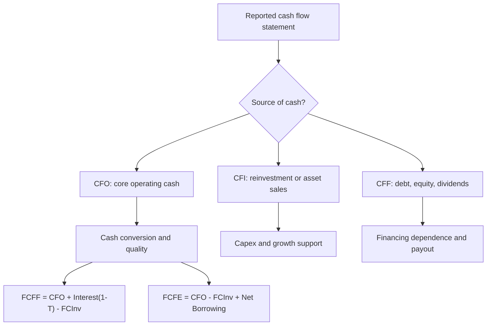
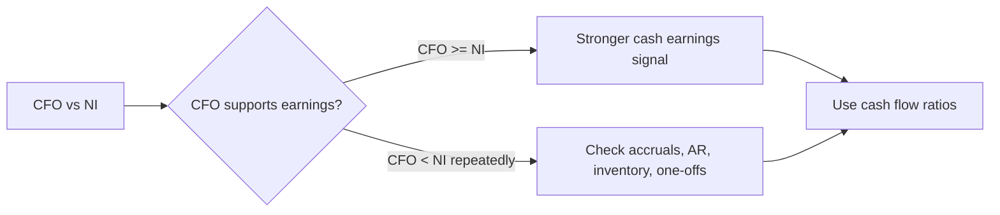

# M05: Analyzing Statements of Cash Flows II

> **模块定位**：把三张报表转成可比较、可预测、可质疑的经营证据。 本模块聚焦 **Analyzing Statements of Cash Flows II**，要求把官方 LOS 转成可执行的判断、计算或解释动作。

---

## Official Module Structure

- Learning Outcomes: Analyzing Statements of Cash Flows II
- 5.01 | Introduction
- 5.02 | Evaluating Sources and Uses of Cash
- 5.03 | Ratios and Common-Size Analysis
- 5.04 | Free Cash Flow Measures
- 5.05 | Cash Flow Statement Analysis: Cash Flow Ratios

## Learning Outcome Statements

1. analyze and interpret both reported and common-size cash flow statements
2. calculate and interpret free cash flow to the firm, free cash flow to equity, and performance and coverage cash flow ratios

---

## 1. 模块定位

### 5.1 学习任务
- **核心问题**：考试希望你用 `Analyzing Statements of Cash Flows II` 解释什么、计算什么、比较什么，或判断什么。
- **输入信息**：题干事实、数据、假设、时间口径、单位、约束条件。
- **输出结果**：中文结论 + 英文关键术语 + 必要公式/框架 + 限制条件。

### 5.2 考试角色
- **难度类型**：计算+解释。
- **高频题型**：定义辨析、情境判断、计算解释、表格补数、跨模块比较。
- **答题原则**：先判断 LOS 动词，再选择工具；计算后必须解释结果含义。

### 5.3 关键英文术语
- **Analyzing Statements of Cash Flows II（核心术语）**：本模块关键词，用于定位 LOS、题干条件和解题动作。
- **Introduction（核心术语）**：本模块关键词，用于定位 LOS、题干条件和解题动作。
- **Evaluating Sources and Uses of Cash（核心术语）**：本模块关键词，用于定位 LOS、题干条件和解题动作。
- **Ratios and Common-Size Analysis（核心术语）**：本模块关键词，用于定位 LOS、题干条件和解题动作。
- **Free Cash Flow Measures（核心术语）**：本模块关键词，用于定位 LOS、题干条件和解题动作。
- **Cash Flow Statement Analysis: Cash Flow Ratios（核心术语）**：本模块关键词，用于定位 LOS、题干条件和解题动作。
- **Cash Flow Statement Analysis（核心术语）**：本模块关键词，用于定位 LOS、题干条件和解题动作。
- **Cash Flow（现金流）**：企业现金流入和流出的真实资金轨迹。

## 2. 官方 LOS 对应学习目标

| LOS | 官方要求 | 中文学习动作 | 做题输出 |
|---|---|---|---|
| 5.1 | analyze and interpret both reported and common-size cash flow statements | 解释结果的投资含义 | 写出结论、依据、公式口径和限制条件。 |
| 5.2 | calculate and interpret free cash flow to the firm, free cash flow to equity, and performance and coverage cash flow ratios | 计算并解释数值结果；解释结果的投资含义 | 写出结论、依据、公式口径和限制条件。 |

## 3. 核心知识树

```text
5. Analyzing Statements of Cash Flows II
├─ 5.1 报告式与同比例现金流量表 (Reported vs Common-Size Cash Flow Statements)
│  ├─ 5.1.1 Reported SCF：先判断现金来自 CFO、CFI 还是 CFF
│  ├─ 5.1.2 Common-size SCF：cash flow item / revenue 或 / total cash inflows，按题干基数
│  └─ 5.1.3 判断：CFO 强于 CFI/CFF 更可持续，出售资产或借款带来的现金不能当经营质量
├─ 5.2 自由现金流 (Free Cash Flow)
│  ├─ 5.2.1 FCFF = CFO + Interest(1 - T) - FCInv；给 debt + equity holders
│  ├─ 5.2.2 FCFE = CFO - FCInv + Net Borrowing；给 common equity holders
│  └─ 5.2.3 判断：FCInv 两个口径都扣；net borrowing 只进入 FCFE
├─ 5.3 现金流比率分析 (Cash Flow Ratio Analysis)
│  ├─ 5.3.1 Performance ratios：CFO / revenue、CFO / NI 看现金转化
│  ├─ 5.3.2 Coverage ratios：CFO / current liabilities、CFO / total debt、cash interest coverage
│  └─ 5.3.3 判断：现金流比率更接近偿债能力，但可能受 working capital timing 扰动
```

## 核心图解





## 4. 知识点详解

### 5.1 报告式与同比例现金流量表 (Reported vs Common-Size Cash Flow Statements)

- **报告式现金流量表 (Reported Cash Flow Statement)**：按 CFO、CFI、CFF 三大分类列示现金收支，反映企业现金的实际来源与运用
- **同比例现金流量表 (Common-Size Cash Flow Statement)**：可将各项目表示为收入(revenue)或总现金流入/流出的百分比，便于跨期和跨公司比较
- 同比例分析有助于识别现金流结构的异常变化，如经营现金流占比持续下降可能是盈利质量恶化的信号

### 5.2 自由现金流 (Free Cash Flow)

**公司自由现金流 (FCFF — Free Cash Flow to the Firm)：**
- 定义：衡量公司对所有资本提供者（股东和债权人）的可供现金流
- 特点：在满足经营和投资需求后，可供分配给所有资本提供者的剩余现金流
- 用途：企业价值评估(DCF 模型)的输入变量

**股权自由现金流 (FCFE — Free Cash Flow to Equity)：**
- 定义：衡量公司对普通股股东的可供现金流
- 特点：在满足经营、投资和偿债需求后，可供分配给股东的剩余现金流
- 用途：股权价值评估的输入变量

#### 5.2.1 核心公式 (English)
- `FCFF = CFO + Interest(1 - T) - FCInv`
- `FCFE = CFO - FCInv + Net Borrowing`

### 5.3 现金流比率分析 (Cash Flow Ratio Analysis)

**业绩现金流比率 (Performance Cash Flow Ratios)：**
- 经营现金流比率 (CFO / Current Liabilities)：衡量经营现金流覆盖短期债务的能力
- 现金流覆盖比率 (Cash Flow Coverage Ratio)：衡量经营现金流覆盖总债务的能力
- 现金流利润率 (Cash Flow Margin)：CFO / Revenue，衡量每单位收入转化为经营现金流的效率

**覆盖现金流比率 (Coverage Cash Flow Ratios)：**
- 债务覆盖比率 (Debt Coverage Ratio)：CFO / Total Debt
- 利息覆盖比率 (Cash Interest Coverage)：(CFO + Interest Paid + Taxes Paid) / Interest Paid

**现金流趋势分析 (Cash Flow Trend Analysis)：**
- 多期 CFO 趋势：CFO 增长应与利润增长趋势基本一致，显著背离可能暗示盈利质量下降
- CFO 与 NI 的关系：CFO > NI 通常意味着盈利质量较高；CFO 持续低于 NI 可能反映激进的收入确认或营运资本恶化
- 自由现金流趋势：FCFF/FCFE 长期为负可能表明公司需要外部融资

## 5. 关键公式与计算框架

### 5.1 核心内容

| 指标 | 公式 | 说明 |
|------|------|------|
| FCFF | `CFO + Interest(1 - T) - FCInv` | 公司自由现金流 |
| FCFE | `CFO - FCInv + Net Borrowing` | 股权自由现金流 |
| CFO / CL | `CFO / Current Liabilities` | 经营现金流比率，衡量短期偿债能力 |
| Cash Flow Margin | `CFO / Revenue` | 每单位收入转为经营现金的能力 |
| Debt Coverage | `CFO / Total Debt` | 现金流覆盖总债务 |
| Cash Interest Coverage | `(CFO + Interest Paid + Taxes Paid) / Interest Paid` | 现金口径利息覆盖 |
| FCFE from FCFF | `FCFF - Interest(1 - T) + Net Borrowing` | 两个自由现金流口径转换 |

## 6. 常见考点与解题思路

| 重要性 | 考点 | 解题动作 |
|---|---|---|
| ⭐⭐⭐ | 5.1 Introduction | 先定位题干触发词，再写公式/框架，最后解释结果或判断陷阱。 |
| ⭐⭐⭐ | 5.2 Evaluating Sources and Uses of Cash | 先定位题干触发词，再写公式/框架，最后解释结果或判断陷阱。 |
| ⭐⭐ | 5.3 Ratios and Common-Size Analysis | 先定位题干触发词，再写公式/框架，最后解释结果或判断陷阱。 |
| ⭐⭐ | 5.4 Free Cash Flow Measures | 先定位题干触发词，再写公式/框架，最后解释结果或判断陷阱。 |
| ⭐ | 5.5 Cash Flow Statement Analysis: Cash Flow Ratios | 先定位题干触发词，再写公式/框架，最后解释结果或判断陷阱。 |

### 6.9 ⭐⭐ Legacy 考点补充

### 6.1 核心内容

- **考点1**：FCFF/FCFE 的计算与区别。解题思路：FCFF 给所有资本提供者，FCFE 只给股东；两者关系为 FCFF - Interest(1-T) + Net Borrowing = FCFE
- **考点2**：现金流比率的计算与解读。解题思路：CFO 比率衡量的是现金流层面的偿债能力，比利润层面的比率更真实
- **考点3**：同比例现金流量表分析。解题思路：关注各分类现金流的占比趋势，尤其注意经营现金流占比的持续变化
- **考点4**：现金流与盈利质量的判断。解题思路：CFO 与 NI 的长期背离是盈利质量分析的重要线索

## 7. 易错点与考试陷阱

| ❌ 错误理解 | ✅ 正确理解 | 为什么错 / 考试提醒 |
|---|---|---|
| ❌ 忽略：FCFF vs FCFE 的调整差异: 计算 FCFF 时加回税后利息，FCFE 不再加回——很多考生在调整细节上丢分 | ✅ FCFF vs FCFE 的调整差异: 计算 FCFF 时加回税后利息，FCFE 不再加回——很多考生在调整细节上丢分 | 题干通常会用口径、顺序、定义边界或例外条件设置干扰。 |
| ❌ 忽略：FCInv (资本支出) 的扣减: 计算 FCFF 和 FCFE 时都需扣减 FCInv，这是维持经营所必需的现金支出 | ✅ FCInv (资本支出) 的扣减: 计算 FCFF 和 FCFE 时都需扣减 FCInv，这是维持经营所必需的现金支出 | 题干通常会用口径、顺序、定义边界或例外条件设置干扰。 |
| ❌ 忽略：Net Borrowing 的方向: 净借款为正(新增借款)增加 FCFE，为负(偿还借款)减少 FCFE | ✅ Net Borrowing 的方向: 净借款为正(新增借款)增加 FCFE，为负(偿还借款)减少 FCFE | 题干通常会用口径、顺序、定义边界或例外条件设置干扰。 |
| ❌ 忽略：现金流比率 vs 利润比率: 现金流比率基于已实现现金，不易被会计政策操纵，但波动性可能更大 | ✅ 现金流比率 vs 利润比率: 现金流比率基于已实现现金，不易被会计政策操纵，但波动性可能更大 | 题干通常会用口径、顺序、定义边界或例外条件设置干扰。 |

## 8. 跨模块关联

- **连接 M04**：所有 FCFF/FCFE 和 coverage ratios 都依赖 M04 的 CFO 计算。
- **连接 Equity**：FCFF 用于 firm valuation；FCFE 用于 equity valuation，口径混用会导致估值错误。
- **连接 Credit/Fixed Income**：CFO coverage、debt coverage 和 cash interest coverage 是现金偿债能力证据。
- **连接 M10/M11**：CFO 与 NI 的关系用于质量判断；现金流比率与盈利比率要交叉验证。


## 9. 复习与刷题提示

- 第一轮：按 `Official Module Structure` 逐节过概念，把每个 LOS 改写成中文任务。
- 第二轮：对照 `## 3. 核心知识树` 做主动回忆，能说出每个编号节点的定义、公式/框架和陷阱。
- 第三轮：刷题后记录错因，如果暴露 MOC 缺口，按 `docs/moc-auto-patch-workflow.md` 进入补强流程。
- 考前：只看术语、公式/框架、易错点和本模块错题，避免重新铺开所有正文。

## 10. Legacy Notes Integrated

- **主要 legacy 来源**：`M05-Analyzing-Cash-Flows-II.md` (high, 0.656)
- **整合规则**：高置信内容已合入 `知识点详解`、`公式与计算框架`、`常见考点`、`易错陷阱` 和 `跨模块关联`。
- **边界**：若 legacy 内容与 2026 官方 LOS 冲突，以官方 module 名称、LOS 和 registry 为准。
