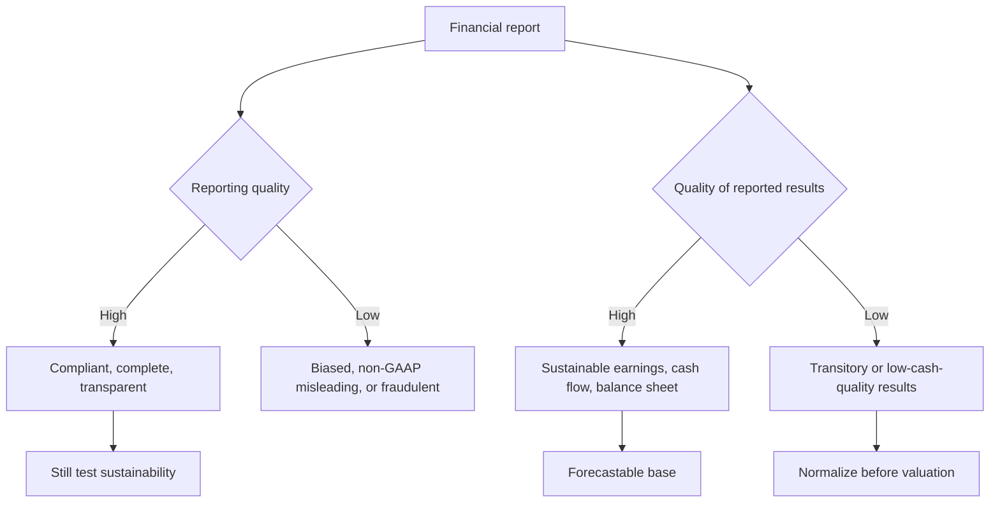
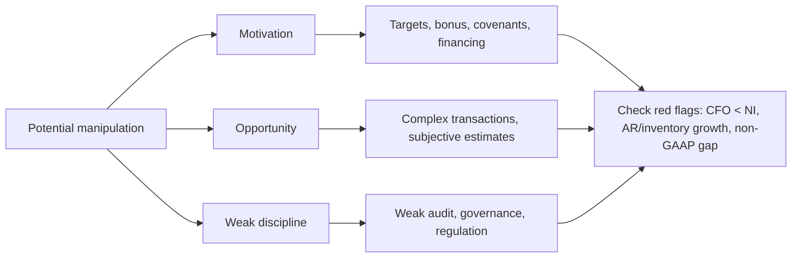

# M10: Financial Reporting Quality

> **模块定位**：把三张报表转成可比较、可预测、可质疑的经营证据。 本模块聚焦 **Financial Reporting Quality**，要求把官方 LOS 转成可执行的判断、计算或解释动作。

---

## Official Module Structure

- Learning Outcomes: Financial Reporting Quality
- 10.01 | Introduction
- 10.02 | Conceptual Overview
- 10.03 | GAAP, Decision Useful Financial Reporting
- 10.04 | Biased Accounting Choices
- 10.05 | Departures from GAAP
- 10.06 | Differentiate between Conservative and Aggressive Accounting
- 10.07 | Context for Assessing Financial Reporting Quality
- 10.08 | Mechanisms That Discipline Financial Reporting Quality
- 10.09 | Detection of Financial Reporting Quality Issues: Introduction and Presentation Choices
- 10.10 | Accounting Choices and Estimates
- 10.11 | Accounting Choices That Affect the Cash Flow Statement
- 10.12 | Accounting Choices that Affect Financial Reporting
- 10.13 | Warning Signs

## Learning Outcome Statements

1. compare financial reporting quality with the quality of reported results (including quality of earnings, cash flow, and balance sheet items)
2. describe a spectrum for assessing financial reporting quality
3. explain the difference between conservative and aggressive accounting
4. describe motivations that might cause management to issue financial reports that are not high quality and conditions that are conducive to issuing low-quality, or even fraudulent, financial reports
5. describe mechanisms that discipline financial reporting quality and the potential limitations of those mechanisms
6. describe presentation choices, including non-GAAP measures, that could be used to influence an analyst’s opinion
7. describe accounting methods (choices and estimates) that could be used to manage earnings, cash flow, and balance sheet items
8. describe accounting warning signs and methods for detecting manipulation of information in financial reports

---

## 1. 模块定位

### 10.1 学习任务
- **核心问题**：考试希望你用 `Financial Reporting Quality` 解释什么、计算什么、比较什么，或判断什么。
- **输入信息**：题干事实、数据、假设、时间口径、单位、约束条件。
- **输出结果**：中文结论 + 英文关键术语 + 必要公式/框架 + 限制条件。

### 10.2 考试角色
- **难度类型**：概念+应用。
- **高频题型**：定义辨析、情境判断、计算解释、表格补数、跨模块比较。
- **答题原则**：先判断 LOS 动词，再选择工具；计算后必须解释结果含义。

### 10.3 关键英文术语
- **Financial Reporting Quality（核心术语）**：本模块关键词，用于定位 LOS、题干条件和解题动作。
- **Introduction（核心术语）**：本模块关键词，用于定位 LOS、题干条件和解题动作。
- **Conceptual Overview（核心术语）**：本模块关键词，用于定位 LOS、题干条件和解题动作。
- **GAAP, Decision Useful Financial Reporting（核心术语）**：本模块关键词，用于定位 LOS、题干条件和解题动作。
- **Biased Accounting Choices（核心术语）**：本模块关键词，用于定位 LOS、题干条件和解题动作。
- **Departures from GAAP（核心术语）**：本模块关键词，用于定位 LOS、题干条件和解题动作。
- **Differentiate between Conservative and Aggressive Accounting（核心术语）**：本模块关键词，用于定位 LOS、题干条件和解题动作。
- **Context for Assessing Financial Reporting Quality（核心术语）**：本模块关键词，用于定位 LOS、题干条件和解题动作。

## 2. 官方 LOS 对应学习目标

| LOS | 官方要求 | 中文学习动作 | 做题输出 |
|---|---|---|---|
| 10.1 | compare financial reporting quality with the quality of reported results (including quality of earnings, cash flow, and balance sheet items) | 比较相似概念的适用条件与差异 | 写出结论、依据、公式口径和限制条件。 |
| 10.2 | describe a spectrum for assessing financial reporting quality | 描述定义、流程和适用场景 | 写出结论、依据、公式口径和限制条件。 |
| 10.3 | explain the difference between conservative and aggressive accounting | 解释机制、原因和后果 | 写出结论、依据、公式口径和限制条件。 |
| 10.4 | describe motivations that might cause management to issue financial reports that are not high quality and conditions that are conducive to issuing low-quality, or even fraudulent, financial reports | 描述定义、流程和适用场景 | 写出结论、依据、公式口径和限制条件。 |
| 10.5 | describe mechanisms that discipline financial reporting quality and the potential limitations of those mechanisms | 描述定义、流程和适用场景 | 写出结论、依据、公式口径和限制条件。 |
| 10.6 | describe presentation choices, including non-GAAP measures, that could be used to influence an analyst’s opinion | 描述定义、流程和适用场景 | 写出结论、依据、公式口径和限制条件。 |
| 10.7 | describe accounting methods (choices and estimates) that could be used to manage earnings, cash flow, and balance sheet items | 描述定义、流程和适用场景 | 写出结论、依据、公式口径和限制条件。 |
| 10.8 | describe accounting warning signs and methods for detecting manipulation of information in financial reports | 描述定义、流程和适用场景 | 写出结论、依据、公式口径和限制条件。 |

## 3. 核心知识树

```text
10. Financial Reporting Quality
├─ 10.1 报告质量 vs 报告结果质量 (Reporting Quality vs Quality of Reported Results)
│  ├─ 10.1.1 Reporting quality：是否合规、完整、透明、decision useful
│  ├─ 10.1.2 Quality of reported results：earnings/cash flow/balance sheet items 是否可持续
│  └─ 10.1.3 判断：高报告质量不等于高盈利质量；合规报表也可能显示不可持续利润
├─ 10.2 稳健 vs 激进会计政策 (Conservative vs Aggressive Accounting)
│  ├─ 10.2.1 Conservative：延后收入、提前费用/损失，压低当期 NI/assets
│  ├─ 10.2.2 Aggressive：提前收入、延后费用/损失，提高当期 NI/assets
│  └─ 10.2.3 判断：关键不是“保守一定好”，而是政策是否一致、合理、披露充分
├─ 10.3 动机、机会与约束机制 (Motivation, Opportunity, Discipline Mechanisms)
│  ├─ 10.3.1 动机：earnings targets、bonus、debt covenant、financing、M&A
│  ├─ 10.3.2 机会：weak controls、complex transactions、subjective estimates
│  └─ 10.3.3 约束：audit、regulator、governance、analysts，但都有局限
├─ 10.4 非 GAAP 列报选择与会计估计 (Non-GAAP Presentation Choices and Accounting Estimates)
│  ├─ 10.4.1 Non-GAAP：adjusted EBITDA/EPS 要检查排除项目是否反复发生且有经济实质
│  ├─ 10.4.2 Accounting estimates：useful life、residual value、bad debt、warranty、pension assumptions
│  └─ 10.4.3 判断：估计变更若持续有利于利润，要回到附注找证据
├─ 10.5 预警信号与操纵识别 (Warning Signs and Manipulation Detection)
│  ├─ 10.5.1 Cash red flags：CFO 持续低于 NI；accruals ratio 上升
│  ├─ 10.5.2 Balance sheet red flags：AR/inventory 增速高于 sales，DTA valuation allowance 异常
│  └─ 10.5.3 Disclosure red flags：auditor change、related-party transactions、fourth-quarter adjustments
```

## 核心图解





## 4. 知识点详解

### 10.1 报告质量 vs 报告结果质量 (Reporting Quality vs Quality of Reported Results)

- **报告质量 (Reporting Quality)**：指财务信息是否遵循 GAAP/IFRS、是否完整透明。高质量的财务报告具有相关性(relevance)、如实反映(faithful representation)、可比性(comparability)和可验证性(verifiability)
- **报告结果质量 (Quality of Reported Results)**：指报告利润是否可持续(sustainable)且来源于核心经营——即使报告质量高，报告结果也可能不可持续
- **质量谱系 (Quality Spectrum)**：从高到低包括 GAAP/IFRS compliant（合规）、within GAAP but biased（偏颇）、non-GAAP（非 GAAP 列报）到 fraudulent（欺诈）
- **分析师的双重任务**：既要评估报告是否符合准则(reporting quality)，也要判断盈利的可持续性(quality of results)

### 10.2 稳健 vs 激进会计政策 (Conservative vs Aggressive Accounting)

- **稳健会计 (Conservative Accounting)**：加速确认费用和损失、延迟确认收入和利得——降低当期利润和资产，减少未来利润波动空间
- **激进会计 (Aggressive Accounting)**：加速确认收入和利得、延迟确认费用和损失——提高当期报告利润，但增加未来业绩风险和调整压力
- **关键判断维度**：收入确认时点(revenue recognition timing)、准备金计提水平(provision levels)、资产减值倾向(impairment倾向)、资本化 vs 费用化选择
- 注意：稳健不等于"好"，激进不等于"坏"——关键在于与公司历史和政策的一致性和合理性

### 10.3 动机、机会与约束机制 (Motivation, Opportunity, Discipline Mechanisms)

**操纵动机 (Motivations for Manipulation)：**
- 满足盈利预期(meet earnings expectations)
- 管理层薪酬激励(management compensation incentives)
- 债务契约合规(debt covenant compliance)
- 融资需求(capital raising)
- 并购交易考虑(M&A considerations)

**机会 (Opportunity)：**
- 内部控制薄弱(weak internal controls)
- 复杂的交易结构(complex transaction structures)
- 高度主观的会计估计(subjective estimates)

**约束机制 (Discipline Mechanisms)：**
- 外部审计(external audit)
- 监管审查(regulatory oversight, SEC)
- 分析师和媒体监督
- 公司治理结构(corporate governance)

### 10.4 非 GAAP 列报选择与会计估计 (Non-GAAP Presentation Choices and Accounting Estimates)

- **非 GAAP 指标 (Non-GAAP Measures)**：如调整后 EBITDA(adjusted EBITDA)、非 GAAP 每股收益(pro forma EPS)
- 管理层可能通过排除某些费用(如重组费用、股权激励费用)来呈现更有利的业绩
- 分析师应关注：非 GAAP 调整是否一致、排除项目是否频繁发生、非 GAAP 与 GAAP 指标的差距是否在扩大
- **会计估计 (Accounting Estimates)**：涉及大量管理层判断，包括折旧年限、残值、坏账准备、保修费用、养老金假设等

### 10.5 预警信号与操纵识别 (Warning Signs and Manipulation Detection)

**红旗信号 (Red Flags)：**
- 收入增长与应收账款增长严重不匹配
- 经营现金流持续低于净利润
- 非经常性项目(non-recurring items)频繁出现
- 资产减值频率异常
- 审计师变更(auditor change)或审计意见异常
- 关联方交易(related-party transactions)规模过大
- 第四季度调整(Fourth-quarter adjustments)占比异常高
- 准备金估计的频繁变动

**分析工具：**
- Beneish M-Score：用于识别财务操纵可能性的统计模型
- 应计比率(accrual ratio)：`(NI - CFO) / Total Assets`，应计比率上升可能是盈利质量恶化的信号

## 5. 关键公式与计算框架

### 5.1 核心内容

| 指标 | 公式 | 说明 |
|------|------|------|
| Accrual Ratio | `(Net Income - CFO) / Average Total Assets` | 应计比率，衡量利润中的应计成分 |
| Beneish M-Score | 多变量综合模型 | 财务操纵概率（低于 -2.22 为正常，高于 -1.78 需警惕） |
| Quality of Earnings | `CFO / Net Income` | 盈利质量比率，>1 说明利润有充足的现金流支撑 |
| Revenue-to-Receivables Check | `Sales Growth vs Receivables Growth` | 应收增速显著高于收入是收入质量红旗 |
| Inventory Quality Check | `Inventory Growth vs Sales Growth` | 存货增速过快提示过时、跌价或渠道压货 |
| Non-GAAP Gap | `Non-GAAP Earnings - GAAP Earnings` | 差距扩大或调整项反复出现需还原 |

## 6. 常见考点与解题思路

| 重要性 | 考点 | 解题动作 |
|---|---|---|
| ⭐⭐⭐ | 10.1 Introduction | 先定位题干触发词，再写公式/框架，最后解释结果或判断陷阱。 |
| ⭐⭐⭐ | 10.2 Conceptual Overview | 先定位题干触发词，再写公式/框架，最后解释结果或判断陷阱。 |
| ⭐⭐ | 10.3 GAAP, Decision Useful Financial Reporting | 先定位题干触发词，再写公式/框架，最后解释结果或判断陷阱。 |
| ⭐⭐ | 10.4 Biased Accounting Choices | 先定位题干触发词，再写公式/框架，最后解释结果或判断陷阱。 |
| ⭐ | 10.5 Departures from GAAP | 先定位题干触发词，再写公式/框架，最后解释结果或判断陷阱。 |

### 6.9 ⭐⭐ Legacy 考点补充

### 6.1 核心内容

- **考点1**：区分报告质量和报告结果质量。解题思路：报告质量遵循准则与否；报告结果质量关乎可持续性——两者是独立维度
- **考点2**：识别激进/稳健会计政策。解题思路：从收入确认时点、费用资本化程度、准备金水平、减值倾向等维度综合判断
- **考点3**：非 GAAP 指标的潜在偏误。解题思路：检查排除项目是否合理、是否年年"非经常"、与 GAAP 指标的差距是否在扩大
- **考点4**：红旗信号识别。解题思路：重点关注 CFO 与 NI 的背离、应收账款的异常增长和第四季度调整

## 7. 易错点与考试陷阱

| ❌ 错误理解 | ✅ 正确理解 | 为什么错 / 考试提醒 |
|---|---|---|
| ❌ 忽略：高报告质量 ≠ 高盈利质量: 严格遵循 GAAP 的报告也可能展示不可持续的利润——两者是不同的概念 | ✅ 高报告质量 ≠ 高盈利质量: 严格遵循 GAAP 的报告也可能展示不可持续的利润——两者是不同的概念 | 题干通常会用口径、顺序、定义边界或例外条件设置干扰。 |
| ❌ 忽略：非 GAAP 调整的陷阱: 管理层排除的费用往往具有经济实质——分析师应还原非 GAAP 指标以反映真实业绩 | ✅ 非 GAAP 调整的陷阱: 管理层排除的费用往往具有经济实质——分析师应还原非 GAAP 指标以反映真实业绩 | 题干通常会用口径、顺序、定义边界或例外条件设置干扰。 |
| ❌ 忽略：非经常性项目的频率: 如果所谓"非经常性"项目(restructuring charges, impairment losses)年年出现，它们实际上已经成了经常性费用 | ✅ 非经常性项目的频率: 如果所谓"非经常性"项目(restructuring charges, impairment losses)年年出现，它们实际上已经成了经常性费用 | 题干通常会用口径、顺序、定义边界或例外条件设置干扰。 |
| ❌ 忽略：CFO 的可靠性: 净利润与 CFO 的差距(accruals)越大，盈利质量越低——应计项目的转回是未来利润下降的潜在风险 | ✅ CFO 的可靠性: 净利润与 CFO 的差距(accruals)越大，盈利质量越低——应计项目的转回是未来利润下降的潜在风险 | 题干通常会用口径、顺序、定义边界或例外条件设置干扰。 |
| ❌ 忽略：会计估计变更: 管理层可能通过改变估计（延长折旧年限、降低坏账率）来操纵利润——注意附注中的估计变更披露 | ✅ 会计估计变更: 管理层可能通过改变估计（延长折旧年限、降低坏账率）来操纵利润——注意附注中的估计变更披露 | 题干通常会用口径、顺序、定义边界或例外条件设置干扰。 |

## 8. 跨模块关联

- **连接 M02**：收入确认、费用资本化、non-recurring item 分类是 earnings quality 的首要证据。
- **连接 M04/M05**：CFO 与 NI 的长期背离、FCF 不足但利润增长，是质量预警。
- **连接 M06/M07**：inventory write-down、LIFO liquidation、impairment timing、depreciation estimates 都可被管理层影响。
- **连接 M08/M09**：养老金假设、stock compensation 调整、DTA valuation allowance 是高判断空间项目。
- **连接 M11/M12**：所有 ratio 和 forecast 在进入模型前都要先做 quality adjustment。


## 9. 复习与刷题提示

- 第一轮：按 `Official Module Structure` 逐节过概念，把每个 LOS 改写成中文任务。
- 第二轮：对照 `## 3. 核心知识树` 做主动回忆，能说出每个编号节点的定义、公式/框架和陷阱。
- 第三轮：刷题后记录错因，如果暴露 MOC 缺口，按 `docs/moc-auto-patch-workflow.md` 进入补强流程。
- 考前：只看术语、公式/框架、易错点和本模块错题，避免重新铺开所有正文。

## 10. Legacy Notes Integrated

- **主要 legacy 来源**：`M09-Financial-Reporting-Quality.md` (high, 0.524)
- **整合规则**：高置信内容已合入 `知识点详解`、`公式与计算框架`、`常见考点`、`易错陷阱` 和 `跨模块关联`。
- **边界**：若 legacy 内容与 2026 官方 LOS 冲突，以官方 module 名称、LOS 和 registry 为准。
