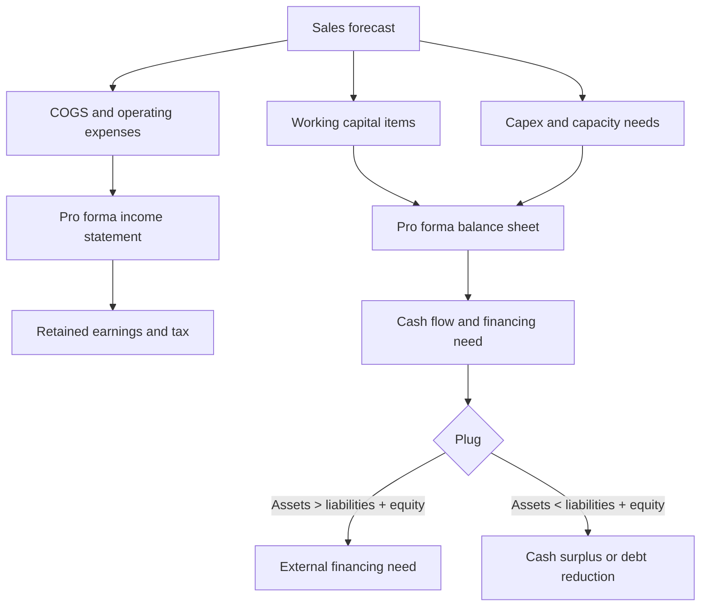
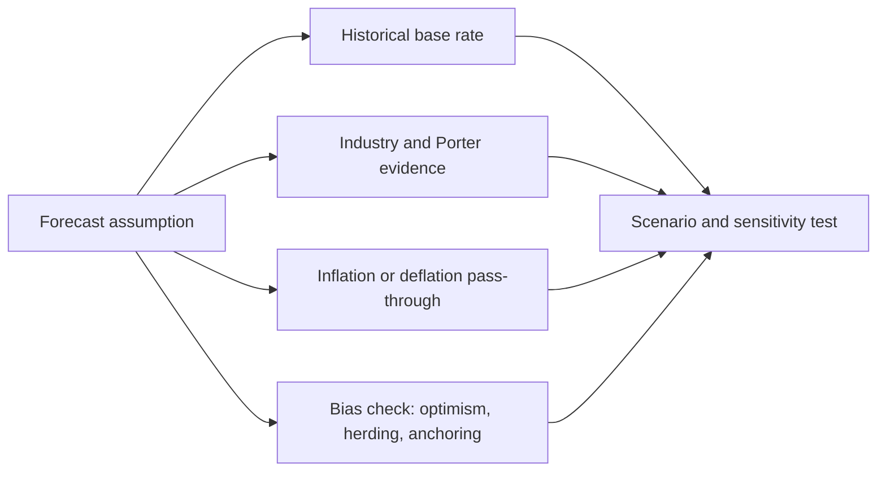

# M12: Introduction to Financial Statement Modeling

> **模块定位**：把三张报表转成可比较、可预测、可质疑的经营证据。 本模块聚焦 **Introduction to Financial Statement Modeling**，要求把官方 LOS 转成可执行的判断、计算或解释动作。

---

## Official Module Structure

- Learning Outcomes: Introduction to Financial Statement Modeling
- 12.01 | Introduction
- 12.02 | Building a Financial Statement Model
- 12.03 | Behavioral Finance and Analyst Forecasts
- 12.04 | The Impact of Competitive Factors in Prices and Costs
- 12.05 | Modeling Inflation and Deflation
- 12.06 | The Forecast Horizon and Long-Term Forecasting

## Learning Outcome Statements

1. demonstrate the development of a sales-based pro forma company model
2. explain how behavioral factors affect analyst forecasts and recommend remedial actions for analyst biases
3. explain how the competitive position of a company based on a Porter’s five forces analysis affects prices and costs
4. explain how to forecast industry and company sales and costs when they are subject to price inflation or deflation
5. explain considerations in the choice of an explicit forecast horizon and an analyst’s choices in developing projections beyond the short-term forecast horizon

---

## 1. 模块定位

### 12.1 学习任务
- **核心问题**：考试希望你用 `Introduction to Financial Statement Modeling` 解释什么、计算什么、比较什么，或判断什么。
- **输入信息**：题干事实、数据、假设、时间口径、单位、约束条件。
- **输出结果**：中文结论 + 英文关键术语 + 必要公式/框架 + 限制条件。

### 12.2 考试角色
- **难度类型**：概念+应用。
- **高频题型**：定义辨析、情境判断、计算解释、表格补数、跨模块比较。
- **答题原则**：先判断 LOS 动词，再选择工具；计算后必须解释结果含义。

### 12.3 关键英文术语
- **Introduction to Financial Statement Modeling（核心术语）**：本模块关键词，用于定位 LOS、题干条件和解题动作。
- **Introduction（核心术语）**：本模块关键词，用于定位 LOS、题干条件和解题动作。
- **Building a Financial Statement Model（核心术语）**：本模块关键词，用于定位 LOS、题干条件和解题动作。
- **Behavioral Finance and Analyst Forecasts（核心术语）**：本模块关键词，用于定位 LOS、题干条件和解题动作。
- **The Impact of Competitive Factors in Prices and Costs（核心术语）**：本模块关键词，用于定位 LOS、题干条件和解题动作。
- **Modeling Inflation and Deflation（核心术语）**：本模块关键词，用于定位 LOS、题干条件和解题动作。
- **The Forecast Horizon and Long-Term Forecasting（核心术语）**：本模块关键词，用于定位 LOS、题干条件和解题动作。

## 2. 官方 LOS 对应学习目标

| LOS | 官方要求 | 中文学习动作 | 做题输出 |
|---|---|---|---|
| 12.1 | demonstrate the development of a sales-based pro forma company model | 识别概念、解释机制并应用到题干。 | 写出结论、依据、公式口径和限制条件。 |
| 12.2 | explain how behavioral factors affect analyst forecasts and recommend remedial actions for analyst biases | 解释机制、原因和后果；给出符合约束的行动建议 | 写出结论、依据、公式口径和限制条件。 |
| 12.3 | explain how the competitive position of a company based on a Porter’s five forces analysis affects prices and costs | 解释机制、原因和后果 | 写出结论、依据、公式口径和限制条件。 |
| 12.4 | explain how to forecast industry and company sales and costs when they are subject to price inflation or deflation | 解释机制、原因和后果 | 写出结论、依据、公式口径和限制条件。 |
| 12.5 | explain considerations in the choice of an explicit forecast horizon and an analyst’s choices in developing projections beyond the short-term forecast horizon | 解释机制、原因和后果 | 写出结论、依据、公式口径和限制条件。 |

## 3. 核心知识树

```text
12. Introduction to Financial Statement Modeling
├─ 12.1 基于销售的 Pro Forma 模型 (Sales-Based Pro Forma Model)
│  ├─ 12.1.1 Sales forecast 是 driver：COGS、SG&A、working capital 常按 sales percentage 推
│  ├─ 12.1.2 固定/阶梯项目：debt、interest、capacity-driven PP&E 不能机械按销售比例
│  └─ 12.1.3 Plug：forecast assets - forecast liabilities - forecast equity 表示融资缺口或现金盈余
├─ 12.2 分析师预测偏差与修正 (Analyst Forecast Bias and Remedies)
│  ├─ 12.2.1 Bias：optimism、selection、herding、anchoring/self-attribution
│  ├─ 12.2.2 Remedy：base-rate、scenario analysis、cross-validation、forecast accuracy tracking
│  └─ 12.2.3 判断：预测明显高于历史与行业时，必须给出结构性证据
├─ 12.3 波特效应：价格与成本影响 (Porter Effects on Prices and Costs)
│  ├─ 12.3.1 Supplier power -> COGS/wage/raw material assumptions
│  ├─ 12.3.2 Buyer power/substitutes/rivalry -> pricing power、volume growth、margin fade
│  └─ 12.3.3 判断：五力必须转成 price、cost、reinvestment、terminal margin 的数字假设
├─ 12.4 通胀/通缩在销售与成本预测中的影响 (Inflation / Deflation in Sales and Cost Forecasts)
│  ├─ 12.4.1 Nominal growth = (1 + real growth)(1 + inflation) - 1
│  ├─ 12.4.2 通胀：看是否能 pass through price；成本项目要分 labor/material/fixed cost
│  └─ 12.4.3 通缩：定价承压、inventory write-down 风险上升、固定成本吸收变差
├─ 12.5 预测期与终值选择 (Explicit Forecast Horizon and Terminal Projection Choices)
│  ├─ 12.5.1 Forecast horizon：直到公司接近稳定增长/稳定 margin/稳定 reinvestment
│  ├─ 12.5.2 Terminal value：Gordon growth 或 exit multiple，关键假设要敏感性测试
│  └─ 12.5.3 判断：terminal growth 长期不应显著超过经济增长，terminal margin 要符合竞争格局
```

## 核心图解





## 4. 知识点详解

### 12.1 基于销售的 Pro Forma 模型 (Sales-Based Pro Forma Model)

- **核心原理**：以销售预测(sales forecast)作为输入驱动变量(input driver)，根据历史关系确定其他财务报表项目的预测值
- **销售百分比法 (Percentage-of-Sales Method)**：假设某些项目（如 COGS、SG&A、流动资产、流动负债）与销售额保持固定比例关系
- **固定项目**：不随销售变动的项目（如长期债务、固定资产/产能）需要单独预测
- **迭代过程 (Iterative Process)**：预测的利息费用(interest expense)取决于预测的债务水平，而债务水平又取决于融资需求(funding needs)，需要通过循环引用(circular reference)解决
- **模型结构**：利润表预测 → 资产负债表预测 → 现金流量表预测 → 融资缺口分析(plug/financing shortfall)

### 12.2 分析师预测偏差与修正 (Analyst Forecast Bias and Remedies)

**常见偏差类型：**
- **过度乐观偏差 (Optimism Bias)**：分析师倾向于高估收益增长，尤其是对热门行业和明星股票
- **选择性偏差 (Selection Bias)**：分析师倾向于跟踪表现良好的公司，导致样本偏差(sample bias)
- **羊群效应 (Herding)**：为不偏离同行共识(consensus)，分析师会倾向于维持接近市场预期的预测
- **自我归因偏差 (Self-Attribution Bias)**：将成功归因于自身能力，失败归因于外部因素

**修正方法 (Remedies)：**
- 使用多情景分析(multiple scenario analysis)——基准(base case)、乐观(bull case)和悲观(bear case)
- 关注预测与历史表现的一致性——如果预测增长率远超历史趋势，需要充分的证据支持
- 交叉验证(cross-validation)：比较公司指引(management guidance)、卖方分析师(sell-side analyst)预测和独立第三方预测
- 使用预测精确度指标(forecast accuracy metrics)系统跟踪和分析预测历史记录

### 12.3 波特效应：价格与成本影响 (Porter Effects on Prices and Costs)

- **波特五力模型 (Porter's Five Forces)** 在财务预测中的应用：
  - 供应商议价能力(bargaining power of suppliers) → 影响 COGS 和利润率预测
  - 客户议价能力(bargaining power of buyers) → 影响定价能力和毛利率
  - 新进入者威胁(threat of new entrants) → 影响长期利润率假设
  - 替代品威胁(threat of substitutes) → 影响销量增长假设
  - 行业内部竞争(intensity of rivalry) → 影响投资回报率和盈利可持续性

- **分析应用**：五力分析结果应转化为具体的预测假设——例如，供应商议价能力强意味着未来毛利率可能下降，预测时应反映这一趋势

### 12.4 通胀/通缩在销售与成本预测中的影响 (Inflation / Deflation in Sales and Cost Forecasts)

- **通胀环境 (Inflationary Environment)**：
  - 在销售预测中反映价格增长(pass-through pricing)能力
  - 在成本预测中考虑工资膨胀(wage inflation)和原材料成本上升
  - 名义增长率(nominal growth rate)和实际增长率(real growth rate)的区分
  - 通胀对不同成本项目的影响不同（如劳动成本 vs 原材料成本），需要单独分析

- **通缩环境 (Deflationary Environment)**：
  - 定价能力下降，毛利率受压
  - 存货减记风险上升（与 M05 存货分析关联）
  - 固定成本负担加重（通缩下同样的固定成本需要更多的销量覆盖）

### 12.5 预测期与终值选择 (Explicit Forecast Horizon and Terminal Projection Choices)

- **显式预测期 (Explicit Forecast Horizon)**：通常为 3-5 年，在此期间逐项详细预测各财务科目
- **终值 (Terminal Value)**：预测期后的价值，通常占公司总价值的很大比例（有时 > 70%）
- **终值计算方法**：
  - **永续增长模型 (Perpetuity Growth Model / Gordon Growth Model)**：假设终值期后 FCFF/FCFE 以固定增长率(g)永续增长
  - **退出倍数法 (Exit Multiple Approach)**：基于可比公司估值倍数(comparable multiples)估算终值

- **关键判断**：
  - 预测期长度取决于公司是否处于稳定增长阶段——高增长公司需要更长的预测期
  - 永续增长率(g)应合理，通常不超过经济长期增长率
  - 终值假设对估值结果极其敏感，应进行敏感性分析(sensitivity analysis)
  - 多情景分析：不同的终值假设对应不同的增长情景

## 5. 关键公式与计算框架

### 5.1 核心内容

| 指标 | 公式 | 说明 |
|------|------|------|
| 销售百分比预测 | `Forecast Item = Forecast Sales x (Historical Item / Historical Sales)` | 简单比例法 |
| 永续增长终值 (FCFF) | `TV = FCFF_{n+1} / (WACC - g)` | FCFF 终值 |
| 永续增长终值 (FCFE) | `TV = FCFE_{n+1} / (r - g)` | FCFE 终值 |
| 退出倍数终值 | `TV = EBITDA_n x Selected Multiple` | 基于可比退出倍数 |
| 融资缺口 (Plug) | `Forecast Assets - Forecast Liabilities - Forecast Equity` | 需外部融资或产生盈余 |
| Nominal Growth | `(1 + Real Growth) x (1 + Inflation) - 1` | 区分销量增长和价格增长 |
| Forecast COGS | `Forecast Sales x Historical COGS / Historical Sales` | 仅在成本率稳定时使用 |
| Forecast Working Capital Item | `Forecast Sales x Historical WC Item / Historical Sales` | 应收、存货、应付可用销售百分比法起步 |
| Sensitivity Table | `Value under different g / margin / multiple assumptions` | 终值和关键假设必须做情景检查 |

## 6. 常见考点与解题思路

| 重要性 | 考点 | 解题动作 |
|---|---|---|
| ⭐⭐⭐ | 12.1 Introduction | 先定位题干触发词，再写公式/框架，最后解释结果或判断陷阱。 |
| ⭐⭐⭐ | 12.2 Building a Financial Statement Model | 先定位题干触发词，再写公式/框架，最后解释结果或判断陷阱。 |
| ⭐⭐ | 12.3 Behavioral Finance and Analyst Forecasts | 先定位题干触发词，再写公式/框架，最后解释结果或判断陷阱。 |
| ⭐⭐ | 12.4 The Impact of Competitive Factors in Prices and Costs | 先定位题干触发词，再写公式/框架，最后解释结果或判断陷阱。 |
| ⭐ | 12.5 Modeling Inflation and Deflation | 先定位题干触发词，再写公式/框架，最后解释结果或判断陷阱。 |

### 6.9 ⭐⭐ Legacy 考点补充

### 6.1 核心内容

- **考点1**：销售百分比法预测财务报表。解题思路：先预测销售，再将各项目分为随销售变动的项目和固定项目，分别计算
- **考点2**：预测偏差识别与修正。解题思路：识别特定类型偏差，使用多情景分析和交叉验证方法修正
- **考点3**：波特五力在预测中的运用。解题思路：将行业竞争分析转化为具体的预测假设——关注五力变化对价格、成本和投资水平的传导
- **考点4**：终值计算与敏感性分析。解题思路：应用永续增长模型或退出倍数法，并在不同增长率/倍数假设下进行敏感性测试

## 7. 易错点与考试陷阱

| ❌ 错误理解 | ✅ 正确理解 | 为什么错 / 考试提醒 |
|---|---|---|
| ❌ 忽略：预测的自我一致性: 各个预测假设之间必须逻辑一致——高速利润增长假设应与资产增长和融资需求相匹配 | ✅ 预测的自我一致性: 各个预测假设之间必须逻辑一致——高速利润增长假设应与资产增长和融资需求相匹配 | 题干通常会用口径、顺序、定义边界或例外条件设置干扰。 |
| ❌ 忽略：终值的权重: 终值通常占估值的绝大部分——不要因为详细预测了 3-5 年就放松对终值假设的审视 | ✅ 终值的权重: 终值通常占估值的绝大部分——不要因为详细预测了 3-5 年就放松对终值假设的审视 | 题干通常会用口径、顺序、定义边界或例外条件设置干扰。 |
| ❌ 忽略：永续增长率的合理性: 在竞争激烈的行业中，长期永续增长率不应显著超过经济整体增长率 | ✅ 永续增长率的合理性: 在竞争激烈的行业中，长期永续增长率不应显著超过经济整体增长率 | 题干通常会用口径、顺序、定义边界或例外条件设置干扰。 |
| ❌ 忽略：循环引用: 利息费用 → 融资需要 → 利息费用的循环关系在 Excel 建模中需要启用迭代计算(iterative calculation) | ✅ 循环引用: 利息费用 → 融资需要 → 利息费用的循环关系在 Excel 建模中需要启用迭代计算(iterative calculation) | 题干通常会用口径、顺序、定义边界或例外条件设置干扰。 |
| ❌ 忽略：历史关系可能会变: 基于历史关系的销售百分比法假设未来关系不变——但经济环境、竞争格局或业务模式的变化会使历史关系失效 | ✅ 历史关系可能会变: 基于历史关系的销售百分比法假设未来关系不变——但经济环境、竞争格局或业务模式的变化会使历史关系失效 | 题干通常会用口径、顺序、定义边界或例外条件设置干扰。 |

## 8. 跨模块关联

- **连接 M02**：revenue growth、gross margin、operating margin 是 pro forma income statement 的起点。
- **连接 M03/M11**：working capital、asset turnover、leverage ratios 决定 forecast balance sheet 和融资缺口。
- **连接 M04/M05/Equity**：FCFF/FCFE forecasts 是估值输入，CFO 质量决定模型可信度。
- **连接 M10**：低质量 earnings 不应直接外推；先 normalize earnings、cash flow 和 one-off items。
- **连接 Corporate Issuers/Credit**：模型输出的 financing need、coverage、leverage 用于融资和偿债能力判断。


## 9. 复习与刷题提示

- 第一轮：按 `Official Module Structure` 逐节过概念，把每个 LOS 改写成中文任务。
- 第二轮：对照 `## 3. 核心知识树` 做主动回忆，能说出每个编号节点的定义、公式/框架和陷阱。
- 第三轮：刷题后记录错因，如果暴露 MOC 缺口，按 `docs/moc-auto-patch-workflow.md` 进入补强流程。
- 考前：只看术语、公式/框架、易错点和本模块错题，避免重新铺开所有正文。

## 10. Legacy Notes Integrated

- **主要 legacy 来源**：`M11-Financial-Statement-Modeling.md` (high, 0.485)
- **整合规则**：高置信内容已合入 `知识点详解`、`公式与计算框架`、`常见考点`、`易错陷阱` 和 `跨模块关联`。
- **边界**：若 legacy 内容与 2026 官方 LOS 冲突，以官方 module 名称、LOS 和 registry 为准。
