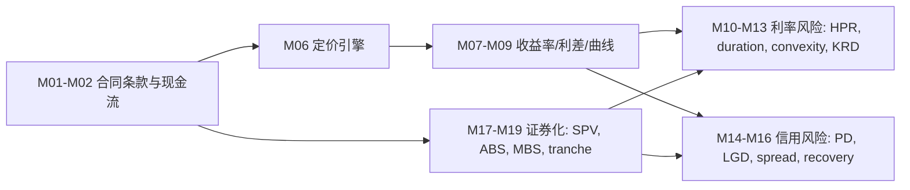

# Fixed Income MOC

> **一句话核心**：从债券现金流、收益率曲线、久期凸性、信用和证券化拆解固定收益风险回报。

---

## 1. 科目定位

- **考试权重**：11-14%
- **官方模块数**：19
- **主线框架**：拆现金流 -> 选折现率/曲线 -> 估值 -> 度量利率/信用/期权风险
- **使用方式**：先从官方模块导航进入，再用编号知识树做主动回忆，最后用公式/陷阱清单做考前压缩。

## 2. 官方模块导航

| 编号 | 官方 Module | 难度 | 必考点 | 模块链接 |
|---|---|---|---|---|
| M01 | Fixed-Income Instrument Features | 概念+应用 | Introduction / Features of Fixed-Income Securities | [[M01-Fixed-Income-Instrument-Features]] |
| M02 | Fixed-Income Cash Flows and Types | 概念+应用 | Introduction / Fixed-Income Cash Flow Structures | [[M02-Fixed-Income-Cash-Flows-and-Types]] |
| M03 | Fixed-Income Issuance and Trading | 概念+应用 | Introduction / Fixed-Income Segments, Issuers, and Investors | [[M03-Fixed-Income-Issuance-and-Trading]] |
| M04 | Fixed-Income Markets for Corporate Issuers | 计算+解释 | Introduction / Short-Term Funding Alternatives | [[M04-Fixed-Income-Markets-for-Corporate-Issuers]] |
| M05 | Fixed-Income Markets for Government Issuers | 概念+应用 | Introduction / Sovereign Debt | [[M05-Fixed-Income-Markets-for-Government-Issuers]] |
| M06 | Fixed-Income Bond Valuation: Prices and Yields | 计算+解释 | Introduction / Bond Pricing and the Time Value of Money | [[M06-Fixed-Income-Bond-Valuation-Prices-and-Yields]] |
| M07 | Yield and Yield Spread Measures for Fixed-Rate Bonds | 计算+解释 | Introduction / Periodicity and Annualized Yields | [[M07-Yield-and-Yield-Spread-Measures-for-Fixed-Rate-Bonds]] |
| M08 | Yield and Yield Spread Measures for Floating-Rate Instruments | 计算+解释 | Introduction / Yield and Yield Spread Measures for Floating-Rate Notes | [[M08-Yield-and-Yield-Spread-Measures-for-Floating-Rate-Instruments]] |
| M09 | The Term Structure of Interest Rates: Spot, Par, and Forward Curves | 计算+解释 | Introduction / Maturity Structure of Interest Rates and Spot Rates | [[M09-The-Term-Structure-of-Interest-Rates-Spot-Par-and-Forward-Curves]] |
| M10 | Interest Rate Risk and Return | 计算+解释 | Introduction / Sources of Return from Investing in a Fixed-Rate Bond | [[M10-Interest-Rate-Risk-and-Return]] |
| M11 | Yield-Based Bond Duration Measures and Properties | 计算+解释 | Introduction / Modified Duration | [[M11-Yield-Based-Bond-Duration-Measures-and-Properties]] |
| M12 | Yield-Based Bond Convexity and Portfolio Properties | 计算+解释 | Introduction / Bond Convexity and Convexity Adjustment | [[M12-Yield-Based-Bond-Convexity-and-Portfolio-Properties]] |
| M13 | Curve-Based and Empirical Fixed-Income Risk Measures | 计算+解释 | Introduction / Curve-Based Interest Rate Risk Measures | [[M13-Curve-Based-and-Empirical-Fixed-Income-Risk-Measures]] |
| M14 | Credit Risk | 计算+解释 | Introduction / Sources of Credit Risk | [[M14-Credit-Risk]] |
| M15 | Credit Analysis for Government Issuers | 概念+应用 | Introduction / Sovereign Credit Analysis | [[M15-Credit-Analysis-for-Government-Issuers]] |
| M16 | Credit Analysis for Corporate Issuers | 计算+解释 | Introduction / Assessing Corporate Creditworthiness | [[M16-Credit-Analysis-for-Corporate-Issuers]] |
| M17 | Fixed-Income Securitization | 概念+应用 | Introduction / The Benefits of Securitization | [[M17-Fixed-Income-Securitization]] |
| M18 | Asset-Backed Security (ABS) Instrument and Market Features | 概念+应用 | Introduction / Covered Bonds | [[M18-Asset-Backed-Security-Instrument-and-Market-Features]] |
| M19 | Mortgage-Backed Security (MBS) Instrument and Market Features | 概念+应用 | Introduction / Time Tranching | [[M19-Mortgage-Backed-Security-Instrument-and-Market-Features]] |

## 3. 核心知识树

```text
Fixed Income (11-14%)
├─ 1. 工具条款层：先读合同，判断现金流、权利和风险归属
│  ├─ 1.1 合同解剖：issuer, par, coupon, maturity, currency, seniority；这些变量决定后续现金流和信用排序
│  ├─ 1.2 契约与保护：affirmative covenant 要求做什么，negative covenant 限制做什么；考试常问谁受保护
│  └─ 1.3 或有条款：callable 利发行人、putable 利投资者、convertible 带 equity upside；含期权工具不能只用普通 YTM 直觉
├─ 2. 现金流层：把债券拆成可贴现的 CF_t
│  ├─ 2.1 票息结构：fixed、floating、zero、step-up、deferred、PIK；先判断 CF 是否确定
│  ├─ 2.2 本金结构：bullet、amortizing、sinking fund；本金回收越早，通常 duration 越短
│  └─ 2.3 通胀/信用联结：TIPS principal = original principal x CPI ratio；CLN 把信用事件嵌入现金流
├─ 3. 市场与发行层：决定报价、流动性和融资约束
│  ├─ 3.1 市场分类：money vs capital, primary vs secondary, public vs private；影响流动性与信息披露
│  ├─ 3.2 Repo：collateralized borrowing, repo rate, haircut；连接短端利率、杠杆和交易对手风险
│  └─ 3.3 指数与交易结构：OTC/dealer market，固定收益指数按 issuer、maturity、credit、currency 分层
├─ 4. 公司发行人融资层：把发行工具映射到信用和流动性风险
│  ├─ 4.1 Corporate bonds：IG vs HY，secured vs unsecured，senior vs subordinated；决定 spread 与 recovery
│  ├─ 4.2 Bank loans：通常浮动利率、较高 seniority/collateral；连接 FRN 和 corporate credit
│  └─ 4.3 CP/MTN/deposit notes：CP 依赖 backup line 和短期信用；MTN 提供 flexible issuance
├─ 5. 政府发行人融资层：提供 benchmark curve 和主权信用框架
│  ├─ 5.1 Sovereign：local currency vs foreign currency；货币主权改变违约与通胀风险
│  ├─ 5.2 Agency/supranational：显性或隐性支持影响 spread；不是所有 agency 都等同 sovereign
│  └─ 5.3 Municipal/TIPS：taxable equivalent yield = tax-exempt yield/(1-tax rate)；TIPS 调本金不直接保证真实回报
├─ 6. 定价层：用现金流和折现率得到 clean/full price
│  ├─ 6.1 YTM 定价：P = Σ C/(1+y/m)^t + FV/(1+y/m)^N；y 与付息频率必须同口径
│  ├─ 6.2 价格关系：coupon rate > YTM 为 premium，coupon rate < YTM 为 discount；期限长/票息低更敏感
│  └─ 6.3 交易惯例：full price = clean price + accrued interest；matrix pricing 用相似债券估计非流动债 required yield
├─ 7. 固定利率收益率与利差层：从 price 反推 required return 和风险补偿
│  ├─ 7.1 Yield lens：current yield 只看 coupon income；YTM 是 promised CF 的 IRR，不是 realized return
│  ├─ 7.2 Annualization：periodic yield、BEY、EAY 按复利频率转换；题干口径优先
│  └─ 7.3 Spread lens：G-spread/I-spread/Z-spread 分别依赖 government、swap、spot curve；spread 混合信用、流动性、税收、期权
├─ 8. 浮动利率与货币市场层：短端报价和 reset 机制
│  ├─ 8.1 FRN：coupon = reference rate + quoted margin；price 偏离 par 时看 discount margin
│  ├─ 8.2 Money market：BDY = discount/FV x 360/t；MMY = discount/price x 360/t；BEY = discount/price x 365/t
│  └─ 8.3 判断陷阱：reset 降低利率风险但不消除信用风险；分母和 day basis 是高频失分点
├─ 9. 曲线层：选择 spot、par、forward 的正确用途
│  ├─ 9.1 Spot curve：P = Σ CF_t/(1+s_t)^t；每笔现金流用匹配期限 spot rate
│  ├─ 9.2 Par curve：par rate = (1-DF_N)/ΣDF_t；用于 par coupon/benchmark
│  └─ 9.3 Forward curve：(1+s_n)^n = (1+s_m)^m(1+f)^(n-m)；forward 是隐含无套利利率，不是确定预测
├─ 10. 回报层：把 holding period return 拆成来源
│  ├─ 10.1 HPR = (coupon + reinvestment income + sale price - purchase price)/purchase price
│  ├─ 10.2 Pull to par：discount bond price 上行至 par，premium bond 下行至 par，前提是其他条件不变
│  └─ 10.3 Horizon vs Macaulay duration：horizon < MacDur 价格风险主导；horizon > MacDur 再投资风险主导
├─ 11. Yield-based duration 层：小幅平行 YTM 变动的一阶风险
│  ├─ 11.1 Macaulay duration = Σ[t x PV(CF_t)]/full price；现金流时间加权平均
│  ├─ 11.2 Modified duration = MacDur/(1+y/m)；%ΔP ≈ -ModDur x Δy
│  └─ 11.3 Money duration/PVBP：money duration = ModDur x full price；PVBP ≈ money duration x 0.0001
├─ 12. Convexity 与组合层：修正 duration 的曲率误差
│  ├─ 12.1 Convexity = (P_- + P_+ - 2P_0)/(P_0 x Δy^2)；大幅 yield move 必须加 convexity
│  ├─ 12.2 %ΔP ≈ -D_mod x Δy + 0.5 x Convexity x Δy^2；Δy 用小数
│  └─ 12.3 Portfolio properties：duration/convexity 用 market value weight；非平行移动时单一 duration 不够
├─ 13. Curve-based/empirical 风险层：处理非平行曲线和含期权现金流
│  ├─ 13.1 Effective duration：现金流会随利率变时，用 P_- 与 P_+ 重新定价
│  ├─ 13.2 Key rate duration：只 shock 某一期限节点；用于 twist/steepening/flattening
│  └─ 13.3 Empirical duration：从历史价格和 benchmark yield 估计；可与模型 duration 不一致
├─ 14. 信用风险层：把 spread 拆成违约、降级、损失和流动性补偿
│  ├─ 14.1 ECL ≈ PD x LGD x Exposure；LGD = 1 - recovery rate
│  ├─ 14.2 Credit ratings：相对风险排序，不是保证；rating migration 可先于 default 影响价格
│  └─ 14.3 Spread drivers：宏观、行业、发行人、流动性、期权、税收和 technical factors
├─ 15. 政府信用层：主权与非主权发行人的偿付能力框架
│  ├─ 15.1 Sovereign：经济增长、财政、外部头寸、货币政策、政治风险
│  ├─ 15.2 Local vs foreign currency：本币债有货币发行能力但有通胀/贬值风险；外币债受外汇储备约束
│  └─ 15.3 Non-sovereign government：看政府支持、独立收入和法律责任边界
├─ 16. 公司信用层：从 business risk 到 recovery waterfall
│  ├─ 16.1 Business risk：行业周期、竞争地位、规模、多元化、经营杠杆
│  ├─ 16.2 Financial risk：coverage、leverage、cash flow stability、liquidity、refinancing access
│  └─ 16.3 Issue analysis：secured/senior/subordinated 与 covenants 影响 issue rating 和 recovery
├─ 17. 证券化基础层：把资产池现金流转换成证券现金流
│  ├─ 17.1 Parties：originator, SPV, servicer, trustee, credit enhancer, investors；SPV 提供 bankruptcy remoteness
│  ├─ 17.2 Benefits：发行人融资多元化/资产出表，投资者获得定制敞口，市场提升流动性
│  └─ 17.3 判断：证券化重新分配风险，不消除 collateral risk；结构复杂度本身是风险
├─ 18. ABS 层：非抵押资产池、covered bonds 和信用增级
│  ├─ 18.1 ABS collateral：auto loans、credit cards、receivables；现金流模式决定 amortization/trigger risk
│  ├─ 18.2 Covered bond：dual recourse，资产留在 issuer balance sheet；不同于典型 SPV true sale
│  └─ 18.3 Credit enhancement：subordination、overcollateralization、excess spread、reserve account、guarantee/insurance
└─ 19. MBS 层：提前还款、分层和商业地产信用
   ├─ 19.1 RMBS：prepayment 造成 contraction/extension risk；CPR/SMM 衡量提前还款速度
   ├─ 19.2 CMO：sequential/pay-through tranches 重排 principal timing；support tranche 吸收更多现金流波动
   └─ 19.3 CMBS：DSCR = NOI/debt service，LTV = loan/property value，debt yield = NOI/loan；balloon risk 和 prepayment protection 高频
```

## 3.5 核心图解



## 4. 跨模块依赖关系

### 4.1 固定收益内部依赖图

```text
M01 terms/covenants/options
├─> M02 cash-flow shape ──> M06 price engine ──> M07 YTM/spread
│                         └─> M09 spot/par/forward curve ──> M13 curve risk
├─> M11/M12 duration-convexity when cash flows are fixed or yield-based
└─> M13 effective duration when embedded options/prepayment change cash flows

M03 issuance/liquidity/repo
├─> M04 corporate funding ──> M16 corporate credit ──┐
├─> M05 government markets ─> M15 sovereign credit ──┼─> M14 credit risk/spread compensation
└─> M07 liquidity/benchmark spread inputs ───────────┘

M17 securitization parties/SPV
├─> M18 ABS collateral + credit enhancement ──> M14 credit risk allocation
└─> M19 MBS prepayment/tranching ─────────────> M13 effective duration/negative convexity
```

### 4.2 关键接口表

| 接口 | 上游输入 | 下游使用 | 考试判断 |
|---|---|---|---|
| TVM -> 债券定价 | M02 的 CF_t、M06 的 YTM/settlement date | M06 clean/full price、M07 YTM、M10 HPR | 现金流确定且题给单一 YTM 时，用 YTM 定价；题给 spot curve 时不能偷用 YTM。 |
| Yield curve -> 定价/利差 | M09 spot/par/forward/discount factor | M06 spot pricing、M07 Z-spread、M13 KRD | 单笔 CF 用 spot；par curve 用于 par coupon；forward 是隐含利率。 |
| Bond price -> Yield measures | M06 price | M07 current yield/YTM/BEY/EAY/spreads | current yield 不含 price change；YTM 是 IRR，不等于 realized return。 |
| Money market -> Short-rate interface | M08 BDY/MMY/BEY/add-on rate | M03 repo、M04 CP、M05 T-bills | 先看分母是 face value 还是 price，再看 360/365。 |
| Duration/convexity -> Price risk | M10 Macaulay、M11 modified/money duration/PVBP、M12 convexity | M13 effective/KRD、M19 MBS risk | 固定现金流用 modified duration；含期权或提前还款用 effective duration。 |
| Curve risk -> Spread/credit separation | M13 benchmark curve shocks | M14 credit spread interpretation | benchmark yield move 与 credit spread move 分开判断，别把所有价格下跌都归因于 default。 |
| Credit risk -> Corporate/government analysis | M14 PD/LGD/recovery/rating/spread | M15 sovereign、M16 corporate、M18 ABS tranches | 发行人评级与债项评级可能因 collateral/seniority/covenants 不同而不同。 |
| Securitization -> ABS/MBS | M17 SPV、true sale、servicer、waterfall | M18 credit enhancement、M19 CMO/CMBS | 结构改变现金流和损失分配，不消除 collateral risk。 |
| ABS/MBS -> Interest-rate risk | M18 amortization/credit enhancement、M19 prepayment | M13 effective duration、M12 convexity | RMBS 常有 contraction/extension risk 和 negative convexity；CMBS 更关注 balloon risk、DSCR/LTV/debt yield。 |

### 4.3 跨科目接口

| Fixed Income 节点 | 连接科目 | 接口内容 | 做题提醒 |
|---|---|---|---|
| TVM、YTM、spot/forward | Quantitative Methods | time value of money、IRR、discount factor | 折现频率、年化口径和小数/百分比单位必须一致。 |
| Corporate bonds、bank loans、CP | Corporate Issuers | capital structure、short-term financing、liquidity management | 公司融资工具既是 Fixed Income 工具，也是公司流动性策略。 |
| Credit metrics | Financial Statement Analysis | interest coverage、debt/EBITDA、cash flow ratios | 题干给会计数据时先识别 numerator/denominator。 |
| Municipal/TIPS/taxable equivalent yield | Economics / Portfolio Management | inflation、taxes、real vs nominal return | 税收和通胀改变 after-tax/real return，不一定改变 contractual coupon。 |
| Duration/convexity/KRD | Portfolio Management | immunization、asset-liability matching、risk budgeting | Macaulay duration 用于 horizon intuition，modified/effective/KRD 用于价格风险。 |
| Securitization/ABS/MBS | Alternative Investments / Portfolio Management | structured cash flows、liquidity、tail risk | 高收益 tranche 不等于低风险；先看损失吸收顺序。 |

## 5. 核心对比专题

| 重要性 | 对比项 | 英文 | 中文解释 | 考试判断 |
|---|---|---|---|---|
| ⭐⭐⭐ | 概念 vs 应用 | definition vs application | 先确认官方定义，再放入题干情境判断。 | 概念题也要能说出适用条件和例外。 |
| ⭐⭐⭐ | 计算 vs 解释 | calculation vs interpretation | 数值只是中间结果，答案要解释方向、含义和限制。 | 凡是 calculate and interpret 都不能只算。 |
| ⭐⭐ | 静态知识 vs 决策流程 | static knowledge vs decision process | 把每个模块压缩成输入 -> 工具 -> 输出 -> 陷阱。 | 流程化比孤立背诵更抗干扰。 |
| ⭐⭐⭐ | 英文识题 vs 中文理解 | English trigger vs Chinese explanation | 英文用于识别题干，中文用于确认真正含义。 | 避免看到熟词就按直觉作答。 |
| ⭐⭐ | 本模块 vs 跨模块 | single module vs cross-module use | 同一公式/概念可能在估值、风险、伦理或报表中换场景出现。 | 错题要回填到 MOC 节点。 |

## 6. 公式与框架速查

### M06-M09 定价、收益率与曲线

| 指标 | 公式 | 知识树节点 | 考试说明 |
|------|------|------------|----------|
| Coupon Bond Price | `P = Σ_{t=1}^{N} C/(1+y/m)^t + FV/(1+y/m)^N` | `M06` | `y` 与 coupon frequency 必须同口径 |
| Full Price | `Full Price = Clean Price + Accrued Interest` | `M06` | invoice price 看 full |
| Accrued Interest | `AI = Coupon per period x Days since last coupon / Days in coupon period` | `M06` | day-count convention 题先读清 |
| Matrix Pricing Interpolation | `Interpolated yield = y_L + [(T - T_L)/(T_H - T_L)](y_H - y_L)` | `M06` | 【考纲重点】估计非流动债券 required yield |
| Current Yield | `Annual Coupon / Bond Price` | `M07` | 只看 coupon income |
| Yield to Maturity | `P = Σ CF_t/(1 + YTM/m)^t` | `M07` | YTM 是使价格等于现金流现值的 IRR |
| BEY from Periodic Yield | `BEY = periodic yield x number of periods per year` | `M07` | 债券等价收益率惯例 |
| Effective Annual Yield | `EAY = (1 + periodic rate)^m - 1` | `M07` | 年化 conversion 高频 |
| Government Benchmark Spread | `G-spread = YTM_bond - YTM_government benchmark` | `M07` | 【考纲重点】同期限或插值政府基准 |
| Interpolated Spread | `I-spread = YTM_bond - swap rate at same maturity` | `M07` | 若考纲/题目使用 swap curve |
| Zero-volatility Spread | `Z-spread = constant spread added to spot curve to price bond` | `M07` | 【扩展/谨慎】若题目只要求概念，不手算 |
| Discount Yield | `BDY = (FV - P)/FV x 360/t` | `M08` | 分母是 face value |
| Money Market Yield | `MMY = (FV - P)/P x 360/t` | `M08` | 分母换成 purchase price |
| Bond Equivalent Yield | `BEY = (FV - P)/P x 365/t` | `M08` | 与 MMY 的 day basis 区分 |
| Add-on Rate | `(FV - P)/P x 365/t` or stated day-count | `M08` | 以 purchase price 为分母，读题确认 360/365 |
| Quoted Margin | `Coupon rate = Reference rate + Quoted margin` | `M08` | FRN coupon reset |
| Discount Margin | `Required margin that prices FRN at current market price` | `M08` | 【考纲重点】概念判断多于手算 |
| Spot Pricing | `P = Σ_{t=1}^{N} CF_t/(1+s_t)^t` | `M09` | 每笔 cash flow 用匹配 spot |
| Discount Factor | `DF_t = 1/(1+s_t)^t` | `M09` | spot pricing 前置 |
| Forward from Spot | `(1+s_n)^n = (1+s_m)^m(1+f_{m,n})^{n-m}` | `M09` | 先对齐区间长度 |
| Par Rate | `Par rate = (1 - DF_N)/Σ_{t=1}^{N} DF_t` | `M09` | discount factor 版最稳 |

### M10-M12 回报与利率风险

| 指标 | 公式 | 知识树节点 | 考试说明 |
|------|------|------------|----------|
| Holding Period Return | `HPR = (Coupon income + reinvestment income + sale price - purchase price)/purchase price` | `M10` | return source 要拆开 |
| Macaulay Duration | `D_mac = Σ_{t=1}^{N}[t x PV(CF_t)] / Full Price` | `M10` | cash-flow time weighted average |
| Modified Duration | `D_mod = D_mac/(1+y/m)` | `M11` | fixed cash-flow % price sensitivity |
| Money Duration | `Money Duration = D_mod x Full Price` | `M11` | 货币价格变化基础 |
| PVBP | `PVBP = (P_- - P_+)/2` or `≈ Money Duration x 0.0001` | `M11` | 1 bp shock |
| Duration Price Approx | `%ΔP ≈ -D_mod x Δy` | `M11` | 一阶近似 |
| Convexity | `Convexity = [P_- + P_+ - 2P_0] / (P_0 x (Δy)^2)` | `M12` | 价格重估版常见 |
| Convexity Adjusted Change | `%ΔP ≈ -D_mod x Δy + 0.5 x Convexity x (Δy)^2` | `M12` | 注意 `Δy` 用小数 |
| Portfolio Duration/Convexity | `Portfolio measure = Σ w_i x measure_i` | `M12` | 价值权重，曲线非平行时有限 |
| Effective Duration | `EffDur = (P_- - P_+) / (2P_0Δy)` | `M13` | 【考纲重点】现金流可能随利率变化时 |
| Effective Convexity | `EffCon = (P_- + P_+ - 2P_0)/(P_0(Δy)^2)` | `M13` | option-aware convexity |
| Key Rate Duration | `KRD_k = -(1/P)(ΔP/Δy_k)` | `M13` | 非平行曲线移动 |

### M13-M19 信用与证券化

| 指标 | 公式 | 知识树节点 | 考试说明 |
|------|------|------------|----------|
| Expected Credit Loss Intuition | `ECL ≈ PD x LGD x Exposure` | `M14` | Level I 重点在三因子方向 |
| Loss Given Default | `LGD = 1 - Recovery Rate` | `M14` | recovery 越高，LGD 越低 |
| Interest Coverage | `EBIT / Interest Expense` 或 `EBITDA / Interest Expense` | `M16` | 看题目指定 numerator |
| Debt to EBITDA | `Total Debt / EBITDA` | `M16` | leverage 越高通常信用越弱 |
| Senior Claim Recovery Logic | `Higher priority -> higher expected recovery` | `M14/M16` | 排名不是公式但常决定答案 |
| Taxable Equivalent Yield | `Tax-exempt yield / (1 - tax rate)` | `M05` | 市政债应税等价收益率 |
| TIPS Adjusted Principal | `Original Principal x (Current CPI / Base CPI)` | `M05` | 通胀挂钩债券 |
| CPR from SMM | `CPR = 1 - (1 - SMM)^12` | `M19` | MBS 提前还款速度 |
| SMM from CPR | `SMM = 1 - (1 - CPR)^(1/12)` | `M19` | CPR/SMM 互转 |
| CMBS DSCR | `NOI / Debt Service` | `M19` | 商业抵押贷款覆盖率 |
| CMBS LTV | `Loan Amount / Property Value` | `M19` | 抵押贷款杠杆 |
| Debt Yield | `NOI / Loan Amount` | `M19` | CMBS 信用品质，不依赖 cap rate |

### 考纲范围标记

| 标记 | 内容 |
|------|------|
| 【考纲重点】 | Bond price/full-clean/accrued interest、yield/spread/money-market measures、spot/par/forward curves、duration/convexity/effective/key-rate measures、credit metrics、MBS/CMBS core ratios |
| 【考纲内但无核心公式】 | Instrument features、issuance/trading, corporate/government market structure, securitization parties, covenant/seniority concepts |
| 【超纲/扩展】 | OAS 完整模型、结构化产品现金流 waterfall 建模、复杂 prepayment model、信用迁移矩阵定价不作为 Level I 必背公式 |

---

## 7. 高频考试陷阱

| ❌ 错误理解 | ✅ 正确理解 | 高频场景 |
|---|---|---|
| ❌ clean price 就是付款价 | ✅ 实际付款价是 full price | 按官方定义和 LOS 口径核验。 |
| ❌ current yield 就是总回报 | ✅ 它忽略 price change 和 reinvestment | 按官方定义和 LOS 口径核验。 |
| ❌ YTM 就是每期现金流真实折现率 | ✅ 更精确时应使用 spot curve | 按官方定义和 LOS 口径核验。 |
| ❌ duration 越大收益越高 | ✅ duration 衡量的是利率敏感度，不是回报 | 按官方定义和 LOS 口径核验。 |
| ❌ convexity 只是锦上添花 | ✅ yield move 大时很关键 | 按官方定义和 LOS 口径核验。 |
| ❌ callable bond 对投资者更好 | ✅ callable 通常有利发行人 | 按官方定义和 LOS 口径核验。 |
| ❌ spread 变宽只可能是 default 风险上升 | ✅ 也可能是 liquidity 或 option factors | 按官方定义和 LOS 口径核验。 |
| ❌ MBS 提前还款一定利好投资者 | ✅ 再投资风险和负 convexity 可能伤害投资者 | 按官方定义和 LOS 口径核验。 |
| ❌ high coupon bond 一定 duration 更高 | ✅ 通常反而 duration 更低 | 按官方定义和 LOS 口径核验。 |
| ❌ 债券题都先算 YTM 就够了 | ✅ spot/forward/option-adjusted 场景不能偷懒 | 按官方定义和 LOS 口径核验。 |

## 8. 通用分析框架

### 框架1：债券估值与收益率选择决策树

```text
题干要求 price / yield / spread?
├─ Price
│  ├─ 现金流固定、题给单一 YTM -> `P = Σ CF_t/(1+y/m)^t`
│  ├─ 题给 spot rates / discount factors -> `P = Σ CF_t/(1+s_t)^t` 或 `P = Σ CF_t x DF_t`
│  ├─ 交易日在付息日之间 -> 先算 full price，再按 `clean = full - AI` 或 `full = clean + AI`
│  └─ 非活跃债券、题给 comparable bonds -> matrix pricing/interpolated yield
├─ Yield
│  ├─ 只问 coupon income / price -> current yield
│  ├─ 求使 PV = price 的 IRR -> YTM
│  ├─ 需要年化转换 -> periodic yield, BEY, EAY 按 compounding frequency 选择
│  └─ money market quote -> 先判 BDY/MMY/BEY/add-on 的分母和 day basis
└─ Spread
   ├─ 对政府基准 -> G-spread / benchmark spread
   ├─ 对 swap curve -> I-spread
   ├─ 对 spot curve 加常数使模型价=市场价 -> Z-spread
   └─ FRN 当前价偏离 par -> discount margin
```

### 框架2：利率风险公式选择树

```text
题干问 yield move 对 price 的影响?
├─ 固定现金流、平行小幅 YTM 变动
│  ├─ 百分比价格变化 -> `%ΔP ≈ -D_mod x Δy`
│  ├─ 货币价格变化 -> `money duration x Δy`
│  └─ 1bp 变动 -> `PVBP ≈ money duration x 0.0001`
├─ yield move 较大或题给 convexity
│  └─ `%ΔP ≈ -D_mod x Δy + 0.5 x convexity x Δy^2`
├─ 含 call/put/prepayment 或现金流随利率变
│  └─ `EffDur = (P_- - P_+)/(2P_0Δy)`；必要时用 effective convexity
└─ 非平行曲线移动
   └─ 使用 key rate duration；分别 shock 目标期限节点，不用单一 duration 概括
```

### 框架3：信用与证券化判断树

```text
题干出现 spread / rating / default / tranche / collateral?
├─ 普通信用风险
│  ├─ 损失大小 -> `ECL ≈ PD x LGD x exposure`，`LGD = 1 - recovery`
│  ├─ 价格下跌原因 -> 分 benchmark yield 上升、credit spread widening、liquidity deterioration、option risk
│  └─ recovery 判断 -> secured/senior/collateral/covenants 优先于发行人名称直觉
├─ 主权信用
│  ├─ 本币债 -> fiscal + monetary flexibility + inflation/devaluation risk
│  └─ 外币债 -> external debt, reserves, current account, political risk
├─ 公司信用
│  ├─ business risk -> 行业、竞争、规模、多元化
│  ├─ financial risk -> coverage、leverage、cash flow、liquidity、refinancing
│  └─ issue risk -> secured/unsecured、senior/subordinated、covenants
└─ 证券化
   ├─ 先识别 parties 和 SPV 是否 bankruptcy remote
   ├─ 再看 collateral cash-flow pattern、credit enhancement、waterfall
   ├─ RMBS -> prepayment、contraction/extension、negative convexity
   └─ CMBS -> DSCR、LTV、debt yield、balloon risk、prepayment protection
```

---

## 9. 学习路径建议

- **第一轮：结构对齐**。按模块顺序读官方结构和 LOS，不急着刷难题。
- **第二轮：主动回忆**。遮住解释，只看编号知识树说出定义、公式和陷阱。
- **第三轮：题目驱动**。把错题回填到对应模块和 MOC 节点，形成可复用 fix rule。
- **考前压缩**。只保留高频术语、公式/框架、易错点、跨模块依赖和错题触发点。

## 10. Legacy 内容治理

- 本 MOC 已优先吸收 `_legacy/2026-05-26-official-sync/` 中的中文解释、公式、陷阱和框架。
- `_legacy` 只作为补强来源，不作为最终学习入口；若与官方 2026 LOS 冲突，以 registry 和官方 Topic Outline 为准。
