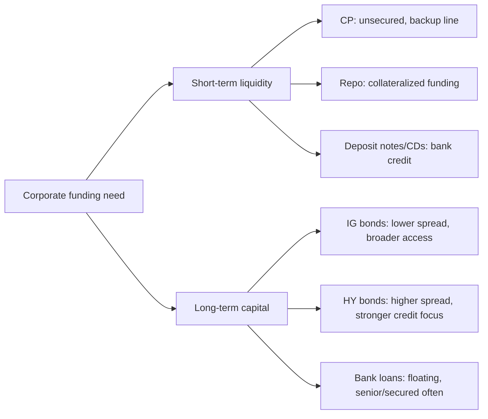

# M04: Fixed-Income Markets for Corporate Issuers

> **模块定位**：从债券现金流、收益率曲线、久期凸性、信用和证券化拆解固定收益风险回报。 本模块聚焦 **Fixed-Income Markets for Corporate Issuers**，要求把官方 LOS 转成可执行的判断、计算或解释动作。

---

## Official Module Structure

- Learning Outcomes: Fixed-Income Markets for Corporate Issuers
- 4.01 | Introduction
- 4.02 | Short-Term Funding Alternatives
- 4.03 | Repurchase Agreements
- 4.04 | Long-Term Corporate Debt

## Learning Outcome Statements

1. compare short-term funding alternatives available to corporations and financial institutions
2. describe repurchase agreements (repos), their uses, and their benefits and risks
3. contrast the long-term funding of investment-grade versus high-yield corporate issuers

---

## 1. 模块定位

### 4.1 学习任务
- **核心问题**：考试希望你用 `Fixed-Income Markets for Corporate Issuers` 解释什么、计算什么、比较什么，或判断什么。
- **输入信息**：题干事实、数据、假设、时间口径、单位、约束条件。
- **输出结果**：中文结论 + 英文关键术语 + 必要公式/框架 + 限制条件。

### 4.2 考试角色
- **难度类型**：计算+解释。
- **高频题型**：定义辨析、情境判断、计算解释、表格补数、跨模块比较。
- **答题原则**：先判断 LOS 动词，再选择工具；计算后必须解释结果含义。

### 4.3 关键英文术语
- **Fixed-Income Markets for Corporate Issuers（核心术语）**：本模块关键词，用于定位 LOS、题干条件和解题动作。
- **Introduction（核心术语）**：本模块关键词，用于定位 LOS、题干条件和解题动作。
- **Short-Term Funding Alternatives（核心术语）**：本模块关键词，用于定位 LOS、题干条件和解题动作。
- **Repurchase Agreements（核心术语）**：本模块关键词，用于定位 LOS、题干条件和解题动作。
- **Long-Term Corporate Debt（核心术语）**：本模块关键词，用于定位 LOS、题干条件和解题动作。
- **Fixed Income（固定收益）**：以约定现金流为核心的债务类证券。

## 2. 官方 LOS 对应学习目标

| LOS | 官方要求 | 中文学习动作 | 做题输出 |
|---|---|---|---|
| 4.1 | compare short-term funding alternatives available to corporations and financial institutions | 比较相似概念的适用条件与差异 | 写出结论、依据、公式口径和限制条件。 |
| 4.2 | describe repurchase agreements (repos), their uses, and their benefits and risks | 描述定义、流程和适用场景 | 写出结论、依据、公式口径和限制条件。 |
| 4.3 | contrast the long-term funding of investment-grade versus high-yield corporate issuers | 识别概念、解释机制并应用到题干。 | 写出结论、依据、公式口径和限制条件。 |

## 3. 核心知识树

```text
4. Fixed-Income Markets for Corporate Issuers
├─ 4.1 公司债券市场 (Corporate Bond Markets)
│  ├─ 4.1.1 Investment grade vs high yield：BBB-/Baa3 及以上通常为 IG；HY spread 对信用周期更敏感
│  ├─ 4.1.2 Public offering vs private placement：披露、流动性、投资者范围和 covenant 强度不同
│  └─ 4.1.3 Seniority/collateral：secured/senior 通常 recovery 更高，连接 M16 issue analysis
├─ 4.2 银行贷款 (Bank Loans)
│  ├─ 4.2.1 Term loan/revolving credit：银行提供中短期或循环融资，常带 financial covenants
│  ├─ 4.2.2 Leveraged loan 通常浮动利率、secured、senior；连接 FRN 和信用分析
│  └─ 4.2.3 银行贷款流动性通常低于公开债券，但 covenant/抵押品保护可能更强
├─ 4.3 商业票据 (Commercial Paper)
│  ├─ 4.3.1 CP 是短期无担保融资工具，通常由高信用质量发行人使用
│  ├─ 4.3.2 Backup line of credit 支持 CP 评级和滚续能力；短端流动性风险是核心
│  └─ 4.3.3 CP 报价连接 M08 money market yield，信用判断连接 liquidity/refinancing risk
├─ 4.4 中期票据 (Medium-Term Notes, MTNs)
│  ├─ 4.4.1 MTN shelf/program issuance：可按需多批次发行，期限和结构灵活
│  └─ 4.4.2 “Medium-term”是市场惯例名，不代表只能中期限
├─ 4.5 存款票据 (Deposit Notes)
│  ├─ 4.5.1 Deposit notes/CDs 是金融机构融资工具，信用风险来自发行银行
│  └─ 4.5.2 与 CP/MTN 对比：期限、担保、投资者基础和监管待遇不同
```

## 3.5 核心图解



## 4. 知识点详解

### 4.1 公司债券市场 (Corporate Bond Markets)

- **投资级债券 (investment-grade bonds)**：评级为 BBB-/Baa3 及以上的公司债券。信用风险较低，收益率较低，利差对经济周期敏感度相对较小。发债主体多为大型成熟企业。
- **高收益债券 (high-yield bonds)**：评级低于投资级（BB+/Ba1 及以下）的公司债券。信用风险较高，收益率较高以补偿违约风险。利差对经济周期和公司特定事件高度敏感。也称"垃圾债券" (junk bonds)。
- **公司债券的发行方式**：公开发行 (public offering) 需在证券监管机构注册，面向广大投资者；私募 (private placement) 无需注册，面向合格机构投资者，条款更灵活但流动性较低。
- **公司债券的期限结构**：短期债券（1-5年）、中期债券（5-12年）、长期债券（12年以上）。不同期限满足不同投资者需求。

### 4.2 银行贷款 (Bank Loans)

- **双边贷款 (bilateral loans)**：一家银行向借款人提供的贷款。条款简单，适合中小规模融资需求。银行评估借款人信用并按自身标准定价。
- **银团贷款 (syndicated loans)**：多家银行联合向借款人提供的大额贷款。由牵头行 (lead arranger) 组织银团并分销贷款份额。银团贷款可分散信用风险，适用于大型融资项目。
- **有担保贷款 (secured loans)**：以特定资产（如应收账款、存货、设备）作为抵押的贷款。担保贷款回收率高于无担保贷款。
- **贷款与债券的关键区别**：贷款通常有浮动利率、更灵活的可协商条款和更严格的契约条款 (covenants)；债券通常有固定或浮动利率、标准化条款和二级市场交易。

### 4.3 商业票据 (Commercial Paper)

- **商业票据 (commercial paper, CP)**：由大型优质公司发行的短期无担保承诺票据，期限通常不超过 270 天（在美国无需 SEC 注册）。主要用于满足短期流动性需求（如营运资金、季节性融资），以贴现方式发行。
- **备用信贷额度 (backup credit lines)**：CP 发行人通常持有银行提供的备用信贷额度，作为 CP 到期时无法展期的应急流动性支持。这是 CP 评级的重要考量因素。
- **CP 市场特征**：面额通常较大（如 $100,000 以上），主要投资者为货币市场基金、保险公司和养老基金。评级要求高，只有投资级以上企业可以进入 CP 市场。

### 4.4 中期票据 (Medium-Term Notes, MTNs)

- **中期票据 (medium-term notes, MTNs)**：公司发行的债务工具，期限通常介于 2 到 10 年，但也有长达 30 年的品种。MTN 可以通过承销商持续发行 (continuous offering)，比传统债券发行更灵活。
- **MTN 的优势**：发行人可根据市场条件和投资者需求灵活调整期限、金额和结构（如固定、浮动、结构性）。投资者可获得定制化的信用敞口和期限选择。
- **MTN 与公司债券的区别**：公司债通常一次性发行、金额固定；MTN 通过持续发行计划分次销售，每次发行金额和条款可调整。

### 4.5 存款票据 (Deposit Notes)

- **存款票据 (deposit notes)**：由银行发行的债务工具，期限通常为 18 个月至 10 年。与银行定期存款类似，但可在二级市场交易。存款票据通常由联邦存款保险部分承保（如 FDIC 承保上限内）。
- **存款票据的特点**：具有银行信用支持但通常无担保，收益率高于同等期限的国债但低于公司债券。主要投资者为寻求银行信用敞口的机构投资者。

## 5. 关键公式与计算框架

### 5.1 核心内容

| 指标 | 公式/关系 | 说明 |
|------|-----------|------|
| 信用评级分界 | `BBB-/Baa3 = 投资级/高收益分界线` | 标准普尔/穆迪评级体系 |
| 利差与评级关系 | `评级越低 → 利差越高 → 融资成本越高` | 信用风险溢价随评级下降上升 |
| CP 贴现基础 | `Price = FV × (1 - BDY × t/360)` | 商业票据的贴现定价 |

## 6. 常见考点与解题思路

| 重要性 | 考点 | 解题动作 |
|---|---|---|
| ⭐⭐⭐ | 4.1 Introduction | 先定位题干触发词，再写公式/框架，最后解释结果或判断陷阱。 |
| ⭐⭐⭐ | 4.2 Short-Term Funding Alternatives | 先定位题干触发词，再写公式/框架，最后解释结果或判断陷阱。 |
| ⭐⭐ | 4.3 Repurchase Agreements | 先定位题干触发词，再写公式/框架，最后解释结果或判断陷阱。 |
| ⭐⭐ | 4.4 Long-Term Corporate Debt | 先定位题干触发词，再写公式/框架，最后解释结果或判断陷阱。 |

### 6.9 ⭐⭐ Legacy 考点补充

### 6.1 核心内容

- **区分 investment-grade 与 high-yield 的特征**：投资级 = 低违约率、低收益率、利差稳定融资渠道广泛；高收益 = 高违约率、高收益率、利差敏感、融资渠道受限。
- **理解 CP 发行必须有 backup line 支持**：考试中常将备用信贷额度与 CP 评级联系起来——无备用额度的 CP 风险显著更高。
- **区分 MTN 与传统公司债券**：MTN 是持续发行、条款灵活；传统债券是一次发行、条款固定。
- **识别不同融资工具的优先顺序**：有担保贷款 → 无担保债券 → 次级债券，破产清偿顺序决定了回收率。

## 7. 易错点与考试陷阱

| ❌ 错误理解 | ✅ 正确理解 | 为什么错 / 考试提醒 |
|---|---|---|
| ❌ 忽略：高收益债券的"高收益"不等于高回报【考试陷阱】：高票息对应高风险，违约发生后本金损失可能远超补偿收益。 | ✅ 高收益债券的"高收益"不等于高回报【考试陷阱】：高票息对应高风险，违约发生后本金损失可能远超补偿收益。 | 题干通常会用口径、顺序、定义边界或例外条件设置干扰。 |
| ❌ 忽略：CP 期限虽短，展期风险不可忽视：如果市场冻结（如金融危机期间），CP 发行人无法展期可能需要依赖备用信贷额度甚至触发违约。 | ✅ CP 期限虽短，展期风险不可忽视：如果市场冻结（如金融危机期间），CP 发行人无法展期可能需要依赖备用信贷额度甚至触发违约。 | 题干通常会用口径、顺序、定义边界或例外条件设置干扰。 |
| ❌ 忽略：银团贷款不一定是债券：虽然银团贷款可以交易，但它本质上是贷款协议，发行和交易机制与债券不同。 | ✅ 银团贷款不一定是债券：虽然银团贷款可以交易，但它本质上是贷款协议，发行和交易机制与债券不同。 | 题干通常会用口径、顺序、定义边界或例外条件设置干扰。 |
| ❌ 忽略：Deposit notes 有 FDIC 保险上限：不是全部存款票据都受全额保护，只限承保额度内。 | ✅ Deposit notes 有 FDIC 保险上限：不是全部存款票据都受全额保护，只限承保额度内。 | 题干通常会用口径、顺序、定义边界或例外条件设置干扰。 |
| ❌ 忽略：同一公司可能有不同评级：发行人评级与具体债项评级可能不同，取决于抵押品和清偿顺序。 | ✅ 同一公司可能有不同评级：发行人评级与具体债项评级可能不同，取决于抵押品和清偿顺序。 | 题干通常会用口径、顺序、定义边界或例外条件设置干扰。 |

## 8. 跨模块关联

| 接口 | 连接模块 | 本模块输出 | 做题用途 |
|---|---|---|---|
| 公司融资工具 | [[M16-Credit-Analysis-for-Corporate-Issuers]] | bonds、loans、CP、MTN、deposit notes | 判断 refinancing、liquidity、capital structure risk |
| 短端报价 | [[M08-Yield-and-Yield-Spread-Measures-for-Floating-Rate-Instruments]] | CP、deposit notes、floating-rate loans | 匹配 money market yield 和 FRN spread |
| 信用利差 | [[M07-Yield-and-Yield-Spread-Measures-for-Fixed-Rate-Bonds]] / [[M14-Credit-Risk]] | IG/HY、secured/senior | 解释 required spread 和 recovery |
| 契约保护 | [[M01-Fixed-Income-Instrument-Features]] | covenants、collateral | 判断债项风险而非只看发行人 |

- **上游模块**：[[M03-Fixed-Income-Issuance-and-Trading]]。先用它提供定义、变量或基础框架。
- **下游模块**：[[M05-Fixed-Income-Markets-for-Government-Issuers]]。本模块输出会被后续更复杂题型调用。

### Legacy 关联补充

- 融资工具 → [[M03-Bond-Valuation]] 不同工具的价格计算
- 信用评级 → [[M14-Credit-Risk]] PD/LGD 与评级关系
- 利差行为 → [[M04-Yield-and-Spread-Measures]] 固定利率利差度量
- 公司信用分析 → [[M16-Credit-Analysis-for-Corporate-Issuers]] 公司发行人的财务分析


## 9. 复习与刷题提示

- 第一轮：按 `Official Module Structure` 逐节过概念，把每个 LOS 改写成中文任务。
- 第二轮：对照 `## 3. 核心知识树` 做主动回忆，能说出每个编号节点的定义、公式/框架和陷阱。
- 第三轮：刷题后记录错因，如果暴露 MOC 缺口，按 `docs/moc-auto-patch-workflow.md` 进入补强流程。
- 考前：只看术语、公式/框架、易错点和本模块错题，避免重新铺开所有正文。

## 10. Legacy Notes Integrated

- **主要 legacy 来源**：`M04-FI-Markets-Corp-Issuers.md` (medium, 0.402)
- **整合规则**：高置信内容已合入 `知识点详解`、`公式与计算框架`、`常见考点`、`易错陷阱` 和 `跨模块关联`。
- **边界**：若 legacy 内容与 2026 官方 LOS 冲突，以官方 module 名称、LOS 和 registry 为准。
