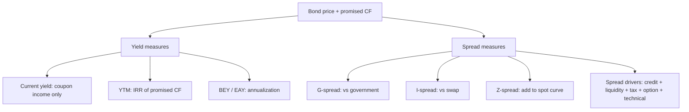

# M07: Yield and Yield Spread Measures for Fixed-Rate Bonds

> **模块定位**：从债券现金流、收益率曲线、久期凸性、信用和证券化拆解固定收益风险回报。 本模块聚焦 **Yield and Yield Spread Measures for Fixed-Rate Bonds**，要求把官方 LOS 转成可执行的判断、计算或解释动作。

---

## Official Module Structure

- Learning Outcomes: Yield and Yield Spread Measures for Fixed-Rate Bonds
- 7.01 | Introduction
- 7.02 | Periodicity and Annualized Yields
- 7.03 | Other Yield Measures, Conventions, and Accounting for Embedded Options
- 7.04 | Yield Spread Measures for Fixed-Rate Bonds and Matrix Pricing

## Learning Outcome Statements

1. calculate annual yield on a bond for varying compounding periods in a year
2. compare, calculate, and interpret yield and yield spread measures for fixed-rate bonds

---

## 1. 模块定位

### 7.1 学习任务
- **核心问题**：考试希望你用 `Yield and Yield Spread Measures for Fixed-Rate Bonds` 解释什么、计算什么、比较什么，或判断什么。
- **输入信息**：题干事实、数据、假设、时间口径、单位、约束条件。
- **输出结果**：中文结论 + 英文关键术语 + 必要公式/框架 + 限制条件。

### 7.2 考试角色
- **难度类型**：计算+解释。
- **高频题型**：定义辨析、情境判断、计算解释、表格补数、跨模块比较。
- **答题原则**：先判断 LOS 动词，再选择工具；计算后必须解释结果含义。

### 7.3 关键英文术语
- **Yield and Yield Spread Measures for Fixed-Rate Bonds（核心术语）**：本模块关键词，用于定位 LOS、题干条件和解题动作。
- **Introduction（核心术语）**：本模块关键词，用于定位 LOS、题干条件和解题动作。
- **Periodicity and Annualized Yields（核心术语）**：本模块关键词，用于定位 LOS、题干条件和解题动作。
- **Other Yield Measures, Conventions, and Accounting for Embedded Options（核心术语）**：本模块关键词，用于定位 LOS、题干条件和解题动作。
- **Yield Spread Measures for Fixed-Rate Bonds and Matrix Pricing（核心术语）**：本模块关键词，用于定位 LOS、题干条件和解题动作。
- **Fixed Income（固定收益）**：以约定现金流为核心的债务类证券。
- **Yield（收益率）**：把债券价格与未来现金流连接起来的回报度量。
- **Option（期权）**：买方拥有权利但无义务，卖方承担相应义务的衍生品。

## 2. 官方 LOS 对应学习目标

| LOS | 官方要求 | 中文学习动作 | 做题输出 |
|---|---|---|---|
| 7.1 | calculate annual yield on a bond for varying compounding periods in a year | 计算并解释数值结果 | 写出结论、依据、公式口径和限制条件。 |
| 7.2 | compare, calculate, and interpret yield and yield spread measures for fixed-rate bonds | 计算并解释数值结果；解释结果的投资含义；比较相似概念的适用条件与差异 | 写出结论、依据、公式口径和限制条件。 |

## 3. 核心知识树

```text
7. Yield and Yield Spread Measures for Fixed-Rate Bonds
├─ 7.1 收益率视角 (Yield Lens)
│  ├─ 7.1.1 Current yield = annual coupon/price；只衡量 coupon income，不含资本利得和再投资
│  ├─ 7.1.2 YTM：使 P = Σ CF_t/(1+YTM/m)^t 的 IRR；隐含持有至到期和再投资假设
│  └─ 7.1.3 Annualization：BEY = periodic yield x periods；EAY = (1+periodic rate)^m - 1
├─ 7.2 利差视角 (Spread Lens)
│  ├─ 7.2.1 Benchmark/G-spread：债券 YTM 减同期限或插值 government yield
│  ├─ 7.2.2 I-spread/Z-spread：分别对 swap curve 和 spot curve；Z-spread 是加到每个 spot rate 的 constant spread
│  └─ 7.2.3 Spread interpretation：credit、liquidity、tax、technical、option risk 都可推宽 spread
```

## 3.5 核心图解



## 4. 知识点详解

### 7.1 收益率视角 (Yield Lens)

- **YTM 是承诺现金流和再投资假设下的 IRR (YTM is IRR under promised cash flows and reinvestment assumptions)**：到期收益率 (YTM) 是使债券现值等于价格的贴现率，隐含假设：持有至到期且所有票息收入按 YTM 再投资。
- **当期收益率仅捕捉票息收入 (current yield captures coupon income only)**：`Current Yield = 年票息收入 / 债券价格`，忽略资本利得/损失和再投资收入。
- **年化收益率转换取决于复利频率 (annual yield conversion depends on compounding frequency)**：不同复利频率下的收益率需要标准化比较。`EAY = (1 + periodic rate)^m - 1`。

### 7.2 利差视角 (Spread Lens)

- **国债基准利差/插值利差/G-利差 (government benchmark spread/interpolated spread/G-spread)**：利差衡量信用风险/流动性风险溢价。G-spread 是在国债即期曲线上插值计算的利差，比简单基准利差更精确。
- **利差包含信用、流动性、期权、税收、技术面因素 (spread embeds credit, liquidity, option, tax, technical factors)**：利差不是纯信用补偿，它综合了多种风险因素。
- **无期权固定利率债券的价格与收益率呈反向关系 (price and yield move inversely for option-free fixed-rate bonds)**：这是固定收益投资最基础的直觉——利率上升时债券价格下降。

## 5. 关键公式与计算框架

### 5.1 核心内容

| 指标 | 公式 |
|------|------|
| 到期收益率 YTM | `P = Σ_{t=1}^{N} C/(1+YTM/m)^t + FV/(1+YTM/m)^N` |
| 当期收益率 | `Current Yield = 年票息 / 债券价格` |
| 债券等价收益率 BEY | `Periodic yield x periods per year` |
| 有效年化收益率 | `EAY = (1 + periodic rate)^m - 1` |
| G-spread | `G-spread = YTM_{bond} - YTM_{government benchmark}`（需插值匹配期限） |
| I-spread | `I-spread = YTM_{bond} - swap rate at same maturity` |
| Z-spread | `constant spread added to each spot rate so PV of cash flows = bond price` |

**考纲标记**：
- 【考纲重点】YTM/current yield/EAY/BEY、benchmark spread、G-spread/interpolated spread 的含义。
- 【考纲内但无核心公式】利差成分解释：credit/liquidity/option/tax/technical。
- 【扩展/谨慎】Z-spread 在 Level I 通常偏概念与方向，若题目未给完整 spot curve 不强行手算。

## 6. 常见考点与解题思路

| 重要性 | 考点 | 解题动作 |
|---|---|---|
| ⭐⭐⭐ | 7.1 Introduction | 先定位题干触发词，再写公式/框架，最后解释结果或判断陷阱。 |
| ⭐⭐⭐ | 7.2 Periodicity and Annualized Yields | 先定位题干触发词，再写公式/框架，最后解释结果或判断陷阱。 |
| ⭐⭐ | 7.3 Other Yield Measures, Conventions, and Accounting for Embedded Options | 先定位题干触发词，再写公式/框架，最后解释结果或判断陷阱。 |
| ⭐⭐ | 7.4 Yield Spread Measures for Fixed-Rate Bonds and Matrix Pricing | 先定位题干触发词，再写公式/框架，最后解释结果或判断陷阱。 |

### 6.9 ⭐⭐ Legacy 考点补充

### 6.1 核心内容

- **YTM 近似计算**：给出债券价格、票息率、期限、面值，反推 YTM。考试中可使用金融计算器。
- **比较不同复利频率的收益率**：统一转换为 EAY 或 BEY (bond equivalent yield) 后比较。
- **计算 G-spread**：确定目标债券的期限后在国债曲线上插值得到对应期限的基准收益率，计算差值。
- **判断利差变化的含义**：利差走阔 → 债券价格下降（相对基准）；利差收窄 → 债券价格上升。

## 7. 易错点与考试陷阱

| ❌ 错误理解 | ✅ 正确理解 | 为什么错 / 考试提醒 |
|---|---|---|
| ❌ 忽略：Same YTM 不代表 same value if timing/risk structure differs：即使两只债券有相同的 YTM，若现金流时间分布不同或含嵌入期权，… | ✅ Same YTM 不代表 same value if timing/risk structure differs：即使两只债券有相同的 YTM，若现金流时间分布不同或含嵌入期权，… | 题干通常会用口径、顺序、定义边界或例外条件设置干扰。 |
| ❌ 忽略：Current yield 不是总回报：它忽略 price change 和 reinvestment income，这一点考试常考。 | ✅ Current yield 不是总回报：它忽略 price change 和 reinvestment income，这一点考试常考。 | 题干通常会用口径、顺序、定义边界或例外条件设置干扰。 |
| ❌ 忽略：YTM 的再投资假设在现实中无法严格满足：如果市场利率变化，实际持有期回报将不同于 YTM。 | ✅ YTM 的再投资假设在现实中无法严格满足：如果市场利率变化，实际持有期回报将不同于 YTM。 | 题干通常会用口径、顺序、定义边界或例外条件设置干扰。 |
| ❌ 忽略：Spread widening 不一定等于违约风险上升：也可能是流动性恶化或市场风险偏好转变。 | ✅ Spread widening 不一定等于违约风险上升：也可能是流动性恶化或市场风险偏好转变。 | 题干通常会用口径、顺序、定义边界或例外条件设置干扰。 |

## 8. 跨模块关联

| 接口 | 连接模块 | 本模块输出 | 做题用途 |
|---|---|---|---|
| YTM/price | [[M06-Fixed-Income-Bond-Valuation-Prices-and-Yields]] | yield as IRR | price-yield 互推 |
| Spread decomposition | [[M14-Credit-Risk]] | G-spread/I-spread/Z-spread | 区分信用、流动性、期权、税收和技术面 |
| Curve basis | [[M09-The-Term-Structure-of-Interest-Rates-Spot-Par-and-Forward-Curves]] | benchmark/swap/spot curve reference | 选择对应利差度量 |
| Realized return | [[M10-Interest-Rate-Risk-and-Return]] | YTM assumptions | 解释 YTM 不等于 HPR |

- **上游模块**：[[M06-Fixed-Income-Bond-Valuation-Prices-and-Yields]]。先用它提供定义、变量或基础框架。
- **下游模块**：[[M08-Yield-and-Yield-Spread-Measures-for-Floating-Rate-Instruments]]。本模块输出会被后续更复杂题型调用。

### Legacy 关联补充

- YTM → [[M03-Bond-Valuation]] 的定价逆运算
- 利差分析 → [[M14-Credit-Risk]] 的信用风险度量
- 年化转换 → [[M05-Floating-Rate-and-Money-Market]] 的货币市场指标


## 9. 复习与刷题提示

- 第一轮：按 `Official Module Structure` 逐节过概念，把每个 LOS 改写成中文任务。
- 第二轮：对照 `## 3. 核心知识树` 做主动回忆，能说出每个编号节点的定义、公式/框架和陷阱。
- 第三轮：刷题后记录错因，如果暴露 MOC 缺口，按 `docs/moc-auto-patch-workflow.md` 进入补强流程。
- 考前：只看术语、公式/框架、易错点和本模块错题，避免重新铺开所有正文。

## 10. Legacy Notes Integrated

- **主要 legacy 来源**：`M04-Yield-and-Spread-Measures.md` (high, 0.466)
- **整合规则**：高置信内容已合入 `知识点详解`、`公式与计算框架`、`常见考点`、`易错陷阱` 和 `跨模块关联`。
- **边界**：若 legacy 内容与 2026 官方 LOS 冲突，以官方 module 名称、LOS 和 registry 为准。
