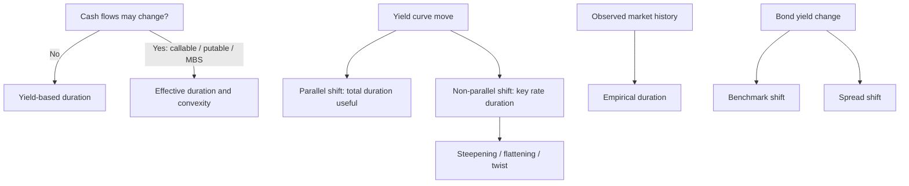

# M13: Curve-Based and Empirical Fixed-Income Risk Measures

> **模块定位**：从债券现金流、收益率曲线、久期凸性、信用和证券化拆解固定收益风险回报。 本模块聚焦 **Curve-Based and Empirical Fixed-Income Risk Measures**，要求把官方 LOS 转成可执行的判断、计算或解释动作。

---

## Official Module Structure

- Learning Outcomes: Curve-Based and Empirical Fixed-Income Risk Measures
- 13.01 | Introduction
- 13.02 | Curve-Based Interest Rate Risk Measures
- 13.03 | Bond Risk and Return Using Curve-Based Duration and Convexity
- 13.04 | Key Rate Duration as a Measure of Yield Curve Risk
- 13.05 | Empirical Duration

## Learning Outcome Statements

1. explain why effective duration and effective convexity are the most appropriate measures of interest rate risk for bonds with embedded options
2. calculate the percentage price change of a bond for a specified change in benchmark yield, given the bond’s effective duration and convexity
3. define key rate duration and describe its use to measure price sensitivity of fixed-income instruments to benchmark yield curve changes
4. describe the difference between empirical duration and analytical duration

---

## 1. 模块定位

### 13.1 学习任务
- **核心问题**：考试希望你用 `Curve-Based and Empirical Fixed-Income Risk Measures` 解释什么、计算什么、比较什么，或判断什么。
- **输入信息**：题干事实、数据、假设、时间口径、单位、约束条件。
- **输出结果**：中文结论 + 英文关键术语 + 必要公式/框架 + 限制条件。

### 13.2 考试角色
- **难度类型**：计算+解释。
- **高频题型**：定义辨析、情境判断、计算解释、表格补数、跨模块比较。
- **答题原则**：先判断 LOS 动词，再选择工具；计算后必须解释结果含义。

### 13.3 关键英文术语
- **Curve-Based and Empirical Fixed-Income Risk Measures（核心术语）**：本模块关键词，用于定位 LOS、题干条件和解题动作。
- **Introduction（核心术语）**：本模块关键词，用于定位 LOS、题干条件和解题动作。
- **Curve-Based Interest Rate Risk Measures（核心术语）**：本模块关键词，用于定位 LOS、题干条件和解题动作。
- **Bond Risk and Return Using Curve-Based Duration and Convexity（核心术语）**：本模块关键词，用于定位 LOS、题干条件和解题动作。
- **Key Rate Duration as a Measure of Yield Curve Risk（核心术语）**：本模块关键词，用于定位 LOS、题干条件和解题动作。
- **Empirical Duration（核心术语）**：本模块关键词，用于定位 LOS、题干条件和解题动作。
- **Fixed Income（固定收益）**：以约定现金流为核心的债务类证券。
- **Yield（收益率）**：把债券价格与未来现金流连接起来的回报度量。

## 2. 官方 LOS 对应学习目标

| LOS | 官方要求 | 中文学习动作 | 做题输出 |
|---|---|---|---|
| 13.1 | explain why effective duration and effective convexity are the most appropriate measures of interest rate risk for bonds with embedded options | 解释机制、原因和后果 | 写出结论、依据、公式口径和限制条件。 |
| 13.2 | calculate the percentage price change of a bond for a specified change in benchmark yield, given the bond’s effective duration and convexity | 计算并解释数值结果 | 写出结论、依据、公式口径和限制条件。 |
| 13.3 | define key rate duration and describe its use to measure price sensitivity of fixed-income instruments to benchmark yield curve changes | 描述定义、流程和适用场景 | 写出结论、依据、公式口径和限制条件。 |
| 13.4 | describe the difference between empirical duration and analytical duration | 描述定义、流程和适用场景 | 写出结论、依据、公式口径和限制条件。 |

## 3. 核心知识树

```text
13. Curve-Based and Empirical Fixed-Income Risk Measures
├─ 13.1 期权感知风险 (Option-Aware Risk)
│  ├─ 13.1.1 Effective duration = (P_- - P_+)/(2P_0Δy)；现金流可能随利率变化时重新定价
│  ├─ 13.1.2 Effective convexity = (P_- + P_+ - 2P_0)/(P_0Δy^2)；适合 callable/putable/MBS
│  └─ 13.1.3 Empirical duration 用历史价格和 benchmark yield 估计，反映市场实际行为
├─ 13.2 曲线风险 (Curve Risk)
│  ├─ 13.2.1 Key rate duration：只改变一个 maturity bucket，衡量非平行曲线风险
│  ├─ 13.2.2 Steepening/flattening/twist：不能用单一 modified duration 完整解释
│  └─ 13.2.3 Benchmark yield shift 与 credit spread shift 分开看，避免把 spread widening 误判成 curve move
```

## 3.5 核心图解



## 4. 知识点详解

### 13.1 期权感知风险 (Option-Aware Risk)

- **有效久期/有效凸性在现金流可能变化时重新定价 (effective duration/effective convexity reprice when cash flows may change)**：对于含嵌入期权（可赎回、可回售）的债券，现金流会随利率变化而改变，因此不能使用基于固定现金流的修正久期，而应使用有效久期 (effective duration) 和有效凸性 (effective convexity)。
- **嵌入期权改变可赎回/提前还款行为 (embedded option changes callability/prepayment behavior)**：利率下降时，可赎回债券的发行人倾向于赎回并再融资，限制了价格上涨空间（负凸性）；利率上升时，MBS 的提前还款减慢（展期风险）。
- **分析久期可能与观察到的经验久期不同 (analytical duration may differ from observed empirical duration)**：基于模型的久期（分析久期）可能不同于从历史数据回归得出的经验久期 (empirical duration)，原因包括模型假设误差、市场摩擦等。

### 13.2 曲线风险 (Curve Risk)

- **关键利率久期隔离期限区间的敏感度 (key rate duration isolates maturity-bucket sensitivity)**：关键利率久期 (key rate duration / partial duration) 衡量收益率曲线上特定期限点的利率变动对债券价格的影响，帮助识别非平行移动的风险暴露。
- **非平行曲线移动打破单一久期直觉 (non-parallel curve shifts break single-duration intuition)**：实际收益率曲线变动往往不是平行的（如长端上升幅度大于短端），此时单一久期指标无法准确描述风险。
- **基准利率变动与信用利差变动是独立问题 (benchmark shift and credit spread shift are separate questions)**：债券收益率变动 = 基准收益率变动 + 信用利差变动，两者驱动因素不同，需要分开分析。

## 5. 关键公式与计算框架

### 5.1 核心内容

| 指标 | 公式 |
|------|------|
| 有效久期 | `EffDur = (P_- - P_+) / (2 x P_0 x Δy)` |
| 有效凸性 | `EffCon = (P_- + P_+ - 2P_0) / (P_0 x (Δy)^2)` |
| 关键利率久期 | `KRD_k = -(1/P) x (ΔP/Δy_k)`（仅移动第 k 个期限点） |
| 收益率分解 | `Δy_bond = Δy_benchmark + Δy_spread` |

## 6. 常见考点与解题思路

| 重要性 | 考点 | 解题动作 |
|---|---|---|
| ⭐⭐⭐ | 13.1 Introduction | 先定位题干触发词，再写公式/框架，最后解释结果或判断陷阱。 |
| ⭐⭐⭐ | 13.2 Curve-Based Interest Rate Risk Measures | 先定位题干触发词，再写公式/框架，最后解释结果或判断陷阱。 |
| ⭐⭐ | 13.3 Bond Risk and Return Using Curve-Based Duration and Convexity | 先定位题干触发词，再写公式/框架，最后解释结果或判断陷阱。 |
| ⭐⭐ | 13.4 Key Rate Duration as a Measure of Yield Curve Risk | 先定位题干触发词，再写公式/框架，最后解释结果或判断陷阱。 |
| ⭐ | 13.5 Empirical Duration | 先定位题干触发词，再写公式/框架，最后解释结果或判断陷阱。 |

### 6.9 ⭐⭐ Legacy 考点补充

### 6.1 核心内容

- **判断何时使用有效久期 vs 修正久期**：债券含嵌入期权（可赎回、可回售、MBS）→ 用有效久期；无期权固定利率债券 → 用修正久期。
- **分析非平行移动的影响**：给定的曲线变化情境（如 flattening、steepening），判断哪种债券受影响最大。
- **计算有效久期**：分别计算利率向上和向下移 Δy 后的价格，代入公式。
- **区分 benchmark shift 与 spread shift 的驱动因素**：benchmark shift 由宏观经济和货币政策驱动；spread shift 由信用状况、流动性等因素驱动。

## 7. 易错点与考试陷阱

| ❌ 错误理解 | ✅ 正确理解 | 为什么错 / 考试提醒 |
|---|---|---|
| ❌ 忽略：可赎回债券和 MBS 的风险不能完全依赖普通修正久期 (callable and MBS risk cannot be fully trusted to plain modifi… | ✅ 可赎回债券和 MBS 的风险不能完全依赖普通修正久期 (callable and MBS risk cannot be fully trusted to plain modifi… | 题干通常会用口径、顺序、定义边界或例外条件设置干扰。 |
| ❌ 忽略：Effective duration ≠ modified duration：只有当现金流不随利率变化时两者才相等。考试常考区分适用场景。 | ✅ Effective duration ≠ modified duration：只有当现金流不随利率变化时两者才相等。考试常考区分适用场景。 | 题干通常会用口径、顺序、定义边界或例外条件设置干扰。 |
| ❌ 忽略：Non-parallel shift 是常态而非例外：组合久期加权平均只适用于平行移动假设，对于 twist 或 butterfly 变动的分析需要 key rate durat… | ✅ Non-parallel shift 是常态而非例外：组合久期加权平均只适用于平行移动假设，对于 twist 或 butterfly 变动的分析需要 key rate durat… | 题干通常会用口径、顺序、定义边界或例外条件设置干扰。 |
| ❌ 忽略：Empirical duration 可能低于 analytical duration：因为现实中利率变动往往伴随信用利差反向变动，部分抵消了纯利率效应。 | ✅ Empirical duration 可能低于 analytical duration：因为现实中利率变动往往伴随信用利差反向变动，部分抵消了纯利率效应。 | 题干通常会用口径、顺序、定义边界或例外条件设置干扰。 |

## 8. 跨模块关联

| 接口 | 连接模块 | 本模块输出 | 做题用途 |
|---|---|---|---|
| Curve shocks | [[M09-The-Term-Structure-of-Interest-Rates-Spot-Par-and-Forward-Curves]] | key maturity rates | 处理 steepening/flattening/twist |
| Option-aware risk | [[M01-Fixed-Income-Instrument-Features]] / [[M02-Fixed-Income-Cash-Flows-and-Types]] | call/put/prepayment cash-flow changes | 选择 effective duration/convexity |
| Credit separation | [[M14-Credit-Risk]] | benchmark yield vs spread move | 区分利率风险和信用利差风险 |
| MBS risk | [[M19-Mortgage-Backed-Security-Instrument-and-Market-Features]] | prepayment-sensitive cash flows | 解释 empirical/effective duration 偏离 |

- **上游模块**：[[M12-Yield-Based-Bond-Convexity-and-Portfolio-Properties]]。先用它提供定义、变量或基础框架。
- **下游模块**：[[M14-Credit-Risk]]。本模块输出会被后续更复杂题型调用。

### Legacy 关联补充

- 有效久期 → [[M11-Yield-Based-Bond-Duration-Measures-and-Properties]] 的修正久期对比
- 嵌入期权 → [[M01-Instrument-Features]] 的或有条款
- Spread shift → [[M14-Credit-Risk]] 的信用利差分析


## 9. 复习与刷题提示

- 第一轮：按 `Official Module Structure` 逐节过概念，把每个 LOS 改写成中文任务。
- 第二轮：对照 `## 3. 核心知识树` 做主动回忆，能说出每个编号节点的定义、公式/框架和陷阱。
- 第三轮：刷题后记录错因，如果暴露 MOC 缺口，按 `docs/moc-auto-patch-workflow.md` 进入补强流程。
- 考前：只看术语、公式/框架、易错点和本模块错题，避免重新铺开所有正文。

## 10. Legacy Notes Integrated

- **主要 legacy 来源**：`M09-Curve-Based-and-Empirical-Risk.md` (high, 0.529)
- **整合规则**：高置信内容已合入 `知识点详解`、`公式与计算框架`、`常见考点`、`易错陷阱` 和 `跨模块关联`。
- **边界**：若 legacy 内容与 2026 官方 LOS 冲突，以官方 module 名称、LOS 和 registry 为准。
