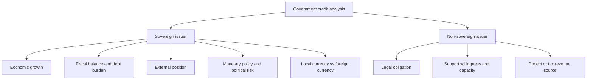

# M15: Credit Analysis for Government Issuers

> **模块定位**：从债券现金流、收益率曲线、久期凸性、信用和证券化拆解固定收益风险回报。 本模块聚焦 **Credit Analysis for Government Issuers**，要求把官方 LOS 转成可执行的判断、计算或解释动作。

---

## Official Module Structure

- Learning Outcomes: Credit Analysis for Government Issuers
- 15.01 | Introduction
- 15.02 | Sovereign Credit Analysis
- 15.03 | Non-Sovereign Credit Risk

## Learning Outcome Statements

1. explain special considerations when evaluating the credit of sovereign and non-sovereign government debt issuers and issues

---

## 1. 模块定位

### 15.1 学习任务
- **核心问题**：考试希望你用 `Credit Analysis for Government Issuers` 解释什么、计算什么、比较什么，或判断什么。
- **输入信息**：题干事实、数据、假设、时间口径、单位、约束条件。
- **输出结果**：中文结论 + 英文关键术语 + 必要公式/框架 + 限制条件。

### 15.2 考试角色
- **难度类型**：概念+应用。
- **高频题型**：定义辨析、情境判断、计算解释、表格补数、跨模块比较。
- **答题原则**：先判断 LOS 动词，再选择工具；计算后必须解释结果含义。

### 15.3 关键英文术语
- **Credit Analysis for Government Issuers（核心术语）**：本模块关键词，用于定位 LOS、题干条件和解题动作。
- **Introduction（核心术语）**：本模块关键词，用于定位 LOS、题干条件和解题动作。
- **Sovereign Credit Analysis（核心术语）**：本模块关键词，用于定位 LOS、题干条件和解题动作。
- **Non-Sovereign Credit Risk（核心术语）**：本模块关键词，用于定位 LOS、题干条件和解题动作。
- **Fixed Income（固定收益）**：以约定现金流为核心的债务类证券。
- **Credit Risk（信用风险）**：发行人无法按时足额履约的风险。

## 2. 官方 LOS 对应学习目标

| LOS | 官方要求 | 中文学习动作 | 做题输出 |
|---|---|---|---|
| 15.1 | explain special considerations when evaluating the credit of sovereign and non-sovereign government debt issuers and issues | 解释机制、原因和后果 | 写出结论、依据、公式口径和限制条件。 |

## 3. 核心知识树

```text
15. Credit Analysis for Government Issuers
├─ 15.1 政府发行人 (Government Issuers)
│  ├─ 15.1.1 Sovereign credit：经济增长、财政收支、债务负担、外部头寸、货币政策、政治制度
│  ├─ 15.1.2 Local-currency debt：有货币发行能力但可能转化为通胀/贬值风险
│  └─ 15.1.3 Foreign-currency debt：受外汇储备、经常账户和外债再融资能力约束
├─ 15.2 非主权政府相关发行人 (Non-sovereign Government Issuers)
│  ├─ 15.2.1 Agency/local authority：看法律责任、政府支持意愿与支持能力
│  ├─ 15.2.2 Revenue-backed issuer：还款来源来自项目或税费收入，不自动等同中央政府信用
│  └─ 15.2.3 Supranational：成员国资本支持与 preferred creditor status 可改善信用质量
```

## 3.5 核心图解



## 4. 知识点详解

### 15.1 政府发行人 (Government Issuers)

- **货币主权、财政灵活性、外部头寸、政治风险 (monetary sovereignty, fiscal flexibility, external position, political risk)**：主权信用的评估维度：能否自主印钞（货币主权）、财政赤字和债务水平（财政灵活性）、外汇储备和贸易平衡（外部头寸）、治理稳定性和政策连续性（政治风险）。
- **主权与非主权发行人的支持假设不同 (sovereign and non-sovereign issuers do not share identical support assumptions)**：地方政府、市政债等非主权发行人的信用分析需要额外考虑上级政府的支持意愿和能力，不自动等同于主权信用。

### 15.2 公司发行人 (Corporate Issuers)

- **商业风险 + 财务风险 + 治理结构 (business risk + financial risk + governance/structure)**：公司信用分析的三支柱。商业风险考察行业特征和竞争地位；财务风险考察杠杆、覆盖率和现金流；治理结构考察管理层、所有权结构和关联交易。
- **杠杆率、覆盖率、现金流稳定性、再融资渠道 (leverage, coverage, cash-flow stability, refinancing access)**：核心定量指标：Debt/EBITDA（杠杆率），EBITDA/Interest（利息覆盖率），自由现金流（稳定性），以及银行信贷额度和资本市场融资能力（再融资渠道）。
- **担保 vs 无担保；优先 vs 次级；破产优先级 (secured vs unsecured; senior vs subordinated; bankruptcy priority)**：担保债务以特定资产作为抵押品；优先级债务在破产时比次级债务优先受偿。同一发行人的不同债项可能有不同评级。

## 5. 关键公式与计算框架

### 5.1 核心内容

| 指标 | 公式 |
|------|------|
| 利息覆盖率 (ICR) | `ICR = EBIT / Interest Expense` 或 `EBITDA / Interest Expense` |
| 杠杆率 | `Debt / EBITDA` |
| 债务资本比 | `Total Debt / (Total Debt + Total Equity)` |
| 自由现金流 | `FCF = CFO - CapEx - 优先股股息` |
| 回收率预期 | 优先级担保 > 优先级无担保 > 次级 |

## 6. 常见考点与解题思路

| 重要性 | 考点 | 解题动作 |
|---|---|---|
| ⭐⭐⭐ | 15.1 Introduction | 先定位题干触发词，再写公式/框架，最后解释结果或判断陷阱。 |
| ⭐⭐⭐ | 15.2 Sovereign Credit Analysis | 先定位题干触发词，再写公式/框架，最后解释结果或判断陷阱。 |
| ⭐⭐ | 15.3 Non-Sovereign Credit Risk | 先定位题干触发词，再写公式/框架，最后解释结果或判断陷阱。 |

### 6.9 ⭐⭐ Legacy 考点补充

### 6.1 核心内容

- **计算和解读覆盖率**：ICR 越低，信用风险越高。注意题目是否使用 EBIT 还是 EBITDA。
- **区分 issuer rating 与 issue rating**：同一发行人的不同债项可能因担保品和优先级不同而有不同评级。
- **主权信用分析框架**：从货币主权、财政灵活性、外部头寸、政治风险四个维度评估。每个维度下有哪些关键指标。
- **区分 secured 与 unsecured、senior 与 subordinated**：破产清算时，secured creditors 优先于 unsecured，senior 优先于 subordinated。

## 7. 易错点与考试陷阱

| ❌ 错误理解 | ✅ 正确理解 | 为什么错 / 考试提醒 |
|---|---|---|
| ❌ 忽略：发行人评级与债项评级在抵押品和清偿顺序不同时可能不同 (issuer rating and issue rating can differ when collateral and… | ✅ 发行人评级与债项评级在抵押品和清偿顺序不同时可能不同 (issuer rating and issue rating can differ when collateral and… | 题干通常会用口径、顺序、定义边界或例外条件设置干扰。 |
| ❌ 忽略：Sovereign ceiling 不是绝对的：传统上认为境内的公司评级不可能高于主权评级，但在某些情况下（如公司有大量海外收入和资产）可能存在例外。 | ✅ Sovereign ceiling 不是绝对的：传统上认为境内的公司评级不可能高于主权评级，但在某些情况下（如公司有大量海外收入和资产）可能存在例外。 | 题干通常会用口径、顺序、定义边界或例外条件设置干扰。 |
| ❌ 忽略：ICR 使用 EBIT 还是 EBITDA 影响大：EBITDA 通常大于 EBIT，因此 EBITDA-based ICR 更高。题目没有明确时，留意上下文提示。 | ✅ ICR 使用 EBIT 还是 EBITDA 影响大：EBITDA 通常大于 EBIT，因此 EBITDA-based ICR 更高。题目没有明确时，留意上下文提示。 | 题干通常会用口径、顺序、定义边界或例外条件设置干扰。 |
| ❌ 忽略：Notching（评级差异化） ：同一发行人的不同债项之间评级相差的级数（notch），主要取决于优先级、担保品和结构支持。 | ✅ Notching（评级差异化） ：同一发行人的不同债项之间评级相差的级数（notch），主要取决于优先级、担保品和结构支持。 | 题干通常会用口径、顺序、定义边界或例外条件设置干扰。 |

## 8. 跨模块关联

| 接口 | 连接模块 | 本模块输出 | 做题用途 |
|---|---|---|---|
| Government markets | [[M05-Fixed-Income-Markets-for-Government-Issuers]] | sovereign/agency/supranational issuer type | 确认还款来源和支持假设 |
| Credit risk | [[M14-Credit-Risk]] | default/downgrade/spread risk | 套用 PD/LGD/recovery 逻辑 |
| Yield spread | [[M07-Yield-and-Yield-Spread-Measures-for-Fixed-Rate-Bonds]] | sovereign spread over benchmark | 判断主权风险补偿 |
| Macro interface | Economics | fiscal、external、monetary、political factors | 解释宏观变量如何影响信用 |

- **上游模块**：[[M14-Credit-Risk]]。先用它提供定义、变量或基础框架。
- **下游模块**：[[M16-Credit-Analysis-for-Corporate-Issuers]]。本模块输出会被后续更复杂题型调用。

### Legacy 关联补充

- 公司信用分析 → [[M14-Credit-Risk]] 的 PD/LGD 框架
- 担保品与优先级 → [[M01-Instrument-Features]] 的合同要素
- 发行人与债项评级 → [[M18-Asset-Backed-Security-Instrument-and-Market-Features]] 的结构化信用增级


## 9. 复习与刷题提示

- 第一轮：按 `Official Module Structure` 逐节过概念，把每个 LOS 改写成中文任务。
- 第二轮：对照 `## 3. 核心知识树` 做主动回忆，能说出每个编号节点的定义、公式/框架和陷阱。
- 第三轮：刷题后记录错因，如果暴露 MOC 缺口，按 `docs/moc-auto-patch-workflow.md` 进入补强流程。
- 考前：只看术语、公式/框架、易错点和本模块错题，避免重新铺开所有正文。

## 10. Legacy Notes Integrated

- **主要 legacy 来源**：`M11-Government-and-Corporate-Credit.md` (high, 0.557)
- **整合规则**：高置信内容已合入 `知识点详解`、`公式与计算框架`、`常见考点`、`易错陷阱` 和 `跨模块关联`。
- **边界**：若 legacy 内容与 2026 官方 LOS 冲突，以官方 module 名称、LOS 和 registry 为准。
