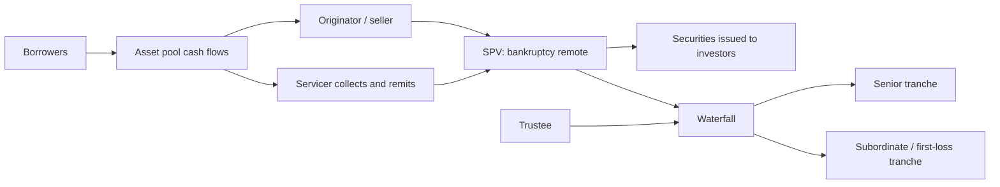

# M17: Fixed-Income Securitization

> **模块定位**：从债券现金流、收益率曲线、久期凸性、信用和证券化拆解固定收益风险回报。 本模块聚焦 **Fixed-Income Securitization**，要求把官方 LOS 转成可执行的判断、计算或解释动作。

---

## Official Module Structure

- Learning Outcomes: Fixed-Income Securitization
- 17.01 | Introduction
- 17.02 | The Benefits of Securitization
- 17.03 | The Securitization Process

## Learning Outcome Statements

1. explain benefits of securitization for issuers, investors, economies, and financial markets
2. describe securitization, including the parties and the roles they play

---

## 1. 模块定位

### 17.1 学习任务
- **核心问题**：考试希望你用 `Fixed-Income Securitization` 解释什么、计算什么、比较什么，或判断什么。
- **输入信息**：题干事实、数据、假设、时间口径、单位、约束条件。
- **输出结果**：中文结论 + 英文关键术语 + 必要公式/框架 + 限制条件。

### 17.2 考试角色
- **难度类型**：概念+应用。
- **高频题型**：定义辨析、情境判断、计算解释、表格补数、跨模块比较。
- **答题原则**：先判断 LOS 动词，再选择工具；计算后必须解释结果含义。

### 17.3 关键英文术语
- **Fixed-Income Securitization（核心术语）**：本模块关键词，用于定位 LOS、题干条件和解题动作。
- **Introduction（核心术语）**：本模块关键词，用于定位 LOS、题干条件和解题动作。
- **The Benefits of Securitization（核心术语）**：本模块关键词，用于定位 LOS、题干条件和解题动作。
- **The Securitization Process（核心术语）**：本模块关键词，用于定位 LOS、题干条件和解题动作。
- **Fixed Income（固定收益）**：以约定现金流为核心的债务类证券。
- **Securitization（证券化）**：把资产池现金流重组为可交易证券的过程。

## 2. 官方 LOS 对应学习目标

| LOS | 官方要求 | 中文学习动作 | 做题输出 |
|---|---|---|---|
| 17.1 | explain benefits of securitization for issuers, investors, economies, and financial markets | 解释机制、原因和后果 | 写出结论、依据、公式口径和限制条件。 |
| 17.2 | describe securitization, including the parties and the roles they play | 描述定义、流程和适用场景 | 写出结论、依据、公式口径和限制条件。 |

## 3. 核心知识树

```text
17. Fixed-Income Securitization
├─ 17.1 Introduction
│  ├─ 17.1.1 Securitization：把资产池现金流转移给 SPV，再发行 securities 给 investors
│  ├─ 17.1.2 Bankruptcy remoteness：SPV 与 originator 隔离，降低 originator 破产对资产池的影响
│  └─ 17.1.3 Pass-through vs structured allocation：前者按资产池现金流传递，后者通过 waterfall 重排风险
├─ 17.2 The Benefits of Securitization
│  ├─ 17.2.1 Issuer/originator：融资多元化、释放资产负债表、改善流动性
│  ├─ 17.2.2 Investors：获得特定 collateral、duration、credit tranche 的定制化敞口
│  └─ 17.2.3 Economy/markets：把非流动贷款转为可交易证券，但不消除 collateral risk
├─ 17.3 The Securitization Process
│  ├─ 17.3.1 Parties：originator、seller/depositor、SPV、servicer、trustee、credit enhancer、underwriter、investors
│  ├─ 17.3.2 Servicer 收取并转付现金流；trustee 保护投资者并监督 waterfall
│  └─ 17.3.3 考试判断：先识别谁转移资产、谁持有资产、谁收款、谁承担 first-loss
```

## 3.5 核心图解



## 4. 知识点详解

### 17.1 Introduction

- **中文主线**：围绕 `Introduction` 掌握定义、适用条件、公式/框架和考试判断。
- **对应动作**：解释机制、原因和后果

### 17.2 The Benefits of Securitization

- **中文主线**：围绕 `The Benefits of Securitization` 掌握定义、适用条件、公式/框架和考试判断。
- **对应动作**：描述定义、流程和适用场景

### 17.3 The Securitization Process

- **中文主线**：围绕 `The Securitization Process` 掌握定义、适用条件、公式/框架和考试判断。
- **对应动作**：识别概念并应用到题干。

## 5. 关键公式与计算框架

### 5.1 证券化流程框架

```text
Originator pools assets
-> sells/assigns assets to SPV
-> SPV issues securities to investors
-> servicer collects borrower payments
-> trustee oversees waterfall and investor protections
-> credit enhancer / liquidity provider supports designated tranches if applicable
```

### 5.2 角色识别表

| 角色 | 作用 | 知识树节点 | 考试判断 |
|---|---|---|---|
| Originator | 产生贷款/应收款并发起资产池 | `17.3.1` | 获得融资和资产负债表管理收益 |
| SPV/SPE | 持有资产并发行 securities | `17.1.2` | bankruptcy remote 是核心特征 |
| Servicer | 收款、催收、转付现金流 | `17.3.2` | 不一定承担 first-loss |
| Trustee | 代表投资者监督文件和 waterfall | `17.3.2` | 保护投资者利益 |
| Credit enhancer | 提供担保、保险或结构支持 | `17.3.3` | 改变损失分配，不消除资产风险 |
| Investors | 按 tranche 获得风险/收益敞口 | `17.2.2` | 收益高通常伴随更低 priority 或更高风险 |

### 5.3 做题顺序

1. 先判断资产池是否已从 originator 转给 SPV，以及是否 bankruptcy remote。
2. 再识别各方角色：谁发起、谁持有资产、谁收款、谁代表投资者、谁提供增级。
3. 判断证券化收益：发行人融资和风险转移，投资者获得定制化敞口，市场改善流动性。
4. 判断风险：资产池信用、提前还款、结构复杂性、servicer performance 和流动性风险仍存在。

---

## 6. 常见考点与解题思路

| 重要性 | 考点 | 解题动作 |
|---|---|---|
| ⭐⭐⭐ | 17.1 Introduction | 先定位题干触发词，再写公式/框架，最后解释结果或判断陷阱。 |
| ⭐⭐⭐ | 17.2 The Benefits of Securitization | 先定位题干触发词，再写公式/框架，最后解释结果或判断陷阱。 |
| ⭐⭐ | 17.3 The Securitization Process | 先定位题干触发词，再写公式/框架，最后解释结果或判断陷阱。 |

## 7. 易错点与考试陷阱

| ❌ 错误理解 | ✅ 正确理解 | 为什么错 / 考试提醒 |
|---|---|---|
| ❌ clean price 就是付款价 | ✅ 实际付款价是 full price | 按官方定义和 LOS 口径核验。 |
| ❌ current yield 就是总回报 | ✅ 它忽略 price change 和 reinvestment | 按官方定义和 LOS 口径核验。 |
| ❌ YTM 就是每期现金流真实折现率 | ✅ 更精确时应使用 spot curve | 按官方定义和 LOS 口径核验。 |
| ❌ duration 越大收益越高 | ✅ duration 衡量的是利率敏感度，不是回报 | 按官方定义和 LOS 口径核验。 |
| ❌ convexity 只是锦上添花 | ✅ yield move 大时很关键 | 按官方定义和 LOS 口径核验。 |
| ❌ callable bond 对投资者更好 | ✅ callable 通常有利发行人 | 按官方定义和 LOS 口径核验。 |
| ❌ spread 变宽只可能是 default 风险上升 | ✅ 也可能是 liquidity 或 option factors | 按官方定义和 LOS 口径核验。 |
| ❌ MBS 提前还款一定利好投资者 | ✅ 再投资风险和负 convexity 可能伤害投资者 | 按官方定义和 LOS 口径核验。 |
| ❌ high coupon bond 一定 duration 更高 | ✅ 通常反而 duration 更低 | 按官方定义和 LOS 口径核验。 |
| ❌ 债券题都先算 YTM 就够了 | ✅ spot/forward/option-adjusted 场景不能偷懒 | 按官方定义和 LOS 口径核验。 |

## 8. 跨模块关联

| 接口 | 连接模块 | 本模块输出 | 做题用途 |
|---|---|---|---|
| ABS structure | [[M18-Asset-Backed-Security-Instrument-and-Market-Features]] | SPV、servicer、waterfall、credit enhancer | 分析 credit enhancement 和 tranche priority |
| MBS structure | [[M19-Mortgage-Backed-Security-Instrument-and-Market-Features]] | pass-through/structured allocation | 识别 prepayment 和 tranching 风险 |
| Credit risk | [[M14-Credit-Risk]] | collateral risk、first-loss allocation | 判断损失由谁吸收 |
| Interest-rate risk | [[M13-Curve-Based-and-Empirical-Fixed-Income-Risk-Measures]] | cash flows may change | 触发 effective duration |

- **上游模块**：[[M16-Credit-Analysis-for-Corporate-Issuers]]。先用它提供定义、变量或基础框架。
- **下游模块**：[[M18-Asset-Backed-Security-Instrument-and-Market-Features]]。本模块输出会被后续更复杂题型调用。

### Legacy 关联补充

```text
工具特征 (Instrument Features)
├── 或有条款 -> 有效久期/凸性 (Contingency provisions -> Effective duration / convexity)
├── 优先级与抵押品 -> 信用分析 (Seniority and collateral -> Credit analysis)
└── 现金流类型 -> 不同票息结构的定价 (Cash-flow types -> Pricing of different coupon structures)
现金流与市场 (Cash Flows and Markets)
├── 浮动利率 -> FRN 定价与贴现利差 (Floating rate -> FRN pricing and discount margin)
├── 公司融资工具 -> 公司信用分析 (Corporate funding instruments -> Corporate credit analysis)
└── 政府发行人 -> 主权信用分析 (Government issuers -> Sovereign credit analysis)
定价与收益率 (Pricing and Yield)
├── YTM -> 固定利率利差度量 (YTM -> fixed-rate spread measures)
├── 即期曲线 -> 平价曲线 -> 远期曲线 (Spot curve -> par curve -> forward curve)
└── 持有期回报 -> 持有期 vs Macaulay 久期 (Holding-period return -> horizon vs Macaulay duration)
风险分层 (Risk Layer)
├── 基于收益率的久期 -> 凸性 -> 组合聚合 (Yield-based duration -> convexity -> portfolio aggregation)
├── 基于曲线的风险 -> 关键利率久期 -> 非平行移动 (Curve-based risk -> key rate duration -> non-parallel shifts)
└── 信用利差 -> 主权/公司分析 -> 债项排名 (Credit spread -> sovereign/corporate analysis -> issue ranking)
证券化 (Securitization)
├── SPV 结构 -> ABS 增级 -> RMBS 提前还款 -> CMO 分层 -> CMBS 气球风险 (SPV structure -> ABS enhancement -> RMBS prepayment -> CMO tranching -> CMBS balloon risk)
└── RMBS 提前还款概念 vs CMBS 提前还款保护 (RMBS prepayment risk vs CMBS prepayment protection)
```

---


## 9. 复习与刷题提示

- 第一轮：按 `Official Module Structure` 逐节过概念，把每个 LOS 改写成中文任务。
- 第二轮：对照 `## 3. 核心知识树` 做主动回忆，能说出每个编号节点的定义、公式/框架和陷阱。
- 第三轮：刷题后记录错因，如果暴露 MOC 缺口，按 `docs/moc-auto-patch-workflow.md` 进入补强流程。
- 考前：只看术语、公式/框架、易错点和本模块错题，避免重新铺开所有正文。

## 10. Legacy Notes Integrated

- **主要 legacy 来源**：`00-Fixed-Income-MOC.md` (high, 0.45)
- **整合规则**：高置信内容已合入 `知识点详解`、`公式与计算框架`、`常见考点`、`易错陷阱` 和 `跨模块关联`。
- **边界**：若 legacy 内容与 2026 官方 LOS 冲突，以官方 module 名称、LOS 和 registry 为准。
