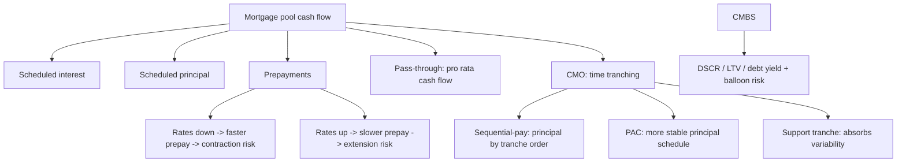

# M19: Mortgage-Backed Security (MBS) Instrument and Market Features

> **模块定位**：从债券现金流、收益率曲线、久期凸性、信用和证券化拆解固定收益风险回报。 本模块聚焦 **Mortgage-Backed Security (MBS) Instrument and Market Features**，要求把官方 LOS 转成可执行的判断、计算或解释动作。

---

## Official Module Structure

- Learning Outcomes: Mortgage-Backed Security (MBS) Instrument and Market Features
- 19.01 | Introduction
- 19.02 | Time Tranching
- 19.03 | Mortgage Loans and Their Characteristic Features
- 19.04 | Residential Mortgage-Backed Securities (RMBS)
- 19.05 | Commercial Mortgage-Backed Securities (CMBS)

## Learning Outcome Statements

1. define prepayment risk and describe time tranching structures in securitizations and their purpose
2. describe fundamental features of residential mortgage loans that are securitized
3. describe types and characteristics of residential mortgage-backed securities, including mortgage pass-through securities and collateralized mortgage obligations, and explain the cash flows and risks for each type
4. describe characteristics and risks of commercial mortgage-backed securities

---

## 1. 模块定位

### 19.1 学习任务
- **核心问题**：考试希望你用 `Mortgage-Backed Security (MBS) Instrument and Market Features` 解释什么、计算什么、比较什么，或判断什么。
- **输入信息**：题干事实、数据、假设、时间口径、单位、约束条件。
- **输出结果**：中文结论 + 英文关键术语 + 必要公式/框架 + 限制条件。

### 19.2 考试角色
- **难度类型**：概念+应用。
- **高频题型**：定义辨析、情境判断、计算解释、表格补数、跨模块比较。
- **答题原则**：先判断 LOS 动词，再选择工具；计算后必须解释结果含义。

### 19.3 关键英文术语
- **Mortgage-Backed Security (MBS) Instrument and Market Features（核心术语）**：本模块关键词，用于定位 LOS、题干条件和解题动作。
- **Introduction（核心术语）**：本模块关键词，用于定位 LOS、题干条件和解题动作。
- **Time Tranching（核心术语）**：本模块关键词，用于定位 LOS、题干条件和解题动作。
- **Mortgage Loans and Their Characteristic Features（核心术语）**：本模块关键词，用于定位 LOS、题干条件和解题动作。
- **Residential Mortgage-Backed Securities (RMBS)（核心术语）**：本模块关键词，用于定位 LOS、题干条件和解题动作。
- **Commercial Mortgage-Backed Securities (CMBS)（核心术语）**：本模块关键词，用于定位 LOS、题干条件和解题动作。
- **Fixed Income（固定收益）**：以约定现金流为核心的债务类证券。

## 2. 官方 LOS 对应学习目标

| LOS | 官方要求 | 中文学习动作 | 做题输出 |
|---|---|---|---|
| 19.1 | define prepayment risk and describe time tranching structures in securitizations and their purpose | 描述定义、流程和适用场景 | 写出结论、依据、公式口径和限制条件。 |
| 19.2 | describe fundamental features of residential mortgage loans that are securitized | 描述定义、流程和适用场景 | 写出结论、依据、公式口径和限制条件。 |
| 19.3 | describe types and characteristics of residential mortgage-backed securities, including mortgage pass-through securities and collateralized mortgage obligations, and explain the cash flows and risks for each type | 描述定义、流程和适用场景；解释机制、原因和后果 | 写出结论、依据、公式口径和限制条件。 |
| 19.4 | describe characteristics and risks of commercial mortgage-backed securities | 描述定义、流程和适用场景 | 写出结论、依据、公式口径和限制条件。 |

## 3. 核心知识树

```text
19. Mortgage-Backed Security (MBS) Instrument and Market Features
├─ 19.1 抵押贷款现金流风险 (Mortgage Cash-Flow Risk)
│  ├─ 19.1.1 RMBS cash flow = scheduled interest + scheduled principal + prepayments；prepayment 改变本金回收时间
│  ├─ 19.1.2 CPR/SMM：CPR = 1-(1-SMM)^12；SMM = 1-(1-CPR)^(1/12)
│  └─ 19.1.3 Contraction risk：利率下降提前还款加快；extension risk：利率上升提前还款放慢
├─ 19.2 结构化 (Structuring)
│  ├─ 19.2.1 CMO tranching：sequential/pay-through structure 重排 principal timing，不改变 collateral 本身
│  ├─ 19.2.2 Support tranche 吸收更多 prepayment variability，PAC tranche 获得更稳定本金路径
│  └─ 19.2.3 CMBS：DSCR = NOI/debt service，LTV = loan/property value，debt yield = NOI/loan；关注 balloon risk 和 prepayment protection
```

## 3.5 核心图解



## 4. 知识点详解

### 19.1 抵押贷款现金流风险 (Mortgage Cash-Flow Risk)

- **借款人提前还款导致利率下降时的收缩风险 (borrower prepayment creates contraction risk when rates fall)**：当利率下降时，借款人倾向于再融资来提前还款 (prepayment)。这导致 MBS 投资者提前收回本金，面临收缩风险 (contraction risk)——资金回笼后只能以较低利率再投资。
- **利率上升且再融资放缓时展期风险增加 (extension risk grows when rates rise and refinancing slows)**：当利率上升时，借款人不会提前还款，MBS 投资者面临展期风险 (extension risk)——预期回收本金的时间延长，锁定在较低利率的资金期限被拉长。
- **过手投资者收到计划本金加上提前还款 (passthrough investors receive scheduled principal plus prepayments)**：过手 MBS (pass-through) 将抵押贷款池的本息按比例传递给投资者，包含计划内本金摊销和任何提前还款。

### 19.2 结构化 (Structuring)

- **机构/非机构区分；抵押品与担保分析 (agency/non-agency distinction; collateral and guarantee analysis)**：机构 MBS (agency MBS) 由 Ginnie Mae、Fannie Mae、Freddie Mac 发行或担保，有政府或政府机构的信用支持；非机构 MBS (non-agency MBS) 没有政府担保，依赖信用增级。
- **CMO 分层重新分配提前还款时间 (CMO tranches redistribute prepayment timing)**：CMO (collateralized mortgage obligation) 将 MBS 现金流切分为不同层级的证券 (tranches)，各层级有不同的本金偿还顺序，从而重新分配提前还款风险。
- **顺序偿付 vs 计划分配 (sequential-pay vs planned allocation intuition)**：顺序偿付结构 (sequential-pay) 中，优先级 tranche 先收回本金，然后下一级再开始回收；计划分配结构（如 PAC tranche）有预先设定的本金偿还计划，提供更可预测的现金流。

## 5. 关键公式与计算框架

### 5.1 核心内容

本模块以概念为主。核心关系为：

- `Prepayment risk = 收缩风险 (利率↓) + 展期风险 (利率↑)`
- `CPR (Conditional Prepayment Rate) = 1 - (1 - SMM)^12`，其中 SMM 是单月提前还款率
- `PSA 基准模型：100% PSA = 第 1 个月 0.2%，直至第 30 个月 6%，之后保持 6%`
- `负凸性 (negative convexity) = 利率下降时 MBS 价格上涨受限`

## 6. 常见考点与解题思路

| 重要性 | 考点 | 解题动作 |
|---|---|---|
| ⭐⭐⭐ | 19.1 Introduction | 先定位题干触发词，再写公式/框架，最后解释结果或判断陷阱。 |
| ⭐⭐⭐ | 19.2 Time Tranching | 先定位题干触发词，再写公式/框架，最后解释结果或判断陷阱。 |
| ⭐⭐ | 19.3 Mortgage Loans and Their Characteristic Features | 先定位题干触发词，再写公式/框架，最后解释结果或判断陷阱。 |
| ⭐⭐ | 19.4 Residential Mortgage-Backed Securities (RMBS) | 先定位题干触发词，再写公式/框架，最后解释结果或判断陷阱。 |
| ⭐ | 19.5 Commercial Mortgage-Backed Securities (CMBS) | 先定位题干触发词，再写公式/框架，最后解释结果或判断陷阱。 |

### 6.9 ⭐⭐ Legacy 考点补充

### 6.1 核心内容

- **区分收缩风险与展期风险**：利率下降 → 提前还款增加 → 收缩风险（资金需低利率再投资）；利率上升 → 提前还款减少 → 展期风险（资金锁定时间延长）。
- **理解 CMO 分层的作用**：CMO 不消除提前还款风险，而是将其在不同层级间重新分配。优先级 tranche 先偿还，吸收部分收缩风险；次级 tranche 后偿还，承担更多展期风险。
- **分析 agency vs non-agency MBS 的区别**：agency MBS 有政府/机构担保，信用风险低；non-agency MBS 信用风险取决于抵押品质量和信用增级。
- **判断负凸性**：MBS 在利率下降时价格上升幅度小于普通债券，因为提前还款限制了价格上升空间。

## 7. 易错点与考试陷阱

| ❌ 错误理解 | ✅ 正确理解 | 为什么错 / 考试提醒 |
|---|---|---|
| ❌ 忽略：MBS 可能呈现负凸性，因为现金流对投资者不利变化 (MBS can show negative convexity because cash flows change agai… | ✅ MBS 可能呈现负凸性，因为现金流对投资者不利变化 (MBS can show negative convexity because cash flows change agai… | 题干通常会用口径、顺序、定义边界或例外条件设置干扰。 |
| ❌ 忽略：CMO 不消除提前还款风险：它只重新分配。所有层的总风险和 MBS 池的总风险相同。 | ✅ CMO 不消除提前还款风险：它只重新分配。所有层的总风险和 MBS 池的总风险相同。 | 题干通常会用口径、顺序、定义边界或例外条件设置干扰。 |
| ❌ 忽略：PAC (Planned Amortization Class) tranche 不是无风险的：虽然 PAC 有本金偿还计划保护，但在极端提前还款情境下保护可能失效（打破 PAC… | ✅ PAC (Planned Amortization Class) tranche 不是无风险的：虽然 PAC 有本金偿还计划保护，但在极端提前还款情境下保护可能失效（打破 PAC… | 题干通常会用口径、顺序、定义边界或例外条件设置干扰。 |
| ❌ 忽略：Prepayment modeling 是 MBS 分析的核心难点：提前还款行为受利率路径、房价变动、失业率、季节性因素等多种因素影响，难以精确预测。 | ✅ Prepayment modeling 是 MBS 分析的核心难点：提前还款行为受利率路径、房价变动、失业率、季节性因素等多种因素影响，难以精确预测。 | 题干通常会用口径、顺序、定义边界或例外条件设置干扰。 |

## 8. 跨模块关联

| 接口 | 连接模块 | 本模块输出 | 做题用途 |
|---|---|---|---|
| Securitization structure | [[M17-Fixed-Income-Securitization]] | pass-through、CMO tranching | 理解现金流 waterfall |
| ABS contrast | [[M18-Asset-Backed-Security-Instrument-and-Market-Features]] | collateral and enhancement comparison | 区分 mortgage collateral 与普通 ABS |
| Effective risk | [[M13-Curve-Based-and-Empirical-Fixed-Income-Risk-Measures]] | prepayment-sensitive cash flows | 使用 effective duration/negative convexity |
| CMBS credit | [[M14-Credit-Risk]] / [[M16-Credit-Analysis-for-Corporate-Issuers]] | DSCR、LTV、debt yield | 判断商业地产贷款信用质量 |

- **上游模块**：[[M18-Asset-Backed-Security-Instrument-and-Market-Features]]。先用它提供定义、变量或基础框架。
- **下游模块**：本科目收束模块。本模块输出会被后续更复杂题型调用。

### Legacy 关联补充

- 提前还款 → [[M01-Instrument-Features]] 的嵌入期权概念（隐含看涨期权）
- 负凸性 → [[M12-Yield-Based-Bond-Convexity-and-Portfolio-Properties]] 的凸性概念
- CMO 分层 → [[M18-Asset-Backed-Security-Instrument-and-Market-Features]] 的分层信贷增级
- 现金流分配 → [[M17-Fixed-Income-Securitization]] 的 SPV 结构


## 9. 复习与刷题提示

- 第一轮：按 `Official Module Structure` 逐节过概念，把每个 LOS 改写成中文任务。
- 第二轮：对照 `## 3. 核心知识树` 做主动回忆，能说出每个编号节点的定义、公式/框架和陷阱。
- 第三轮：刷题后记录错因，如果暴露 MOC 缺口，按 `docs/moc-auto-patch-workflow.md` 进入补强流程。
- 考前：只看术语、公式/框架、易错点和本模块错题，避免重新铺开所有正文。

## 10. Legacy Notes Integrated

- **主要 legacy 来源**：`M14-MBS-and-CMO.md` (medium, 0.352)
- **整合规则**：高置信内容已合入 `知识点详解`、`公式与计算框架`、`常见考点`、`易错陷阱` 和 `跨模块关联`。
- **边界**：若 legacy 内容与 2026 官方 LOS 冲突，以官方 module 名称、LOS 和 registry 为准。
