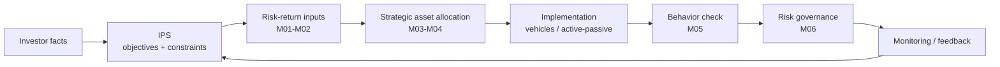

# Portfolio Management MOC

> **一句话核心**：把风险收益、组合构建、行为偏差和风险管理连接成投资流程。

---

## 1. 科目定位

- **考试权重**：8-12%
- **官方模块数**：6
- **主线框架**：设定目标约束 -> 估计风险收益 -> 构建组合 -> 监控偏差与风险
- **使用方式**：先从官方模块导航进入，再用编号知识树做主动回忆，最后用公式/陷阱清单做考前压缩。

## 2. 官方模块导航

| 编号 | 官方 Module | 难度 | 必考点 | 模块链接 |
|---|---|---|---|---|
| M01 | Portfolio Risk and Return: Part I | 计算+解释 | Introduction / Historical Return and Risk | [[M01-Portfolio-Risk-and-Return-Part-I]] |
| M02 | Portfolio Risk and Return: Part II | 计算+解释 | Introduction / Capital Market Theory: Risk-Free and Risky Assets | [[M02-Portfolio-Risk-and-Return-Part-II]] |
| M03 | Portfolio Management: An Overview | 概念+应用 | Introduction / Portfolio Perspective: Diversification and Risk Reduction | [[M03-Portfolio-Management-An-Overview]] |
| M04 | Basics of Portfolio Planning and Construction | 计算+解释 | Introduction / The Investment Policy Statement | [[M04-Basics-of-Portfolio-Planning-and-Construction]] |
| M05 | The Behavioral Biases of Individuals | 概念+应用 | Introduction / Behavioral Bias Categories | [[M05-The-Behavioral-Biases-of-Individuals]] |
| M06 | Introduction to Risk Management | 概念+案例判断 | Introduction / Risk Management Process | [[M06-Introduction-to-Risk-Management]] |

## 3. 核心知识树

```text
Portfolio Management (8-12%)
├─ 1. Portfolio Risk and Return: Part I
│  ├─ 1.1 投资组合视角：风险/收益必须放在 investor objective 和 portfolio context 下解释
│  ├─ 1.2 历史收益与风险：`E(Rp)=Σw_iE(R_i)`，`σp` 由 variance、covariance、correlation 决定
│  ├─ 1.3 分散化：关键不是资产数量，而是 `ρ<1`；低相关降低 unsystematic risk
│  ├─ 1.4 风险厌恶：更高 `A` 要求同等风险有更高 expected return
│  └─ 1.5 Utility / indifference curve：`U=E(R)-0.5Aσ²`，曲线越陡风险厌恶越强
├─ 2. Portfolio Risk and Return: Part II
│  ├─ 2.1 CAL / CML：无风险资产与最优风险组合的配置线，斜率是 Sharpe ratio
│  ├─ 2.2 CAPM：`E(R_i)=R_f+β_i[E(R_M)-R_f]`，只补偿 systematic risk
│  ├─ 2.3 Beta：`β_i=Cov(R_i,R_M)/Var(R_M)`，组合 beta 是加权平均
│  └─ 2.4 SML 与 mispricing：实际/预期收益高于 required return 为 undervalued，反之 overvalued
├─ 3. Portfolio Management: An Overview
│  ├─ 3.1 组合管理流程：planning -> execution -> feedback，IPS 是 planning 核心输出
│  ├─ 3.2 投资者类型：individual / institutional 的目标、约束和税务不同
│  ├─ 3.3 集合投资工具：mutual fund / ETF / hedge fund / PE 按流动性、费用、透明度区分
│  └─ 3.4 Active vs passive：主动承担 active risk，是否值得看 alpha、cost、tracking error
├─ 4. Basics of Portfolio Planning and Construction
│  ├─ 4.1 IPS：连接目标、约束、资产配置和绩效评估，避免随市场情绪漂移
│  ├─ 4.2 Return objective：required return 必须和 spending / liability / inflation / fees 对齐
│  ├─ 4.3 Risk objective：risk tolerance = willingness + ability，冲突时以 ability 为硬约束
│  ├─ 4.4 Constraints：liquidity、time horizon、taxes、legal/regulatory、unique circumstances
│  └─ 4.5 Portfolio construction：strategic asset allocation 先于 security selection
├─ 5. The Behavioral Biases of Individuals
│  ├─ 5.1 分类：cognitive errors 可教育纠偏，emotional biases 往往要适度 accommodate
│  ├─ 5.2 Cognitive：belief perseverance、information-processing、conservatism、confirmation 等
│  ├─ 5.3 Emotional：loss aversion、overconfidence、self-control、status quo、endowment、regret aversion
│  └─ 5.4 投资影响：错误 risk tolerance、过度交易、集中持仓、拒绝再平衡
├─ 6. Introduction to Risk Management
│  ├─ 6.1 风险治理：define risk tolerance -> identify -> measure -> modify -> monitor
│  ├─ 6.2 风险分类：market、credit、liquidity、operational、model、settlement、legal/regulatory
│  ├─ 6.3 风险调整：avoid / prevent / transfer / retain / diversify / hedge
│  └─ 6.4 绩效与风险：风险管理不是最小化风险，而是让风险服务目标收益
```

## 核心图解



## 4. 跨模块依赖关系

```text
Quant input layer
├─ Quant M03-M05 -> PM M01: variance, covariance, correlation, safety-first
├─ Quant M01-M02 -> PM M01/M02/M04: return measurement, discount rate, required return
└─ Quant M08-M10 -> PM M03/M06: performance evidence, regression beta, model risk

Portfolio construction layer
├─ M01 Risk/Return Part I
│  ├─ feeds M02: risk aversion, utility, diversification before CAPM
│  ├─ feeds M04: risk objective and strategic allocation constraints
│  └─ feeds M06: risk measures to monitor and modify
├─ M02 Risk/Return Part II
│  ├─ feeds Equity / Corporate Issuers: required return from CAPM
│  ├─ feeds M03: active/passive and benchmark discussion
│  └─ feeds M04: expected return and beta constraints in allocation
├─ M03 Overview
│  ├─ feeds M04: IPS workflow and pooled vehicle selection
│  └─ feeds M06: governance, feedback, rebalancing discipline
├─ M04 Planning and Construction
│  ├─ consumes M01/M02: objective inputs and risk-return trade-off
│  ├─ feeds M05: bias diagnosis when stated preferences conflict with rational IPS
│  └─ feeds M06: risk tolerance, constraints, and monitoring triggers
├─ M05 Behavioral Biases
│  ├─ feeds M04: willingness vs ability adjustment
│  └─ feeds Ethics: client communication, suitability, documentation
└─ M06 Risk Management
   ├─ consumes all PM modules: objectives, exposures, constraints, behavior
   └─ feeds Derivatives / Fixed Income / Alternatives: hedging, liquidity and stress scenarios
```

| 依赖接口 | 输入模块 | 输出模块/科目 | 考试判断 |
|---|---|---|---|
| Risk-return math | Quant M03-M05 | PM M01/M02 | 先算组合风险，再解释 correlation 和 diversification。 |
| Required return | Quant M01-M02, PM M02 | Equity, Corporate Issuers, Fixed Income | CAPM required return 可作为估值折现率或 hurdle rate。 |
| IPS suitability | PM M03/M04/M05 | Ethics, Wealth planning | 客户偏好、约束和行为偏差都要写入 suitability 判断。 |
| Benchmark/performance | PM M02/M03/M04 | Portfolio analytics | Sharpe 用 total risk，Treynor/Jensen 用 beta，IR 用 active risk。 |
| Risk governance | PM M04/M06 | Derivatives, Alternatives, FI | 风险处理动作必须匹配目标：avoid、transfer、hedge、diversify 或 retain。 |

## 5. 核心对比专题

| 重要性 | 对比项 | 英文 | 中文解释 | 考试判断 |
|---|---|---|---|---|
| ⭐⭐⭐ | 概念 vs 应用 | definition vs application | 先确认官方定义，再放入题干情境判断。 | 概念题也要能说出适用条件和例外。 |
| ⭐⭐⭐ | 计算 vs 解释 | calculation vs interpretation | 数值只是中间结果，答案要解释方向、含义和限制。 | 凡是 calculate and interpret 都不能只算。 |
| ⭐⭐ | 静态知识 vs 决策流程 | static knowledge vs decision process | 把每个模块压缩成输入 -> 工具 -> 输出 -> 陷阱。 | 流程化比孤立背诵更抗干扰。 |
| ⭐⭐⭐ | 英文识题 vs 中文理解 | English trigger vs Chinese explanation | 英文用于识别题干，中文用于确认真正含义。 | 避免看到熟词就按直觉作答。 |
| ⭐⭐ | 本模块 vs 跨模块 | single module vs cross-module use | 同一公式/概念可能在估值、风险、伦理或报表中换场景出现。 | 错题要回填到 MOC 节点。 |

## 6. 公式与框架速查

| 指标 | 公式 | 知识树节点 | 考试说明 |
|------|------|------------|----------|
| Portfolio Return | `Σ wiE(Ri)` | `M01` | 组合期望收益 |
| Two-asset Variance | `w1²σ1²+w2²σ2²+2w1w2Cov12` | `M01` | 分散化核心 |
| Two-asset Variance, Correlation Form | `w1²σ1² + w2²σ2² + 2w1w2σ1σ2ρ12` | `M01` | 题目给 correlation 时使用 |
| Correlation | `Corr(R_1,R_2) = Cov(R_1,R_2)/(σ_1σ_2)` | `M01` | 判断分散化来源 |
| Minimum-Variance Weight | `w_1* = (σ_2² - Cov_12)/(σ_1² + σ_2² - 2Cov_12)` | `M01` | 【扩展/谨慎】Level I 可能考直觉，复杂计算不强行背 |
| Utility | `E(Rp)-0.5Aσp²` | `M02` | 风险厌恶框架 |
| CAL | `E(R_C) = R_f + [(E(R_P)-R_f)/σ_P] x σ_C` | `M02` | 风险资产与无风险资产组合 |
| Risky Asset Weight on CAL | `y = [E(R_C) - R_f] / [E(R_P) - R_f]` | `M02` | 【考纲重点】目标收益反推风险组合权重 |
| Portfolio on CAL Return | `E(R_C) = yE(R_P) + (1-y)R_f` | `M02` | 借入时 `y > 1` |
| Portfolio on CAL Risk | `σ_C = yσ_P` | `M02` | 无风险资产标准差为 0 |
| Pooled Vehicle NAV | `(资产市值 - 负债) / 流通份额` | `M03` | 基金定价基础 |
| CAPM | `E(R_i) = R_f + β_i[E(R_M)-R_f]` | `M04` | required return |
| Beta | `β_i = Cov(R_i,R_M)/Var(R_M)` | `M04` | systematic risk |
| Portfolio Beta | `β_p = Σw_iβ_i` | `M04` | 组合系统性风险 |
| Security Market Line | `Required return = R_f + β_i Market Risk Premium` | `M04` | CAPM 图像语言 |
| Sharpe | `(Rp-Rf)/σp` | `M04` | total risk-adjusted performance |
| Treynor | `(Rp-Rf)/βp` | `M04` | beta-adjusted performance |
| Jensen Alpha | `α_p = R_p-[R_f+β_p(E(R_M)-R_f)]` | `M04` | CAPM 偏离度 |
| M-squared | `M^2 = R_f + Sharpe_p x σ_M - R_M` | `M04` | 【考纲重点】把 Sharpe 差异换算成收益率差 |
| Tracking Error | `σ(R_p - R_b)` | `M05` | 主动风险 |
| Information Ratio | `(R_p - R_b) / Tracking Error` | `M05` | 【考纲重点】主动收益/主动风险 |
| Required Excess Return | `β_i x (E(R_m)-R_f)` | `M04` | CAPM risk premium |

### 考纲范围标记

| 标记 | 内容 |
|------|------|
| 【考纲重点】 | Portfolio risk/return, utility/CAL, pooled vehicle NAV, CAPM/beta/SML, performance ratios, IPS objective/constraint classification |
| 【考纲内但无核心公式】 | Portfolio management process, IPS constraints, behavioral biases, risk management governance 多为判断和分类 |
| 【超纲/扩展】 | Markowitz optimization 矩阵形式、Black-Litterman、VaR 模型推导、完整绩效归因不作为 Level I 必背公式 |

---

## 7. 高频考试陷阱

| ❌ 错误理解 | ✅ 正确理解 | 高频场景 |
|---|---|---|
| ❌ 多买几个资产就完成分散化 | ✅ 关键是低相关，而不是数量本身 | 按官方定义和 LOS 口径核验。 |
| ❌ beta 高说明总风险一定高 | ✅ beta 只反映 systematic risk | 按官方定义和 LOS 口径核验。 |
| ❌ utility 只是抽象概念 | ✅ 它决定风险资产与无风险资产配置 | 按官方定义和 LOS 口径核验。 |
| ❌ active 管理 = 更专业 | ✅ active 只是更主动承担 tracking/selection risk | 按官方定义和 LOS 口径核验。 |
| ❌ passive 管理 = 不用判断市场 | ✅ 仍要判断目标、基准与成本 | 按官方定义和 LOS 口径核验。 |
| ❌ IPS 先写约束再写目标也无所谓 | ✅ 考试常严格区分 objective 与 constraints | 按官方定义和 LOS 口径核验。 |
| ❌ 高 return objective 必然合理 | ✅ 还要看 risk capacity / risk tolerance 是否支持 | 按官方定义和 LOS 口径核验。 |
| ❌ behavioral bias 是心理学边角料 | ✅ 它直接影响配置和交易错误 | 按官方定义和 LOS 口径核验。 |
| ❌ risk management 的目标是把风险压到最低 | ✅ 目标是使风险与回报目标匹配 | 按官方定义和 LOS 口径核验。 |
| ❌ Sharpe 和 Treynor 可以随便替换 | ✅ 一个基于 total risk，一个基于 beta risk | 按官方定义和 LOS 口径核验。 |

## 8. 通用分析框架

### 框架1：组合题 SOP

1. 题目给资产权重和收益：先算 `E(Rp)=Σw_iE(R_i)`。
2. 题目问风险：两资产用 `σp²=w1²σ1²+w2²σ2²+2w1w2σ1σ2ρ12`。
3. 题目强调相关性：`ρ<1` 有分散化，`ρ=+1` 无分散化，`ρ=-1` 可能完全对冲。
4. 题目给风险厌恶系数：用 `U=E(R)-0.5Aσ²` 比较效用。
5. 题目给无风险资产和风险组合：用 CAL，`E(R_C)=R_f+y[E(R_P)-R_f]`，`σ_C=yσ_P`。
6. 题目给 beta 和市场风险溢价：用 CAPM required return，再与 expected return 比较 mispricing。
7. 结论必须回到 investor objective：风险能否承受、收益是否足够、约束是否允许。

### 框架2：IPS 题 SOP

1. 先识别投资者类型、liability、spending need、time horizon。
2. Return objective：写 required return，不只写“maximize return”。
3. Risk objective：分开写 willingness 和 ability；冲突时 ability 通常约束最终风险水平。
4. Constraints 按 `L-T-T-L-U`：liquidity、time horizon、taxes、legal/regulatory、unique circumstances。
5. 如果题目出现 concentrated position、tax lock-in、legal limit、ESG preference，要放入 unique 或 legal/tax，而不是 return objective。
6. 最后把 IPS 翻译成 strategic asset allocation，并说明 rebalancing / monitoring 触发条件。

### 框架3：行为偏差题 SOP

1. 先判断偏差来源：信息处理/信念坚持类多为 cognitive；恐惧、后悔、占有感多为 emotional。
2. Cognitive bias：优先 educate、provide evidence、use checklist。
3. Emotional bias：若客户目标仍可达，可 accommodate；若会破坏目标，必须 moderate。
4. 判断影响路径：risk tolerance、asset allocation、trading frequency、diversification、rebalancing。
5. 把偏差连接回 IPS：是否导致 stated willingness 偏离 true ability。
6. 给纠偏动作时避免空话：例如预设再平衡规则、限制集中持仓、分阶段卖出、书面化决策标准。

---

## 9. 学习路径建议

- **第一轮：结构对齐**。按模块顺序读官方结构和 LOS，不急着刷难题。
- **第二轮：主动回忆**。遮住解释，只看编号知识树说出定义、公式和陷阱。
- **第三轮：题目驱动**。把错题回填到对应模块和 MOC 节点，形成可复用 fix rule。
- **考前压缩**。只保留高频术语、公式/框架、易错点、跨模块依赖和错题触发点。

## 10. Legacy 内容治理

- 本 MOC 已优先吸收 `_legacy/2026-05-26-official-sync/` 中的中文解释、公式、陷阱和框架。
- `_legacy` 只作为补强来源，不作为最终学习入口；若与官方 2026 LOS 冲突，以 registry 和官方 Topic Outline 为准。
