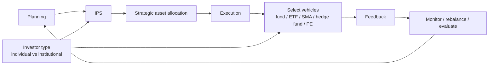

# M03: Portfolio Management: An Overview

> **模块定位**：把风险收益、组合构建、行为偏差和风险管理连接成投资流程。 本模块聚焦 **Portfolio Management: An Overview**，要求把官方 LOS 转成可执行的判断、计算或解释动作。

---

## Official Module Structure

- Learning Outcomes: Portfolio Management: An Overview
- 3.01 | Introduction
- 3.02 | Portfolio Perspective: Diversification and Risk Reduction
- 3.03 | Portfolio Perspective: Risk-Return Trade-off, Downside Protection, Modern Portfolio Theory
- 3.04 | Steps in the Portfolio Management Process
- 3.05 | Types of Investors
- 3.06 | The Asset Management Industry
- 3.07 | Pooled Interest - Mutual Funds
- 3.08 | Pooled Interest - Type of Mutual Funds
- 3.09 | Pooled Interest - Other Investment Products
- 3.10 | Summary

## Learning Outcome Statements

1. describe the portfolio approach to investing
2. describe the steps in the portfolio management process
3. describe types of investors and distinctive characteristics and needs of each
4. describe defined contribution and defined benefit pension plans
5. describe aspects of the asset management industry
6. describe mutual funds and compare them with other pooled investment products

---

## 1. 模块定位

### 3.1 学习任务
- **核心问题**：考试希望你用 `Portfolio Management: An Overview` 解释什么、计算什么、比较什么，或判断什么。
- **输入信息**：题干事实、数据、假设、时间口径、单位、约束条件。
- **输出结果**：中文结论 + 英文关键术语 + 必要公式/框架 + 限制条件。

### 3.2 考试角色
- **难度类型**：概念+应用。
- **高频题型**：定义辨析、情境判断、计算解释、表格补数、跨模块比较。
- **答题原则**：先判断 LOS 动词，再选择工具；计算后必须解释结果含义。

### 3.3 关键英文术语
- **Portfolio Management: An Overview（核心术语）**：本模块关键词，用于定位 LOS、题干条件和解题动作。
- **Portfolio Management（核心术语）**：本模块关键词，用于定位 LOS、题干条件和解题动作。
- **Introduction（核心术语）**：本模块关键词，用于定位 LOS、题干条件和解题动作。
- **Portfolio Perspective: Diversification and Risk Reduction（核心术语）**：本模块关键词，用于定位 LOS、题干条件和解题动作。
- **Portfolio Perspective（核心术语）**：本模块关键词，用于定位 LOS、题干条件和解题动作。
- **Portfolio Perspective: Risk-Return Trade-off, Downside Protection, Modern Portfolio Theory（核心术语）**：本模块关键词，用于定位 LOS、题干条件和解题动作。
- **Steps in the Portfolio Management Process（核心术语）**：本模块关键词，用于定位 LOS、题干条件和解题动作。
- **Types of Investors（核心术语）**：本模块关键词，用于定位 LOS、题干条件和解题动作。

## 2. 官方 LOS 对应学习目标

| LOS | 官方要求 | 中文学习动作 | 做题输出 |
|---|---|---|---|
| 3.1 | describe the portfolio approach to investing | 描述定义、流程和适用场景 | 写出结论、依据、公式口径和限制条件。 |
| 3.2 | describe the steps in the portfolio management process | 描述定义、流程和适用场景 | 写出结论、依据、公式口径和限制条件。 |
| 3.3 | describe types of investors and distinctive characteristics and needs of each | 描述定义、流程和适用场景 | 写出结论、依据、公式口径和限制条件。 |
| 3.4 | describe defined contribution and defined benefit pension plans | 描述定义、流程和适用场景 | 写出结论、依据、公式口径和限制条件。 |
| 3.5 | describe aspects of the asset management industry | 描述定义、流程和适用场景 | 写出结论、依据、公式口径和限制条件。 |
| 3.6 | describe mutual funds and compare them with other pooled investment products | 比较相似概念的适用条件与差异；描述定义、流程和适用场景 | 写出结论、依据、公式口径和限制条件。 |

## 3. 核心知识树

```text
3. Portfolio Management: An Overview
├─ 3.1 投资组合管理流程 (Portfolio Management Process)
│  ├─ 3.1.1 Planning：了解客户、制定 IPS、设定 strategic asset allocation
│  ├─ 3.1.2 Execution：资产配置实施、证券选择、主动/被动管理选择
│  └─ 3.1.3 Feedback：监控、再平衡、绩效评估、更新 IPS
├─ 3.2 投资者类型 (Types of Investors)
│  ├─ 3.2.1 Individual：生命周期、税务、行为偏差和突发流动性需求更突出
│  ├─ 3.2.2 Institutional：受托责任、监管约束、负债匹配和治理流程更突出
│  └─ 3.2.3 Suitability：工具和策略必须匹配 investor type、目标和约束
├─ 3.3 集合投资工具 (Pooled Investment Vehicles)
│  ├─ 3.3.1 Mutual fund：开放型按 NAV 申赎，封闭型可折溢价交易
│  ├─ 3.3.2 ETF：交易所实时交易，AP 套利使价格贴近 NAV，通常税效高
│  ├─ 3.3.3 SMA：直接持有底层证券，可定制税务/ESG/限制
│  ├─ 3.3.4 Hedge fund：策略灵活、锁定期、低透明度、管理费+业绩费
│  └─ 3.3.5 Private equity：长期锁定、J-curve、流动性溢价
├─ 3.4 投资策略说明书简介 (Introduction to Investment Policy Statement)
│  ├─ 3.4.1 IPS role：指导性决策框架，不是法律合同
│  ├─ 3.4.2 Core elements：return objective、risk objective、constraints、guidelines、review rules
│  └─ 3.4.3 Workflow：IPS 把客户信息翻译成资产配置和再平衡纪律
```

## 核心图解



## 4. 知识点详解

### 3.1 投资组合管理流程 (Portfolio Management Process)

投资组合管理是一个系统性的三阶段循环过程：

**阶段一：规划 (Planning)**
- **了解客户**：分析投资者的目标、约束、偏好
- **撰写 IPS**：制定投资策略说明书，记录投资目标和约束
- **设定战略资产配置**：确定长期资产类别权重
- 关键产出：IPS + 战略资产配置

**阶段二：执行 (Execution)**
- **组合构建**：选择具体资产和权重
- **资产配置实施**：将资金分配到不同资产类别
- **证券选择**：在每类资产中选择具体投资工具
- 主动 vs 被动管理选择
- 关键产出：实际构建的投资组合

**阶段三：反馈 (Feedback)**
- **监控与再平衡**：定期检查组合是否偏离目标配置
- **业绩评估**：衡量组合表现（收益、风险、归因分析）
- **IPS 调整**：根据投资者情况变化更新 IPS
- 关键产出：调整后的组合和更新后的 IPS

> 核心逻辑：规划 → 执行 → 反馈 → 再规划（持续循环）

### 3.2 投资者类型 (Types of Investors)

**个人投资者 (Individual Investors)**：
- 目标多样化：退休储蓄、教育基金、财富传承
- 受行为偏差影响较大
- 税收敏感度因账户类型（应税 vs 退休账户）而异
- 投资期限常与生命周期阶段相关
- 常见代表：散户、高净值个人 (HNWI)、家族办公室

**机构投资者 (Institutional Investors)**：
- 通常有明确的法律/受托责任
- 受到更严格的监管约束
- 投资期限通常更长（养老基金、捐赠基金）
- 常见类型：
  - **养老基金 (Pension funds)**：DB 计划 vs DC 计划，长期负债匹配
  - **捐赠基金/基金会 (Endowments/Foundations)**：永续存在，支出率约束
  - **保险公司 (Insurance companies)**：保费收入与理赔支出的匹配
  - **主权财富基金 (Sovereign wealth funds, SWFs)**：国家财富管理
  - **银行 (Banks)**：资本充足率与流动性约束
  - **共同基金/ETF 管理人**：代表基金持有人投资

| 对比维度 | 个人投资者 | 机构投资者 |
|----------|-----------|-----------|
| 投资期限 | 各异（生命阶段相关） | 通常较长 |
| 流动性需求 | 突发事件支出 | 可预测的负债/支出 |
| 税收敏感性 | 高（应税账户） | 各异（养老金免税，其余视情况） |
| 监管约束 | 较少 | 严格（受托责任、合规） |
| 行为偏差 | 常见且显著 | 有流程控制但仍有影响 |

### 3.3 集合投资工具 (Pooled Investment Vehicles)

集合投资工具将多个投资者的资金汇集在一起，由专业投资经理管理。

**共同基金 (Mutual Funds)**：

| 特征 | 说明 |
|------|------|
| 结构 | 开放型 (open-end)：随时申购/赎回，价格 = NAV |
| 定价 | 按交易日结束时 NAV 定价（forward pricing） |
| 费用 | 管理费 (management fee)、12b-1 费（营销）、申购/赎回费 (load) |
| 类型 | 股票基金、债券基金、货币市场基金、混合基金、指数基金 |
| 最小投资额 | 通常较低，适合零售投资者 |

- **开放型基金 (Open-end funds)**：份额不固定，按 NAV 交易
- **封闭型基金 (Closed-end funds)**：份额固定，在交易所按市场价格交易（可能折价或溢价于 NAV）

**交易所交易基金 (Exchange-Traded Funds, ETFs)**：
- 在交易所上市交易，像股票一样买卖
- 价格由市场供需决定，接近 NAV（通过授权参与人 AP 套利机制维持）
- **优势**：税收效率高、费用低、透明度高、交易灵活
- **劣势**：交易佣金、买卖价差（bid-ask spread）
- 适合被动指数投资，也可用于主动策略
- AP (Authorized Participant) 套利机制使 ETF 市价贴近 NAV

**单独管理账户 (Separately Managed Accounts, SMAs)**：
- 投资者直接拥有底层证券（不同于共同基金的集合持有）
- 可进行个性化管理（税收优化、ESG 筛选、特定约束）
- 通常要求较高最低投资额（高净值客户）
- 费用通常高于共同基金，但税收管理更灵活

**对冲基金 (Hedge Funds)**：
- 使用更广泛的策略（多空、事件驱动、全球宏观等）
- 通常有锁定期 (lock-up period) 和赎回限制
- 费用结构：管理费 (management fee) + 业绩报酬 (performance fee)
  - 典型结构："2 and 20"（2% 管理费 + 20% 业绩报酬）
  - 高水位条款 (high-water mark)：业绩报酬仅针对超过历史最高净值的部分
  - 门槛收益率 (hurdle rate)：业绩报酬仅针对超出基准的收益部分
- 监管较少，信息披露有限
- 通常只面向合格投资者 (accredited/qualified investors)

**私募股权 (Private Equity)**：
- 投资于非上市公司股权
- 策略类型：杠杆收购 (LBO)、风险资本 (VC)、成长资本 (growth equity)、困境投资 (distressed)
- 长期锁定（通常 5-10 年）
- 流动性极低，预期收益溢价补偿流动性风险
- J-curve 效应：早期负收益（管理费用 + 投资成本），后期收益逐渐体现

**集合投资工具对比**：

| 维度 | 共同基金 | ETF | SMA | 对冲基金 | 私募股权 |
|------|---------|-----|-----|---------|---------|
| 流动性 | 每日 | 实时交易 | 管理决定 | 有限（锁定期） | 极低 |
| 费用 | 中 | 低 | 高 | 很高 | 很高 |
| 透明度 | 高 | 高 | 高 | 低 | 低 |
| 税收效率 | 低 | 高 | 高 | 低 | 低 |
| 最低投资额 | 低 | 低（1股） | 高 | 很高 | 极高 |
| 监管 | 严格 | 严格 | 严格 | 宽松 | 宽松 |
| 适合投资者 | 零售 | 零售+机构 | 高净值 | 合格投资者 | 机构+超高净值 |

### 3.4 投资策略说明书简介 (Introduction to Investment Policy Statement)

**IPS 的定义与角色**：
- IPS 是客户与投资经理之间的**指导性文件**
- 记录投资者的目标 (objectives)、约束 (constraints) 和投资指导原则
- 不是法律合同，而是**决策框架** (decision-making framework)
- 确保投资活动始终围绕客户需求展开

**IPS 的核心要素**：
1. **收益目标 (Return Objective)**：所需收益 vs 期望收益，可量化表述
2. **风险目标 (Risk Objective)**：风险意愿 vs 风险能力，取较低者
3. **约束条件 (Constraints)**：流动性、时间跨度、税收、法律、特殊情形
4. **投资指导原则**：资产配置范围、再平衡规则、禁止投资等
5. **回顾与更新机制**：定期检查并调整

> IPS 将在 M06（原 M05）中详细展开，此处仅需理解其定义、目的和在组合管理流程中的位置。

---

## 5. 关键公式与计算框架

### 5.1 核心内容

| 概念 | 公式/说明 | 使用场景 |
|------|-----------|----------|
| NAV | `(资产市值 - 负债) / 流通份额` | 共同基金和 ETF 定价基础 |
| 管理费 | 通常为 AUM 的固定比例（如 0.75%/年） | 所有集合投资工具 |
| 业绩报酬 | `(超额收益) × 业绩报酬率`（受 high-water mark / hurdle rate 约束） | 对冲基金、私募股权 |
| 费用率 (Expense ratio) | `基金总费用 / 基金总资产` | 衡量基金成本 |

*注：M03 为概念性模块，以理解各类投资工具和流程为主，无复杂计算。*

### 5.2 工具选择框架

| 投资者/题干需求 | 倾向工具 | 知识树节点 | 判断理由 |
|---|---|---|---|
| 低门槛、每日 NAV、零售 | open-end mutual fund | `3.3.1` | 操作简单、监管透明。 |
| 日内交易、低费率、税效 | ETF | `3.3.2` | 交易灵活，价格接近 NAV。 |
| 高净值、税务定制、特殊限制 | SMA | `3.3.3` | 直接持有底层证券，可个性化。 |
| 合格投资者、低流动性容忍、追求绝对收益 | hedge fund | `3.3.4` | 锁定期和费用高，透明度低。 |
| 长期限、可承受极低流动性 | private equity | `3.3.5` | J-curve 和长期锁定。 |
| 管理流程排序 | planning -> execution -> feedback | `3.1` | IPS 出现在 planning 阶段。 |

---

## 6. 常见考点与解题思路

| 重要性 | 考点 | 解题动作 |
|---|---|---|
| ⭐⭐⭐ | 3.1 考点1：投资组合管理流程排序 | 先定位题干触发词，再写公式/框架，最后解释结果或判断陷阱。 |
| ⭐⭐⭐ | 3.2 考点2：集合投资工具辨析 | 先定位题干触发词，再写公式/框架，最后解释结果或判断陷阱。 |
| ⭐⭐ | 3.3 考点3：ETF vs 共同基金比较 | 先定位题干触发词，再写公式/框架，最后解释结果或判断陷阱。 |
| ⭐⭐ | 3.4 考点4：投资者类型区分 | 先定位题干触发词，再写公式/框架，最后解释结果或判断陷阱。 |
| ⭐ | 3.5 考点5：对冲基金费用计算 | 先定位题干触发词，再写公式/框架，最后解释结果或判断陷阱。 |

### 6.9 ⭐⭐ Legacy 考点补充

### 6.1 考点1：投资组合管理流程排序
- **步骤**：给一系列步骤 → 按规划→执行→反馈排序
- 关键点：规划阶段产出 IPS 和 SAA；执行阶段构建组合；反馈阶段调整和再平衡

### 6.2 考点2：集合投资工具辨析
- **步骤**：给定投资者情景 → 选择最合适的工具
- 判断维度：投资金额、流动性需求、税收考虑、透明度要求
- 常见陷阱：零售投资者与对冲基金/私募股权不匹配

### 6.3 考点3：ETF vs 共同基金比较
- **重点**：ETF 税收效率更高，费用更低，交易更灵活
- AP 套利机制确保 ETF 价格贴近 NAV
- 共同基金按 NAV 定价，ETF 按市场价格交易

### 6.4 考点4：投资者类型区分
- **步骤**：描述一个投资者情景 → 判断是个人还是机构 → 指出适用约束
- 机构投资者关键特征：受托责任、监管约束、长期投资

### 6.5 考点5：对冲基金费用计算
- **步骤**：给定基金业绩 → 扣除管理费 → 检查 high-water mark → 计算业绩报酬
- 注意：管理费通常按年初/平均 AUM 计算
- 业绩报酬只有超过 high-water mark 时才收取

---

## 7. 易错点与考试陷阱

| ❌ 错误理解 | ✅ 正确理解 | 为什么错 / 考试提醒 |
|---|---|---|
| ❌ IPS 是一份法律合同 | ✅ IPS 是指导性决策框架，不是法律合同 | 按官方定义和 LOS 口径核验。 |
| ❌ 个人投资者的约束比机构更复杂 | ✅ 机构投资者有更多的受托责任和监管约束 | 按官方定义和 LOS 口径核验。 |
| ❌ 共同基金和 ETF 都在交易所交易 | ✅ 共同基金按 NAV 由基金公司直接交易，ETF 在交易所交易 | 按官方定义和 LOS 口径核验。 |
| ❌ ETF 费用一定比共同基金低 | ✅ 大部分被动 ETF 费用低，但部分主动 ETF 费用可能较高 | 按官方定义和 LOS 口径核验。 |
| ❌ 对冲基金 = 高风险（总风险） | ✅ 对冲基金追求绝对收益，部分策略实际波动率可能低于股票 | 按官方定义和 LOS 口径核验。 |
| ❌ 封闭型基金的交易价格 = NAV | ✅ 封闭型基金按市场价交易，可能折价或溢价于 NAV | 按官方定义和 LOS 口径核验。 |
| ❌ 私募股权立即产生正收益 | ✅ 私募股权有 J-curve 效应，早期通常为负收益 | 按官方定义和 LOS 口径核验。 |
| ❌ SMAs 和共同基金没有区别 | ✅ SMAs 投资者直接拥有底层证券，可实现个性化管理和税收优化 | 按官方定义和 LOS 口径核验。 |
| ❌ 所有集合投资工具都受相同监管 | ✅ 对冲基金和私募股权监管较松，共同基金和 ETF 监管更严格 | 按官方定义和 LOS 口径核验。 |

## 8. 跨模块关联

| 输出节点 | 连接模块/科目 | 如何被调用 | 易错接口 |
|---|---|---|---|
| `3.1` 管理流程 | [[M04-Basics-of-Portfolio-Planning-and-Construction]]、M06 Risk | IPS、执行、反馈和监控形成闭环 | 再平衡属于 feedback，不是初始 planning。 |
| `3.2` 投资者类型 | Ethics、IPS、Behavioral | suitability、受托责任、客户沟通 | 机构也会有行为和治理问题。 |
| `3.3` pooled vehicles | Alternatives、Wealth planning | 选择基金/ETF/SMA/hedge fund/PE | 流动性、费用、透明度和监管不能混同。 |
| `3.4` IPS role | M04、M05、M06 | 目标、约束、偏差和风险治理的入口 | IPS 不是法律合同，但必须可执行。 |

### Legacy 关联补充

- [[M01-Portfolio-Risk-and-Return]]：组合风险收益概念是所有投资工具评估的基础
- [[M05-Market-Efficiency-and-Portfolio-Construction]]：IPS 目标和约束在此展开为组合构建的具体步骤
- [[M06-IPS]]：IPS 的详细构成要素在此独立模块中深入讲解
- [[M02-Utility-and-CAL]]：资产配置决策基于风险厌恶程度和效用最大化
- [[M07-Behavioral-Biases]]：投资者行为偏差影响 IPS 设定和工具选择
- [[00-Portfolio-Management-MOC]]


## 9. 复习与刷题提示

- 第一轮：按 `Official Module Structure` 逐节过概念，把每个 LOS 改写成中文任务。
- 第二轮：对照 `## 3. 核心知识树` 做主动回忆，能说出每个编号节点的定义、公式/框架和陷阱。
- 第三轮：刷题后记录错因，如果暴露 MOC 缺口，按 `docs/moc-auto-patch-workflow.md` 进入补强流程。
- 考前：只看术语、公式/框架、易错点和本模块错题，避免重新铺开所有正文。

## 10. Legacy Notes Integrated

- **主要 legacy 来源**：`M03-Portfolio-Management-Overview.md` (high, 0.46)
- **整合规则**：高置信内容已合入 `知识点详解`、`公式与计算框架`、`常见考点`、`易错陷阱` 和 `跨模块关联`。
- **边界**：若 legacy 内容与 2026 官方 LOS 冲突，以官方 module 名称、LOS 和 registry 为准。
