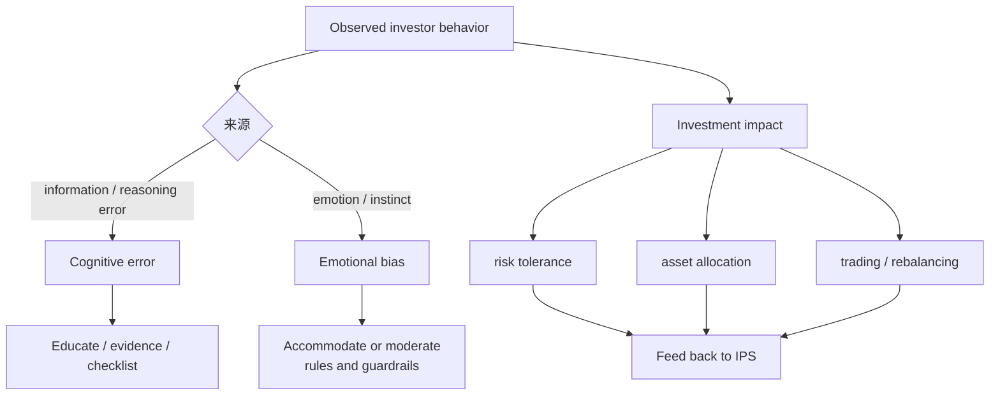

# M05: The Behavioral Biases of Individuals

> **模块定位**：把风险收益、组合构建、行为偏差和风险管理连接成投资流程。 本模块聚焦 **The Behavioral Biases of Individuals**，要求把官方 LOS 转成可执行的判断、计算或解释动作。

---

## Official Module Structure

- Learning Outcomes: The Behavioral Biases of Individuals
- 5.01 | Introduction
- 5.02 | Behavioral Bias Categories
- 5.03 | Cognitive Errors
- 5.04 | Emotional Biases
- 5.05 | Behavioral Finance and Market Behavior
- 5.06 | Summary

## Learning Outcome Statements

1. compare and contrast cognitive errors and emotional biases
2. discuss commonly recognized behavioral biases and their implications for financial decision making
3. describe how behavioral biases of investors can lead to market characteristics that may not be explained by traditional finance

---

## 1. 模块定位

### 5.1 学习任务
- **核心问题**：考试希望你用 `The Behavioral Biases of Individuals` 解释什么、计算什么、比较什么，或判断什么。
- **输入信息**：题干事实、数据、假设、时间口径、单位、约束条件。
- **输出结果**：中文结论 + 英文关键术语 + 必要公式/框架 + 限制条件。

### 5.2 考试角色
- **难度类型**：概念+应用。
- **高频题型**：定义辨析、情境判断、计算解释、表格补数、跨模块比较。
- **答题原则**：先判断 LOS 动词，再选择工具；计算后必须解释结果含义。

### 5.3 关键英文术语
- **The Behavioral Biases of Individuals（核心术语）**：本模块关键词，用于定位 LOS、题干条件和解题动作。
- **Introduction（核心术语）**：本模块关键词，用于定位 LOS、题干条件和解题动作。
- **Behavioral Bias Categories（核心术语）**：本模块关键词，用于定位 LOS、题干条件和解题动作。
- **Cognitive Errors（核心术语）**：本模块关键词，用于定位 LOS、题干条件和解题动作。
- **Emotional Biases（核心术语）**：本模块关键词，用于定位 LOS、题干条件和解题动作。
- **Behavioral Finance and Market Behavior（核心术语）**：本模块关键词，用于定位 LOS、题干条件和解题动作。
- **Summary（核心术语）**：本模块关键词，用于定位 LOS、题干条件和解题动作。
- **Portfolio Management（核心术语）**：本模块关键词，用于定位 LOS、题干条件和解题动作。

## 2. 官方 LOS 对应学习目标

| LOS | 官方要求 | 中文学习动作 | 做题输出 |
|---|---|---|---|
| 5.1 | compare and contrast cognitive errors and emotional biases | 比较相似概念的适用条件与差异 | 写出结论、依据、公式口径和限制条件。 |
| 5.2 | discuss commonly recognized behavioral biases and their implications for financial decision making | 识别概念、解释机制并应用到题干。 | 写出结论、依据、公式口径和限制条件。 |
| 5.3 | describe how behavioral biases of investors can lead to market characteristics that may not be explained by traditional finance | 描述定义、流程和适用场景 | 写出结论、依据、公式口径和限制条件。 |

## 3. 核心知识树

```text
5. The Behavioral Biases of Individuals
├─ 5.1 偏差总分类 (Bias Classification)
│  ├─ 5.1.1 Cognitive errors：信息处理或推理错误，可通过教育、流程、checklist 缓解
│  ├─ 5.1.2 Emotional biases：情绪/本能驱动，通常更难纠正，更多采用 accommodate/moderate
│  └─ 5.1.3 考试动作：先分类，再命名具体偏差，再说明投资影响和纠偏动作
├─ 5.2 认知错误 (Cognitive Errors)
│  ├─ 5.2.1 Belief perseverance：confirmation、representativeness、illusion of control、hindsight
│  ├─ 5.2.2 Information processing：anchoring、mental accounting、framing、availability
│  ├─ 5.2.3 典型后果：忽略反证、错误分类概率、过度交易、分账户导致整体风险失真
│  └─ 5.2.4 修正：反面证据清单、预设决策标准、整体组合视角、独立复核
├─ 5.3 情绪偏差 (Emotional Biases)
│  ├─ 5.3.1 Loss aversion：损失痛苦大于同额收益快乐，导致 disposition effect
│  ├─ 5.3.2 Overconfidence：高估能力/信息精度，导致集中持仓和过度交易
│  ├─ 5.3.3 Self-control / status quo / endowment / regret aversion：储蓄不足、拒绝再平衡、不愿卖出
│  └─ 5.3.4 管理：自动储蓄、再平衡规则、分阶段交易、顾问约束
├─ 5.4 偏差对投资过程的影响 (Impact on Investment Process)
│  ├─ 5.4.1 IPS：偏差会扭曲 stated willingness，必须与 ability 交叉验证
│  ├─ 5.4.2 Asset allocation：现状/禀赋/损失厌恶导致集中或不再平衡
│  ├─ 5.4.3 Trading：过度自信和确认偏差导致高换手和追涨杀跌
│  └─ 5.4.4 Market characteristics：偏差可解释动量、泡沫、过度反应/反应不足等传统金融难解释现象
```

## 核心图解



## 4. 知识点详解

### 5.1 偏差总分类 (Bias Classification)

行为偏差分为两大类，区分的关键在于**纠正难度**和**纠正方式**：

| 偏差大类 | 来源 | 能否完全纠正 | 处理方式 |
|----------|------|-------------|----------|
| 认知错误 (Cognitive errors) | 信息处理缺陷 | 可通过教育改进 | 教育、流程、检查表 |
| 情绪偏差 (Emotional biases) | 情绪/本能驱动 | 难以完全纠正 | 管理而非纠正 |

### 5.2 认知错误 (Cognitive Errors)

**信念固着类 (Belief Perseverance)**：

| 偏差 | 定义 | 对投资的影响 |
|------|------|-------------|
| 确认偏差 (Confirmation bias) | 只关注支持自己观点的信息 | 忽视反面证据，过度持有 |
| 代表性偏差 (Representativeness bias) | 根据刻板印象判断概率 | 追热门、误判均值回归 |
| 控制幻觉 (Illusion of control) | 高估自己对结果的掌控 | 过度交易、缺乏分散化 |
| 后见之明 (Hindsight bias) | 事后认为自己"早就知道" | 过度自信、归因错误 |

**信息处理类 (Information Processing)**：

| 偏差 | 定义 | 对投资的影响 |
|------|------|-------------|
| 锚定偏差 (Anchoring) | 过度依赖初始信息 | 买入价锚定导致不理性持有 |
| 心智账户 (Mental accounting) | 将资金分割成独立账户 | 忽略整体组合的相关性 |
| 框架效应 (Framing) | 受问题表述方式影响 | 不同表述导致不同决策 |
| 可得性偏差 (Availability bias) | 以易想起的事件判断概率 | 近期事件过度影响判断 |

### 5.3 情绪偏差 (Emotional Biases)

| 偏差 | 定义 | 对投资的影响 |
|------|------|-------------|
| 损失厌恶 (Loss aversion) | 同等损失比收益更痛苦 | 过早卖出盈利、过久持有亏损 |
| 过度自信 (Overconfidence) | 高估自身能力/信息精度 | 过度交易、集中持股 |
| 自我控制 (Self-control bias) | 偏好即时消费而非长期规划 | 储蓄不足、退休储备不足 |
| 禀赋偏差 (Endowment bias) | 高估已持有资产的价值 | 不愿卖出继承资产、不调整配置 |
| 现状偏差 (Status quo bias) | 不愿改变现状 | 配置长期失衡不调整 |

### 5.4 偏差对投资过程的影响 (Impact on Investment Process)

- **资产配置**：锚定、禀赋、现状偏差 → 配置偏离最优
- **交易行为**：过度自信 → 过度交易；损失厌恶 → 处置效应 (disposition effect)
- **风险管理**：控制幻觉 → 低估风险；可得性 → 高估小概率事件
- **IPS 设定**：过度自信 → 设过高收益目标；损失厌恶 → 过低风险意愿

## 5. 关键公式与计算框架

### 5.1 核心内容

| 概念 | 公式/定义 | 说明 |
|------|-----------|------|
| 处置效应 (Disposition effect) | 过早卖出盈利资产 + 过久持有亏损资产 | 损失厌恶 + 确认偏差共同导致 |
| 前景理论 (Prospect theory) | 参考点依赖 + 损失厌恶 + 非线性概率权重 | 替代期望效用理论 |
| 均值回归误判 | 将随机波动误认为趋势反转或延续 | 代表性偏差的表现形式 |

*注：M06 以概念辨析题为主，无复杂数学计算。*

### 5.2 偏差诊断框架

| 题干行为 | 可能偏差 | 类别 | 投资影响/动作 |
|---|---|---|---|
| 只找支持自己观点的信息 | confirmation | cognitive | 要求列出反面证据。 |
| 因近期新闻高估概率 | availability | cognitive | 使用长期基准率校正。 |
| 把继承股票看得特别贵 | endowment | emotional | 分阶段卖出或设置集中持仓上限。 |
| 亏损股不卖、盈利股早卖 | loss aversion / disposition | emotional | 预设止损/再平衡规则。 |
| 频繁交易且自认为能择时 | overconfidence | emotional | 限制换手率、记录交易理由。 |
| 分账户忽略整体风险 | mental accounting | cognitive | 回到 total portfolio view。 |
| 不愿改变默认配置 | status quo | emotional | 设置定期再平衡和审查触发。 |

## 6. 常见考点与解题思路

| 重要性 | 考点 | 解题动作 |
|---|---|---|
| ⭐⭐⭐ | 5.1 考点1：识别偏差类型 | 先定位题干触发词，再写公式/框架，最后解释结果或判断陷阱。 |
| ⭐⭐⭐ | 5.2 考点2：区分认知错误 vs 情绪偏差 | 先定位题干触发词，再写公式/框架，最后解释结果或判断陷阱。 |
| ⭐⭐ | 5.3 考点3：偏差的影响与纠正 | 先定位题干触发词，再写公式/框架，最后解释结果或判断陷阱。 |
| ⭐⭐ | 5.4 考点4：多偏差共存 | 先定位题干触发词，再写公式/框架，最后解释结果或判断陷阱。 |

### 6.9 ⭐⭐ Legacy 考点补充

### 6.1 考点1：识别偏差类型
- **步骤**：
  1. 读情景描述 → 识别关键行为
  2. 判断是认知错误还是情绪偏差
  3. 匹配具体偏差名称
  4. 说明对投资决策的影响

### 6.2 考点2：区分认知错误 vs 情绪偏差
- **步骤**：给定偏差 → 判断类别 → 解释为什么
- 关键判断点：情绪偏差更难纠正，来自本能；认知错误来自信息处理缺陷

### 6.3 考点3：偏差的影响与纠正
- **步骤**：识别偏差 → 指出影响 → 给出纠正/管理建议
- 认知错误：建议通过教育、流程化、检查表
- 情绪偏差：建议通过规则约束、自动机制、顾问介入

### 6.4 考点4：多偏差共存
- **步骤**：识别多个偏差 → 分析交互影响 → 综合建议
- 常见组合：过度自信 + 确认偏差 → 强化错误持仓

## 7. 易错点与考试陷阱

| ❌ 错误理解 | ✅ 正确理解 | 为什么错 / 考试提醒 |
|---|---|---|
| ❌ 行为偏差是心理学边角料 | ✅ 行为偏差直接影响配置和交易错误，是核心考点 | 按官方定义和 LOS 口径核验。 |
| ❌ 所有偏差都可以被纠正 | ✅ 情绪偏差只能管理，很难完全纠正 | 按官方定义和 LOS 口径核验。 |
| ❌ Loss aversion 和 risk aversion 一样 | ✅ Loss aversion 是行为偏差，risk aversion 是理性偏好 | 按官方定义和 LOS 口径核验。 |
| ❌ 代表性偏差 = 过度自信 | ✅ 两者不同：代表性是模式识别错误 | 按官方定义和 LOS 口径核验。 |
| ❌ 偏差只影响散户 | ✅ 机构投资者和专业投资者同样受偏差影响 | 按官方定义和 LOS 口径核验。 |
| ❌ 知道偏差就能避免偏差 | ✅ 认知不等于行为改变，需要系统性工具和纪律 | 按官方定义和 LOS 口径核验。 |

## 8. 跨模块关联

| 输出节点 | 连接模块/科目 | 如何被调用 | 易错接口 |
|---|---|---|---|
| `5.1` 分类 | [[M04-Basics-of-Portfolio-Planning-and-Construction]] | IPS 中 willingness 是否可信 | Cognitive 可教育，emotional 更常需管理。 |
| `5.2` 认知错误 | Equity research、Quant evidence | 研究结论和信息处理偏差 | 数据证据可缓解但不能自动消除偏差。 |
| `5.3` 情绪偏差 | Wealth planning、Risk Management | 客户行为、再平衡和风险暴露 | Loss aversion 不是 risk aversion。 |
| `5.4` 投资过程影响 | M06 Risk、Market efficiency | 偏差导致错误风险承担和市场异常 | 识别偏差后必须给具体控制动作。 |

### Legacy 关联补充

- [[M02-Utility-and-CAL]]：行为偏差使实际选择偏离理性效用最大化
- [[M03-CAPM-and-Beta]]：行为偏差可能解释 CAPM 异常现象（如动量效应）
- [[M04-Market-Efficiency-and-Portfolio-Construction]]：偏差影响市场有效性和组合构建
- [[M05-IPS]]：偏差影响 IPS 的准确性，特别是 self-assessment 部分
- [[M07-Risk-Management]]：偏差可能使风险暴露超出预期
- [[00-Portfolio-Management-MOC]]


## 9. 复习与刷题提示

- 第一轮：按 `Official Module Structure` 逐节过概念，把每个 LOS 改写成中文任务。
- 第二轮：对照 `## 3. 核心知识树` 做主动回忆，能说出每个编号节点的定义、公式/框架和陷阱。
- 第三轮：刷题后记录错因，如果暴露 MOC 缺口，按 `docs/moc-auto-patch-workflow.md` 进入补强流程。
- 考前：只看术语、公式/框架、易错点和本模块错题，避免重新铺开所有正文。

## 10. Legacy Notes Integrated

- **主要 legacy 来源**：`M06-Behavioral-Biases.md` (medium, 0.322)
- **整合规则**：高置信内容已合入 `知识点详解`、`公式与计算框架`、`常见考点`、`易错陷阱` 和 `跨模块关联`。
- **边界**：若 legacy 内容与 2026 官方 LOS 冲突，以官方 module 名称、LOS 和 registry 为准。
