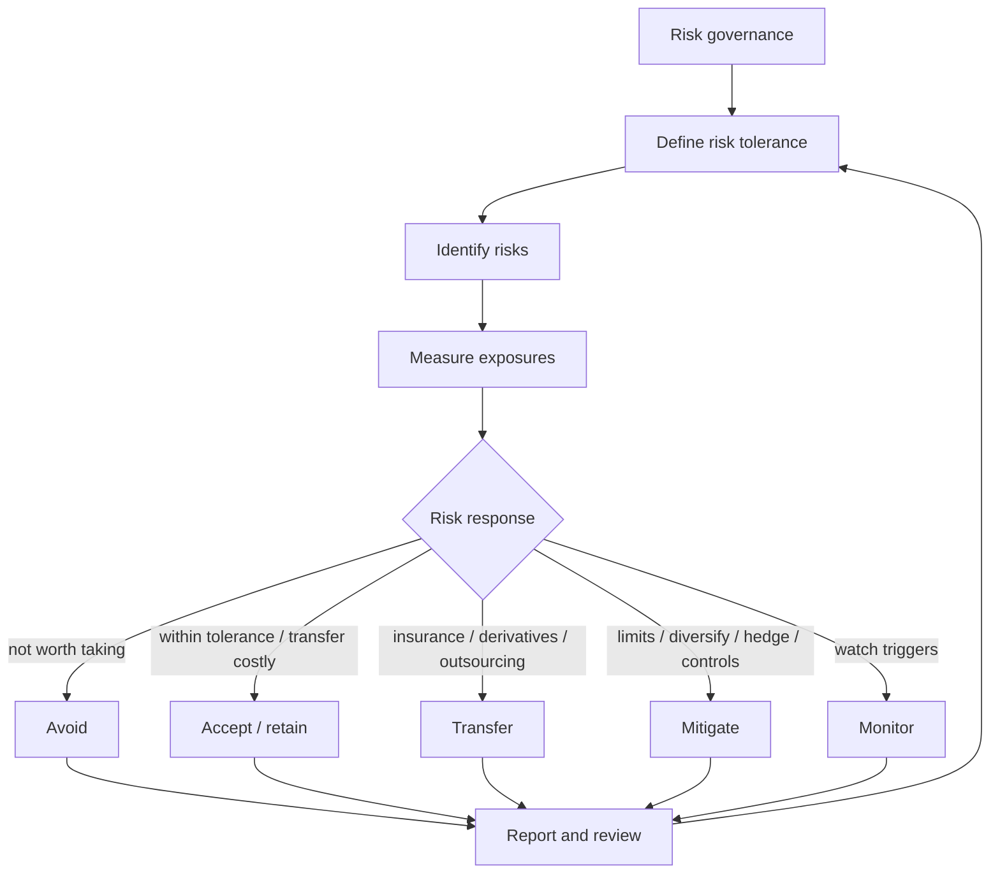

# M06: Introduction to Risk Management

> **模块定位**：把风险收益、组合构建、行为偏差和风险管理连接成投资流程。 本模块聚焦 **Introduction to Risk Management**，要求把官方 LOS 转成可执行的判断、计算或解释动作。

---

## Official Module Structure

- Learning Outcomes: Introduction to Risk Management
- 6.01 | Introduction
- 6.02 | Risk Management Process
- 6.03 | Risk Management Framework
- 6.04 | Risk Governance - An Enterprise View
- 6.05 | Risk Tolerance
- 6.06 | Risk Budgeting
- 6.07 | Identification of Risk - Financial Vs. Non-Financial Risk
- 6.08 | Interactions Between Risks
- 6.09 | Measuring and Modifying Risk: Drivers and Metrics
- 6.10 | Risk Modification: Prevention, Avoidance, and Acceptance
- 6.11 | Risk Modification: Transferring, Shifting, and How to Choose
- 6.12 | Summary

## Learning Outcome Statements

1. define risk management
2. describe features of a risk management framework
3. define risk governance and describe elements of effective risk governance
4. explain how risk tolerance affects risk management
5. describe risk budgeting and its role in risk governance
6. identify financial and non-financial sources of risk and describe how they may interact
7. describe methods for measuring and modifying risk exposures and factors to consider in choosing among the methods

---

## 1. 模块定位

### 6.1 学习任务
- **核心问题**：考试希望你用 `Introduction to Risk Management` 解释什么、计算什么、比较什么，或判断什么。
- **输入信息**：题干事实、数据、假设、时间口径、单位、约束条件。
- **输出结果**：中文结论 + 英文关键术语 + 必要公式/框架 + 限制条件。

### 6.2 考试角色
- **难度类型**：概念+案例判断。
- **高频题型**：定义辨析、情境判断、计算解释、表格补数、跨模块比较。
- **答题原则**：先判断 LOS 动词，再选择工具；计算后必须解释结果含义。

### 6.3 关键英文术语
- **Introduction to Risk Management（核心术语）**：本模块关键词，用于定位 LOS、题干条件和解题动作。
- **Introduction（核心术语）**：本模块关键词，用于定位 LOS、题干条件和解题动作。
- **Risk Management Process（核心术语）**：本模块关键词，用于定位 LOS、题干条件和解题动作。
- **Risk Management Framework（核心术语）**：本模块关键词，用于定位 LOS、题干条件和解题动作。
- **Risk Governance - An Enterprise View（核心术语）**：本模块关键词，用于定位 LOS、题干条件和解题动作。
- **Risk Tolerance（核心术语）**：本模块关键词，用于定位 LOS、题干条件和解题动作。
- **Risk Budgeting（核心术语）**：本模块关键词，用于定位 LOS、题干条件和解题动作。
- **Identification of Risk - Financial Vs. Non-Financial Risk（核心术语）**：本模块关键词，用于定位 LOS、题干条件和解题动作。

## 2. 官方 LOS 对应学习目标

| LOS | 官方要求 | 中文学习动作 | 做题输出 |
|---|---|---|---|
| 6.1 | define risk management | 识别概念、解释机制并应用到题干。 | 写出结论、依据、公式口径和限制条件。 |
| 6.2 | describe features of a risk management framework | 描述定义、流程和适用场景 | 写出结论、依据、公式口径和限制条件。 |
| 6.3 | define risk governance and describe elements of effective risk governance | 描述定义、流程和适用场景 | 写出结论、依据、公式口径和限制条件。 |
| 6.4 | explain how risk tolerance affects risk management | 解释机制、原因和后果 | 写出结论、依据、公式口径和限制条件。 |
| 6.5 | describe risk budgeting and its role in risk governance | 描述定义、流程和适用场景 | 写出结论、依据、公式口径和限制条件。 |
| 6.6 | identify financial and non-financial sources of risk and describe how they may interact | 描述定义、流程和适用场景；识别题干中的关键事实和触发条件 | 写出结论、依据、公式口径和限制条件。 |
| 6.7 | describe methods for measuring and modifying risk exposures and factors to consider in choosing among the methods | 描述定义、流程和适用场景 | 写出结论、依据、公式口径和限制条件。 |

## 3. 核心知识树

```text
6. Introduction to Risk Management
├─ 6.1 风险管理框架 (Risk Management Framework)
│  ├─ 6.1.1 Governance：定义 risk tolerance、角色、职责、报告线和独立性
│  ├─ 6.1.2 Identification：识别会阻碍目标实现的金融和非金融风险
│  ├─ 6.1.3 Measurement：用 VaR、stress test、scenario、tracking error 等量化暴露
│  ├─ 6.1.4 Modification：avoid / accept / transfer / mitigate / monitor
│  └─ 6.1.5 Monitoring：持续跟踪、报告和根据目标变化更新
├─ 6.2 风险分类 (Risk Classification)
│  ├─ 6.2.1 Financial risks：market、credit、liquidity、operational
│  ├─ 6.2.2 Non-financial risks：legal、regulatory、tax、accounting、model、reputation
│  ├─ 6.2.3 Tail risk：低概率高损失，常规波动指标可能低估
│  └─ 6.2.4 Interaction：流动性风险可放大市场/信用风险，操作风险可触发声誉风险
├─ 6.3 风险改变化方式 (Risk Modification Methods)
│  ├─ 6.3.1 Avoid：退出或不进入风险活动
│  ├─ 6.3.2 Accept/retain：风险在容忍度内或转移成本太高时自留
│  ├─ 6.3.3 Transfer：保险、衍生品、外包等把风险转给他方
│  ├─ 6.3.4 Mitigate：分散化、对冲、限额、流程控制降低概率或损失
│  └─ 6.3.5 Monitor：风险暂不处理但设置指标和触发点
├─ 6.4 风险预算 (Risk Budgeting)
│  ├─ 6.4.1 Risk budget：把总风险限额分配给资产类别、策略或经理
│  ├─ 6.4.2 Active risk budget：约束相对 benchmark 的偏离程度
│  └─ 6.4.3 监控：实际风险超过预算时需要降风险、再平衡或修订目标
├─ 6.5 风险管理的关键原则
│  ├─ 6.5.1 目标：不是最小化风险，而是使风险与 return objective 匹配
│  ├─ 6.5.2 独立性：风险管理职能应能独立挑战投资决策
│  └─ 6.5.3 持续性：风险管理是循环过程，不是一次性报表
```

## 核心图解



## 4. 知识点详解

### 6.1 风险管理框架 (Risk Management Framework)

风险管理是一个系统性过程，包含五个核心步骤：

1. **风险治理 (Risk governance)**：建立风险管理组织结构、政策、角色和职责
2. **风险识别 (Risk identification)**：找出影响投资目标实现的各类风险
3. **风险计量 (Risk measurement)**：量化风险敞口的大小和影响
4. **风险改变化 (Risk modification)**：通过工具调整风险敞口
5. **风险监控 (Risk monitoring)**：持续追踪风险变化并报告

### 6.2 风险分类 (Risk Classification)

**金融风险 (Financial Risks)**：

| 风险类型 | 英文 | 说明 |
|----------|------|------|
| 市场风险 | Market risk | 资产价格变动导致的损失风险 |
| 信用风险 | Credit risk | 交易对手违约的风险 |
| 流动性风险 | Liquidity risk | 无法以合理价格及时交易的风险 |
| 操作风险 | Operational risk | 内部流程/系统/人员失误导致的风险 |

**非金融风险 (Non-Financial Risks)**：

| 风险类型 | 英文 | 说明 |
|----------|------|------|
| 法律风险 | Legal risk | 合同不可执行或法律纠纷 |
| 监管风险 | Regulatory risk | 法规变化带来的影响 |
| 税务风险 | Tax risk | 税法变动导致的损失 |
| 会计风险 | Accounting risk | 会计处理方法变更的影响 |
| 模型风险 | Model risk | 模型假设错误或使用不当 |
| 声誉风险 | Reputational risk | 负面事件损害机构声誉 |
| 尾部风险 | Tail risk | 极端事件发生的低概率高风险场景 |

### 6.3 风险改变化方式 (Risk Modification Methods)

| 方式 | 英文 | 说明 |
|------|------|------|
| 规避 | Avoid | 不参与产生风险的活动 |
| 接受 | Accept | 承担风险（self-insure） |
| 转移 | Transfer | 通过衍生品/保险转移风险 |
| 缓释 | Mitigate | 通过分散化/对冲降低风险 |
| 监控 | Monitor | 持续观察并准备应对 |

### 6.4 风险预算 (Risk Budgeting)

- **风险预算 (risk budget)**：将总风险限额分配到不同资产类别、策略或部门
- 主动风险预算 (active risk budget) 决定了组合偏离基准的最大程度
- 风险预算应与企业/投资者的使命、目标、资本实力一致

### 6.5 风险管理的关键原则

- 好的风险管理**不是**把风险降到最低，而是使风险与回报目标相匹配
- 风险管理 **不是** 恐惧驱动的电子表格工作，而是**赋能**选定的风险承担
- 独立性原则：风险管理职能应与投资决策职能分离（独立的风险管理官）
- 风险管理是持续的过程，非一次性事件

## 5. 关键公式与计算框架

### 5.1 核心内容

| 指标 | 公式/概念 | 说明 |
|------|-----------|------|
| 风险价值 (VaR) | 给定置信水平下的最大损失 | `P(ΔP ≤ -VaR) = 1 - α` |
| 跟踪误差 (Tracking error) | `σ(Rp - Rb)` | 主动风险的衡量 |
| 风险预算偏差 | 实际风险 vs 预算风险限额 | 监控主动风险是否超限 |
| 夏普比率再审视 | `(Rp-Rf)/σp` | 风险调整后收益的完整衡量 |

*注：M07 以概念题为主，VaR 等指标在 CFA L1 只要求基本理解。*

### 5.2 风险处理决策树

| 题干情景 | 首选动作 | 对应节点 | 判断理由 |
|---|---|---|---|
| 风险不符合使命或收益不足以补偿 | avoid | `6.3.1` | 不承担不必要风险。 |
| 风险小且转移成本高 | accept/retain | `6.3.2` | 自留更经济。 |
| 可通过保险/衍生品转给他方 | transfer | `6.3.3` | 风险承担方改变，不代表风险消失。 |
| 可通过分散化、限额、流程降低 | mitigate | `6.3.4` | 降低概率或损失幅度。 |
| 风险暂在预算内但需观察 | monitor | `6.3.5` | 设触发点和报告频率。 |
| 主动风险超限 | 降低 tracking error / 再平衡 | `6.4` | 风险预算是风险额度，不是资金预算。 |

## 6. 常见考点与解题思路

| 重要性 | 考点 | 解题动作 |
|---|---|---|
| ⭐⭐⭐ | 6.1 考点1：风险分类判断 | 先定位题干触发词，再写公式/框架，最后解释结果或判断陷阱。 |
| ⭐⭐⭐ | 6.2 考点2：风险管理流程排序 | 先定位题干触发词，再写公式/框架，最后解释结果或判断陷阱。 |
| ⭐⭐ | 6.3 考点3：风险改变化方式选择 | 先定位题干触发词，再写公式/框架，最后解释结果或判断陷阱。 |
| ⭐⭐ | 6.4 考点4：风险预算与主动风险 | 先定位题干触发词，再写公式/框架，最后解释结果或判断陷阱。 |

### 6.9 ⭐⭐ Legacy 考点补充

### 6.1 考点1：风险分类判断
- **步骤**：给定情景 → 判断属于哪种风险类型
- 常见题型：区分市场风险、信用风险、操作风险、流动性风险

### 6.2 考点2：风险管理流程排序
- **步骤**：给一系列风险管理动作 → 按正确顺序排列
- 正确顺序：治理 → 识别 → 计量 → 改变化 → 监控

### 6.3 考点3：风险改变化方式选择
- **步骤**：给定风险情景 → 选择最合适的改变化方式
- 关键：规避（不参与）、接受（自留）、转移（保险/衍生品）、缓释（分散化）

### 6.4 考点4：风险预算与主动风险
- **步骤**：分析主动风险水准 → 判断是否超出风险预算
- 常见题型：给定追踪误差和预算限额 → 判断是否需要调整

## 7. 易错点与考试陷阱

| ❌ 错误理解 | ✅ 正确理解 | 为什么错 / 考试提醒 |
|---|---|---|
| ❌ 风险管理目标是把风险降到最低 | ✅ 目标是使风险与回报目标匹配 | 按官方定义和 LOS 口径核验。 |
| ❌ 操作风险 = 小概率不重要 | ✅ 操作风险（如交易员错误）可能造成重大损失 | 按官方定义和 LOS 口径核验。 |
| ❌ 风险转移 = 风险消失 | ✅ 转移只是改变了风险承担方，系统性风险无法转移 | 按官方定义和 LOS 口径核验。 |
| ❌ 风险预算就是资金预算 | ✅ 风险预算分配的是风险限额，不是资金 | 按官方定义和 LOS 口径核验。 |
| ❌ VaR 衡量最大损失 | ✅ VaR 衡量给定置信水平下的最小可能损失 | 按官方定义和 LOS 口径核验。 |
| ❌ 流动性风险只在危机时出现 | ✅ 流动性风险在正常市场也可能存在 | 按官方定义和 LOS 口径核验。 |
| ❌ 风险管理是风控部门的事 | ✅ 风险管理是每个投资决策的一部分 | 按官方定义和 LOS 口径核验。 |

## 8. 跨模块关联

| 输出节点 | 连接模块/科目 | 如何被调用 | 易错接口 |
|---|---|---|---|
| `6.1` 风险框架 | [[M04-Basics-of-Portfolio-Planning-and-Construction]]、Ethics | IPS 目标和受托责任需要风险治理支持 | 风险管理不是只在损失后补救。 |
| `6.2` 风险分类 | Fixed Income、Derivatives、Alternatives | 信用、市场、流动性、模型和操作风险识别 | 风险常相互放大，不是孤立标签。 |
| `6.3` 风险处理 | Derivatives、Insurance、Portfolio construction | hedge、transfer、diversify、retain | 转移风险不等于消灭风险。 |
| `6.4` 风险预算 | Active management、Performance | tracking error、active risk 限额 | 预算分配的是风险，不是资金。 |
| `6.5` 风险原则 | Behavioral、Governance | 独立风控与行为偏差校正 | 目标是匹配风险和收益，而非压到最低。 |

### Legacy 关联补充

- [[M01-Portfolio-Risk-and-Return]]：风险概念源于组合收益的波动性
- [[M03-CAPM-and-Beta]]：系统性风险是 CAPM 的定价基础
- [[M04-Market-Efficiency-and-Portfolio-Construction]]：风险预算是组合构建的一部分
- [[M05-IPS]]：风险管理确保 IPS 目标的实现
- [[M06-Behavioral-Biases]]：行为偏差可能误导风险判断
- [[00-Portfolio-Management-MOC]]


## 9. 复习与刷题提示

- 第一轮：按 `Official Module Structure` 逐节过概念，把每个 LOS 改写成中文任务。
- 第二轮：对照 `## 3. 核心知识树` 做主动回忆，能说出每个编号节点的定义、公式/框架和陷阱。
- 第三轮：刷题后记录错因，如果暴露 MOC 缺口，按 `docs/moc-auto-patch-workflow.md` 进入补强流程。
- 考前：只看术语、公式/框架、易错点和本模块错题，避免重新铺开所有正文。

## 10. Legacy Notes Integrated

- **主要 legacy 来源**：`M07-Risk-Management.md` (medium, 0.312)
- **整合规则**：高置信内容已合入 `知识点详解`、`公式与计算框架`、`常见考点`、`易错陷阱` 和 `跨模块关联`。
- **边界**：若 legacy 内容与 2026 官方 LOS 冲突，以官方 module 名称、LOS 和 registry 为准。
