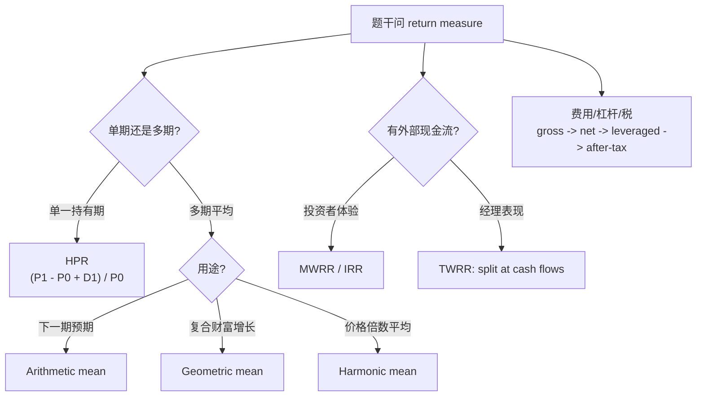

# M01: Rates and Returns

> **模块定位**：把投资问题翻译成收益率、现金流、统计推断和模型检验。 本模块聚焦 **Rates and Returns**，要求把官方 LOS 转成可执行的判断、计算或解释动作。

---

## Official Module Structure

- Learning Outcomes: Rates and Returns
- 1.01 | Introduction
- 1.02 | Interest Rates and Time Value of Money
- 1.03 | Rates of Return
- 1.04 | Money-Weighted and Time-Weighted Return
- 1.05 | Annualized Return
- 1.06 | Other Major Return Measures and Their Applications

## Learning Outcome Statements

1. interpret interest rates as required rates of return, discount rates, or opportunity costs and explain an interest rate as the sum of a real risk-free rate and premiums that compensate investors for bearing distinct types of risk
2. calculate and interpret different approaches to return measurement over time and describe their appropriate uses
3. compare the money-weighted and time-weighted rates of return and evaluate the performance of portfolios based on these measures
4. calculate and interpret annualized return measures and continuously compounded returns, and describe their appropriate uses
5. calculate and interpret major return measures and describe their appropriate uses

---

## 1. 模块定位

### 1.1 学习任务
- **核心问题**：考试希望你用 `Rates and Returns` 解释什么、计算什么、比较什么，或判断什么。
- **输入信息**：题干事实、数据、假设、时间口径、单位、约束条件。
- **输出结果**：中文结论 + 英文关键术语 + 必要公式/框架 + 限制条件。

### 1.2 考试角色
- **难度类型**：计算+解释。
- **高频题型**：定义辨析、情境判断、计算解释、表格补数、跨模块比较。
- **答题原则**：先判断 LOS 动词，再选择工具；计算后必须解释结果含义。

### 1.3 关键英文术语
- **Rates and Returns（利率与收益率）**：把现金流的时间价值、风险补偿和投资表现放到同一套语言中比较。
- **Introduction（核心术语）**：本模块关键词，用于定位 LOS、题干条件和解题动作。
- **Interest Rates and Time Value of Money（核心术语）**：本模块关键词，用于定位 LOS、题干条件和解题动作。
- **Rates of Return（核心术语）**：本模块关键词，用于定位 LOS、题干条件和解题动作。
- **Money-Weighted and Time-Weighted Return（核心术语）**：本模块关键词，用于定位 LOS、题干条件和解题动作。
- **Annualized Return（核心术语）**：本模块关键词，用于定位 LOS、题干条件和解题动作。
- **Other Major Return Measures and Their Applications（核心术语）**：本模块关键词，用于定位 LOS、题干条件和解题动作。
- **Time Value of Money（货币时间价值）**：今天的一元钱与未来的一元钱价值不同，必须用折现或复利转换。

## 2. 官方 LOS 对应学习目标

| LOS | 官方要求 | 中文学习动作 | 做题输出 |
|---|---|---|---|
| 1.1 | interpret interest rates as required rates of return, discount rates, or opportunity costs and explain an interest rate as the sum of a real risk-free rate and premiums that compensate investors for bearing distinct types of risk | 解释结果的投资含义；解释机制、原因和后果 | 写出结论、依据、公式口径和限制条件。 |
| 1.2 | calculate and interpret different approaches to return measurement over time and describe their appropriate uses | 计算并解释数值结果；解释结果的投资含义；描述定义、流程和适用场景 | 写出结论、依据、公式口径和限制条件。 |
| 1.3 | compare the money-weighted and time-weighted rates of return and evaluate the performance of portfolios based on these measures | 比较相似概念的适用条件与差异；评价优缺点、限制和决策含义 | 写出结论、依据、公式口径和限制条件。 |
| 1.4 | calculate and interpret annualized return measures and continuously compounded returns, and describe their appropriate uses | 计算并解释数值结果；解释结果的投资含义；描述定义、流程和适用场景 | 写出结论、依据、公式口径和限制条件。 |
| 1.5 | calculate and interpret major return measures and describe their appropriate uses | 计算并解释数值结果；解释结果的投资含义；描述定义、流程和适用场景 | 写出结论、依据、公式口径和限制条件。 |

## 3. 核心知识树

```text
1. Rates and Returns
├─ 1.1 利率的三种解释（Three Interpretations of Interest Rate）
│  ├─ 1.1.1 Required return：投资者要求的最低补偿，后续 CAPM/估值使用
│  ├─ 1.1.2 Discount rate：未来现金流折现到今天的利率，连接 M02 TVM
│  └─ 1.1.3 Opportunity cost：选择该资产放弃的次优收益，题目常用作概念解释
├─ 1.2 利率分解（Interest Rate Decomposition）
│  ├─ 1.2.1 名义利率 ≈ real risk-free + expected inflation + default + liquidity + maturity premium
│  ├─ 1.2.2 高利率归因：不能只说“风险高”，要指出是哪一种 premium 上升
│  └─ 1.2.3 跨科目接口：Fixed Income 的 yield spread、Equity 的 required return 都沿用该分解
├─ 1.3 收益率度量阶梯（Return Measurement Ladder）
│  ├─ 1.3.1 HPR：`(P1-P0+D1)/P0`，单一持有期总回报
│  ├─ 1.3.2 Gross return：`(P1+D1)/P0=1+HPR`；Net return 再扣管理/行政费
│  ├─ 1.3.3 Arithmetic mean：单期期望收益；Geometric mean：多期复合增长
│  └─ 1.3.4 Harmonic mean：价格倍数平均，避免高倍数异常值主导
├─ 1.4 MWRR vs TWRR
│  ├─ 1.4.1 MWRR：`ΣCF_t/(1+r)^t=0`，现金流时点会影响结果，衡量 investor experience
│  ├─ 1.4.2 TWRR：先按外部现金流切段，再 `Π(1+HP_i)-1`，衡量 manager performance
│  └─ 1.4.3 判断陷阱：差时追加/好时赎回会拖低 MWRR，不等于经理差
├─ 1.5 年化与连续复利（Annualization and Continuous Compounding）
│  ├─ 1.5.1 年化：`(1+R_period)^c-1`，c 是一年内期数
│  ├─ 1.5.2 连续复利：`r_cc=ln(1+HPR)`；可加性强，普通收益需乘法链接
│  └─ 1.5.3 连续终值/现值：`FV=PV e^(rt)`，`PV=FV e^(-rt)`
├─ 1.6 总回报 vs 净回报（Gross Return vs Net Return）
│  ├─ 1.6.1 Gross return 已反映 trading expenses，不再重复扣交易费用
│  ├─ 1.6.2 Net return = gross return - management/admin fees
│  └─ 1.6.3 杠杆税后顺序：gross -> net -> leveraged -> after-tax
```

## 核心图解



## 4. 知识点详解

### 1.1 利率的三种解释（Three Interpretations of Interest Rate）

利率（Interest Rate）在 CFA 考试中有三种等价解释：

- **要求回报率（Required Rate of Return）**：投资者投资所要求的最低回报率，包含机会成本和风险补偿。
- **折现率（Discount Rate）**：将未来现金流折算为现值的比率，反映货币的时间价值。
- **机会成本（Opportunity Cost）**：选择某一投资而放弃次优选择所损失的潜在收益。

这三种解释相通 — 折现率就是投资者对该投资的要求回报率，也就是放弃其他机会的成本。

### 1.2 利率分解（Interest Rate Decomposition）

名义利率可分解为多个组成部分：

`名义利率 ≈ 实际无风险利率 + 预期通胀溢价 + 违约风险溢价 + 流动性风险溢价 + 期限风险溢价 + 其他风险溢价`

- **实际无风险利率（Real Risk-Free Rate）**：无通胀、无风险环境下的纯粹时间价值，通常用短期国债实际收益率近似。
- **预期通胀溢价（Expected Inflation Premium）**：补偿投资者预期购买力下降的溢价。
- **违约风险溢价（Default Risk Premium）**：补偿发行人可能违约的风险。
- **流动性风险溢价（Liquidity Risk Premium）**：补偿资产难以快速变现的流动性风险。
- **期限风险溢价（Maturity Risk Premium）**：补偿长期债券的利率风险。

> **【考试核心】** 高名义利率可能来自高通胀，也可能来自高违约风险或低流动性，不能简单归因于单一因素。

### 1.3 收益率度量阶梯（Return Measurement Ladder）

**持有期收益率（Holding Period Return, HPR）**：
`HPR = (P_1 - P_0 + D_1) / P_0`

HPR 是基础收益率度量，不考虑投资期限长短，直接计算整个持有期的总回报比率。

**算术平均收益率（Arithmetic Mean Return）**：
`Arithmetic Mean = (R_1 + R_2 + ... + R_n) / n`

适用于估计单期预期收益（Expected Return），但会高估多期复合财富增长。

**几何平均收益率（Geometric Mean Return）**：
`Geometric Mean = [(1 + R_1)(1 + R_2)...(1 + R_n)]^(1/n) - 1`

适用于衡量多期复合增长。几何平均始终小于或等于算术平均，差异越大说明收益率波动越大。

**调和平均（Harmonic Mean）**：适用于价格倍数（Price Multiple）的平均，如平均市盈率（P/E）计算，因为调和平均对极端值更不敏感。

### 1.4 MWRR vs TWRR

**资金加权收益率（Money-Weighted Rate of Return, MWRR）**本质上是投资组合的内部收益率（IRR），对现金流进出时点敏感。MWRR 衡量的是**投资者实际体验** — 相同投资组合业绩下，在不同时点追加或赎回资金的投资者会得到不同的 MWRR。

**时间加权收益率（Time-Weighted Rate of Return, TWRR）**通过在每个现金流进出时点将投资组合拆分为子期间，将各子期间收益率几何链接起来。TWRR 衡量的是**基金经理的投资管理能力**，不受投资者现金流决策的影响。

> **【考试陷阱】** 当客户在业绩差的时候追加资金、业绩好的时候赎回资金时，MWRR 会显著低于 TWRR，这不代表基金经理表现差。

### 1.5 年化与连续复利（Annualization and Continuous Compounding）

**年化收益率（Annualized Return）**：
`Annualized Return = (1 + R_period)^c - 1`
其中 c 是一年内的期数。例如月度收益率年化时 c = 12。

**连续复利收益率（Continuously Compounded Return）**：
`r_cc = ln(1 + HPR)`

连续复利收益率的最大优势是**可加性（Additivity）**：多期连续复利收益率可以直接相加，而普通收益率必须用乘法链接。

**连续复利的终值与现值**：
- `FV = PV * e^(rt)`
- `PV = FV * e^(-rt)`

> **【考试核心】** 当题目所给利率是连续复利口径时，必须使用 e^(rt) 而不是 (1+r)^n。

### 1.6 总回报 vs 净回报（Gross Return vs Net Return）

- **总回报（Gross Return）**：`(P_1 + D_1) / P_0 = 1 + HPR`，已在价格中扣除交易费用（Trading Expenses），但不扣除管理费和行政费。
- **净回报（Net Return）**：`Gross Return - Management/Admin Fees`，投资者实际到手的回报。

> **【考试陷阱】** Gross Return 已经包含了交易费用（Trading Expenses），不需要再额外扣除交易费用！净回报只额外扣除管理费和行政费。

### 1.7 杠杆与税后回报（Leveraged and After-Tax Return）

**杠杆回报（Leveraged Return）**：
`Leveraged Return = R_p + (B/E)(R_p - r_D)`
- B = 借款额
- E = 自有本金
- r_D = 借款利率

**税后回报（After-Tax Return）**：
`After-Tax Return = Pre-tax Return × (1 - t)`
- t = 税率

> **【考试陷阱】** 计算顺序至关重要：**Gross Return → Net Return → Leveraged Return → After-Tax Return**。不可以先扣税再算杠杆。

## 5. 关键公式与计算框架

### 5.1 核心内容

| 公式 | 解释 | 使用场景 |
|------|------|----------|
| `HPR = (P_1 - P_0 + D_1) / P_0` | 持有期收益率 | 衡量单一持有期的总回报 |
| `Arithmetic Mean = ΣR_i / n` | 算术平均收益率 | 估计单期预期收益 |
| `Geometric Mean = [(1+R_1)...(1+R_n)]^(1/n) - 1` | 几何平均收益率 | 衡量多期复合增长 |
| `Annualized Return = (1 + R_period)^c - 1` | 年化收益率 | 将期间收益率转化为年化口径 |
| `r_cc = ln(1 + HPR)` | 连续复利收益率 | 需要收益率可加性时使用 |
| `MWRR: Σ CF_t / (1+r)^t = 0` | 资金加权收益率 | 评估投资者实际体验 |
| `Compounded TWRR = ∏(1 + HP_i) - 1` | 复合时间加权收益率 | 评估基金经理表现 |
| `FV = PV * e^(rt)` | 连续复利终值 | 连续复利条件下的终值计算 |
| `Leveraged Return = R_p + (B/E)(R_p - r_D)` | 杠杆回报 | 借款投资时的回报计算 |
| `After-Tax Return = Pre-tax × (1 - t)` | 税后回报 | 考虑税收后的净回报 |

### 5.2 选择框架

| 题干触发 | 使用公式/口径 | 对应节点 | 检查点 |
|---|---|---|---|
| one holding period, price and income | `HPR = (P1-P0+D1)/P0` | `1.3.1` | D1 是否已含在 ending value。 |
| average expected one-period return | arithmetic mean | `1.3.3` | 不用于描述长期复合财富增长。 |
| compound annual growth | geometric mean | `1.3.3` | 所有期间先转 gross return 再连乘。 |
| investor cash-flow experience | MWRR / IRR | `1.4.1` | 外部现金流时点和符号要统一。 |
| manager performance | TWRR | `1.4.2` | 在每次外部现金流处切段。 |
| continuously compounded | `ln(1+HPR)` or `e^r-1` | `1.5.2` | 不要和普通年化混用。 |
| fees, leverage, taxes | gross -> net -> leverage -> tax | `1.6.3` | Gross 已包含 trading expenses。 |

## 6. 常见考点与解题思路

| 重要性 | 考点 | 解题动作 |
|---|---|---|
| ⭐⭐⭐ | 1.1 Introduction | 先定位题干触发词，再写公式/框架，最后解释结果或判断陷阱。 |
| ⭐⭐⭐ | 1.2 Interest Rates and Time Value of Money | 先定位题干触发词，再写公式/框架，最后解释结果或判断陷阱。 |
| ⭐⭐ | 1.3 Rates of Return | 先定位题干触发词，再写公式/框架，最后解释结果或判断陷阱。 |
| ⭐⭐ | 1.4 Money-Weighted and Time-Weighted Return | 先定位题干触发词，再写公式/框架，最后解释结果或判断陷阱。 |
| ⭐ | 1.5 Annualized Return | 先定位题干触发词，再写公式/框架，最后解释结果或判断陷阱。 |

### 6.9 ⭐⭐ Legacy 考点补充

### 6.1 核心内容

**考点一：计算 HPR 并区分其组成部分**
- 给定期初价格、期末价格和期间收入（股息/利息），直接代入 HPR 公式
- 注意区分 Gross Return 和 HPR 的关系：Gross Return = 1 + HPR

**考点二：选择 arithmetic mean vs geometric mean**
- 给多个历史收益率，要比较累计增长 → 用 Geometric Mean
- 给概率分布，求 expected return → 用 Arithmetic Mean
- 给一系列历史收益率求平均 → 先判断题目问的是 expected return 还是 past growth

**考点三：MWRR vs TWRR 计算与比较**
- MWRR 用 IRR 计算，将所有现金流（初始投资、追加/赎回、最终价值）代入解 r
- TWRR 先分段计算子期间 HPR，再几何链接
- 考试中可能要求比较两者大小关系并解释原因

**考点四：年化收益率计算**
- 给定期间收益率，用 `(1 + R)^c - 1` 年化
- 注意区分"年化收益率"和"有效年利率（EAR）"的等价性

**考点五：Gross → Net → Leverage → Tax 计算顺序**
- 计算顺序不可逆：**Gross Return → Net Return → Leveraged Return → After-Tax Return**
- Gross Return 已含 trading expenses，计算 Net Return 时只减 management/administrative fees
- Leverage 公式 `R_p + (B/E)(R_p - r_D)` 在 Net Return 基础上计算
- After-tax 在 Leveraged Return 基础上乘以 `(1 - t)`
- **常见错误**：在 Gross Return 阶段多减 trading expenses，或在 Leverage 之前扣税

## 7. 易错点与考试陷阱

| ❌ 错误理解 | ✅ 正确理解 | 为什么错 / 考试提醒 |
|---|---|---|
| ❌ 只背 Rates and Returns 的英文名，不解释中文含义 | ✅ 用中文说清定义、适用条件和考试动作 | 术语题和情境题都会考定义边界。 |
| ❌ 看到公式就直接套，不检查口径 | ✅ 先检查时间、单位、现金流方向、会计口径或统计假设 | CFA 常把错误藏在输入口径里。 |
| ❌ 把显著性、相关性或高分数直接当成好结论 | ✅ 还要看经济含义、限制条件和跨模块证据 | 数量结果必须回到投资解释。 |

## 8. 跨模块关联

| 输出节点 | 连接模块/科目 | 如何被调用 | 易错接口 |
|---|---|---|---|
| `1.1` 利率三重身份 | [[M02-Time-Value-of-Money-in-Finance]]、Fixed Income、Equity | 折现率、YTM、required return 都是同一利率语言的不同场景 | 不要把 discount rate 和 coupon rate 混为一谈。 |
| `1.2` 利率分解 | Fixed Income credit spread、Macroeconomics | 解释 yield / required return 变化来源 | 高 nominal rate 可能来自通胀，不一定来自信用风险。 |
| `1.3` 均值与收益率 | [[M03-Statistical-Measures-of-Asset-Returns]] | arithmetic/geometric/harmonic 在统计模块正式展开 | 几何均值用于复合，调和均值用于倍数。 |
| `1.4` MWRR/TWRR | Portfolio Management performance | 投资者体验与经理表现分离 | 外部现金流不是投资收益本身。 |
| `1.5` 年化/连续复利 | Fixed Income、Derivatives | 计息频率、连续贴现、远期定价 | 题目给 continuous 时不能用普通复利。 |
| `1.6` 费用/杠杆/税 | Portfolio Management、Wealth Planning | 投资者最终到手收益和风险承受能力 | 先后顺序错会导致税基和杠杆收益错。 |

### Legacy 关联补充

- **[[M02-Time-Value-of-Money]]**：TVM 是 HPR 和 MWRR（本质就是 IRR）的基础。MWRR = 0 = ΣCF/(1+r)^t 正是 TVM 的反向应用。
- **[[M03-Statistical-Measures]]**：三种均值（算术/几何/调和）在此首次出现，在 M03 中会进一步展开为 general 统计量。
- **[[M05-Portfolio-Mathematics]]**：杠杆回报公式是 Portfolio return 的延伸，组合方差中的权重逻辑也在此预热。
- **M07**：年化收益率涉及的"periodicity 转换"与 EAR 概念在固收中也反复出现。


## 9. 复习与刷题提示

- 第一轮：按 `Official Module Structure` 逐节过概念，把每个 LOS 改写成中文任务。
- 第二轮：对照 `## 3. 核心知识树` 做主动回忆，能说出每个编号节点的定义、公式/框架和陷阱。
- 第三轮：刷题后记录错因，如果暴露 MOC 缺口，按 `docs/moc-auto-patch-workflow.md` 进入补强流程。
- 考前：只看术语、公式/框架、易错点和本模块错题，避免重新铺开所有正文。

## 10. Legacy Notes Integrated

- **主要 legacy 来源**：`M01-Rates-and-Returns.md` (high, 0.791)
- **整合规则**：高置信内容已合入 `知识点详解`、`公式与计算框架`、`常见考点`、`易错陷阱` 和 `跨模块关联`。
- **边界**：若 legacy 内容与 2026 官方 LOS 冲突，以官方 module 名称、LOS 和 registry 为准。
