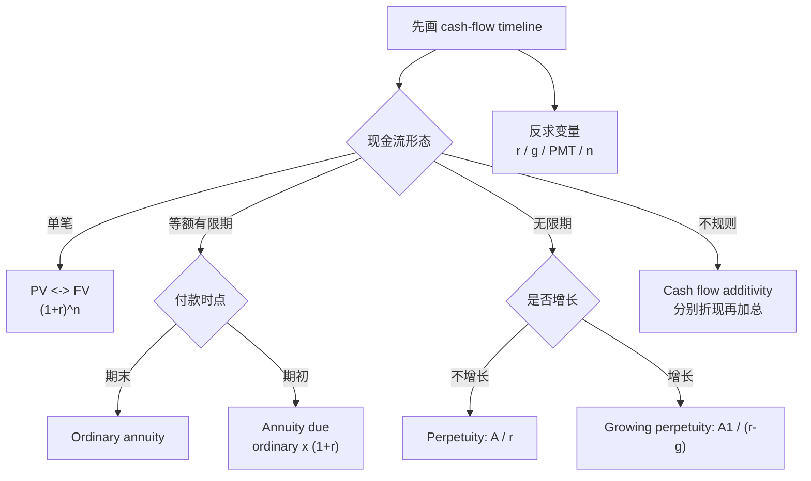

# M02: Time Value of Money in Finance

> **模块定位**：把投资问题翻译成收益率、现金流、统计推断和模型检验。 本模块聚焦 **Time Value of Money in Finance**，要求把官方 LOS 转成可执行的判断、计算或解释动作。

---

## Official Module Structure

- Learning Outcomes: Time Value of Money in Finance
- 2.01 | Introduction
- 2.02 | Time Value of Money in Fixed Income and Equity
- 2.03 | Implied Return and Growth
- 2.04 | Cash Flow Additivity

## Learning Outcome Statements

1. calculate and interpret the present value (PV) of fixed-income and equity instruments based on expected future cash flows
2. calculate and interpret the implied return of fixed-income instruments and required return and implied growth of equity instruments given the present value (PV) and cash flows
3. explain the cash flow additivity principle, its importance for the no-arbitrage condition, and its use in calculating implied forward interest rates, forward exchange rates, and option values

---

## 1. 模块定位

### 2.1 学习任务
- **核心问题**：考试希望你用 `Time Value of Money in Finance` 解释什么、计算什么、比较什么，或判断什么。
- **输入信息**：题干事实、数据、假设、时间口径、单位、约束条件。
- **输出结果**：中文结论 + 英文关键术语 + 必要公式/框架 + 限制条件。

### 2.2 考试角色
- **难度类型**：计算+解释。
- **高频题型**：定义辨析、情境判断、计算解释、表格补数、跨模块比较。
- **答题原则**：先判断 LOS 动词，再选择工具；计算后必须解释结果含义。

### 2.3 关键英文术语
- **Time Value of Money in Finance（核心术语）**：本模块关键词，用于定位 LOS、题干条件和解题动作。
- **Introduction（核心术语）**：本模块关键词，用于定位 LOS、题干条件和解题动作。
- **Time Value of Money in Fixed Income and Equity（核心术语）**：本模块关键词，用于定位 LOS、题干条件和解题动作。
- **Implied Return and Growth（核心术语）**：本模块关键词，用于定位 LOS、题干条件和解题动作。
- **Cash Flow Additivity（核心术语）**：本模块关键词，用于定位 LOS、题干条件和解题动作。
- **Time Value of Money（货币时间价值）**：今天的一元钱与未来的一元钱价值不同，必须用折现或复利转换。
- **Cash Flow（现金流）**：企业现金流入和流出的真实资金轨迹。
- **Fixed Income（固定收益）**：以约定现金流为核心的债务类证券。

## 2. 官方 LOS 对应学习目标

| LOS | 官方要求 | 中文学习动作 | 做题输出 |
|---|---|---|---|
| 2.1 | calculate and interpret the present value (PV) of fixed-income and equity instruments based on expected future cash flows | 计算并解释数值结果；解释结果的投资含义 | 写出结论、依据、公式口径和限制条件。 |
| 2.2 | calculate and interpret the implied return of fixed-income instruments and required return and implied growth of equity instruments given the present value (PV) and cash flows | 计算并解释数值结果；解释结果的投资含义 | 写出结论、依据、公式口径和限制条件。 |
| 2.3 | explain the cash flow additivity principle, its importance for the no-arbitrage condition, and its use in calculating implied forward interest rates, forward exchange rates, and option values | 解释机制、原因和后果 | 写出结论、依据、公式口径和限制条件。 |

## 3. 核心知识树

```text
2. Time Value of Money in Finance
├─ 2.1 现金流时间轴（Cash-Flow Map）
│  ├─ 2.1.1 Single sum：`FV=PV(1+r)^n`，`PV=FV/(1+r)^n`
│  ├─ 2.1.2 Ordinary annuity：期末现金流，`PV=A[1-1/(1+r)^n]/r`
│  ├─ 2.1.3 Annuity due：期初现金流，在 ordinary annuity 结果上乘 `(1+r)`
│  ├─ 2.1.4 Perpetuity/growing perpetuity：`PV=A/r`，`PV=A1/(r-g)` 且 `r>g`
│  └─ 2.1.5 识题动作：先画时间轴，确认现金流时点、频率、增长率和折现率口径
├─ 2.2 工具现值应用（Instrument PV Applications）
│  ├─ 2.2.1 Fixed Income：债券价格 = coupon annuity PV + par single-sum PV
│  ├─ 2.2.2 Equity：股利折现，本质是 growing perpetuity 或多阶段现金流折现
│  └─ 2.2.3 Corporate Issuers：NPV/IRR 使用同一 PV 加总原则
├─ 2.3 隐含变量求解（Implied Quantities）
│  ├─ 2.3.1 Implied return：已知 PV 与未来现金流，反求 r/YTM/IRR
│  ├─ 2.3.2 Implied growth：`g = r - D1/P0`，或由价格和现金流约束反推
│  └─ 2.3.3 PMT/n 求解：贷款、养老金、储蓄目标题先统一频率再输入
├─ 2.4 现金流可加性（Cash-Flow Additivity）
│  ├─ 2.4.1 原则：组合现值 = 各现金流现值之和，同一现金流不能有两个价格
│  ├─ 2.4.2 No-arbitrage：复制组合与目标资产现金流相同，则价格必须相同
│  └─ 2.4.3 应用：forward rate、forward FX、option payoff 的估值直觉都来自可加性
```

## 核心图解



## 4. 知识点详解

### 2.1 现金流时间轴（Cash-Flow Map）

TVM（Time Value of Money）的核心前提：**今天的 1 元钱比未来的 1 元钱更值钱**，因为今天的钱可以投资生息。

**核心关系（Core Relationship）**：
`FV = PV × (1 + r)^n`

- PV = 现值（Present Value）：今天投资的本金
- FV = 终值（Future Value）：未来某一时点的本利和
- r = 每期利率（Periodic Interest Rate）
- n = 期数（Number of Periods）

**四种基本现金流模式（Four Basic Cash Flow Patterns）**：

1. **单笔现金流（Single Sum）**：一笔资金，一个现值对应一个终值。最简单的 TVM 题型，直接代入公式。
2. **等额年金（Ordinary Annuity）**：每期末支付等额现金流。考试常见 — 如等额本息还款、固定票息债券。
3. **永续年金（Perpetuity）**：等额现金流无限持续。公式最简单：`PV = A / r`，但注意必须分子为第一个现金流。
4. **增长现金流（Growing Stream）**：现金流按固定增长率增长。增长率 g 低于折现率 r 时可用永续增长公式。

**先付年金（Annuity Due）vs 普通年金（Ordinary Annuity）**：
- 先付年金每期期初支付，普通年金每期期末支付
- 先付年金现值 = 普通年金现值 × (1 + r)
- 先付年金终值 = 普通年金终值 × (1 + r)

### 2.2 工具现值应用（Instrument PV Applications）

TVM 最基本的应用就是将未来现金流折现。无论债券还是股票，估值工作的本质都是**把未来现金流折现到今天**：

- **固定收益（Fixed Income）**：债券价格 = 未来各期票息现值 + 到期本金现值
- **股权（Equity）**：股票内在价值 = 预期未来股利的现值（DDM）
- 实际考试中，先识别现金流的时点和模式，再选择合适的公式。

> **【考试陷阱】** 不要一上来就套公式 — 先画现金流时间轴，判断是单笔、年金还是混合模式。

### 2.3 隐含变量求解（Implied Quantities）

已知部分变量（PV、FV、PMT 等），反求未知变量（r、n、A）：

**戈登增长模型（Gordon Growth Model）形式的隐含回报率**：
`r = D_1 / P_0 + g`
- 这是将 Perpetuity 与 TVM 结合的经典公式
- 常见于 Equity 和 Quant 交叉考点

**隐含求解方法论**：
- 债券：已知价格、票息、期限 → 反求到期收益率（YTM）
- 股权：已知价格、股利、增长率 → 反求要求回报率
- 贷款：已知贷款额、还款额、期数 → 反求隐含利率

### 2.4 现金流可加性（Cash-Flow Additivity）

CFA 考试中一个重要但容易被忽视的原则：

**一个投资组合的现值 = 各组成部分现值的和**
- 这是套利定价逻辑的基础
- 意味着同一现金流不应因不同的"拆分方式"而得到不同的现值
- 为远期利率、远期汇率和期权定价提供直觉

> **【考试陷阱】** 考试会给你多个不同的现金流序列，要求你分别折现再加总，而不是直接套单一的年金公式。

## 5. 关键公式与计算框架

### 5.1 核心内容

| 公式 | 解释 | 使用场景 |
|------|------|----------|
| `FV = PV(1+r)^n` | 终值公式 | 单笔投资未来价值 |
| `PV = FV/(1+r)^n` | 现值公式 | 未来单笔现金流的现值 |
| `PV_annuity = A[1-1/(1+r)^n]/r` | 普通年金现值 | 等额分期现金流的现值 |
| `PV_perpetuity = A/r` | 永续年金现值 | 永续等额现金流的现值 |
| `PV_annuity_due = PV_ordinary × (1+r)` | 先付年金现值 | 每期期初等额支付 |
| `PV_growing_perpetuity = A_1/(r-g)` | 永续增长年金现值 | 股利折现模型（DDM）基础 |
| `PV_growing_annuity = A_1/(r-g)[1-((1+g)/(1+r))^n]` | 增长年金现值 | 有限期增长现金流 |
| `r = D_1/P_0 + g` | 戈登增长模型 | 从股价反推要求回报率 |
| `EAR = (1 + r_nominal/m)^m - 1` | 有效年利率 | 比较不同计息频率 |
| `FV = PV e^(rt)` | 连续复利终值 | 题目明确 continuously compounded |
| `PV = FV e^(-rt)` | 连续贴现现值 | 连续复利的逆运算 |
| `PV_bond = Σ C/(1+y)^t + FV/(1+y)^N` | 债券现值 | 固收票息加本金折现 |

### 5.2 公式选择树

| 题干结构 | 先问 | 公式选择 | 对应节点 |
|---|---|---|---|
| 一笔现金流 | 求 PV 还是 FV | `PV=FV/(1+r)^n` 或 `FV=PV(1+r)^n` | `2.1.1` |
| 等额、有限期、期末 | PMT 是否在期末 | ordinary annuity PV/FV | `2.1.2` |
| 等额、有限期、期初 | 是否多滚一期 | ordinary result × `(1+r)` | `2.1.3` |
| 无限期等额 | 是否增长 | `A/r` 或 `A1/(r-g)` | `2.1.4` |
| 多个不规则现金流 | 能否拆成单笔/年金 | 分别折现后相加 | `2.4.1` |
| 已知价格反求收益率 | 现金流给定 | IRR/YTM/financial calculator | `2.3.1` |
| 不同计息频率 | nominal 还是 EAR | 先转统一周期或 EAR | `2.1.5` |

## 6. 常见考点与解题思路

| 重要性 | 考点 | 解题动作 |
|---|---|---|
| ⭐⭐⭐ | 2.1 Introduction | 先定位题干触发词，再写公式/框架，最后解释结果或判断陷阱。 |
| ⭐⭐⭐ | 2.2 Time Value of Money in Fixed Income and Equity | 先定位题干触发词，再写公式/框架，最后解释结果或判断陷阱。 |
| ⭐⭐ | 2.3 Implied Return and Growth | 先定位题干触发词，再写公式/框架，最后解释结果或判断陷阱。 |
| ⭐⭐ | 2.4 Cash Flow Additivity | 先定位题干触发词，再写公式/框架，最后解释结果或判断陷阱。 |

### 6.9 ⭐⭐ Legacy 考点补充

### 6.1 核心内容

**考点一：固定收益债券定价**
- 债券价格 = 票息年金现值 + 本金单笔现值
- 注意票息频率（半年付息时折半率、加倍期数）

**考点二：隐含利率反推**
- 给定贷款金额、月还款额和期数，计算隐含月利率和年化利率
- 用金融计算器或 TVM 公式的反向求解

**考点三：不同计息频率的比较**
- 给定 nominal annual rate 和 compounding frequency，计算 EAR
- `EAR = (1 + r_nominal / m)^m - 1`

**考点四：年金模式识别**
- 期初支付 → Annuity Due（每月 1 号交租）
- 期末支付 → Ordinary Annuity（月底发工资）
- 无限期 → Perpetuity（永续债）

## 7. 易错点与考试陷阱

| ❌ 错误理解 | ✅ 正确理解 | 为什么错 / 考试提醒 |
|---|---|---|
| ❌ 只背 Time Value of Money in Finance 的英文名，不解释中文含义 | ✅ 用中文说清定义、适用条件和考试动作 | 术语题和情境题都会考定义边界。 |
| ❌ 看到公式就直接套，不检查口径 | ✅ 先检查时间、单位、现金流方向、会计口径或统计假设 | CFA 常把错误藏在输入口径里。 |
| ❌ 把显著性、相关性或高分数直接当成好结论 | ✅ 还要看经济含义、限制条件和跨模块证据 | 数量结果必须回到投资解释。 |

## 8. 跨模块关联

| 输出节点 | 连接模块/科目 | 如何被调用 | 易错接口 |
|---|---|---|---|
| `2.1` 现金流时间轴 | Fixed Income、Equity、Corporate Issuers | 所有估值题先转换成现金流时间轴 | 利率周期与现金流周期不一致时必须先匹配。 |
| `2.2` 工具现值 | Fixed Income | 债券价格 = 票息年金 + 本金现值 | 半年付息要折半 coupon rate、期数翻倍。 |
| `2.2` 股权现值 | Equity | DDM/Gordon growth 是 growing perpetuity | 分子是下一期股利 `D1`，不是 `D0`。 |
| `2.3` 隐含变量 | [[M01-Rates-and-Returns]]、Corporate Issuers | MWRR/IRR、hurdle rate、implied growth | 反求 r 时不要把现金流符号写反。 |
| `2.4` 现金流可加性 | Derivatives、Fixed Income、Economics | forward、option、无套利复制 | 相同现金流必须相同价格，否则存在套利。 |

### Legacy 关联补充

- **[[M01-Rates-and-Returns]]**：MWRR 本质就是 TVM 的 IRR 应用，"折现率"的概念从 M01 的利率解释延续而来。
- **[[M03-Statistical-Measures]]**：几何平均收益率与 TVM 中的复合增长概念相通 — geometric mean 就是平均每年复合增长率。
- **Fixed Income**：债券定价 = TVM 最直接的应用场景（票息年金 + 本金单笔现值）。
- **Equity**：戈登增长模型（Gordon Growth Model）是 TVM 在股利折现中的核心应用：
  `V_0 = D_1 / (r - g)`，本质就是永续增长年金的现值公式（分母有 r-g 而不是 r）。
- **Corporate Issuers**：资本预算中的 NPV、IRR、Payback Period 全部基于 TVM 框架。


## 9. 复习与刷题提示

- 第一轮：按 `Official Module Structure` 逐节过概念，把每个 LOS 改写成中文任务。
- 第二轮：对照 `## 3. 核心知识树` 做主动回忆，能说出每个编号节点的定义、公式/框架和陷阱。
- 第三轮：刷题后记录错因，如果暴露 MOC 缺口，按 `docs/moc-auto-patch-workflow.md` 进入补强流程。
- 考前：只看术语、公式/框架、易错点和本模块错题，避免重新铺开所有正文。

## 10. Legacy Notes Integrated

- **主要 legacy 来源**：`M02-Time-Value-of-Money.md` (high, 0.901)
- **整合规则**：高置信内容已合入 `知识点详解`、`公式与计算框架`、`常见考点`、`易错陷阱` 和 `跨模块关联`。
- **边界**：若 legacy 内容与 2026 官方 LOS 冲突，以官方 module 名称、LOS 和 registry 为准。
