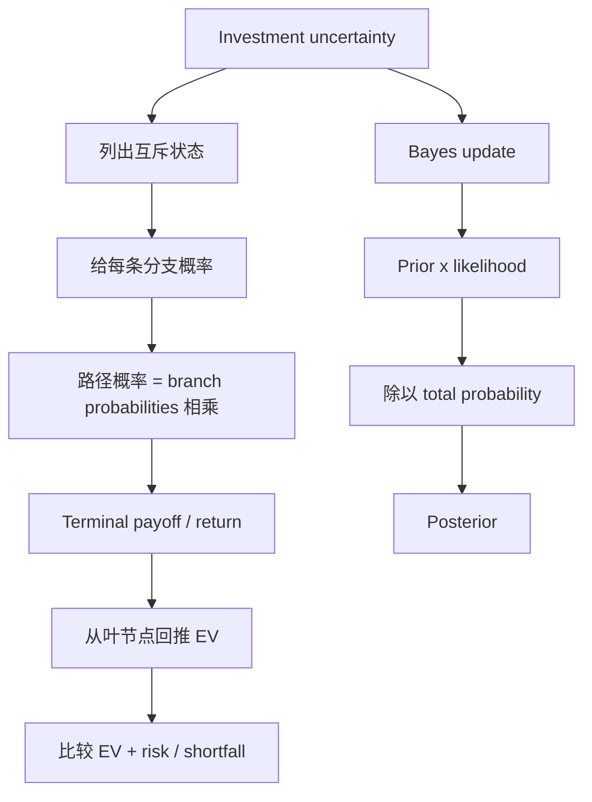

# M04: Probability Trees and Conditional Expectations

> **模块定位**：把投资问题翻译成收益率、现金流、统计推断和模型检验。 本模块聚焦 **Probability Trees and Conditional Expectations**，要求把官方 LOS 转成可执行的判断、计算或解释动作。

---

## Official Module Structure

- Learning Outcomes: Probability Trees and Conditional Expectations
- 4.01 | Introduction
- 4.02 | Expected Value and Variance
- 4.03 | Probability Trees and Conditional Expectations
- 4.04 | Bayes' Formula and Updating Probability Estimates

## Learning Outcome Statements

1. calculate expected values, variances, and standard deviations and demonstrate their application to investment problems
2. formulate an investment problem as a probability tree and explain the use of conditional expectations in investment application
3. calculate and interpret an updated probability in an investment setting using Bayes’ formula

---

## 1. 模块定位

### 4.1 学习任务
- **核心问题**：考试希望你用 `Probability Trees and Conditional Expectations` 解释什么、计算什么、比较什么，或判断什么。
- **输入信息**：题干事实、数据、假设、时间口径、单位、约束条件。
- **输出结果**：中文结论 + 英文关键术语 + 必要公式/框架 + 限制条件。

### 4.2 考试角色
- **难度类型**：计算+解释。
- **高频题型**：定义辨析、情境判断、计算解释、表格补数、跨模块比较。
- **答题原则**：先判断 LOS 动词，再选择工具；计算后必须解释结果含义。

### 4.3 关键英文术语
- **Probability Trees and Conditional Expectations（核心术语）**：本模块关键词，用于定位 LOS、题干条件和解题动作。
- **Introduction（核心术语）**：本模块关键词，用于定位 LOS、题干条件和解题动作。
- **Expected Value and Variance（核心术语）**：本模块关键词，用于定位 LOS、题干条件和解题动作。
- **Bayes' Formula and Updating Probability Estimates（核心术语）**：本模块关键词，用于定位 LOS、题干条件和解题动作。

## 2. 官方 LOS 对应学习目标

| LOS | 官方要求 | 中文学习动作 | 做题输出 |
|---|---|---|---|
| 4.1 | calculate expected values, variances, and standard deviations and demonstrate their application to investment problems | 计算并解释数值结果 | 写出结论、依据、公式口径和限制条件。 |
| 4.2 | formulate an investment problem as a probability tree and explain the use of conditional expectations in investment application | 解释机制、原因和后果 | 写出结论、依据、公式口径和限制条件。 |
| 4.3 | calculate and interpret an updated probability in an investment setting using Bayes’ formula | 计算并解释数值结果；解释结果的投资含义 | 写出结论、依据、公式口径和限制条件。 |

## 3. 核心知识树

```text
4. Probability Trees and Conditional Expectations
├─ 4.1 期望值/方差/标准差（Expected Value / Variance / Standard Deviation）
│  ├─ 4.1.1 Expected value：`E(X)=Σp_ix_i`，概率加权平均，不是最可能结果
│  ├─ 4.1.2 Variance definition：`Σp_i[x_i-E(X)]²`
│  ├─ 4.1.3 Variance shortcut：`E(X²)-[E(X)]²`，情景表计算更快
│  └─ 4.1.4 Standard deviation：`σ=√Var(X)`，解释为结果分散程度
├─ 4.2 概率树（Probability Tree）
│  ├─ 4.2.1 路径概率：同一路径分支概率相乘，不同互斥路径相加
│  ├─ 4.2.2 Terminal payoff：每条路径终点对应 payoff/return
│  ├─ 4.2.3 Conditional expectation：从叶节点往回算每个节点的概率加权值
│  └─ 4.2.4 决策判断：选择期望值最高不等于风险最低，必要时还要看方差/shortfall
├─ 4.3 贝叶斯更新（Bayes Update）
│  ├─ 4.3.1 Prior：新信息前的 `P(B_j)`
│  ├─ 4.3.2 Likelihood：事件为真时观察到信号的概率 `P(A|B_j)`
│  ├─ 4.3.3 Total probability：`P(A)=ΣP(A|B_i)P(B_i)`，是 Bayes 分母
│  └─ 4.3.4 Posterior：`P(B_j|A)=P(A|B_j)P(B_j)/P(A)`，更新后概率
```

## 核心图解



## 4. 知识点详解

### 4.1 期望值/方差/标准差（Expected Value / Variance / Standard Deviation）

**期望值（Expected Value）**：
`E(X) = Σ p(x_i) × x_i`

期望值是在概率分布下的加权平均（Probability-Weighted Average），反映随机变量的"长期平均水平"。它不是实际会发生的结果，而是大量重复试验的平均结果。

**两种方差算法（Two Variance Formulas）**：
- 定义式：`Var(X) = Σ p(x_i) × [x_i - E(X)]²`
- 计算式：`Var(X) = E(X²) - [E(X)]²`

两种公式要会互认。计算式通常更快 — 先算 E(X²)，再减去 E(X) 的平方。

**离散概率（Discrete Outcome Probabilities）**：
- 每个结果概率在 [0, 1] 之间
- 所有结果的概率之和为 1
- 考试中常以"情景分析"（Scenario Analysis）出现，给定 3-5 个情景及其概率

> **【考试核心】** Expected Value 是概率加权中心，不是必然结果。考试可能会给一个高概率的正面结果和一个低概率的极端负面结果，答案是概率加权平均，不是"最可能的结果"。

### 4.2 概率树（Probability Tree）

概率树用于分解复杂概率问题：

```
                  ┌── 好结果 (节点概率 × 分支概率)
     ┌── 好经济 ──┤
     │            └── 差结果
初始 ─┤
     │            ┌── 好结果
     └── 差经济 ──┤
                  └── 差结果
```

- **分支概率（Branch Probability）**：沿着概率树某一支路走到底的概率
- **终端收益（Terminal Payoff）**：走完整个概率路径后的最终结果
- **决策节点的条件期望（Conditional Expectation at Decision Node）**：在每个决策节点，计算各分支概率加权的期望值，再用这个期望值做决策

概率树的核心思路是**递归求期望**（Recursive Expectation）：从叶节点往回推，在每个决策节点处计算期望值。

### 4.3 贝叶斯更新（Bayes Update）

贝叶斯公式的核心思想：**用新信息更新旧概率**。

**公式核心链条**：
- 先验概率（Prior Probability）：在获知新信息前对事件的初始判断 P(B_j)
- 条件似然（Conditional Likelihood）：新信息在事件发生条件下的概率 P(A|B_j)
- 后验概率（Posterior Probability）：用新信息更新后的概率 P(B_j|A)

**全概率公式（Total Probability Rule）**：
`P(A) = Σ P(A|B_i) × P(B_i)`

**贝叶斯公式（Bayes Formula）**：
`P(B_j|A) = [P(A|B_j) × P(B_j)] / Σ[P(A|B_i) × P(B_i)]`

注意分母 = P(A) = 全概率，而不是分子单独。

> **【考试陷阱】** 更新后概率必须回到完整分母，不只看分子。常见错误：算了分子就忘了除以 P(A)。

**贝叶斯的直觉（Bayesian Intuition）**：
- 先验 + 新证据 → 后验
- = 旧概率 × 证据的似然 / 证据的总概率
- 考试不要求推导，但要求能代入公式计算后验概率

## 5. 关键公式与计算框架

### 5.1 核心内容

| 公式 | 解释 | 使用场景 |
|------|------|----------|
| `E(X) = Σ p(x_i) × x_i` | 期望值 | 概率加权平均结果 |
| `Var(X) = Σ p(x_i)[x_i - E(X)]²` | 方差（定义） | 概率加权离散度 |
| `Var(X) = E(X²) - [E(X)]²` | 方差（计算） | 更快计算 |
| `P(A|B) = P(A∩B)/P(B)` | 条件概率 | 给定 B 下 A 的概率 |
| `P(A) = Σ P(A|B_i)P(B_i)` | 全概率 | 计算复杂事件概率 |
| `P(B_j|A) = P(A|B_j)P(B_j)/P(A)` | 贝叶斯公式 | 新信息更新概率 |
| `Path probability = Π branch probabilities` | 路径概率 | 概率树单一路径 |
| `Node EV = Σp_i payoff_i` | 节点条件期望 | 从叶节点回推 |
| `σ = √Var(X)` | 标准差 | 结果分布风险解释 |

### 5.2 计算流程

| 题型 | 执行动作 | 对应节点 | 防错点 |
|---|---|---|---|
| 离散情景求期望/方差 | 算 `E(X)` -> 算 `E(X²)` 或离差平方 -> 开方 | `4.1` | 概率总和必须等于 1。 |
| 概率树 | 路径概率相乘 -> 终点 payoff -> 从后往前求 EV | `4.2` | 不要把同一路径概率相加。 |
| 条件概率 | 明确条件事件在分母 | `4.3` | `P(A|B)` 和 `P(B|A)` 不可互换。 |
| Bayes | prior × likelihood -> 全概率分母 -> posterior | `4.3` | 分母必须包含所有互斥状态。 |
| 投资解释 | 比较 EV 后补风险/限制 | `4.2.4` | 最高 EV 不一定最适合风险厌恶投资者。 |

## 6. 常见考点与解题思路

| 重要性 | 考点 | 解题动作 |
|---|---|---|
| ⭐⭐⭐ | 4.1 Introduction | 先定位题干触发词，再写公式/框架，最后解释结果或判断陷阱。 |
| ⭐⭐⭐ | 4.2 Expected Value and Variance | 先定位题干触发词，再写公式/框架，最后解释结果或判断陷阱。 |
| ⭐⭐ | 4.3 Probability Trees and Conditional Expectations | 先定位题干触发词，再写公式/框架，最后解释结果或判断陷阱。 |
| ⭐⭐ | 4.4 Bayes' Formula and Updating Probability Estimates | 先定位题干触发词，再写公式/框架，最后解释结果或判断陷阱。 |

### 6.9 ⭐⭐ Legacy 考点补充

### 6.1 核心内容

**考点一：计算期望值和方差**
- 步骤 1：确认概率分布表（各情景概率和对应收益率）
- 步骤 2：用 `Σ p_i × R_i` 算 E(R)
- 步骤 3：用 `Σ p_i × [R_i - E(R)]²` 算方差
- 步骤 4：开方得标准差

**考点二：条件概率计算**
- 给定 2×2 列联表（Contingency Table），计算条件概率
- 注意：P(A|B) = P(A∩B) / P(B) — 分母是条件事件概率

**考点三：贝叶斯更新**
- 步骤 1：确定先验概率 P(B_j)
- 步骤 2：确定条件似然 P(A|B_j)
- 步骤 3：计算全概率 P(A) = ΣP(A|B_i)P(B_i)
- 步骤 4：代入贝叶斯公式求后验
- 步骤 5：验证后验概率之和为 1

**考点四：概率树+期望值做决策**
- 从叶节点往回计算期望值
- 在每个决策节点选择期望值最高的分支

## 7. 易错点与考试陷阱

| ❌ 错误理解 | ✅ 正确理解 | 为什么错 / 考试提醒 |
|---|---|---|
| ❌ 只背 Probability Trees and Conditional Expectations 的英文名，不解释中文含义 | ✅ 用中文说清定义、适用条件和考试动作 | 术语题和情境题都会考定义边界。 |
| ❌ 看到公式就直接套，不检查口径 | ✅ 先检查时间、单位、现金流方向、会计口径或统计假设 | CFA 常把错误藏在输入口径里。 |
| ❌ 把显著性、相关性或高分数直接当成好结论 | ✅ 还要看经济含义、限制条件和跨模块证据 | 数量结果必须回到投资解释。 |

## 8. 跨模块关联

| 输出节点 | 连接模块/科目 | 如何被调用 | 易错接口 |
|---|---|---|---|
| `4.1` 概率加权矩 | [[M03-Statistical-Measures-of-Asset-Returns]]、[[M05-Portfolio-Mathematics]] | 单变量 mean/variance 扩展到概率分布和组合收益 | Expected value 不是 most likely value。 |
| `4.2` 概率树 | Derivatives、Fixed Income credit、Risk scenarios | 多阶段 payoff、违约路径、情景分析 | 路径概率乘法和互斥路径加法要分清。 |
| `4.3` Bayes | Fixed Income、Risk Management、Big Data | 用评级、信号、模型输出更新概率 | 后验概率分母是全概率，不是单个 likelihood。 |
| `4.1-4.2` EV + risk | Portfolio Management | 期望收益还要与方差、shortfall、风险厌恶一起判断 | 只选最高 EV 可能忽略风险目标。 |

### Legacy 关联补充

- **[[M03-Statistical-Measures]]**：概率版本的统计量 — 期望值对应均值，方差概念延续。
- **[[M05-Portfolio-Mathematics]]**：组合期望收益和协方差全部基于概率框架（联合概率函数）。
- **[[M02-Time-Value-of-Money]]**：概率加权现金流的期望现值 — TVM + 概率 = 风险中性定价直觉。
- **Fixed Income**：违约概率的贝叶斯更新 — 用新信息（新的信用评级）更新违约概率估计。


## 9. 复习与刷题提示

- 第一轮：按 `Official Module Structure` 逐节过概念，把每个 LOS 改写成中文任务。
- 第二轮：对照 `## 3. 核心知识树` 做主动回忆，能说出每个编号节点的定义、公式/框架和陷阱。
- 第三轮：刷题后记录错因，如果暴露 MOC 缺口，按 `docs/moc-auto-patch-workflow.md` 进入补强流程。
- 考前：只看术语、公式/框架、易错点和本模块错题，避免重新铺开所有正文。

## 10. Legacy Notes Integrated

- **主要 legacy 来源**：`M04-Probability-Concepts.md` (high, 0.821)
- **整合规则**：高置信内容已合入 `知识点详解`、`公式与计算框架`、`常见考点`、`易错陷阱` 和 `跨模块关联`。
- **边界**：若 legacy 内容与 2026 官方 LOS 冲突，以官方 module 名称、LOS 和 registry 为准。
