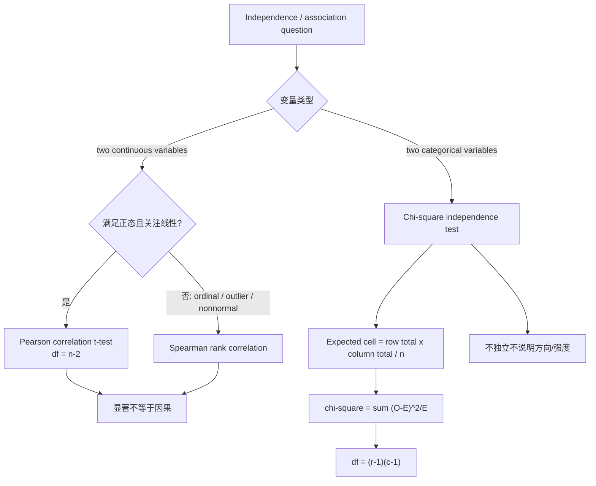

# M09: Parametric and Non-Parametric Tests of Independence

> **模块定位**：把投资问题翻译成收益率、现金流、统计推断和模型检验。 本模块聚焦 **Parametric and Non-Parametric Tests of Independence**，要求把官方 LOS 转成可执行的判断、计算或解释动作。

---

## Official Module Structure

- Learning Outcomes: Parametric and Non-Parametric Tests of Independence
- 9.01 | Introduction
- 9.02 | Tests Concerning Correlation
- 9.03 | Tests of Independence Using Contingency Table Data

## Learning Outcome Statements

1. explain parametric and nonparametric tests of the hypothesis that the population correlation coefficient equals zero, and determine whether the hypothesis is rejected at a given level of significance
2. explain tests of independence based on contingency table data

---

## 1. 模块定位

### 9.1 学习任务
- **核心问题**：考试希望你用 `Parametric and Non-Parametric Tests of Independence` 解释什么、计算什么、比较什么，或判断什么。
- **输入信息**：题干事实、数据、假设、时间口径、单位、约束条件。
- **输出结果**：中文结论 + 英文关键术语 + 必要公式/框架 + 限制条件。

### 9.2 考试角色
- **难度类型**：计算+解释。
- **高频题型**：定义辨析、情境判断、计算解释、表格补数、跨模块比较。
- **答题原则**：先判断 LOS 动词，再选择工具；计算后必须解释结果含义。

### 9.3 关键英文术语
- **Parametric and Non-Parametric Tests of Independence（核心术语）**：本模块关键词，用于定位 LOS、题干条件和解题动作。
- **Introduction（核心术语）**：本模块关键词，用于定位 LOS、题干条件和解题动作。
- **Tests Concerning Correlation（核心术语）**：本模块关键词，用于定位 LOS、题干条件和解题动作。
- **Tests of Independence Using Contingency Table Data（核心术语）**：本模块关键词，用于定位 LOS、题干条件和解题动作。
- **Correlation（相关系数）**：衡量两个变量线性同向或反向变化的程度。

## 2. 官方 LOS 对应学习目标

| LOS | 官方要求 | 中文学习动作 | 做题输出 |
|---|---|---|---|
| 9.1 | explain parametric and nonparametric tests of the hypothesis that the population correlation coefficient equals zero, and determine whether the hypothesis is rejected at a given level of significance | 解释机制、原因和后果；根据条件判断正确结论 | 写出结论、依据、公式口径和限制条件。 |
| 9.2 | explain tests of independence based on contingency table data | 解释机制、原因和后果 | 写出结论、依据、公式口径和限制条件。 |

## 3. 核心知识树

```text
9. Parametric and Non-Parametric Tests of Independence
├─ 9.1 相关系数检验（Test of Correlation）
│  ├─ 9.1.1 Pearson parametric test：检验 `H0: ρ=0`，要求双变量正态，关注线性关系
│  ├─ 9.1.2 Test statistic：`t=r√[(n-2)/(1-r²)]`，df=`n-2`
│  ├─ 9.1.3 Spearman nonparametric test：基于 rank，适合 ordinal、异常值或非正态数据
│  └─ 9.1.4 判断陷阱：显著相关不等于因果，也不等于经济意义重大
├─ 9.2 列联表独立性检验（Contingency Table Independence Test）
│  ├─ 9.2.1 适用对象：两个 categorical variables 是否独立
│  ├─ 9.2.2 Expected frequency：`E=(row total × column total)/n`
│  ├─ 9.2.3 Chi-square statistic：`χ²=Σ[(O-E)²/E]`，右尾检验
│  ├─ 9.2.4 df：`(r-1)(c-1)`
│  └─ 9.2.5 限制：期望频数过低会使 χ² 近似不可靠；结果不说明方向和强度
```

## 核心图解



## 4. 知识点详解

### 9.1 相关系数检验（Test of Correlation）

**参数检验 — Pearson 相关系数 t 检验**：
`t = r × √[(n-2) / (1-r²)]`
- H₀: ρ = 0 （总体相关系数为零，即两变量无线性关系）
- H₁: ρ ≠ 0 （总体相关系数不为零，两变量存在线性关系）
- 自由度 df = n-2
- 假设条件：两变量服从双变量正态分布（Bivariate Normal Distribution）
- 这个检验与简单线性回归中斜率系数的 t 检验完全等价

**非参数检验 — Spearman 秩相关系数检验**：
- 基于数据的排序（Rank）而非原始数值
- 不要求正态分布假设
- 当数据不满足正态假设或有异常值时，Spearman 相关更可靠
- 适用于有序数据（Ordinal Data）

**两种检验方法对比**：

| 特性 | Pearson 参数检验 | Spearman 非参数检验 |
|------|-----------------|-------------------|
| 数据类型 | 连续变量（区间/比率尺度） | 有序变量或连续变量 |
| 分布假设 | 双变量正态分布 | 无分布假设 |
| 检测关系 | 线性关系 | 单调关系（不要求线性） |
| 异常值影响 | 敏感 | 不敏感 |

### 9.2 列联表独立性检验（Contingency Table Independence Test）

**卡方独立性检验（Chi-Square Test of Independence）**：
- 用于检验两个分类变量（Categorical Variables）是否独立
- H₀: 两个变量独立
- H₁: 两个变量不独立（存在关联）

**检验统计量**：
`χ² = Σ[(观测频数 - 期望频数)² / 期望频数]`

其中期望频数计算公式为：
`期望频数 = (行合计 × 列合计) / 总样本量`

**自由度**：
`df = (r-1) × (c-1)`
- r = 行数，c = 列数

**注意事项**：
- 所有期望频数应 ≥ 5（否则卡方近似可能不可靠）
- 卡方检验是右尾检验（检验统计量越大越拒绝 H₀）
- 检验结果仅说明变量是否独立，不说明关联的强度或方向

> **注**：本模块 M09 仅包含独立性检验内容。简单线性回归内容已移至 [[M10-Simple-Linear-Regression]]。

## 5. 关键公式与计算框架

### 5.1 核心内容

| 公式 | 解释 | 使用场景 |
|------|------|----------|
| `t = r√[(n-2)/(1-r²)]` | 相关系数 t 检验 | 检验总体相关系数 ρ = 0 |
| `χ² = Σ[(O-E)²/E]` | 卡方检验统计量 | 列联表独立性检验 |
| `E = (行合计×列合计)/n` | 期望频数 | 列联表期望值计算 |
| `df = (r-1)(c-1)` | 卡方检验自由度 | 列联表自由度计算 |
| `df = n-2` | 相关系数 t 检验自由度 | Pearson 相关性检验 |

### 5.2 检验选择框架

| 数据/问题 | 使用检验 | 对应节点 | 结论写法 |
|---|---|---|---|
| 两个连续变量、近似正态、问线性相关 | Pearson correlation t-test | `9.1.1-9.1.2` | reject/fail to reject `H0:ρ=0`。 |
| 有序数据、异常值明显或非正态 | Spearman rank correlation | `9.1.3` | 说明单调关系，不要求线性。 |
| 两个分类变量 | χ² independence test | `9.2` | 拒绝 H0 只能说明不独立。 |
| 列联表有小期望频数 | 谨慎解释 χ² | `9.2.5` | 近似可能不可靠。 |
| 相关性显著 | 回到投资含义 | `9.1.4` | 不自动推出因果或可交易策略。 |

## 6. 常见考点与解题思路

| 重要性 | 考点 | 解题动作 |
|---|---|---|
| ⭐⭐⭐ | 9.1 Introduction | 先定位题干触发词，再写公式/框架，最后解释结果或判断陷阱。 |
| ⭐⭐⭐ | 9.2 Tests Concerning Correlation | 先定位题干触发词，再写公式/框架，最后解释结果或判断陷阱。 |
| ⭐⭐ | 9.3 Tests of Independence Using Contingency Table Data | 先定位题干触发词，再写公式/框架，最后解释结果或判断陷阱。 |

### 6.9 ⭐⭐ Legacy 考点补充

### 6.1 核心内容

**考点一：相关系数 t 检验计算**
- 给定 r 和 n，计算 t 统计量，与 t 临界值比较（自由度 df = n-2）
- 等价于回归中斜率系数的 t 检验（t 统计量完全相等）

**考点二：参数 vs 非参数检验选择**
- 数据满足正态分布且无异常值 → Pearson 参数检验
- 数据不满足正态分布、有序数据、或有异常值 → Spearman 非参数检验
- 注意 Spearman 检测的是单调关系（不一定是线性关系）

**考点三：列联表计算与分析**
- 给定列联表，先计算期望频数 E = (行合计 × 列合计) / n
- 再计算 χ² = Σ[(O-E)² / E]
- 与 χ² 临界值比较（df = (r-1)(c-1)，右尾检验）
- 若 χ² > 临界值 → 拒绝 H₀，变量不独立

**考点四：Spearman 与 Pearson 核心区别总结**
- Pearson：原始值、正态假设、线性关系、异常值敏感
- Spearman：秩（Rank）、无分布假设、单调关系、异常值不敏感

## 7. 易错点与考试陷阱

| ❌ 错误理解 | ✅ 正确理解 | 为什么错 / 考试提醒 |
|---|---|---|
| ❌ 忽略：1. 相关系数 t 检验的自由度 = n-2，不是 n-1 — 与单样本 t 检验的自由度 n-1 混淆是 CFA 高频陷阱。 | ✅ 1. 相关系数 t 检验的自由度 = n-2，不是 n-1 — 与单样本 t 检验的自由度 n-1 混淆是 CFA 高频陷阱。 | 题干通常会用口径、顺序、定义边界或例外条件设置干扰。 |

## 8. 跨模块关联

| 输出节点 | 连接模块/科目 | 如何被调用 | 易错接口 |
|---|---|---|---|
| `9.1` Pearson t-test | [[M10-Simple-Linear-Regression]] | 简单回归 slope t-test 与 correlation t-test 等价，`R²=r²` | df 是 `n-2`，不是 `n-1`。 |
| `9.1` Spearman | [[M08-Hypothesis-Testing]]、Big Data | 非参数 rank 检验处理 ordinal/异常值数据 | Spearman 检测单调关系，不一定是线性。 |
| `9.2` χ² independence | Ethics survey、Economics categories、Risk classification | 类别变量是否独立 | 不说明关系方向或强度。 |
| `9.1-9.2` 独立性证据 | Portfolio Mathematics、Research | 相关性是否可作为组合或模型输入 | 统计显著还要检验经济意义和样本稳定性。 |

### Legacy 关联补充

- **[[M08-Hypothesis-Testing]]**：本模块是 M08 假设检验框架的直接应用。相关性 t 检验是参数检验的具体实例，Spearman 检验是非参数检验的应用。
- **[[M10-Simple-Linear-Regression]]**：相关系数的 t 检验与简单线性回归中斜率系数的 t 检验完全等价。在简单回归中 R² = r²。
- **[[M03-Statistical-Measures]]**：相关系数的概念在 M03 中引入（correlation intuition），本模块将其扩展为正式的统计检验。
- **[[M05-Portfolio-Mathematics]]**：协方差和相关系数是投资组合数学的核心概念，本模块的检验方法可用于检验资产收益相关性是否显著。


## 9. 复习与刷题提示

- 第一轮：按 `Official Module Structure` 逐节过概念，把每个 LOS 改写成中文任务。
- 第二轮：对照 `## 3. 核心知识树` 做主动回忆，能说出每个编号节点的定义、公式/框架和陷阱。
- 第三轮：刷题后记录错因，如果暴露 MOC 缺口，按 `docs/moc-auto-patch-workflow.md` 进入补强流程。
- 考前：只看术语、公式/框架、易错点和本模块错题，避免重新铺开所有正文。

## 10. Legacy Notes Integrated

- **主要 legacy 来源**：`M09-Tests-of-Independence.md` (high, 0.828)
- **整合规则**：高置信内容已合入 `知识点详解`、`公式与计算框架`、`常见考点`、`易错陷阱` 和 `跨模块关联`。
- **边界**：若 legacy 内容与 2026 官方 LOS 冲突，以官方 module 名称、LOS 和 registry 为准。
