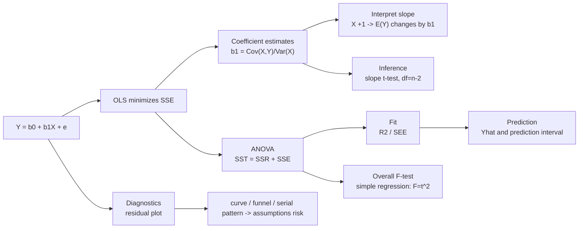

# M10: Simple Linear Regression

> **模块定位**：把投资问题翻译成收益率、现金流、统计推断和模型检验。 本模块聚焦 **Simple Linear Regression**，要求把官方 LOS 转成可执行的判断、计算或解释动作。

---

## Official Module Structure

- Learning Outcomes: Simple Linear Regression
- 10.01 | Introduction
- 10.02 | Estimation of the Simple Linear Regression Model
- 10.03 | Assumptions of the Simple Linear Regression Model
- 10.04 | Hypothesis Tests in the Simple Linear Regression Model
- 10.05 | Prediction in the Simple Linear Regression Model
- 10.06 | Functional Forms for Simple Linear Regression

## Learning Outcome Statements

1. describe a simple linear regression model, how the least squares criterion is used to estimate regression coefficients, and the interpretation of these coefficients
2. explain the assumptions underlying the simple linear regression model, and describe how residuals and residual plots indicate if these assumptions may have been violated
3. calculate and interpret measures of fit and formulate and evaluate tests of fit and of regression coefficients in a simple linear regression
4. describe the use of analysis of variance (ANOVA) in regression analysis, interpret ANOVA results, and calculate and interpret the standard error of estimate in a simple linear regression
5. calculate and interpret the predicted value for the dependent variable, and a prediction interval for it, given an estimated linear regression model and a value for the independent variable
6. describe different functional forms of simple linear regressions

---

## 1. 模块定位

### 10.1 学习任务
- **核心问题**：考试希望你用 `Simple Linear Regression` 解释什么、计算什么、比较什么，或判断什么。
- **输入信息**：题干事实、数据、假设、时间口径、单位、约束条件。
- **输出结果**：中文结论 + 英文关键术语 + 必要公式/框架 + 限制条件。

### 10.2 考试角色
- **难度类型**：计算+解释。
- **高频题型**：定义辨析、情境判断、计算解释、表格补数、跨模块比较。
- **答题原则**：先判断 LOS 动词，再选择工具；计算后必须解释结果含义。

### 10.3 关键英文术语
- **Simple Linear Regression（核心术语）**：本模块关键词，用于定位 LOS、题干条件和解题动作。
- **Introduction（核心术语）**：本模块关键词，用于定位 LOS、题干条件和解题动作。
- **Estimation of the Simple Linear Regression Model（核心术语）**：本模块关键词，用于定位 LOS、题干条件和解题动作。
- **Assumptions of the Simple Linear Regression Model（核心术语）**：本模块关键词，用于定位 LOS、题干条件和解题动作。
- **Hypothesis Tests in the Simple Linear Regression Model（核心术语）**：本模块关键词，用于定位 LOS、题干条件和解题动作。
- **Prediction in the Simple Linear Regression Model（核心术语）**：本模块关键词，用于定位 LOS、题干条件和解题动作。
- **Functional Forms for Simple Linear Regression（核心术语）**：本模块关键词，用于定位 LOS、题干条件和解题动作。
- **Regression（回归）**：用一个或多个解释变量估计因变量的平均变化关系。

## 2. 官方 LOS 对应学习目标

| LOS  | 官方要求                                                                                                                                                                                          | 中文学习动作                            | 做题输出               |
| ---- | --------------------------------------------------------------------------------------------------------------------------------------------------------------------------------------------- | --------------------------------- | ------------------ |
| 10.1 | describe a simple linear regression model, how the least squares criterion is used to estimate regression coefficients, and the interpretation of these coefficients                          | 描述定义、流程和适用场景                      | 写出结论、依据、公式口径和限制条件。 |
| 10.2 | explain the assumptions underlying the simple linear regression model, and describe how residuals and residual plots indicate if these assumptions may have been violated                     | 描述定义、流程和适用场景；解释机制、原因和后果           | 写出结论、依据、公式口径和限制条件。 |
| 10.3 | calculate and interpret measures of fit and formulate and evaluate tests of fit and of regression coefficients in a simple linear regression                                                  | 计算并解释数值结果；解释结果的投资含义；评价优缺点、限制和决策含义 | 写出结论、依据、公式口径和限制条件。 |
| 10.4 | describe the use of analysis of variance (ANOVA) in regression analysis, interpret ANOVA results, and calculate and interpret the standard error of estimate in a simple linear regression    | 计算并解释数值结果；解释结果的投资含义；描述定义、流程和适用场景  | 写出结论、依据、公式口径和限制条件。 |
| 10.5 | calculate and interpret the predicted value for the dependent variable, and a prediction interval for it, given an estimated linear regression model and a value for the independent variable | 计算并解释数值结果；解释结果的投资含义               | 写出结论、依据、公式口径和限制条件。 |
| 10.6 | describe different functional forms of simple linear regressions                                                                                                                              | 描述定义、流程和适用场景                      | 写出结论、依据、公式口径和限制条件。 |

## 3. 核心知识树

```text
10. Simple Linear Regression
├─ 10.1 简单线性回归模型（Simple Linear Regression Model）
│  ├─ 10.1.1 Model：`Y_i=b0+b1X_i+e_i`，Y 是 dependent，X 是 independent
│  ├─ 10.1.2 Slope：`b1=Cov(X,Y)/Var(X)`，解释为 X 增加 1 单位时 Y 的平均变化
│  ├─ 10.1.3 Intercept：`b0=ȳ-b1x̄`，X=0 时的预测值，未必有经济意义
│  └─ 10.1.4 OLS objective：最小化 `SSE=Σ(Y_i-Ŷ_i)²`
├─ 10.2 回归诊断（Regression Diagnostics） ↳ 笔记：ε 假设：不相关、方差恒定、正态分布（不是 Y 正态）
│  ├─ 10.2.1 Linearity：残差图若有曲线模式，线性设定不合适
│  ├─ 10.2.2 Homoskedasticity：残差方差恒定；喇叭形提示 heteroskedasticity
│  ├─ 10.2.3 Independence：时间序列残差若有趋势/交替模式，可能 serial correlation
│  ├─ 10.2.4 Normal errors：小样本推断需要，影响 t/F 检验可靠性
│  └─ 10.2.5 诊断后果：标准误错会让显著性结论失真
├─ 10.3 拟合与推断（Fit and Inference）
│  ├─ 10.3.1 ANOVA：`SST=SSR+SSE`，`R²=SSR/SST=1-SSE/SST`
│  ├─ 10.3.2 SEE：`√[SSE/(n-2)]`，衡量预测误差尺度
│  ├─ 10.3.3 Slope t-test：`t=(b1-β1,0)/SE(b1)`，df=`n-2`
│  ├─ 10.3.4 F-test：`F=MSR/MSE`，简单回归中 `F=t²`
│  ├─ 10.3.5 Prediction：`Ŷ=b0+b1X`，prediction interval = `Ŷ ± t_c × SEE × √(1 + 1/n + (X - X̄)² / ((n-1)sₓ²))`，宽于 confidence interval ↳ 笔记：X离X̄越远区间越宽；SEE越大区间越宽
│  └─ 10.3.6 Functional form：linear-log / log-linear 改变系数解释口径
```

## 核心图解



## 4. 知识点详解

### 10.1 简单线性回归模型（Simple Linear Regression Model）

**回归方程（Regression Equation）**：
`Y_i = b₀ + b₁X_i + e_i`
- Y = 因变量（Dependent Variable）= 被解释变量
- X = 自变量（Independent Variable）= 解释变量
- b₀ = 截距（Intercept）：当 X=0 时 Y 的期望值
- b₁ = 斜率（Slope）：X 每增加 1 单位，Y 的平均变化量
- e_i = 残差（Residual）：实际值 Y_i 与预测值 Ŷ_i 之差

**最小二乘法（Ordinary Least Squares, OLS）**：
- OLS 的目标：最小化残差平方和 SSE = Σ(Y_i - Ŷ_i)²
- 斜率公式：`b₁ = Cov(X, Y) / Var(X)`
- 截距公式：`b₀ = ȳ - b₁x̄`

**OLS 估计量的性质（Gauss-Markov Theorem）**：
- 在线性、无偏估计量中，OLS 估计量具有最小方差（BLUE: Best Linear Unbiased Estimator）

### 10.2 回归诊断（Regression Diagnostics）

**四个关键假设（Four Key Assumptions of OLS）**：
1. **线性（Linearity）**：Y 与 X 的关系是线性的
2. **同方差性（Homoskedasticity）**：残差的方差在所有 X 值上恒定
3. **独立性（Independence）**：各观测值的残差相互独立（时间序列数据中尤其重要）
4. **正态误差（Normality of Errors）**：残差服从正态分布（对系数的无偏性不是必须的，但对小样本推断很重要）

**诊断方法**：
- **残差图（Residual Plot）**：残差 vs 拟合值（或 vs 自变量）。如果残差图呈随机散布 → 假设满足；如果有明显模式（喇叭形、曲线形）→ 假设违反。
- **异方差（Heteroskedasticity）**：残差方差随 X 变化（常见于横截面数据）。后果：标准误有偏 → t 检验失效。
- **序列相关（Serial Correlation / Autocorrelation）**：时间序列回归中常见。后果：标准误被低估。

### 10.3 拟合与推断（Fit and Inference）

**拟合优度（R² / Coefficient of Determination）**：
`R² = SSR / SST = 1 - SSE / SST`
- R² 衡量模型解释的 Y 变异占总变异的比例
- R² 范围 [0, 1]，越高说明模型拟合越好
- 但 R² 高不意味着因果关系或模型正确（spurious regression 问题）

**估计标准误（Standard Error of Estimate, SEE）**：
`SEE = √[SSE / (n-2)]`
- 衡量回归模型中观测值围绕回归线的分散程度
- 单位与 Y 相同，越小说明预测越精确
- 对应的 MSE（Mean Squared Error）= SEE²

**斜率系数的 t 检验**：
`t = (b₁ - β₁,₀) / SE(b₁)`
- H₀: β₁ = 0（X 对 Y 无线性影响）
- 自由度 df = n-2
- 如果不拒绝 H₀，说明 X 对 Y 没有显著的线性关系

**方差分析 F 检验（ANOVA F-Test）**：
`F = MSR / MSE`
- 检验整体模型的显著性（在简单回归中，F = t²，与斜率 t 检验等价）
- 在多元回归中，F 检验检验所有斜率是否同时为零

**预测区间（Prediction Interval）**：
- 点估计（Point Estimate）给出 Y 的"最佳猜测"
- 预测区间比置信区间更宽，因为它包含了两种不确定性：参数估计的不确定性 + 随机误差项的不确定性
- 距离 x̄ 越远的 X 值，预测区间越宽

> **【考试陷阱】** Prediction Interval 比 Point Estimate 更诚实地表达了预测的不确定性。考试可能问：为什么预测区间比置信区间宽？因为预测区间包含了个体观测值的误差。

## 5. 关键公式与计算框架

### 5.1 核心内容

| 公式 | 解释 | 使用场景 |
|------|------|----------|
| `Y_i = b₀ + b₁X_i + e_i` | 回归方程 | 简单线性回归模型 |
| `b₁ = Cov(X,Y)/Var(X)` | 斜率 | 回归系数估计 |
| `b₀ = ȳ - b₁x̄` | 截距 | 回归截距估计 |
| `R² = SSR/SST` | 拟合优度 | 模型解释力 |
| `SEE = √[SSE/(n-2)]` | 估计标准误 | 回归预测精度 |
| `t = (b₁-β₁,₀)/SE(b₁)` | 斜率 t 检验 | 检验 X 对 Y 的线性影响 |
| `F = MSR/MSE` | ANOVA F 统计量 | 检验整体模型显著性 |
| `SST = SSR + SSE` | ANOVA 分解 | 总变异=解释变异+残差变异 |
| `R² = 1 - SSE/SST` | 拟合优度 | 样本内解释比例 |
| `Ŷ = b₀ + b₁X` | 点预测 | 给定 X 预测 Y |
| `Ŷ ± t_c × SEE × √(1 + 1/n + (X - X̄)² / ((n-1)sₓ²))` | Prediction interval | 单个新观测值的预测区间，含 `+1` 项 |
| `b₁ = r(s_Y/s_X)` | 斜率与相关系数 | 简单回归中连接 correlation |
| `R² = r²` | 简单回归关系 | 仅限一个解释变量 |

### 5.2 回归解题框架

| 题干任务 | 动作 | 对应节点 | 防错点 |
|---|---|---|---|
| 解释 slope | 写 X 每变 1 单位，Y 的条件均值变 `b1` | `10.1.2` | 不要说成 X 导致 Y，除非研究设计支持因果。 |
| 计算系数 | 用 `b1=Cov/Var`，`b0=ȳ-b1x̄` | `10.1` | intercept 可能没有经济意义。 |
| 解读 ANOVA 表 | 算 `R²`、`SEE`、`F` | `10.3.1-10.3.4` | df 回归=1，残差=`n-2`。 |
| 检验 slope | 用 t-test | `10.3.3` | 与 correlation t-test 等价。 |
| 整体模型显著性 | 用 F-test | `10.3.4` | 简单回归中 `F=t²` 可校验。 |
| 点预测/区间 | 先算 `Ŷ`，再判断 prediction interval | `10.3.5` | prediction interval 比 mean CI 更宽。 |
| 残差图 | 找曲线、喇叭形、序列模式 | `10.2` | 假设违反会污染标准误和检验。 |

## 6. 常见考点与解题思路

| 重要性 | 考点                                                          | 解题动作                          |
| --- | ----------------------------------------------------------- | ----------------------------- |
| ⭐⭐⭐ | 10.1 Introduction                                           | 先定位题干触发词，再写公式/框架，最后解释结果或判断陷阱。 |
| ⭐⭐⭐ | 10.2 Estimation of the Simple Linear Regression Model       | 先定位题干触发词，再写公式/框架，最后解释结果或判断陷阱。 |
| ⭐⭐  | 10.3 Assumptions of the Simple Linear Regression Model      | 先定位题干触发词，再写公式/框架，最后解释结果或判断陷阱。 |
| ⭐⭐  | 10.4 Hypothesis Tests in the Simple Linear Regression Model | 先定位题干触发词，再写公式/框架，最后解释结果或判断陷阱。 |
| ⭐   | 10.5 Prediction in the Simple Linear Regression Model       | 先定位题干触发词，再写公式/框架，最后解释结果或判断陷阱。 |

### 6.9 ⭐⭐ Legacy 考点补充

### 6.1 核心内容

**考点一：掌握 ANOVA 表解读**
- 给 ANOVA 表（SSR, SSE, SST; df; MSR, MSE），计算 R²、SEE、F 统计量
- R² = SSR/SST
- F = MSR/MSE = [SSR/1] / [SSE/(n-2)]

**考点二：相关 vs 回归关系**
- 回归斜率 b₁ = Cov(X,Y)/Var(X)
- 相关系数 r = Cov(X,Y)/(σ_Xσ_Y)
- 两者关系：b₁ = r × (s_Y/s_X)
- R² = r²（仅限简单线性回归）

**考点三：残差图判断假设违反**
- 散点随机分布 → OK
- 扇形/喇叭形 → 异方差（Heteroskedasticity）
- 曲线模式 → 非线性（Nonlinearity）
- 正/负序列模式 → 序列相关（Serial Correlation）

## 7. 易错点与考试陷阱

| ❌ 错误理解 | ✅ 正确理解 | 为什么错 / 考试提醒 |
|---|---|---|
| ❌ 忽略：4. F 与 t 在简单回归中等价：F = t²，但注意 F 是单边检验，t 可以是双边检验。 | ✅ 4. F 与 t 在简单回归中等价：F = t²，但注意 F 是单边检验，t 可以是双边检验。 | 题干通常会用口径、顺序、定义边界或例外条件设置干扰。 |

## 8. 跨模块关联

| 输出节点 | 连接模块/科目 | 如何被调用 | 易错接口 |
|---|---|---|---|
| `10.1` slope/covariance | [[M03-Statistical-Measures-of-Asset-Returns]]、[[M05-Portfolio-Mathematics]] | Cov、Var、Correlation 进入预测模型 | 回归 slope 有单位，correlation 无单位。 |
| `10.3` t/F 检验 | [[M08-Hypothesis-Testing]]、M09 | slope 和整体模型显著性 | 统计显著不等于经济显著。 |
| `10.3` R²/SEE | Equity research、Portfolio analytics | 衡量样本内解释力和预测误差 | 高 R² 不说明因果或样本外稳定。 |
| `10.2` 诊断 | Big Data / ML | 模型验证、残差检查、overfitting 风险 | 假设违反会使 p-value 不可靠。 |
| `10.3.5` Prediction | Investment forecasting | 预测收益、价格、风险指标 | 样本外预测要比样本内拟合更谨慎。 |

### Legacy 关联补充

- **[[M09-Tests-of-Independence]]**：相关系数的 t 检验与回归斜率系数的 t 检验等价（t 统计量完全相等），R² = r²。列联表分析中发现的关联可以使用回归进一步建模。
- **[[M03-Statistical-Measures]]**：相关系数的概念在 M03 中引入，在回归分析中扩展为正式的斜率检验和 R² 解释。
- **[[M05-Portfolio-Mathematics]]**：协方差和相关系数是组合方差公式和回归分析框架的共同组件。
- **[[M08-Hypothesis-Testing]]**：回归中的 t 检验和 F 检验是 M08 假设检验框架的直接应用。
- **[[M07-Sampling-and-Estimation]]**：回归系数标准误 SE(b₁) 是 M07 中标准误概念在回归中的推广。
- **[[M10-Big-Data-and-ML]]**：简单线性回归是机器学习中监督学习的最基础模型 — 理解回归假设有助于理解更复杂的模型何时适用。


## 9. 复习与刷题提示

- 第一轮：按 `Official Module Structure` 逐节过概念，把每个 LOS 改写成中文任务。
- 第二轮：对照 `## 3. 核心知识树` 做主动回忆，能说出每个编号节点的定义、公式/框架和陷阱。
- 第三轮：刷题后记录错因，如果暴露 MOC 缺口，按 `docs/moc-auto-patch-workflow.md` 进入补强流程。
- 考前：只看术语、公式/框架、易错点和本模块错题，避免重新铺开所有正文。

## 10. Legacy Notes Integrated

- **主要 legacy 来源**：`M09-Correlation-and-Regression.md` (high, 0.833)
- **整合规则**：高置信内容已合入 `知识点详解`、`公式与计算框架`、`常见考点`、`易错陷阱` 和 `跨模块关联`。
- **边界**：若 legacy 内容与 2026 官方 LOS 冲突，以官方 module 名称、LOS 和 registry 为准。
