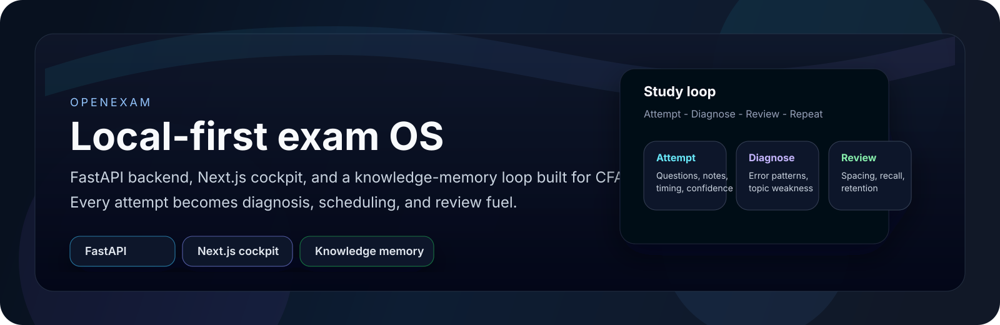
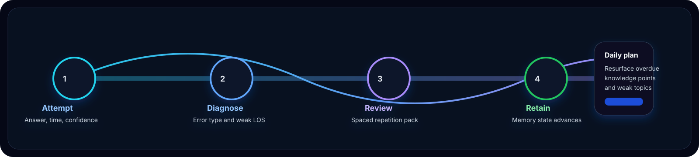
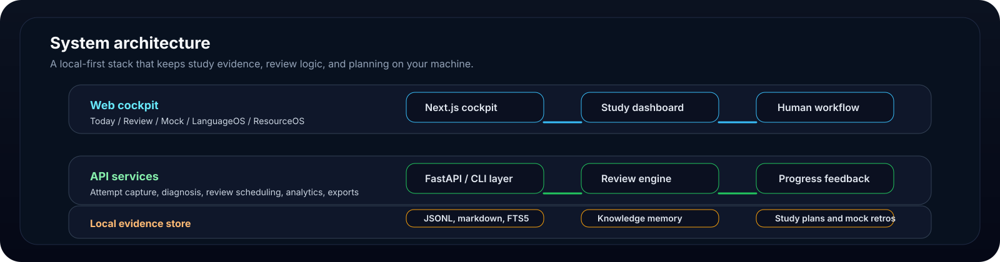

# OpenExam



OpenExam is a local-first, AI-augmented exam operating system for CFA Level I. It combines a FastAPI backend, a Next.js cockpit, and a knowledge-memory engine to turn every question attempt into diagnosis, review scheduling, and measurable progress.

This is not a generic flashcards app. OpenExam keeps the learning loop local, tracks mistakes and confidence over time, and feeds those signals back into spaced repetition, daily planning, and mock retros.

## Build Philosophy

- Human defines the direction, audience, constraints, and success criteria.
- Human shapes the architecture and workflow first; AI expands the options and implementation paths.
- AI does the repetitive algorithmic iteration and code generation.
- Human verifies behavior, UX, edge cases, and release quality.
- The loop stays closed: define, build, test, polish, repeat.

If you want the short version for sharing, see [the project-thinking note](./notes/OpenExam-打造思路.md).

## What it does

- Captures question attempts, wrong answers, confidence, and timing data.
- Generates diagnosis, review packs, and daily plans from study evidence.
- Persists knowledge states locally so overdue topics resurface automatically.
- Exposes a cockpit for review, mock sessions, LanguageOS, and ResourceOS.



## System Layout

- `apps/api/` - FastAPI backend for attempts, diagnosis, review packs, study plans, mock retros, dashboards, and knowledge memory.
- `apps/web/` - Next.js cockpit, including the Today, Review, Mock, LanguageOS, and ResourceOS surfaces.
- `packages/study-science/` - spaced repetition, retrieval practice, interleaving, worked-example fading, self-explanation, and calibration engines.
- `packages/agent-runtime/` - six AI agent role boundaries.
- `packages/resource-ingestion/` - public resource ingestion with robots, SSRF, redirect, license, hash-manifest, and audit checks.
- `.system/` - canonical local event stream, memory overlay, workflow kernel, and exam profiles.
- `CFA_tier1/` - Obsidian/Markdown projection layer for reading and review.



## Quick Start

```powershell
.\start-examos.ps1
```

The launcher starts the API on port `8000`, the web app on port `3000`, imports the CFA mock question bank, checks dependencies, and opens `http://localhost:3000`.

If you prefer the manual flow:

```powershell
python -m venv .venv
.venv\Scripts\Activate.ps1
pip install -r requirements.txt
cd apps\web
npm install
npm run dev
```

## Included Workflows

| Area | What you get |
|------|--------------|
| **Web Cockpit** | Today, review, mock, LanguageOS, ResourceOS |
| **API** | Attempt capture, diagnosis, memory updates, exports |
| **Knowledge Memory** | A local Ebbinghaus-style graduated memory model |
| **CLI** | Recording mistakes, generating daily reviews, checking knowledge state |
| **ResourceOS** | Public resource ingestion with safety and audit gates |

## CLI Still Works

```powershell
# Record a mistake
python scripts/cfa.py record-mistake --payload "{\"source_layer\":\"question\",\"topic\":\"Ethics\",\"los\":\"I.A\",\"prompt_or_question\":\"...\",\"wrong_choice_or_output\":\"A\",\"correct_resolution\":\"B\",\"error_type\":\"concept_confusion\",\"confidence\":2,\"time_spent\":100,\"evidence_refs\":[\"mock-1\"]}"

# Generate a daily review
python scripts/cfa.py daily-review --focus-topic "Fixed Income"

# Check knowledge point memory states
python scripts/cfa.py knowledge-status

# Run a decay sweep on overdue knowledge points
python scripts/cfa.py decay-knowledge

# Complete a daily review and feed it back into the memory loop
python scripts/cfa.py complete-daily-review --review-id daily-review-xxxx
```

## Tests

```powershell
python -m ruff check .
python -m mypy
python -m bandit -c pyproject.toml -r .system apps packages scripts
python -m pip_audit -r requirements-audit.txt
pytest -q
```

```powershell
cd apps\web
npm install
npm run lint
npm run typecheck
npm run build
npm run test:e2e
npm run audit:deps
```

`python -m mypy` is the strict ResourceOS gate. The older modules remain covered by Ruff, Bandit, tests, and incremental typing work.

## Source Of Truth

The frontend is a cockpit, not the source of truth. Canonical learning evidence lives in `.system/events/` (JSONL event streams) and `.system/memory/` (markdown cards plus the knowledge overlay). `CFA_tier1/` is a Markdown projection layer for reading and review.

## Maintainer

**Elian** - 计算机本科生，正在学习 CFA，目标留学爱尔兰。<br>
欢迎交流学习经验、备考方法、代码协作。<br>
这个系统是我边学 CFA 边写出来的，希望能帮到同样在备考的朋友，也欢迎大家提 Issue 和 PR。

## License

MIT - built with care for the CFA community.
